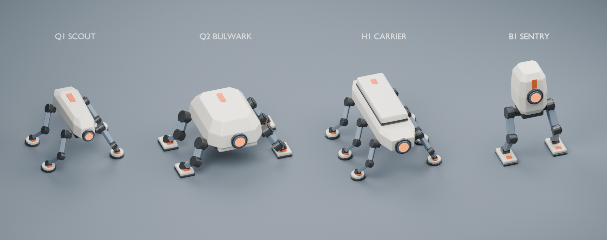

# Robot Family v01 — Blender / skeletal FBX

ImageGen 레퍼런스 기반 비인간형 적 로봇 4종. Blender 4.5.12 LTS 스크립트로 제작했다. 아래 프리뷰는 생성 이미지를 다시 그린 것이 아니라 실제 모델을 렌더링한 결과다.



## 산출물

각 ID별 `.blend`와 `.fbx`, `textures/T_RobotFamily_BaseColor.png`, `previews`의 정면·측면·후면·상면·사선·관절 포즈 PNG가 있다. `RobotFamily_Overview.blend`는 같은 크기 기준의 4종 비교 장면이며 바닥·글자·카메라가 포함된 프리뷰 전용 파일이다. 게임 메시 통계에 이 장면 소품은 포함하지 않는다.

| 모델 | 다리 | 폴리곤 | 삼각형 | 본 | 재질 슬롯 | UV | 전체 크기 X×Y×Z (cm) |
|---|---:|---:|---:|---:|---:|---:|---|
| Q1_Scout | 4 | 5,104 | 11,256 | 14 | 3 | 1 | 156.72 × 168.92 × 107.25 |
| Q2_Bulwark | 4 | 4,318 | 9,556 | 14 | 3 | 1 | 161.67 × 230.00 × 107.25 |
| H1_Carrier | 6 | 7,446 | 16,388 | 20 | 3 | 1 | 226.90 × 184.92 × 123.60 |
| B1_Sentry | 2 | 2,548 | 5,632 | 8 | 3 | 1 | 71.90 × 131.00 × 194.00 |

Q1은 좁은 쐐기형 정찰 몸통, Q2는 넓은 장갑 몸통, H1은 3쌍의 다리와 장비 상자, B1은 세로 포드와 두 다리로 구분한다. 같은 팔레트와 관절 부품 언어를 공유한다. 역할은 시각적 제안이며 게임 동작을 추가하지 않았다.

## 텍스처 / UV

- 공용 Base Color 이미지 1장: **1254×1254 PNG**, sRGB. 실제 ImageGen 원본과 적용 파일의 SHA-256이 동일하다. `validation/additional_audit.json`에 기록했다.
- 원본: `GeneratedImages/Enemies/RobotFamily/20260906_225120_reference_v01/robot_atlas_imagegen_source.png`.
- 좌상 아이보리, 우상 청회색, 좌하 검정, 우하 주황의 2×2 표면 아틀라스. UV는 영역 경계에서 이미지 폭의 2.5%씩 여유를 둔다.
- 모든 부품에 face-projected `UV0`를 작성했다. 공유 표면 샘플 방식이라 다른 부품과 UV가 의도적으로 겹친다. 유일한 비중첩 베이크 UV나 lightmap UV는 아니다.
- `M_Robot_Painted`, `M_Robot_Joints`, `M_Robot_Sensor`의 Base Color에 모두 생성 이미지 노드가 연결돼 있다. 관절 금속도와 거칠기, 센서 발광만 별도 상수다. 절차적 색 재질만으로 만든 결과가 아니다.
- Blender에는 텍스처를 패킹했고 상대 경로 `//textures/T_RobotFamily_BaseColor.png`도 저장했다. FBX에는 이미지가 내장돼 있다. 별도 PNG도 함께 제공한다.
- 원본 해상도를 보존했으므로 현재 텍스처는 2의 거듭제곱 크기가 아니다. UE용 최종 mip/streaming 설정과 재질 구성은 아직 적용하지 않았다.
- normal/roughness 텍스처를 생성했다고 주장하지 않는다. 현재는 생성된 색 텍스처와 기하 베벨, 스칼라 표면 설정이다.

## 리그와 단위

`Docs/game_conventions.md` 및 `Docs/quadruped_robot_ik.md`를 기준으로 **+X 전방(센서 방향), +Y 오른쪽, +Z 위**, Blender 단위 배율 0.01을 사용한다. 숫자 100은 100cm다. 메시·Armature의 위치와 회전은 원점 기준이며 스케일은 (1,1,1)이다.

`root`는 (0,0,0), 그 아래 `body`가 있다. 각 다리는 다음 직접 부모 체인을 가진다.

```text
root
└─ body
   ├─ upper_front_l → lower_front_l → foot_front_l
   ├─ upper_front_r → lower_front_r → foot_front_r
   ├─ upper_rear_l  → lower_rear_l  → foot_rear_l
   └─ upper_rear_r  → lower_rear_r  → foot_rear_r
```

- H1에는 `middle_l`, `middle_r` 두 체인이 추가된다. B1은 `main_l`, `main_r` 두 체인만 사용한다.
- 각 모델은 독립 Skeleton이다. 4족은 기존 프로필의 Front Left / Front Right / Back Left / Back Right 슬롯에 위 이름을 연결할 수 있는 **체인 구조 후보**다. UE용 QRP/AnimBP를 생성하거나 실제 기존 IK에서 시험하지 않았다.
- 6족·2족은 기존 4족 보행 솔버와 별도 구조다.
- 모든 정점은 하나의 본에 정확히 1.0 웨이트를 가진다. 몸통·상부 링크·하부 링크·발은 분리된 닫힌 기하 섬이며 하나의 Skeletal Mesh 오브젝트로 합쳤다.
- 고관절·무릎·발목 축은 각 다리 굽힘 평면의 법선으로 맞췄다. 본의 로컬 Z가 힌지 회전축이고 로컬 Y는 본 길이 방향이다. 축·피벗의 정확한 cm 값은 `validation/design_parameters.json`에 저장했다.
- 모터/축 연결 부위는 의도적으로 끼워지는 구조다. 링크 장갑은 축 주변에서 끝나고 케이블·피스톤으로 다른 본을 가로질러 연결하지 않는다.
- `*_JointPoseStudy` 액션: 1/36프레임 기본 포즈, 12프레임 한쪽 다리, 24프레임 반대쪽 다리 시험. 올라가는 쪽의 upper −12°, lower +32°, foot −20°이며 각 로컬 Z 기준이다.
- 이는 **관절 포즈 검사 액션**이다. 균형 제어·접지 IK·이동·전투 애니메이션이나 완성된 보행 사이클이 아니다.
- FBX는 기본 포즈의 메시·Armature만 내보냈고 leaf bone과 애니메이션 베이크는 껐다. 포즈 액션은 Blender 원본에서 확인한다. 축 메타데이터 X forward/Z up, 단위 스케일 포함 상태로 export/import 왕복을 검증했다.

## 검증 결과와 범위

`validation/report.json`, `validation/additional_audit.json`은 최종 파일에서 다시 실행한 결과다.

- 4개 Blender 파일 재로드, 4개 FBX 재임포트 성공. 폴리곤·삼각형·본·재질 수 유지.
- FBX 왕복 크기 오차 0.001cm 미만. 메시와 리그 스케일 1.0 유지.
- UV 누락·범위 오류·누락 본·웨이트 오류·퇴화 면·부품 경계/비매니폴드 에지 0.
- 모든 닫힌 기하 섬의 signed volume이 양수라 외향 와인딩을 확인했다.
- 패킹 이미지와 FBX 이미지 노드의 파일 존재 확인. FBX마다 유효 텍스처 노드 3개.
- 1~36프레임 전체에서 정점 에지 길이 변화 0.001cm 미만, 바닥 아래 침범은 부동소수점 오차 수준(0.01cm 허용치 이내).
- 같은 본/직접 부모-자식 모터 결합을 제외한 **서로 다른 비인접 본 부품의 BVH 표면 교차는 모든 검사 프레임에서 0**이다. 의도된 모터 축 결합과 장갑·링크 배치는 다방향/포즈 렌더로 함께 점검했다.
- 이 검사는 지정한 포즈의 표면 교차 검사다. 완전한 내부 포함, 모든 가능한 회전 범위, 물리적 조립 공차, 실제 게임 보행 안정성까지 증명하지 않는다.
- 실제 프리뷰에서 다리 수 4·4·6·2, 독립 상/하부 링크, 비인간형 실루엣, 센서와 생성 텍스처 적용을 확인했다. H1 센서 가림은 위치 수정 후 재렌더했다.
- UE 빌드/임포트, 기존 적 BP·맵 교체, AI/보행 시스템 변경은 수행하지 않았다. 따라서 UE 5.7에서 가동 확인 완료된 애셋이라고 보고하지 않는다.

## 재생성

프로젝트 루트에서 PowerShell로 실행한다. `$blenderExe`는 설치 경로에 맞춰 바꾼다. 스크립트는 이 고유 폴더의 동명 산출물을 재생성한다.

```powershell
$blenderExe = 'C:/Program Files/Blender Foundation/Blender 4.5/blender.exe'
$assetDir = 'ArtSource/RobotFamily/20260906_v01'
& $blenderExe --background --factory-startup --python-exit-code 1 --python "$assetDir/scripts/build_robot_family.py" -- build
& $blenderExe --background --factory-startup --python-exit-code 1 --python "$assetDir/scripts/build_robot_family.py" -- verify
& $blenderExe --background --factory-startup --python-exit-code 1 --python "$assetDir/scripts/audit_geometry.py"
& $blenderExe --background --factory-startup --python-exit-code 1 --python "$assetDir/scripts/build_robot_family.py" -- render
& $blenderExe --background --factory-startup --python-exit-code 1 --python "$assetDir/scripts/render_family.py"
```

최종 실행은 다섯 명령 모두 종료 코드 0이다. ImageGen 원본과 프롬프트는 별도 레퍼런스 폴더에 보존돼 있으며 재생성 스크립트는 이미 저장된 텍스처를 사용한다. 외부 네트워크나 유료 API 호출은 필요 없다.
