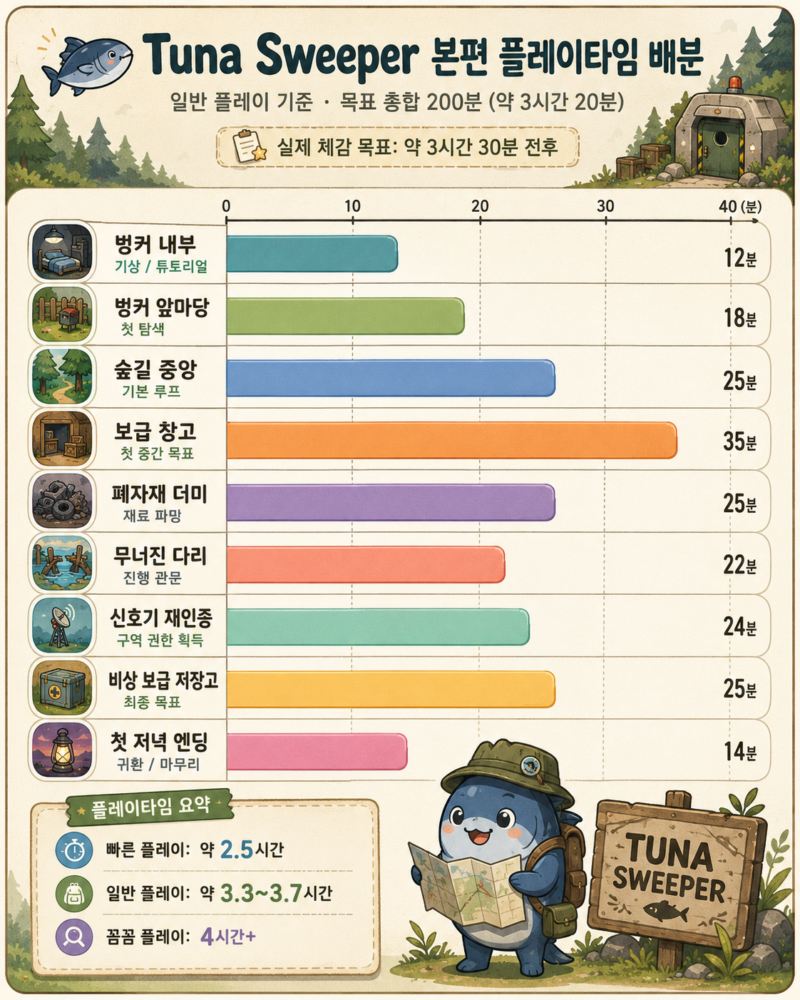

# Tuna Sweeper 플레이타임 배분

## 이미지 요약
- 일반 플레이 기준 목표 총합: **200분 (약 3시간 20분)**
- 실제 체감 목표: **약 3시간 30분 전후**

## 구역별 목표 시간

| 구역 | 목표 시간 | 역할 |
|---|---:|---|
| 벙커 내부 | 12분 | 기상 / 튜토리얼 |
| 벙커 앞마당 | 18분 | 첫 탐색 |
| 숲길 중앙 | 25분 | 기본 루프 |
| 보급 창고 | 35분 | 첫 중간 목표 |
| 폐자재 더미 | 25분 | 재료 파밍 |
| 무너진 다리 | 22분 | 진행 관문 |
| 신호기 재인증 | 24분 | 구역 권한 획득 |
| 비상 보급 저장고 | 25분 | 최종 목표 |
| 첫 저녁 엔딩 | 14분 | 귀환 / 마무리 |

## 플레이타임 기준
- 빠른 플레이: **약 2.5시간**
- 일반 플레이: **약 3.3~3.7시간**
- 꼼꼼 플레이: **4시간+**
