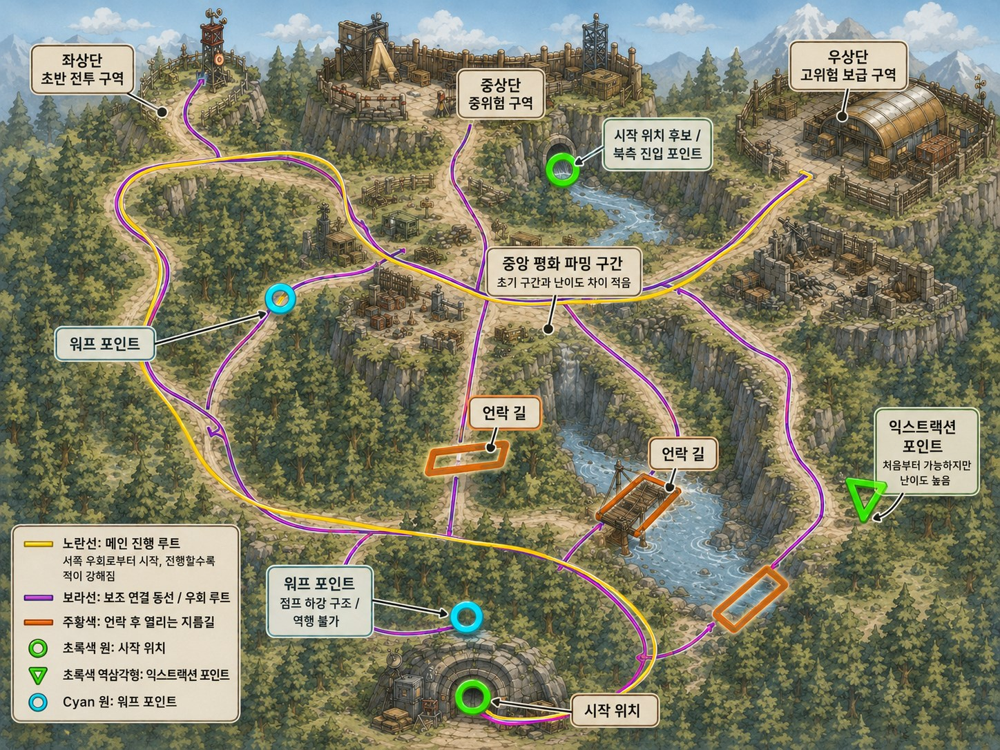

# 지역 개방 기준

이 문서는 TunaSweeper 단일 레이드 맵의 구역 개방과 이동 편의 해금 기준을 정리하는 SSOT 문서다.

퀘스트 구조, 아이템 요구량, 대화 기준은 `TunaSweeper_SSOT_Quest_Item_v0.6.md`와 `TunaSweeper_Quest_Dialogue_v0.6.1.md`를 우선한다.



## 전체 원칙

- 게임플레이 지역은 단일 레이드 맵을 중심으로 운용한다.
- `BunkerMap`은 거점 레벨, `RaidMap`은 실제 탐사/전투 맵으로 구분한다.
- 본편에서는 후속 지역 이동이나 후속 지역 떡밥을 메인 목표로 쓰지 않는다.
- 본편 엔딩은 루나와 캔봇의 일상 안정화 엔딩이다.
- 기존의 강제형 `시설복구1`, `시설복구2` 진행축은 사용하지 않는다.
- 시설 복구 개념은 선택/편의 퀘스트 보상형 하우징 해금으로 대체한다.
- 포탈/워프포인트는 처음부터 사용 가능하지만 퀘스트 텍스트에서 직접 안내하지 않는다.
- 콘크리트 더미 제거는 포탈 설명이 아니라 “막힌 길을 열 수 있다”는 편의성 해금으로 다룬다.
- `검문초소`와 `북쪽 보급 창고 / 상위 적 지역` 명칭은 폐기하고, 후반 위험 구역 명칭은 `고급보안구역`으로 통일한다.
- 보급창고는 필수 관문이 아니라 선택형 파밍 효율 퀘스트다.

## 메인 진행 순서

```text
1. M01 눈 뜬 벙커
2. M02 첫 번째 참치캔
3. M03 벙커 공기 점검
4. M04 캔봇의 체크리스트
5. M05 숲길 확인
6. M06 이상한 균열 / M07 수상한 안전거리 / M08 막힌 숲길 중 2개 이상
7. M09 수상한 자판기
8. M10 자판기 관리자 권한
9. M11 폭발물 취급 주의
10. M12 콘크리트 더미 제거
11. M13 고급보안구역 소문
12. M14 더 튼튼하게
13. M15 고급보안구역 진입
14. M16 보안 로그 해독
15. M17 마지막 외출 준비
16. M18 최종보스전
17. M19 고급참치 확보
18. M20 오늘의 식탁
19. 일상 엔딩
```

## 구역별 기준

| 순서 | 구역/상태 | 역할 | 개방/변화 방식 |
|---:|---|---|---|
| 1 | 벙커 | 시작점, 퀘스트 접점, 하우징 공간 | 기본 개방 |
| 2 | 초반 외부/중앙 파밍권 | 기본 탐사, 식량과 기초 재료 확보 | M02~M04에서 자연스럽게 유도 |
| 3 | 숲길 | 초반 탐색 확장, 표식과 지도 단서 | M05 완료로 진행 기준 확정 |
| 4 | 숲길 단서 3종 | 막힌 길과 폭발물 사용 가능성 암시 | M06~M08 중 2개 이상 완료 |
| 5 | 자판기 | 상품 구매, 잠긴 상품 조건 표시 | M09~M10으로 시스템 해금 |
| 6 | 자판기 폭발물 | 콘크리트 더미 제거 도구 | M11로 상품 해금 |
| 7 | 콘크리트 더미 | 반복 이동 편의성을 막는 장애물 | M12에서 영구 제거 |
| 8 | 고급보안구역 | 상위 적과 후반 단서가 있는 위험 구역 | M13~M15에서 위치 확인과 진입 |
| 9 | 최종보스 단서 | 보스 위치와 위험 정보 확인 | M16에서 보안 로그 해독 |
| 10 | 최종보스 구역 | 본편 기준 최종 전투 | M17 이후 M18에서 진행 |
| 11 | 엔딩 준비 | 고급참치와 식탁 준비 | M19~M20에서 완료 |
| 12 | 엔딩 후 일상 | 반복 플레이와 후일담 | M20 이후 S18~S20 |

## 선택/편의 해금 기준

| 항목 | 기준 | 역할 |
|---|---|---|
| 가방 공간 확장 | S01~S03 | `철지난 NFT`를 재료로 수납 상수를 영구 증가시킨다. |
| 보급창고 | S04~S05 | 필드 파밍 단서로 열리는 선택형 파밍 효율 구역이다. 메인 진행 필수 조건으로 쓰지 않는다. |
| 하우징: 정리 선반 | S06 | M03 이후 열리는 보관/정리 편의성 보상이다. |
| 하우징: 간이 작업대 | S07 | M11 이후 열리는 제작/작업 편의성 보상이다. |
| 하우징: 휴식 코너 | S08 | M17 이후 열리는 생활 편의 보상이다. |
| 방어구 보강 실험 | S14 | 고급보안구역 위험도를 체감한 뒤 열리는 선택 성장 보너스다. |
| 엔딩 후 생활 퀘스트 | S18~S20 | 엔딩 이후 반복 플레이와 후일담용 목표다. |

## 포탈/워프포인트 기준

- 포탈/워프포인트는 처음부터 사용할 수 있다.
- 초기에는 동선상 단방향적이거나 불편하게 느껴질 수 있다.
- 복귀 포탈 쪽 동선은 초반에 낙하나 우회가 섞인 불편한 루트로 둔다.
- 숲길 콘크리트 더미를 제거하면 포탈 방향 접근성이 좋아진다.
- 퀘스트 설명에는 포탈의 위치, 사용법, 목적지를 직접 쓰지 않는다.
- 플레이어가 이동 편의 요소를 직접 발견하는 구조를 유지한다.

## 고급보안구역 기준

- 공식 명칭은 `고급보안구역`이다.
- `검문초소` 명칭은 사용하지 않는다.
- `북쪽 보급 창고`는 후반 메인 관문 명칭으로 사용하지 않는다.
- 상위 레벨 적과 최종보스 단서가 있는 후반 위험 구역이다.
- M13에서 존재와 위치를 암시하고, M14에서 방어구 보강 필요성을 체감시키며, M15에서 내부 단서를 회수한다.

## 보급창고 기준

- 보급창고는 선택형이다.
- 필드 파밍으로 단서를 얻은 뒤 S04/S05로 해금한다.
- 보급창고를 열면 파밍 체감 효율이 증가한다.
- 보급창고를 열지 않아도 M01~M20 메인 진행과 엔딩은 가능해야 한다.
- 고급참치를 보급창고 전용 보상으로 두면 안 된다.

## 엔딩 기준

엔딩 최종 조건:

1. `고급참치` 확보
2. M20 `오늘의 식탁` 완료

보스 처치 후 즉시 엔딩으로 가지 않는다. M18 이후 M19/M20을 통해 고급참치와 식탁 준비를 완료하고, 루나와 캔봇의 일상 안정화 엔딩으로 닫는다.

고급참치 획득처, 보스 처치와 고급참치 획득의 관계, 엔딩 연출 세부 대사는 아직 미정이다.

## 핵심 감각

- 같은 레이드 맵이 진행에 따라 익숙해지고 이동 피로가 줄어야 한다.
- 편의 해금은 직접적인 설명보다 발견과 반복 플레이 체감으로 전달한다.
- 후반 위험 구역은 고급보안구역으로 명확히 부르고, 위험도와 장비 성장 필요성을 체감시킨다.
- 최종 결과는 다음 지역 이동이 아니라 벙커가 루나의 집으로 안정되는 것이다.
