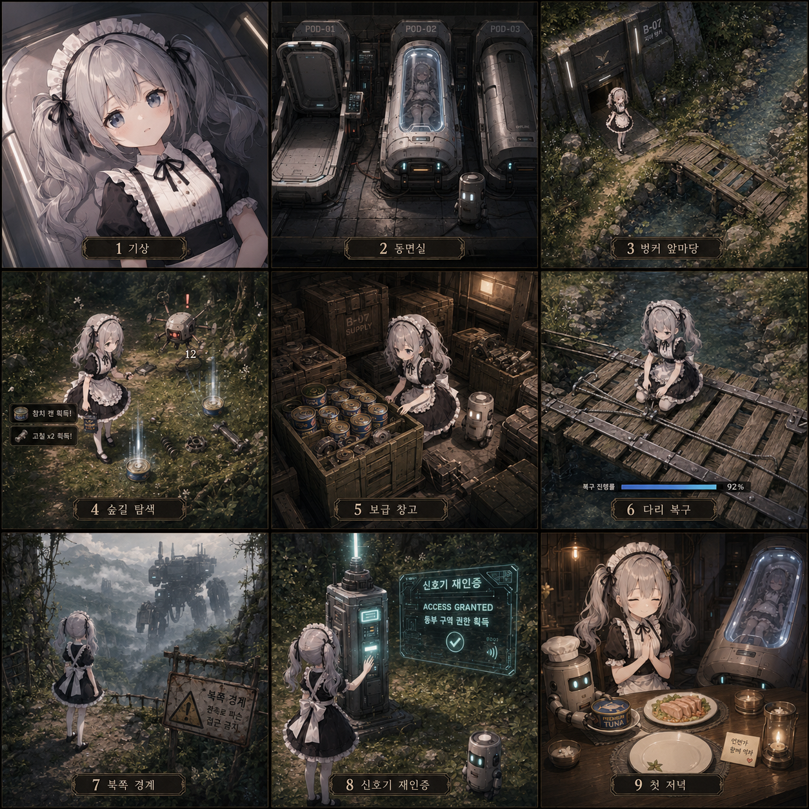
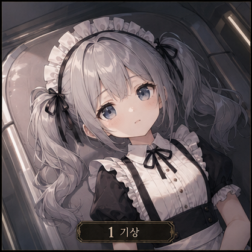
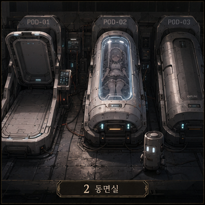
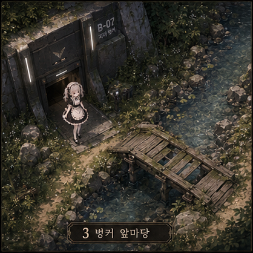
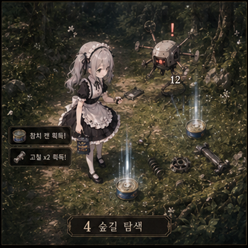
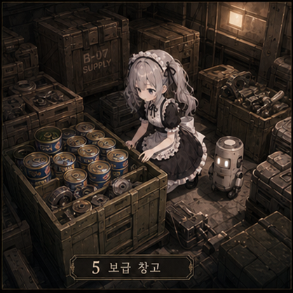
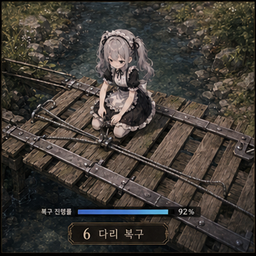
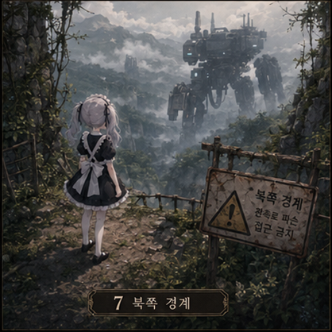
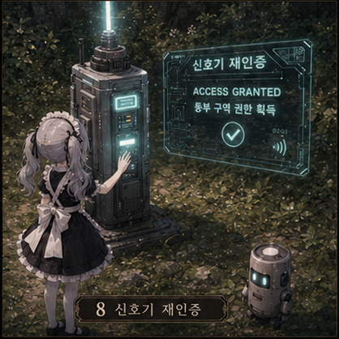
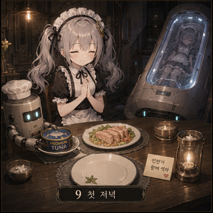

# Tuna Sweeper 대화집

숲속 벙커에서 깨어난 메이드로이드 **루나**가,
작은 생활권을 다시 집으로 바꾸어 가는 본편 스토리 대화집입니다.

---

## 주요 화자

- **루나**: 플레이어 캐릭터. 차분하고 담담한 메이드로이드.
- **관리 AI**: 벙커 시스템. 건조한 문장으로 목표와 상태를 전달함.
- **캔봇**: 참치 선반과 보급품 정리를 담당하는 소형 로봇.

---

## 목차

1. [기상](#1-기상)
2. [동면실](#2-동면실)
3. [벙커-앞마당](#3-벙커-앞마당)
4. [숲길-탐색](#4-숲길-탐색)
5. [보급-창고](#5-보급-창고)
6. [다리-복구](#6-다리-복구)
7. [북쪽-경계](#7-북쪽-경계)
8. [신호기-재인증](#8-신호기-재인증)
9. [첫-저녁](#9-첫-저녁)

---

## 삽화 모음

아래 이미지는 3×3 구성의 전체 삽화 목차입니다.

---

## 1. 기상

어두운 동면 장치 내부. 루나가 눈을 뜬다.

**관리 AI**

> 지원 유닛 기상 확인.  
> 기체 식별 중… 메이드로이드 루나.  
> 상태: 불완전.

**루나**

> ……여기.  
> 어디지?

**관리 AI**

> 위치: B-07 벙커 내부.  
> 장기 저전력 상태에서 부분 재가동되었습니다.

**루나**

> 기억 데이터가 많이 비어 있어.  
> 그래도 움직일 수는 있네.

**관리 AI**

> 기본 기능 확인 필요.  
> 주변을 조사하십시오.

---

## 2. 동면실

루나는 동면실의 세 장치를 확인한다.

**관리 AI**

> POD-01. 지원 유닛용 동면 장치.  
> 상태: 비상 기상 완료.

**루나**

> 내가 나온 장치… 정상적으로 열린 건 아니구나.

**관리 AI**

> 비상 기상 기록 손상.  
> 상세 원인 확인 불가.

루나는 가운데 장치로 시선을 옮긴다.

**관리 AI**

> POD-02. 상태: 동면 유지 중.  
> 생체 신호: 안정.

**루나**

> 안에… 누가 있어.

**관리 AI**

> 접근 권한 없음.  
> 강제 개방 금지.

**루나**

> 깨우면 안 되는 거야?

**관리 AI**

> 기상 조건 미충족.  
> 상위 권한 필요.

오른쪽 장치는 비어 있다.

**관리 AI**

> POD-03. 상태: 폐쇄.  
> 내부: 비어 있음.

**루나**

> 비어 있는데 닫혀 있어.

참치 선반 아래에서 작은 로봇 하나가 켜진다.

**캔봇**

> …삐.  
> 참치 선반 상태 확인 중.  
> 참치 선반… 비어 있음.

**루나**

> 너는?

**캔봇**

> 캔봇.  
> 참치 정렬, 보급품 분류, 선반 미관 유지 담당.

**루나**

> 선반 미관도 담당이야?

**캔봇**

> 중요 업무입니다.

**관리 AI**

> 본편 목표를 등록합니다.  
> 벙커 주변 제1생활권을 확보하고,  
> 첫 야간 운용이 가능한 거주 상태를 달성하십시오.

**루나**

> 여기서… 살 수 있게 만들라는 뜻이네.

**캔봇**

> 집 만들기입니다.

---

## 3. 벙커 앞마당

루나는 처음으로 벙커 밖을 본다. 냇가와 작은 나무다리가 눈앞에 있다.

**관리 AI**

> 외부 출입문 수동 개방 가능.  
> 주변 위험도: 낮음.  
> 회수 우선순위: 참치캔, 부품 조각.

**루나**

> 참치캔이 우선순위에 있어?

**캔봇**

> 최우선입니다.

**루나**

> 왜?

**관리 AI**

> 장기 보존 식량.  
> 인간 생존 기준 적합.

**루나**

> 인간…  
> 그럼 안에 잠든 사람을 위한 걸까.

**캔봇**

> 참치는 응답 가능합니다.  
> 맛있습니다.

**루나**

> 너 먹을 수 있어?

**캔봇**

> 불가능합니다.

루나는 벙커 입구 앞에 서서 주변을 둘러본다.

**루나**

> 물소리… 나쁘지 않네.  
> 여긴 아직 완전히 죽은 곳은 아닌가 봐.

**캔봇**

> 집 후보는 입지 조건이 양호합니다.

---

## 4. 숲길 탐색

숲길 중앙으로 나간 루나는 참치캔과 부품을 줍고, 고장난 드론과 마주친다.

**루나**

> 원통형 보급품 발견.  
> 라벨… 참치.

**캔봇**

> 회수 권장. 강력 권장.

**루나**

> 정말 중요한가 보네.

**캔봇**

> 선반이 비어 있으면 마음도 비어 보입니다.

**루나**

> ……그건 조금 이해돼.

빛 기둥과 함께 부품이 드러난다.

**루나**

> 부품 조각 발견.  
> 이걸로 뭘 고칠 수 있지?

**관리 AI**

> 작업대, 조명, 출입로 설비 복구 가능.  
> 수집을 권장합니다.

그때, 숲길의 작은 드론이 루나를 향해 반응한다.

**관리 AI**

> 고장난 자동기계 접근.  
> 위협 수준: 낮음.

**루나**

> 저건 적이야?

**관리 AI**

> 식별 실패.  
> 그러나 충돌 가능성 있음.

**캔봇**

> 드론이 참치를 밟을 수 있습니다.

**루나**

> 그럼 정리하자.

전투 후.

**루나**

> 멈췄다.  
> 부품도 남겼네.

**캔봇**

> 훌륭한 청소입니다.

**관리 AI**

> 숲길 중앙 도달.  
> 제1생활권 후보 구역입니다.

**루나**

> 정리하면 생활권이 되는 거네.

---

## 5. 보급 창고

수리를 마친 뒤 루나는 보급 창고 안으로 들어간다. 상자마다 참치캔이 가득하다.

**관리 AI**

> 보급 창고 내부 산소 및 독성 수치 정상.  
> 구조 안전도: 낮음.  
> 빠른 회수를 권장합니다.

**루나**

> 오래됐지만 아직 쓸 만한 게 있어.

**캔봇**

> 참치 신호 다수.  
> 선반 확장 준비.

**루나**

> 너무 신났네.

**캔봇**

> 표정 기능이 있었다면 웃고 있었을 것입니다.

루나는 상자 안을 들여다본다.

**루나**

> 참치캔이 많아.  
> 누가 이렇게 모아둔 걸까.

**관리 AI**

> 과거 생활권 보급품.  
> 인간용 장기 보존 식량으로 분류됨.

**루나**

> 인간용… 역시 POD-02랑 관련 있을까.

**관리 AI**

> 정보 부족.

루나는 다른 상자에서 장비 부품을 찾아낸다.

**관리 AI**

> 장비 부품 발견.  
> 작업대 정식 복구에 사용 가능.

**루나**

> 드디어 제대로 된 장비를 만들 수 있겠네.

**캔봇**

> 안전한 출격은 더 많은 참치를 의미합니다.

루나는 어이없다는 듯 웃는다.

**루나**

> 결국 참치로 돌아오네.

**캔봇**

> 모든 길은 참치로 통합니다.

---

## 6. 다리 복구

냇가의 무너진 다리는 동쪽 보급 구역으로 넘어가는 유일한 길이다.

**관리 AI**

> 진행 관문 도달.  
> 다리 붕괴. 동쪽 구역 접근 불가.

**루나**

> 여기서 막혀 있었구나.

**관리 AI**

> 수리 후 통과 가능.  
> 수리 재료 확인됨.

**캔봇**

> 다리를 고치면 집 앞 생활권이 넓어집니다.

**루나**

> 집 앞이라기엔 꽤 멀지만.

복구 작업이 시작된다.

**관리 AI**

> 다리 임시 복구 시작.  
> 소음 및 진동 발생.  
> 주변 기계 반응 가능성 있음.

**루나**

> 창고 때랑 같은 패턴이네.

**캔봇**

> 수리는 항상 시끄럽습니다.  
> 하지만 시끄러운 수리 뒤에는 조용한 집이 옵니다.

**루나**

> 그건 조금 좋다.

잠시 후, 다리가 이어진다.

**관리 AI**

> 다리 임시 복구 완료.  
> 동쪽 보급 구역 접근 가능.

**루나**

> 길이 이어졌어.

**캔봇**

> 축하합니다.  
> 집 앞이 넓어졌습니다.

---

## 7. 북쪽 경계

북쪽 절벽. 끊어진 관측로 너머, 거대한 로봇이 안개 속을 지나간다.

**루나**

> …………

**캔봇**

> …………

먼 숲이 흔들리고, 발소리가 천천히 사라진다.

**루나**

> 지금 건… 못 본 걸로 할까?

**캔봇**

> 기록은 했습니다.  
> 접근은 권장하지 않습니다.

**루나**

> 나도 그럴 생각이야.

루나는 경고 표지판을 내려다본다.

**루나**

> 생활권 바깥은 아직 그대로네.

**캔봇**

> 집 바깥이 넓을수록 집 안은 더 중요해집니다.

**루나**

> …좋은 말이네.

**캔봇**

> 방금 만들었습니다.

---

## 8. 신호기 재인증

동쪽 보급 구역의 오작동 신호기. 루나는 B-07 관리망으로 이 구역을 다시 등록한다.

**관리 AI**

> 보급 신호기 감지. 상태: 오작동.  
> 반복 신호 송출 중.

**루나**

> 이 신호 때문에 기계들이 모였던 걸까.

**관리 AI**

> 가능성 높음.  
> 신호 패턴: 비상 보급 요청.

주변을 정리한 뒤 루나는 단말기에 손을 올린다.

**관리 AI**

> 신호기 단말 접속.  
> B-07 관리망 재연결을 시도합니다.

**루나**

> 내가 할 일은?

**관리 AI**

> 전원 모듈 연결.  
> 손상 케이블 교체.  
> 인증 신호 수동 승인.

재인증이 완료된다.

**관리 AI**

> 재인증 완료.  
> 동쪽 보급 구역: B-07 관리망에 등록됨.  
> 관리 권한 일부 획득.

**루나**

> 이제 여기도 우리 생활권이야?

**관리 AI**

> 제1생활권 편입 조건 충족.

**캔봇**

> 집 앞 확장 완료.

**루나**

> 그래. 이제 집 앞이라고 해도 될 것 같아.

**관리 AI**

> 비상 보급 저장고 B-07 응답 확인.  
> 접근 권한 획득. 좌표 등록 완료.

**캔봇**

> 프리미엄 참치 가능성… 매우 높음.

**루나**

> 이번엔 나도 기대돼.

---

## 9. 첫 저녁

비상 보급 저장고에서 돌아온 뒤, 벙커는 마침내 ‘살 수 있는 곳’이 된다.

**관리 AI**

> 비상 보급 상자 등록 완료.  
> 식량 비축량: 기준치 도달.  
> 야간 조명 부품: 설치 가능.  
> 거주 가능 상태: 달성.

**루나**

> 달성…  
> 이제 여긴 살 수 있는 곳이 된 거야?

**관리 AI**

> 기준상 그렇습니다.

**캔봇**

> 조명 있음.  
> 작업대 있음.  
> 참치 있음.  
> 귀환자 있음.

**루나**

> 귀환자?

**캔봇**

> 루나입니다.

잠시 뒤, 캔봇이 작은 식탁을 차린다.

**루나**

> 뭐 하는 거야?

**캔봇**

> 첫 저녁 준비.

**루나**

> 우리는 먹을 수 있어?

**캔봇**

> 저는 불가능합니다.  
> 루나는 맛 데이터 분석 가능.

**루나**

> 그럼 식사라기보다 검사잖아.

**캔봇**

> 식사 분위기 재현입니다.  
> 집에는 식탁이 필요합니다.

루나는 잠시 POD-02 방향을 바라본다.

**루나**

> 아직은 못 깨워.  
> 그래도… 기다릴 수 있는 자리는 만들어졌네.

**캔봇**

> 빈자리: 언젠가용.

**루나**

> 그건 괜찮네.

캔이 열린다. 작은 불빛이 벙커를 따뜻하게 비춘다.

**캔봇**

> 프리미엄 참치 1캔 개봉 승인 요청.

**루나**

> 거절할 이유는 없겠네.

**캔봇**

> 축하 기능 활성.

루나는 작게 웃는다.

**루나**

> 오늘부터 여긴 집이야.

**캔봇**

> 집 이름 등록 필요.

**루나**

> 그럼… 튜나 벙커.

**캔봇**

> TUNA BUNKER 등록 완료.  
> 참치 선반 상태: 매우 좋음.

**루나**

> 밖은 아직 위험하지만…  
> 여기까지는 괜찮아.

**관리 AI**

> 지원 유닛 대기 모드 전환 가능.  
> 야간 운용 안정.

**루나**

> 오늘 임무 완료.  
> 내일도 정리할 게 많겠지?

**캔봇**

> 예.  
> 참치 선반은 더 넓어질 수 있습니다.

**루나**

> 그래.  
> 내일은 조금 더 멀리 가보자.

---

## 엔딩 한 줄 요약

> **“세계를 구하지는 못했지만, 오늘 밤 돌아올 집은 만들었다.”**

