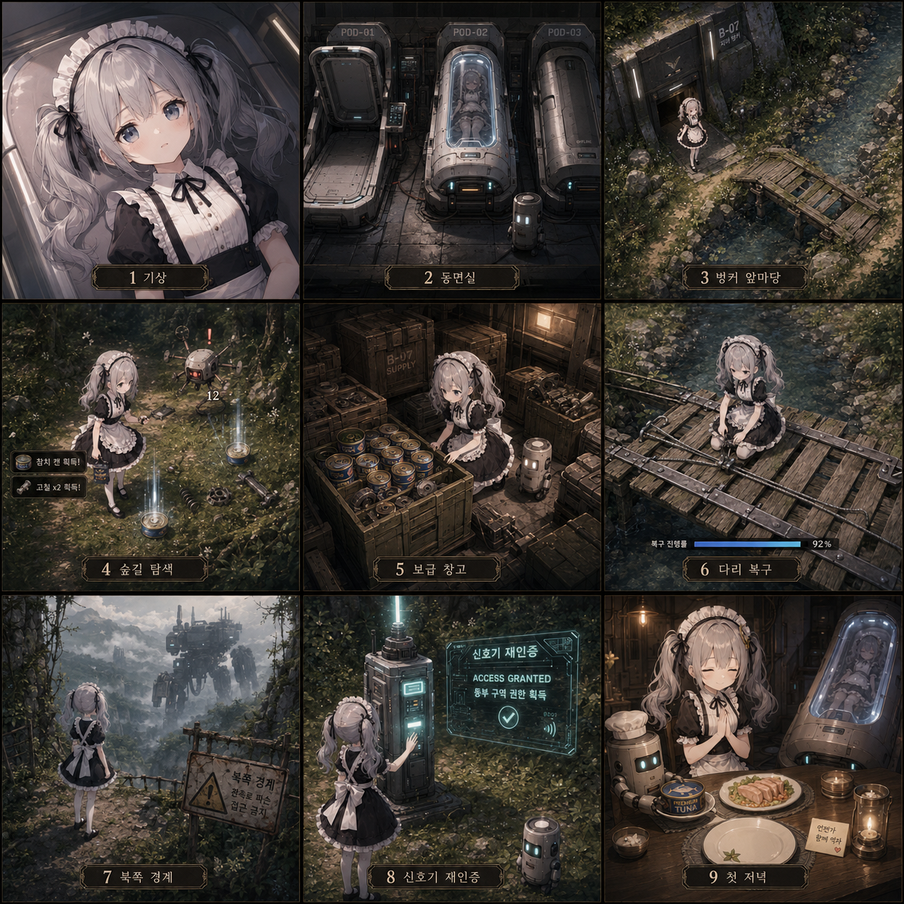
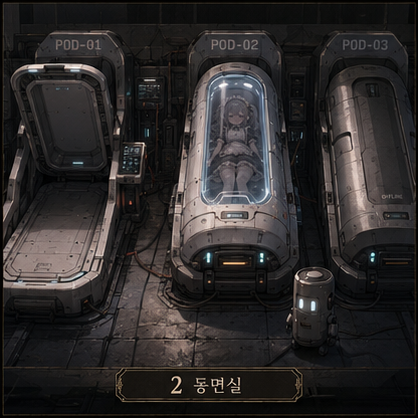
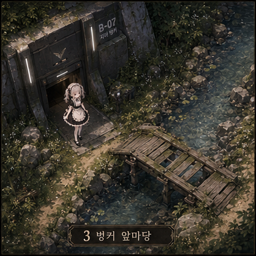
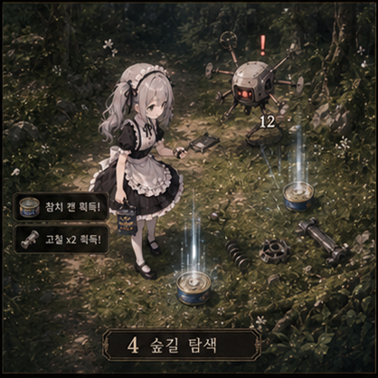
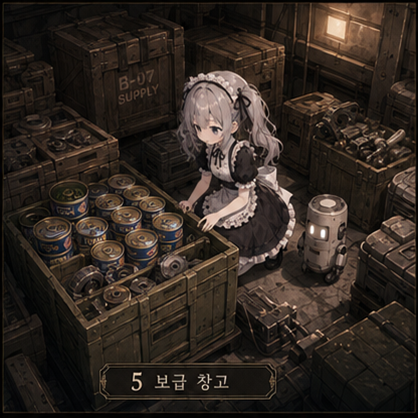
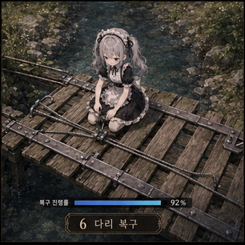
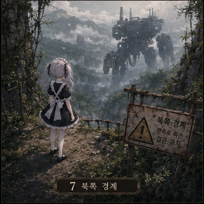
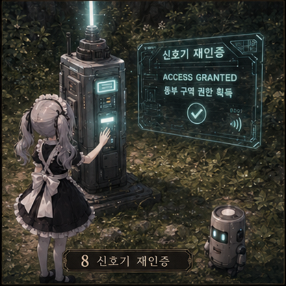
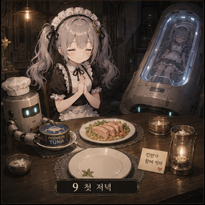

# Tuna Sweeper 대화집

숲속 벙커에서 깨어난 메이드로이드 **루나**가,
단일 대형 맵의 구역을 차례로 열고 작은 생활권을 다시 집으로 바꾸어 가는 본편 스토리 대화집입니다.

---

## 주요 화자

- **루나**: 플레이어 캐릭터. 차분하고 담담한 메이드로이드.
- **관리 AI**: 벙커 시스템. 건조한 문장으로 목표와 상태를 전달함.
- **두더지**: 참치 선반과 보급품을 챙기는 작은 두더지.

---

## 목차

1. [기상](#1-기상)
2. [동면실](#2-동면실)
3. [벙커-앞마당](#3-벙커-앞마당)
4. [숲길-탐색](#4-숲길-탐색)
5. [서쪽-우회로와-돌아오는-문](#5-서쪽-우회로와-돌아오는-문)
6. [콘크리트-더미와-막힌-숲길](#6-콘크리트-더미와-막힌-숲길)
7. [고급보안구역](#7-고급보안구역)
8. [보안-로그와-마지막-외출](#8-보안-로그와-마지막-외출)
9. [첫-저녁](#9-첫-저녁)

---

## 삽화 모음

아래 이미지는 3×3 구성의 전체 삽화 목차입니다.

---

## 1. 기상

어두운 동면 장치 내부. 루나가 눈을 뜬다.

**관리 AI**

> 지원 유닛 기상 확인.
> 기체 식별 중… 메이드로이드 루나.
> 상태: 불완전.

**루나**

> ……여기.
> 어디지?

**관리 AI**

> 위치: B-07 벙커 내부.
> 장기 저전력 상태에서 부분 재가동되었습니다.

**루나**

> 기억 데이터가 많이 비어 있어.
> 그래도 움직일 수는 있네.

**관리 AI**

> 기본 기능 확인 필요.
> 주변을 조사하십시오.

---

## 2. 동면실

루나는 동면실의 세 장치를 확인한다.

**관리 AI**

> POD-01. 지원 유닛용 동면 장치.
> 상태: 비상 기상 완료.

**루나**

> 내가 나온 장치… 정상적으로 열린 건 아니구나.

**관리 AI**

> 비상 기상 기록 손상.
> 상세 원인 확인 불가.

루나는 가운데 장치로 시선을 옮긴다.

**관리 AI**

> POD-02. 상태: 동면 유지 중.
> 생체 신호: 안정.

**루나**

> 안에… 누가 있어.

**관리 AI**

> 접근 권한 없음.
> 강제 개방 금지.

**루나**

> 깨우면 안 되는 거야?

**관리 AI**

> 기상 조건 미충족.
> 상위 권한 필요.

오른쪽 장치는 비어 있다.

**관리 AI**

> POD-03. 상태: 폐쇄.
> 내부: 비어 있음.

**루나**

> 비어 있는데 닫혀 있어.

참치 선반 아래 낡은 담요 더미에서 작은 두더지 한 마리가 몸을 일으킨다.

**두더지**

> ……으음.
> 참치 선반부터 봐야겠네.
> ……하나도 없어.

**루나**

> 너는?

**두더지**

> 난 두더지야.
> 이 벙커와 참치 선반을 지키며 살아왔어.

**루나**

> 선반 미관도 담당이야?

**두더지**

> 중요한 일이야. 먹을 것도 잘 챙겨야 하니까.

**관리 AI**

> 본편 목표를 등록합니다.
> 벙커 주변 제1생활권을 확보하고,
> 첫 야간 운용이 가능한 거주 상태를 달성하십시오.

**루나**

> 여기서… 살 수 있게 만들라는 뜻이네.

**두더지**

> 우리가 지낼 집을 만드는 거야.

---

## 3. 벙커 앞마당

루나는 처음으로 벙커 밖을 본다. 초반 숲길과 중앙 파밍 구역으로 이어지는 갈림길이 눈앞에 있다.

**관리 AI**

> 외부 출입문 수동 개방 가능.
> 주변 위험도: 낮음.
> 회수 우선순위: 참치캔, 부품 조각.

**루나**

> 참치캔이 우선순위에 있어?

**두더지**

> 중요하지. 그래도 네 안전이 먼저야.

**루나**

> 왜?

**관리 AI**

> 장기 보존 식량.
> 인간 생존 기준 적합.

**루나**

> 인간…
> 그럼 안에 잠든 사람을 위한 걸까.

**두더지**

> 참치는 적어도 우리 배를 채워주잖아.
> 맛있어.

**루나**

> 너 먹을 수 있어?

**두더지**

> 나도 먹을 수 있어.

루나는 벙커 입구 앞에 서서 주변을 둘러본다.

**루나**

> 물소리… 나쁘지 않네.
> 여긴 아직 완전히 죽은 곳은 아닌가 봐.

**두더지**

> 조금만 손보면 우리 집으로 괜찮겠어.

---

## 4. 숲길 탐색

숲길 중앙으로 나간 루나는 참치캔과 부품을 줍고, 고장난 드론과 마주친다.

**루나**

> 원통형 보급품 발견.
> 라벨… 참치.

**두더지**

> 챙기자. 먹을 건 귀하니까.

**루나**

> 정말 중요한가 보네.

**두더지**

> 선반이 비어 있으면 마음도 비어 보이잖아.

**루나**

> ……그건 조금 이해돼.

빛 기둥과 함께 부품이 드러난다.

**루나**

> 부품 조각 발견.
> 이걸로 뭘 고칠 수 있지?

**관리 AI**

> 작업대, 조명, 출입로 설비 복구 가능.
> 수집을 권장합니다.

그때, 숲길의 작은 드론이 루나를 향해 반응한다.

**관리 AI**

> 고장난 자동기계 접근.
> 위협 수준: 낮음.

**루나**

> 저건 적이야?

**관리 AI**

> 식별 실패.
> 그러나 충돌 가능성 있음.

**두더지**

> 드론이 참치를 밟을 수 있어.

**루나**

> 그럼 정리하자.

전투 후.

**루나**

> 멈췄다.
> 부품도 남겼네.

**두더지**

> 정말 깔끔해졌네.

**관리 AI**

> 숲길 중앙 도달.
> 제1생활권 후보 구역입니다.

**루나**

> 정리하면 생활권이 되는 거네.

---

## 5. 서쪽 우회로와 돌아오는 문

서쪽 우회로 끝에서 루나는 초기 구역으로 돌아오는 잠긴 문을 발견한다.

**관리 AI**

> 우회로 종점 도달.
> 초기 구역 연결문 확인.
> 반대편 수동 개방 가능.

**루나**

> 여기서 열면 돌아가는 길이 짧아지겠어.

**두더지**

> 이제 돌아오는 길이 훨씬 편해졌어.
> 참치도 훨씬 편하게 가져올 수 있겠어.

**루나**

> 결국 거기로 이어지는구나.

**두더지**

> 참치를 들고 돌아올 길은 짧을수록 좋지.

문이 열린다.

**루나**

> 이제 맵이 조금 접힌 느낌이야.

**관리 AI**

> 영구 개방 문 등록.
> 초기 귀환 동선 단축.

**루나**

> 같은 길인데 전보다 짧아졌어.

루나는 문 너머의 익숙한 벙커 방향을 본다.

**관리 AI**

> 숲길 단서 조사가 필요합니다.
> 막힌 길을 열 수 있는 방법을 확인하십시오.

**루나**

> 다음은 막힌 길을 여는 준비네.

**두더지**

> 준비된 집은 돌아오는 길도 짧아야 해.

루나는 어이없다는 듯 웃는다.

**루나**

> 그 기준은 이상한데, 이번엔 맞는 말이야.

---

## 6. 콘크리트 더미와 막힌 숲길

숲길 단서를 조사한 뒤, 루나는 길목을 막은 콘크리트 더미 앞에 선다. 이 구간은 포탈을 직접 설명하지 않고, 막힌 길을 열 수 있다는 사실만 암시한다.

**관리 AI**

> 진행 관문 도달.
> 콘크리트 더미 확인.
> 손으로 제거하기에는 비효율적입니다.

**루나**

> 여기서 막혀 있었구나.

**관리 AI**

> 자판기 폭발물 사용 가능.
> 적절한 거리 확보를 권장합니다.

**두더지**

> 이 길을 열면 같은 길을 몇 번씩 돌지 않아도 돼.

**루나**

> 되게 실용적인 설명이네.

개방 작업이 시작된다.

**관리 AI**

> 폭발물 설치 확인.
> 소음 및 진동 발생 예정.
> 주변 기계 반응 가능성 있음.

**루나**

> 가까이 있으면 안 되는 거지?

**두더지**

> 맞아.
> 퀘스트 실패가 아니라 인생 실패가 될 수 있어.

**루나**

> 표현이 너무 세.

잠시 후, 길이 이어진다.

**관리 AI**

> 콘크리트 더미 제거 완료.
> 영구 지형 변화가 기록되었습니다.

**루나**

> 길이 이어졌어.

**두더지**

> 잘했어. 다친 데는 없지?
> 이제 다음부터는 덜 힘들게 다닐 수 있겠다.

---

## 7. 고급보안구역

콘크리트 더미를 지나 더 깊이 들어간 루나는 고급보안구역의 표식과 잔존 경비 신호를 발견한다.

**루나**

> …………

**두더지**

> …………

먼 숲이 흔들리고, 발소리가 천천히 사라진다.

**루나**

> 지금 건… 못 본 걸로 할까?

**두더지**

> 기억은 해둘게.
> 그래도 지금은 가까이 가지 마.

**루나**

> 나도 그럴 생각이야.

루나는 경고 표지판을 내려다본다.

**루나**

> 여기부터는 확실히 위험 구역이네.

**두더지**

> 고급보안구역이야. 위험하니까 조심해.
> 이름이 불친절하게 정확해.

**루나**

> 안 들어가면 안 돼?

**두더지**

> 피하고 싶겠지만, 준비되면 같이 방법을 찾아보자.

---

## 8. 보안 로그와 마지막 외출

고급보안구역에서 회수한 기록칩과 파손된 드론 렌즈를 통해 루나는 최종보스의 위치를 확인한다. 보스를 처치해도 엔딩으로 바로 이어지지 않고, 마지막 식탁 준비가 남는다.

**관리 AI**

> 고급보안구역 기록칩 인식.
> 손상 데이터 복구 중.

**루나**

> 이런 데서 아직 데이터가 읽혀?

**관리 AI**

> 보조 저장 매체와 물리 입력 부품이 필요합니다.
> 오래된 규격은 쉽게 죽지 않습니다.

보안 로그가 열린다.

**관리 AI**

> 최종 위협 위치 확인.
> 마지막 외출 준비를 권장합니다.

**루나**

> 정말 마지막이었으면 좋겠다.

**두더지**

> 정확히는 마지막이길 바라는 외출이야.

최종보스전 이후.

**관리 AI**

> 최종보스 처치가 확인되었습니다.
> 엔딩 조건은 아직 모두 충족되지 않았습니다.

**루나**

> 끝난 줄 알았는데.

**관리 AI**

> 좋은 엔딩에는 정리가 필요합니다.

**두더지**

> 그리고 고급참치가 필요해.

**루나**

> 갑자기 현실적인데, 이번엔 나도 기대돼.

---

## 9. 첫 저녁

최종보스전 이후 고급참치와 식탁 재료를 준비한 뒤, 벙커는 마침내 ‘살 수 있는 곳’이 된다.

**관리 AI**

> 비상 보급 상자 등록 완료.
> 식량 비축량: 기준치 도달.
> 오늘의 식탁: 준비 가능.
> 생활 안정화: 확인 가능.
> 거주 가능 상태: 달성.

**루나**

> 달성…
> 이제 여긴 살 수 있는 곳이 된 거야?

**관리 AI**

> 기준상 그렇습니다.

**두더지**

> 불도 켜졌고, 이제 제법 집 같아.
> 작업대도 있고,
> 참치도 있고,
> 무엇보다 네가 돌아와 있잖아.

**루나**

> 귀환자?

**두더지**

> 루나야.

잠시 뒤, 두더지가 작은 식탁을 차린다.

**루나**

> 뭐 하는 거야?

**두더지**

> 우리 첫 저녁 준비하고 있어.

**루나**

> 우리는 먹을 수 있어?

**두더지**

> 나도 먹을 수 있어.
> 같이 먹을 준비는 끝났어.

**루나**

> 그럼 식사라기보다 검사잖아.

**두더지**

> 같이 먹으면 더 맛있잖아.
> 집에는 식탁이 필요해.

루나는 잠시 POD-02 방향을 바라본다.

**루나**

> 아직은 못 깨워.
> 그래도… 기다릴 수 있는 자리는 만들어졌네.

**두더지**

> 빈자리는 언젠가 누군가와 같이 앉을 자리야.

**루나**

> 그건 괜찮네.

캔이 열린다. 작은 불빛이 벙커를 따뜻하게 비춘다.

**두더지**

> 고급참치 한 캔, 이제 열어도 될까?

**루나**

> 거절할 이유는 없겠네.

**두더지**

> 오늘은 마음껏 축하하자.

루나는 작게 웃는다.

**루나**

> 오늘부터 여긴 집이야.

**두더지**

> 이제 우리 집 이름만 정하면 되겠네.

**루나**

> 그럼… 튜나 벙커.

**두더지**

> 좋아. 이제 여긴 튜나 벙커야.
> 참치 선반도 아주 든든해졌고.

**루나**

> 밖은 아직 위험하지만…
> 여기까지는 괜찮아.

**관리 AI**

> 지원 유닛 대기 모드 전환 가능.
> 야간 운용 안정.

**루나**

> 오늘 임무 완료.
> 내일도 정리할 게 많겠지?

**두더지**

> 응.
> 참치 선반은 더 넓어질 수 있어.

**루나**

> 그래.
> 내일은 조금 더 멀리 가보자.

---

## 엔딩 한 줄 요약

> **“세계를 구하지는 못했지만, 오늘 밤 돌아올 집은 만들었다.”**
