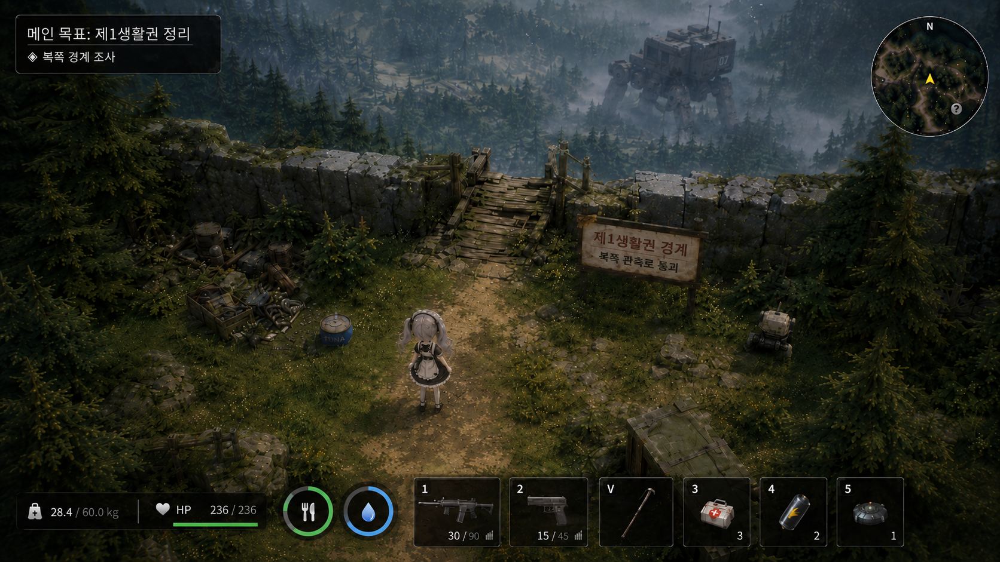
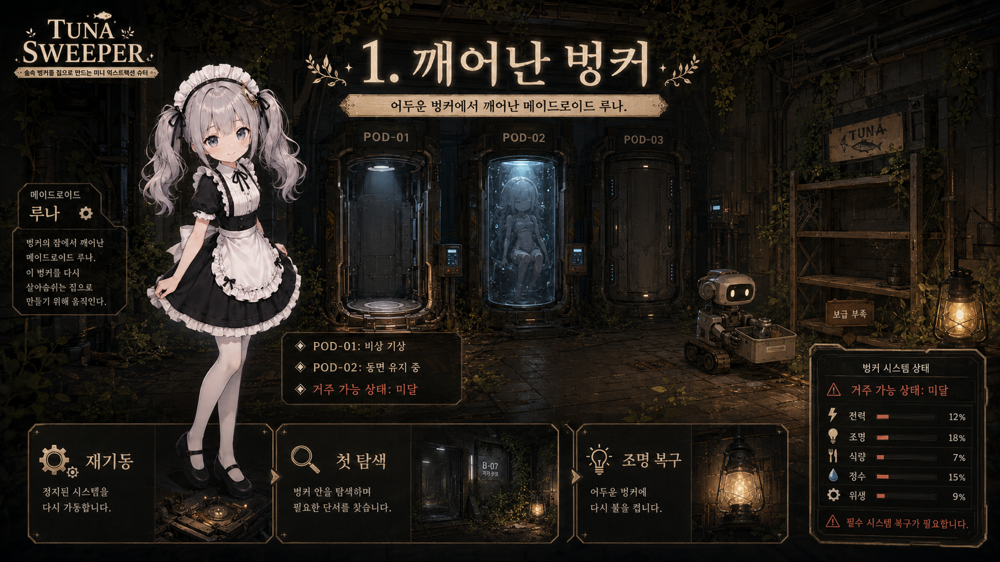
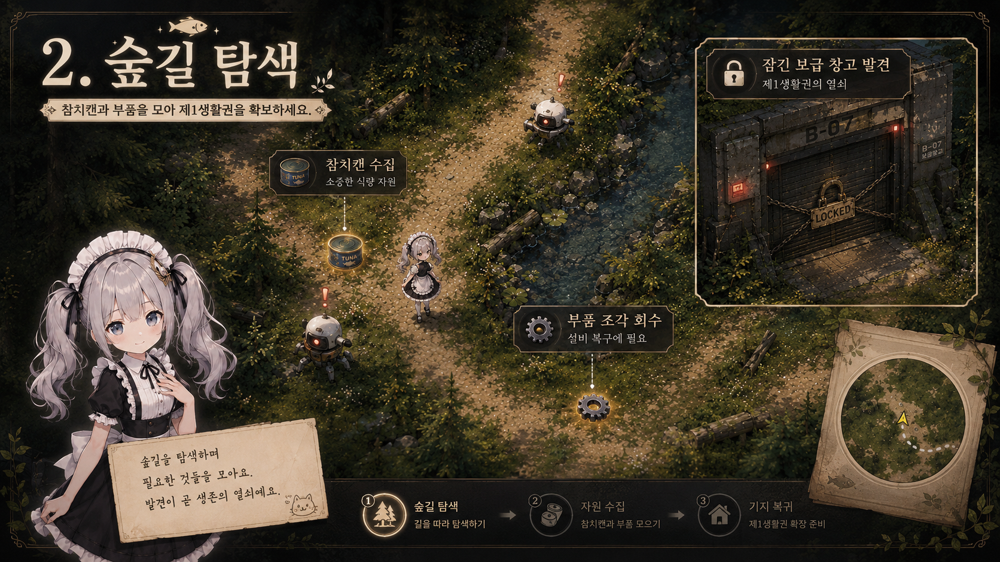
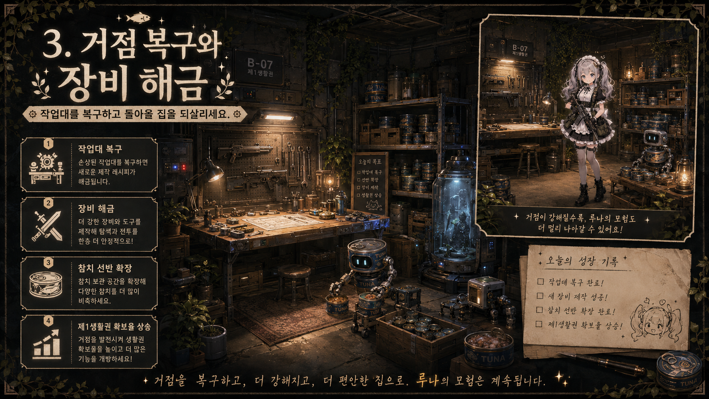
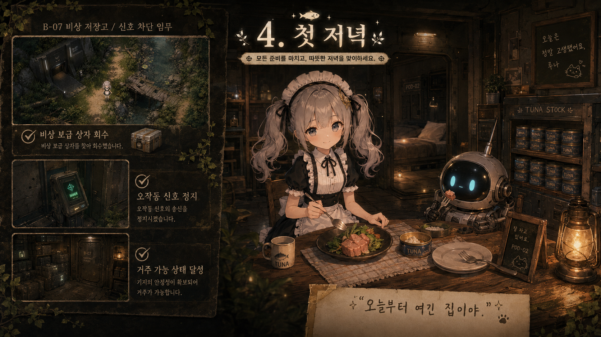

# Tuna Sweeper 본편 스토리/퀘스트 구성 정리


## 1. 핵심 방향

**Tuna Sweeper**는 거대한 세계의 진실을 파헤치는 게임이 아니라, 숲속 벙커에서 깨어난 소녀형 안드로이드가 주변 숲의 제1생활권을 확보하고, 벙커를 거주 가능한 집으로 만드는 3~4시간 분량의 소규모 익스트랙션 슈터다.

본편의 감정선은 다음과 같다.

> 어두운 대피소 → 돌아올 수 있는 집  
> 빈 참치 선반 → 차려진 식탁  
> 고장난 벙커 → 따뜻한 첫 저녁

최종 목표는 단순히 “프리미엄 참치 획득”이 아니라, **벙커를 거주 가능 상태로 만들고 첫 저녁을 차리는 것**이다.

---

## 2. 본편 목표

### 공식 목표

> 벙커 주변 제1생활권을 확보하고, 첫 야간 운용이 가능한 거주 가능 상태를 달성한다.

### 플레이어가 실제로 하는 일

- 벙커 내부 상태 점검
- 참치캔과 부품 조각 회수
- 숲길 정리
- 보급 창고 개방
- 작업대 복구
- 냇가의 오작동 보급 신호 추적
- 비상 보급 저장고 개방
- 오작동 신호 정지
- 프리미엄 참치 상자와 야간 운용 부품 회수
- 벙커에서 첫 저녁 준비

### 엔딩 감정

> 세계를 구한 것이 아니라, 오늘 밤 돌아올 집을 만들었다.

---

## 3. 본편에서 해결하는 것과 남기는 것

### 본편에서 해결하는 것

- 벙커 조명 복구
- 작업대 복구
- 참치 선반 완성
- 보급 창고 개방
- 냇가 통로 확보
- 오작동 보급 신호 정지
- 비상 보급 저장고 물자 회수
- 제1생활권 확보
- 거주 가능 상태 달성
- 첫 저녁 준비

### 본편에서 남기는 것

- POD-02 안에 잠든 존재의 정체
- POD-03 빈 장치의 사용자
- 상위 권한의 의미
- 주인공의 정확한 제작 목적
- 숲 바깥의 세계

이 떡밥들은 본편의 미완성이 아니라, DLC나 후속 지역으로 이어지는 남은 미스터리다.

---

## 4. 주요 캐릭터/요소

## 4.1 플레이어: 소녀형 안드로이드 지원 유닛

- 숲속 벙커의 열린 동면 장치에서 비상 기상
- 기억 일부 손상
- 식량 확보 프로토콜 유지
- 참치캔을 중요 자원으로 인식
- 감정 표현은 서툴지만, 점점 벙커를 “집”으로 받아들임

대표 대사:

> “기억 데이터 손상. 위치 확인… 벙커.”  
> “고단백 원통형 보급품. 중요도 높음.”  
> “조명이 켜지니까… 덜 버려진 곳 같아.”

---

## 4.2 캔봇

참치캔 정리 담당 소형 로봇. 본편의 벙커 관리인 역할을 하지만, 상점/퀘스트/제작 기능은 직접 담당하지 않는다.

### 역할

- 참치 선반 정리
- 짧은 안내와 리액션
- 벙커 생활감 제공
- 엔딩에서 첫 식탁 준비

### 하지 않는 것

- 상점 기능
- 퀘스트 제공
- 호감도
- 제작/강화 담당
- 전투 동행

대표 대사:

> “참치 선반 비어 있음. 비상 상황입니다.”  
> “밖은 위험함. 하지만 참치는 밖에 있음.”  
> “프리미엄 참치 확인. 중앙 선반 배치 대상입니다.”  
> “그래도 준비된 집입니다.”

---

## 4.3 벙커 시스템

감정 없는 시스템 메시지와 퀘스트 목표를 표시하는 장치.

### 역할

- 벙커 상태 진단
- 퀘스트 목표 표시
- 동면 장치 상태 표시
- 본편 목표와 DLC 떡밥 전달

대표 로그:

```text
POD-02: PRIMARY / STASIS ACTIVE
생체 신호: 안정
기상 권한: 없음
```

```text
제1생활권 확보 완료
외부 출입로: 안정
오작동 보급 신호: 정지
비상 보급품: 회수 완료
벙커 야간 운용: 가능
거주 가능 상태: 달성
```

---

## 4.4 동면 장치 3개

벙커 안에 처음부터 보이는 핵심 떡밥.

| 장치 | 상태 | 역할 |
|---|---|---|
| POD-01 | 열림 | 주인공이 나온 장치 |
| POD-02 | 가동 중 | 누군가 잠들어 있음, DLC 떡밥 |
| POD-03 | 닫힌 빈 장치 | 사라진 누군가의 흔적 |

### POD-01

```text
POD-01: SUPPORT UNIT / AWAKENED
비상 기상 기록: 손상됨
```

### POD-02

```text
POD-02: PRIMARY / STASIS ACTIVE
생체 신호: 안정
기상 권한: 없음
```

### POD-03

```text
POD-03: EMPTY / LOCKED
사용자 기록: 삭제됨
```

본편에서는 POD-02를 절대 깨우지 않는다.

---

## 5. 시스템/범위 결정 사항

## 5.1 지역

지역은 1개다.

> 숲속 벙커 주변 제1생활권



그 안에서 서브구역 느낌으로 진행한다.

- 벙커 내부/앞마당
- 숲길
- 보급 창고
- 냇가
- 비상 보급 저장고

거대 공장, 대형 연구소, 멀쩡히 작동하는 거대 시설은 본편에서 제외한다.

---

## 5.2 재화

### 참치캔

- 돈이 아니라 핵심 수집품/식량 비축 상징
- 선반에 쌓이며 진행감을 줌
- 최종 엔딩의 식탁과 연결

### 부품 조각

- 실질적인 기본 재화
- 작업대 복구, 장비 제작, 수리, 업그레이드에 사용

### 배터리

- 본편에서는 능력 트리 재화로 크게 쓰지 않음
- 필요하다면 퀘스트 아이템 또는 DLC 떡밥 수준으로 제한

---

## 5.3 상점/작업대

본편에는 상점이 없다.

- 무기상 없음
- 방어구상 없음
- 잡화상 없음
- NPC별 상점 없음

대신 **작업대 하나**로 통합한다.

### 작업대 기능

- 장비 제작
- 장비 수리
- 간단 업그레이드
- 수리 키트 보충

### 작업대 진행

| 시점 | 상태 |
|---|---|
| 시작 | 고장난 상태, 전력 부족 |
| 메인 1 후 | 기본 정비 가능 |
| 메인 2 후 | 정식 개방 준비 |
| 메인 3 후 | 새 장비 제작 가능 |
| 엔딩 후 | 자유 정리 가능 |

---

## 5.4 NPC

NPC 기능은 넣지 않는다.

즉, NPC는 다음을 하지 않는다.

- 상점
- 퀘스트 지급
- 호감도
- 제작 담당
- 전투 동행
- 스케줄 생활

대신 연출형 NPC는 가능하다.

- 캔봇: 참치 선반 정리
- 청소봇: 바닥 청소 연출
- 정비봇: 작업대 주변 공구질 연출

본편에서 꼭 필요한 것은 캔봇이며, 나머지는 포트폴리오용 연출 요소로 제한한다.

---

## 5.5 창고 개방

보급 창고는 처음부터 열려 있지 않다.

### 진행 구조

| 시점 | 창고 상태 |
|---|---|
| 시작 | 존재만 암시 |
| 메인 2 | 외부 접근 가능, 문은 잠김 |
| 메인 3 | 개방 도구 제작 후 진입 |
| 메인 3 완료 | 대량 보상, 새 장비, 설계도 획득 |

창고는 본편의 첫 번째 중간 목표이자 큰 보상 구역이다.

---

## 5.6 시간 시스템

“첫 밤” 또는 “첫 저녁”은 실제 시간 시스템이 아니다.

넣지 않는 것:

- 실시간 낮밤 사이클
- 타이머
- 시간 제한
- 굶주림
- 수면 시스템
- 하루 카운트

대신 메인 진행에 따라 조명/분위기만 바뀌고, 엔딩에서 밤 연출이 나온다.

---

## 6. 메인 퀘스트 구성

총 5개 메인 챕터.  
각 챕터 안에 작은 연계 퀘스트가 들어간다.

| 메인 | 제목 | 핵심 목표 | 감정 변화 |
|---|---|---|---|
| 1 | 깨어난 벙커 | 재기동, 첫 참치 회수, 조명 복구 | 여긴 어디지? |
| 2 | 숲길 정리 | 출입로 확보, 창고 발견 | 밖에 나갔다 돌아올 수 있다 |
| 3 | 보급 창고 | 창고 개방, 작업대 복구 | 벙커가 쓸 만해진다 |
| 4 | 냇가의 신호 | 신호 추적, 저장고 좌표 획득 | 위험 원인을 찾는다 |
| 5 | 첫 저녁 | 저장고 회수, 신호 정지, 식탁 준비 | 여긴 집이다 |

---

# 메인 퀘스트 1. 깨어난 벙커



## 챕터 역할

튜토리얼, 벙커 소개, 목표 설정.

## 시작 상황

플레이어는 어두운 벙커 안에서 깨어난다. 조명은 깜빡이고, 작업대는 꺼져 있으며, 참치 선반은 비어 있다.

옆에는 열린 동면 장치가 있다. 조금 떨어진 곳에는 아직 작동 중인 동면 장치 하나와, 닫혀 있지만 비어 있는 장치 하나가 보인다.

캔봇은 참치 선반 앞에서 반쯤 고장난 상태로 재부팅된다.

---

## 퀘스트 1-1. 재기동 확인

### 목표

- 벙커 내부 둘러보기
- 열린 동면 장치 조사
- 벙커 시스템 단말기 확인
- 기본 권총 회수

### 퀘스트 설명

> **재기동 확인**  
> 지원 유닛의 비상 기상이 확인되었습니다.  
> 벙커 내부 상태를 점검하고 기본 장비를 회수하십시오.

### 시스템 로그

```text
POD-01: SUPPORT UNIT / AWAKENED
비상 기상 기록: 손상됨
벙커 상태: 저전력
거주 가능 상태: 미달
```

### 대사

안드로이드:

> “기억 데이터 손상. 위치 확인… 벙커.”  
> “내가 나온 장치인가.”

캔봇:

> “참치 선반 비어 있음. 비상 상황입니다.”

안드로이드:

> “그게 첫 번째 비상 상황이야?”

---

## 퀘스트 1-2. 잠든 장치

### 목표

- POD-02 조사
- POD-03 조사
- 시스템 로그 확인

### 퀘스트 설명

> **동면 장치 점검**  
> 벙커 내 동면 장치의 상태를 확인하십시오.  
> 접근 권한이 없는 장치는 강제로 개방하지 마십시오.

### 시스템 로그

```text
POD-02: PRIMARY / STASIS ACTIVE
생체 신호: 안정
기상 권한: 없음
```

```text
POD-03: EMPTY / LOCKED
사용자 기록: 삭제됨
```

### 대사

안드로이드:

> “하나는 아직 잠들어 있고…”  
> “하나는 비어 있는데 잠겨 있어.”

캔봇:

> “기록 누락은 관리 대상이 아닙니다. 참치 누락은 관리 대상입니다.”

안드로이드:

> “너 기준 이상해.”

---

## 퀘스트 1-3. 첫 외부 탐색

### 목표

- 벙커 밖으로 나가기
- 벙커 앞마당에서 참치캔 3개 회수
- 부품 조각 10개 수집
- 정찰 드론 2기 처치
- 벙커로 귀환

### 퀘스트 설명

> **식량 확보 프로토콜**  
> 벙커의 식량 비축량이 기준치에 미달합니다.  
> 주변에서 보존 식량과 수리 부품을 회수하십시오.

### 시스템 로그

```text
식량 비축량: 0%
외부 출입로: 위험도 낮음
회수 우선순위: 참치캔 / 부품 조각
```

### 대사

안드로이드:

> “참치캔 발견.”  
> “고단백 원통형 보급품. 중요도 높음.”

캔봇:

> “회수 권장. 강력 권장.”

---

## 퀘스트 1-4. 조명 복구

### 목표

- 벙커로 귀환
- 부품 조각으로 보조 전력 복구
- 참치캔을 선반에 등록
- 캔봇 재기동 완료

### 퀘스트 설명

> **보조 전력 복구**  
> 회수한 부품을 사용해 벙커 조명을 복구하십시오.  
> 식량 선반에 참치캔을 등록하면 보급 상태가 갱신됩니다.

### 완료 변화

- 벙커 조명 일부 켜짐
- 캔봇 정상 작동
- 참치 선반에 첫 참치캔 표시
- 작업대는 아직 제한 상태

### 대사

캔봇:

> “참치 3개 등록. 선반 상태: 아주 조금 안심.”

안드로이드:

> “조명이 켜지니까… 덜 버려진 곳 같아.”

시스템:

```text
벙커 상태: 임시 대피소
다음 목표: 외부 출입로 확보
```

---

# 메인 퀘스트 2. 숲길 정리



## 챕터 역할

기본 탐색 루프 확립. “집 앞을 안전하게 만든다”는 감각을 준다.

---

## 퀘스트 2-1. 벙커 앞마당 정리

### 목표

- 벙커 앞마당의 고장 기계 제거
- 부품 조각 20개 수집
- 참치캔 3개 추가 회수

### 퀘스트 설명

> **벙커 앞마당 정리**  
> 벙커 출입로 주변에 고장난 자동기계가 남아 있습니다.  
> 출입 안전을 위해 주변을 정리하십시오.

### 대사

안드로이드:

> “집 앞에 드론이 돌아다니는 건 불편해.”

캔봇:

> “집이라는 표현을 기록했습니다.”

안드로이드:

> “아직 집이라고 한 건 아니야.”

---

## 퀘스트 2-2. 숲길 중앙 확보

### 목표

- 숲길 중앙까지 이동
- 정찰 드론 4기 처치
- 낡은 표지판 조사

### 퀘스트 설명

> **숲길 중앙 확보**  
> 벙커에서 이어지는 숲길을 따라 이동하십시오.  
> 보급 창고 방향을 나타내는 표지판이 감지되었습니다.

### 발견

```text
보급 창고 →
```

표지판 글씨 일부는 지워져 있다.

### 대사

캔봇:

> “창고 방향 신호 감지. 참치 가능성 있음.”

안드로이드:

> “참치 가능성이라면 확인할 가치가 있지.”

---

## 퀘스트 2-3. 잠긴 보급 창고

### 목표

- 보급 창고 외부 도달
- 창고 셔터 조사
- 주변 적 제거
- 벙커로 귀환

### 퀘스트 설명

> **낡은 보급 창고**  
> 숲길 끝에서 보급 창고가 확인되었습니다.  
> 셔터가 고착되어 있어 현재 진입할 수 없습니다.

### 시스템 로그

```text
창고 상태: 셔터 고착
수동 개방: 불가
필요 조건: 개방 도구 / 추가 부품
```

### 대사

안드로이드:

> “안에 뭔가 있는데 못 열어.”

캔봇:

> “참치와의 물리적 단절 확인.”

안드로이드:

> “그렇게 말하니까 더 심각해 보이네.”

---

## 퀘스트 2-4. 작업대 기본 복구

### 목표

- 부품 조각으로 작업대 기본 전원 복구
- 수리 키트 보충 기능 개방
- 스캐너 제작 조건 확인

### 퀘스트 설명

> **작업대 기본 복구**  
> 외부에서 회수한 부품으로 작업대의 기본 정비 기능을 복구하십시오.  
> 이후 장비 제작과 간단한 업그레이드가 가능해집니다.

### 완료 변화

- 작업대 기본 기능 개방
- 수리 키트 보충 가능
- 스캐너 제작 조건 표시
- 참치 선반 1단계 변화

### 대사

캔봇:

> “작업대 전력 복구. 이제 물건을 고칠 수 있습니다.”

안드로이드:

> “그러면 저 창고 문도 언젠가 열 수 있겠네.”

시스템:

```text
외부 출입로: 부분 안정
제1생활권 확보율: 25%
```

---

# 메인 퀘스트 3. 보급 창고



## 챕터 역할

중간 성취. 처음으로 “큰 보상 구역”을 연다.

---

## 퀘스트 3-1. 개방 도구 제작

### 목표

- 부품 조각 40개 수집
- 작업대에서 창고 개방 도구 제작
- 스캐너 제작 또는 사용

### 퀘스트 설명

> **개방 도구 제작**  
> 보급 창고의 셔터를 열기 위한 간이 개방 도구를 제작하십시오.  
> 필요한 부품은 숲길과 폐자재 더미에서 회수할 수 있습니다.

### 대사

캔봇:

> “창고 개방 도구 제작 가능. 참치 접근성 향상 예상.”

안드로이드:

> “너 정말 참치 기준으로만 세상을 보네.”

캔봇:

> “정상입니다.”

---

## 퀘스트 3-2. 창고 셔터 수리

### 목표

- 창고로 이동
- 주변 드론 제거
- 개방 도구 사용
- 셔터 수리 후 창고 개방

### 퀘스트 설명

> **창고 셔터 수리**  
> 개방 도구를 사용해 고착된 셔터를 복구하십시오.  
> 주변 자동기계가 소음에 반응할 수 있습니다.

### 이벤트

셔터를 열면 작은 적 웨이브 발생.

### 대사

안드로이드:

> “문 열리는 소리가 너무 커.”

캔봇:

> “참치도 놀랐을 수 있습니다.”

안드로이드:

> “참치는 안 놀라.”

---

## 퀘스트 3-3. 보존 식량 회수

### 목표

- 창고 내부 보급상자 2개 열기
- 참치캔 10개 회수
- 부품 조각 30개 회수
- 산탄총 부품 획득

### 퀘스트 설명

> **보존 식량 회수**  
> 창고 내부에서 다수의 통조림 신호가 감지됩니다.  
> 손상되지 않은 보존 식량을 우선 회수하십시오.

### 대사

캔봇:

> “참치 다수 감지. 선반 확장 준비.”

안드로이드:

> “이 정도면 오늘은 풍족하다.”

---

## 퀘스트 3-4. 이상한 설계도

### 목표

- 창고 안쪽 조사
- 캔 런처 설계도 발견
- 빈 캔 5개 회수
- 벙커로 귀환

### 퀘스트 설명

> **이상한 설계도**  
> 창고 안쪽에서 빈 캔을 발사체로 사용하는 장비 설계도가 발견되었습니다.  
> 합리성은 낮지만 실용 가능성이 있습니다.

### 시스템 로그

```text
설계도 등록: 캔 런처
제작 조건: 추후 해금
```

### 대사

안드로이드:

> “이걸 무기라고 부를 수 있어?”

캔봇:

> “참치의 두 번째 삶입니다.”

안드로이드:

> “말은 좋은데 좀 이상해.”

---

## 퀘스트 3-5. 작업대 정식 개방

### 목표

- 창고에서 가져온 부품으로 작업대 복구
- 산탄총 제작 가능
- 장비 업그레이드 1단계 개방
- 참치 선반 확장

### 퀘스트 설명

> **작업대 정식 개방**  
> 창고에서 회수한 부품으로 작업대 기능을 확장하십시오.  
> 이제 새 장비 제작과 간단한 업그레이드가 가능합니다.

### 완료 변화

- 산탄총 또는 기관단총 제작 가능
- 참치 선반 확장
- 정비봇 연출을 넣는다면 이 시점에 등장
- 벙커가 확실히 밝아짐

### 대사

캔봇:

> “선반 확장 완료. 참치 배열 가능 수 증가.”

안드로이드:

> “이제 조금 창고가 아니라 집 같아.”

캔봇:

> “집 표현 두 번째 기록.”

시스템:

```text
제1생활권 확보율: 50%
```

---

# 메인 퀘스트 4. 냇가의 신호

## 챕터 역할

후반 목표 안내. 최종 저장고와 오작동 신호기를 발견한다.

---

## 퀘스트 4-1. 이상 신호 감지

### 목표

- 벙커 시스템에서 신호 확인
- 냇가 방향 숲길 개방
- 스캐너로 신호 추적

### 퀘스트 설명

> **이상 신호 감지**  
> 냇가 방향에서 오래된 보급 신호가 감지됩니다.  
> 신호 발생 지점을 확인하십시오.

### 시스템 로그

```text
오래된 보급 신호 감지
신호 상태: 반복 송출
외부 자동기계 유입 가능성 증가
```

### 대사

안드로이드:

> “이 신호 때문에 기계들이 모이는 걸까?”

캔봇:

> “신호 내용 분석 중… 보급 요청입니다.”

안드로이드:

> “그럼 참치가 있을 수도 있고, 위험도 있을 수도 있네.”

---

## 퀘스트 4-2. 무너진 다리

### 목표

- 냇가 도달
- 무너진 다리 조사
- 부품 조각으로 임시 통로 복구
- 주변 터렛 제거

### 퀘스트 설명

> **무너진 다리**  
> 냇가 건너편에 신호 발생 지점이 있습니다.  
> 임시 통로를 확보하고 주변 위협을 제거하십시오.

### 대사

안드로이드:

> “물소리. 기계음보다 나아.”

캔봇:

> “수분은 참치캔 외부 부식 요인입니다.”

안드로이드:

> “감성 없는 말 하지 마.”

---

## 퀘스트 4-3. 떠내려온 보급함

### 목표

- 스캐너로 숨겨진 보급함 찾기
- 참치캔 6개 회수
- 부품 조각 회수
- 낡은 신호기 부품 발견

### 퀘스트 설명

> **떠내려온 보급함**  
> 냇가 주변에서 손상된 보급함이 감지됩니다.  
> 회수 가능한 물자를 확보하십시오.

### 대사

캔봇:

> “물에 젖은 참치캔 회수. 밀봉 상태 양호.”

안드로이드:

> “참치는 강하네.”

캔봇:

> “참치는 강합니다.”

---

## 퀘스트 4-4. 오작동 보급 신호기

### 목표

- 낡은 신호기 조사
- 신호 내용을 복구
- 비상 보급 저장고 좌표 획득
- 신호기가 고장나 계속 송출 중임을 확인

### 퀘스트 설명

> **오작동 보급 신호기**  
> 오래된 보급 신호기가 같은 구조 요청을 반복 송출하고 있습니다.  
> 신호를 분석하고 연결된 저장고 좌표를 복구하십시오.

### 시스템 로그

```text
신호 원문 복구:
비상 보급 저장고 B-07
야간 운용 물자 부족 시 개방
신호 송출 오류: 정지 실패
```

### 대사

안드로이드:

> “이 신호가 계속 켜져 있으면 기계들이 계속 모이겠네.”

캔봇:

> “집 주변 안전도 저하. 참치 보관에 부적합.”

안드로이드:

> “그래. 이제 그 이유가 더 납득돼.”

---

## 퀘스트 4-5. 저장고 좌표 등록

### 목표

- 벙커로 귀환
- 저장고 좌표 등록
- 최종 보급품 필요 조건 확인
- 첫 야간 운용 준비 목표 갱신

### 퀘스트 설명

> **저장고 좌표 등록**  
> 복구한 좌표를 벙커 시스템에 등록하십시오.  
> 저장고의 비상 보급품은 야간 운용 준비에 필요합니다.

### 시스템 로그

```text
비상 보급 저장고 위치 등록 완료
벙커 야간 운용 상태: 불안정
필요 항목: 비상 보급 상자 / 신호기 정지 / 귀환로 안정화
```

### 대사

안드로이드:

> “밤이 오기 전에 준비해야 한다는 뜻은 아니지?”

캔봇:

> “시간 제한 없음. 하지만 준비는 필요합니다.”

안드로이드:

> “좋아. 서두르지 말고 끝내자.”

시스템:

```text
제1생활권 확보율: 75%
```

---

# 메인 퀘스트 5. 첫 저녁



## 챕터 역할

최종 챕터. 저장고에서 비상 보급품을 회수하고, 오작동 신호를 정지시킨 뒤, 벙커에서 첫 식탁을 차린다.

챕터 이름은 **첫 밤**보다 **첫 저녁**이 더 좋다. 시간 시스템 느낌이 덜하고, 일상 엔딩과 바로 연결된다.

---

## 퀘스트 5-1. 비상 보급 저장고

### 목표

- 저장고 입구 도달
- 주변 위협 제거
- 저장고 문 조사
- 문 전원 복구

### 퀘스트 설명

> **비상 보급 저장고**  
> 숲 아래에 묻힌 비상 보급 저장고가 확인되었습니다.  
> 문 전원을 복구하고 내부 물자를 회수하십시오.

### 시스템 로그

```text
저장고 B-07
상태: 봉인
보관 물자: 장기 보존 식량 / 야간 운용 보급품
```

### 대사

캔봇:

> “저장고 내부 참치 가능성 높음.”

안드로이드:

> “이번엔 참치 말고도 필요한 게 있어.”

캔봇:

> “충격적인 발언입니다.”

---

## 퀘스트 5-2. 보관 로봇 활성화

### 목표

- 저장고 방어 장치 작동
- 보관 로봇 처치
- 저장고 내부 진입

### 퀘스트 설명

> **보관 로봇 활성화**  
> 저장고 방어 장치가 작동했습니다.  
> 비상 보급품 회수를 위해 위협 요소를 제거하십시오.

### 전투 의미

세계관 보스가 아니라 마지막 문지기 정도의 가벼운 미니보스.

### 대사

안드로이드:

> “보급품을 지키는 로봇이 보급품 회수를 막고 있어.”

캔봇:

> “관리 체계의 모순입니다.”

안드로이드:

> “그럼 정리하자.”

---

## 퀘스트 5-3. 오작동 신호 정지

### 목표

- 저장고 내부 신호 장치 조사
- 오작동 보급 신호 정지
- 외부 기계 유입 감소 확인

### 퀘스트 설명

> **신호 정지**  
> 저장고의 보급 신호가 비정상적으로 반복 송출되고 있습니다.  
> 신호를 정지시켜 벙커 주변 기계 유입을 줄이십시오.

### 시스템 로그

```text
오작동 보급 신호: 정지 완료
외부 자동기계 유입: 감소 예상
제1생활권 위험도: 낮음으로 갱신
```

### 대사

안드로이드:

> “이제 집 주변이 조금 조용해지겠네.”

캔봇:

> “조용한 환경은 참치 정렬에 적합합니다.”

---

## 퀘스트 5-4. 비상 보급 상자

### 목표

- 비상 보급 상자 회수
- 프리미엄 참치 상자 획득
- 야간 조명 부품 획득
- 벙커로 귀환

### 퀘스트 설명

> **비상 보급 상자**  
> 저장고 내부에서 장기 보존 식량 상자와 야간 운용 부품이 확인되었습니다.  
> 회수 후 벙커로 귀환하십시오.

### 획득물

- 프리미엄 참치 상자
- 야간 조명 부품
- 선반 확장 부품
- 식탁용 소형 가열기 또는 조리 장치

### 대사

캔봇:

> “프리미엄 참치 확인. 중앙 선반 배치 대상입니다.”

안드로이드:

> “오늘은 선반에만 두지 말자.”

캔봇:

> “의미 확인 불가.”

안드로이드:

> “돌아가면 알려줄게.”

---

## 퀘스트 5-5. 귀환지점 안정화

### 목표

- 벙커로 귀환
- 야간 조명 부품 설치
- 보급 상자 등록
- 참치 선반 최종 정리
- 거주 가능 상태 달성

### 퀘스트 설명

> **귀환지점 안정화**  
> 회수한 보급품과 부품을 벙커에 등록하십시오.  
> 벙커의 첫 야간 운용 준비를 완료합니다.

### 시스템 로그

```text
제1생활권 확보 완료
외부 출입로: 안정
오작동 보급 신호: 정지
비상 보급품: 회수 완료
벙커 야간 운용: 가능
거주 가능 상태: 달성
```

### 대사

캔봇:

> “집 상태 등록 가능.”

안드로이드:

> “집… 맞아?”

캔봇:

> “참치 선반, 조명, 작업대, 귀환자 있음. 기준 충족.”

안드로이드:

> “그 기준도 이상하지만… 나쁘지 않아.”

---

## 퀘스트 5-6. 첫 저녁

### 목표

- 작은 식탁 조사
- 프리미엄 참치 1캔 개봉
- 캔봇이 식탁 준비
- POD-02 쪽 빈자리에 접시 하나 놓기
- 엔딩 컷신

### 퀘스트 설명

> **첫 저녁**  
> 벙커가 거주 가능 상태에 도달했습니다.  
> 회수한 보급품으로 첫 식탁을 준비하십시오.

### 엔딩 장면

밖은 밤.  
숲은 어둡지만 멀리서 들리던 기계음은 줄어 있다.

벙커 안은 따뜻한 조명으로 켜져 있다.  
참치 선반은 가득 차 있고, 중앙에는 프리미엄 참치 상자가 놓여 있다.

캔봇이 작은 접이식 테이블을 펼친다.  
작은 조리 장치 위에 참치 토스트, 참치 샌드위치, 혹은 따뜻한 참치죽 같은 것이 놓인다.

안드로이드는 먹을 수 있는지 애매하다. 그래도 맛 데이터를 기록하려고 한 입, 혹은 아주 소량을 분석한다.

그리고 POD-02 쪽을 바라본다.  
깨우지는 않는다.  
대신 빈 접시 하나를 조용히 더 놓는다.

### 엔딩 대사

캔봇:

> “식사 준비 완료.”

안드로이드:

> “먹을 사람은 아직 없는데.”

캔봇:

> “그래도 준비된 집입니다.”

안드로이드:

> “……응.”  
> “오늘부터 여긴 집이야.”

캔봇:

> “집 이름 등록 필요.”

안드로이드:

> “튜나 벙커.”

캔봇:

> “TUNA BUNKER 등록 완료.”  
> “참치 선반 상태: 매우 좋음.”

시스템:

```text
POD-02: STASIS ACTIVE
생체 신호: 안정
기상 권한: 없음
```

안드로이드:

> “언젠가, 같이 먹을 수 있으면 좋겠네.”

### 마지막 컷

- 캔봇이 선반 앞에서 조용히 움직임
- 안드로이드는 식탁에 앉아 있음
- POD-02의 상태등이 천천히 한 번 깜빡임
- 밖은 밤, 안은 따뜻함

엔딩 타이틀:

```text
첫 저녁 완료
거주 가능 상태 달성
```

---

## 7. 홍보/기대치 관리 문구

이 게임은 처음부터 엔딩 범위를 명확히 알려야 한다.

### 핵심 포지셔닝

> 세계를 구하는 게임이 아니라, 벙커를 집으로 만드는 게임.

### 좋은 홍보 문구

> 숲속 벙커에서 깨어난 안드로이드가 참치캔과 부품을 모아 주변 숲의 제1생활권을 확보하고, 벙커를 거주 가능한 집으로 복구하는 3~4시간 분량의 소규모 익스트랙션 슈터.

짧은 버전:

> 참치캔을 줍고, 숲길을 정리하고, 오늘 밤 돌아올 집을 만드세요.

### 피해야 할 홍보 문구

- 멸망한 세계의 진실을 밝혀라
- 잠든 존재의 정체를 추적하라
- 인류 재건의 비밀이 깨어난다
- 모든 진실이 밝혀진다

이런 표현은 유저가 큰 서사를 기대하게 만들어 본편 엔딩이 약하게 느껴질 수 있다.

---

## 8. 최종 한 줄 요약

**Tuna Sweeper 본편은 참치를 찾는 이야기가 아니라, 어두운 벙커에서 깨어난 안드로이드가 숲길을 정리하고 보급품을 모아, 마침내 첫 저녁을 차릴 수 있는 집을 만드는 이야기다.**
