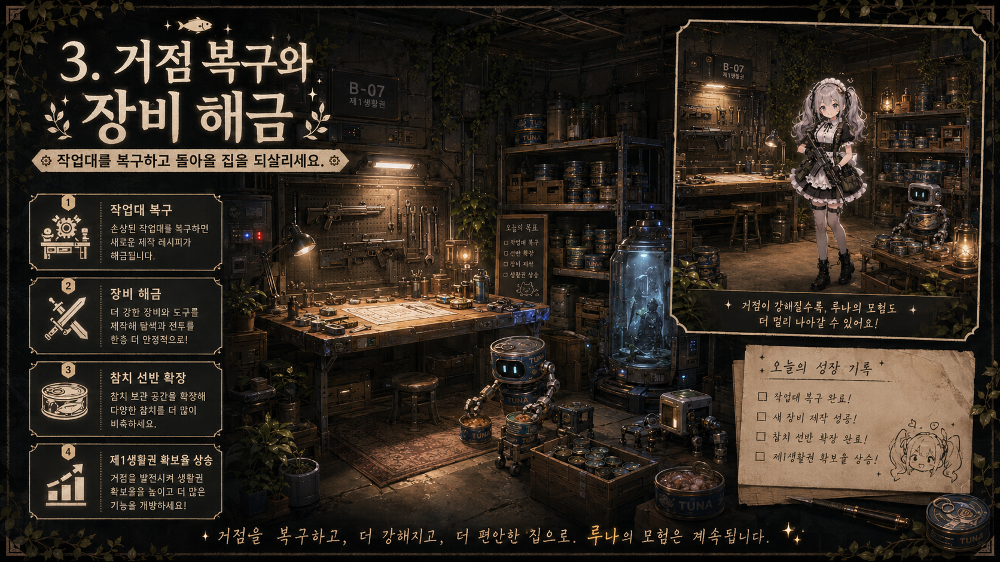

# Tuna Sweeper 본편 스토리/퀘스트 구성 정리


## 1. 핵심 방향

**Tuna Sweeper**는 거대한 세계의 진실을 파헤치는 게임이 아니라, 숲속 벙커에서 깨어난 소녀형 안드로이드가 주변 숲의 제1생활권을 확보하고, 벙커를 거주 가능한 집으로 만드는 3~4시간 분량의 소규모 익스트랙션 슈터다.

본편의 감정선은 다음과 같다.

> 어두운 대피소 → 돌아올 수 있는 집
> 빈 참치 선반 → 차려진 식탁
> 고장난 벙커 → 따뜻한 첫 저녁

최종 목표는 단순히 “프리미엄 참치 획득”이 아니라, **벙커를 거주 가능 상태로 만들고 첫 저녁을 차리는 것**이다.

---

## 2. 본편 목표

### 공식 목표

> 단일 대형 맵의 제1생활권을 단계적으로 개방하고, 벙커를 첫 야간 운용이 가능한 거주 가능 상태로 복구한다.

### 플레이어가 실제로 하는 일

- 벙커 내부 상태 점검
- 참치캔과 부품 조각 회수
- 초반 숲길과 중앙 저위험 파밍 구역 확보
- 서쪽 우회로 탐사와 영구 개방 문 해금
- 벙커 시설 복구 1로 첫 경로 언락 준비
- 맵 경로 언락 1로 중급 파밍 구역과 익스트랙션 후보 개방
- 검문초소/상위 적 지역 돌파
- 시설 복구 2로 워프포인트와 고급 기능 활성화
- 맵 경로 언락 2~3으로 북쪽 고지대와 후반 구역 연결
- 보스 구역에서 최종 단서와 마지막 복구 재료 확보
- 벙커 완전 복구와 첫 저녁 준비

### 엔딩 감정

> 세계를 구한 것이 아니라, 오늘 밤 돌아올 집을 만들었다.

---

## 3. 본편에서 해결하는 것과 남기는 것

### 본편에서 해결하는 것

- 벙커 조명 복구
- 작업대 복구
- 참치 선반 완성
- 서쪽 우회로와 초기 숏컷 개방
- 중앙 파밍 구역 안정화
- 맵 경로 언락 1~3
- 검문초소/상위 적 관문 돌파
- 워프포인트와 주요 지름길 활성화
- 북쪽 고지대와 후반 선택 루트 연결
- 보스 구역 정리
- 제1생활권 관리 가능 상태 달성
- 거주 가능 상태 달성
- 첫 저녁 준비

### 본편에서 남기는 것

- POD-02 안에 잠든 존재의 정체
- POD-03 빈 장치의 사용자
- 상위 권한의 의미
- 주인공의 정확한 제작 목적
- 숲 바깥의 세계와 지도 밖 구역

이 떡밥들은 본편의 미완성이 아니다. 본편 엔딩은 다음 지역 이동이 아니라 벙커 정착으로 닫고, 남은 요소는 후속 확장 여지로만 남긴다.

---

## 4. 주요 캐릭터/요소

## 4.1 플레이어: 소녀형 안드로이드 지원 유닛

- 숲속 벙커의 열린 동면 장치에서 비상 기상
- 기억 일부 손상
- 식량 확보 프로토콜 유지
- 참치캔을 중요 자원으로 인식
- 감정 표현은 서툴지만, 점점 벙커를 “집”으로 받아들임

대표 대사:

> “기억 데이터 손상. 위치 확인… 벙커.”
> “고단백 원통형 보급품. 중요도 높음.”
> “조명이 켜지니까… 덜 버려진 곳 같아.”

---

## 4.2 캔봇

참치캔 정리 담당 소형 로봇. 본편의 벙커 관리인 역할을 하지만, 상점/퀘스트/제작 기능은 직접 담당하지 않는다.

### 역할

- 참치 선반 정리
- 짧은 안내와 리액션
- 벙커 생활감 제공
- 엔딩에서 첫 식탁 준비

### 하지 않는 것

- 상점 기능
- 퀘스트 제공
- 호감도
- 제작/강화 담당
- 전투 동행

대표 대사:

> “참치 선반 비어 있음. 비상 상황입니다.”
> “밖은 위험함. 하지만 참치는 밖에 있음.”
> “프리미엄 참치 확인. 중앙 선반 배치 대상입니다.”
> “그래도 준비된 집입니다.”

---

## 4.3 벙커 시스템

감정 없는 시스템 메시지와 퀘스트 목표를 표시하는 장치.

### 역할

- 벙커 상태 진단
- 퀘스트 목표 표시
- 동면 장치 상태 표시
- 본편 목표와 DLC 떡밥 전달

대표 로그:

```text
POD-02: PRIMARY / STASIS ACTIVE
생체 신호: 안정
기상 권한: 없음
```

```text
제1생활권 확보 완료
외부 출입로: 안정
후반 위험 구역: 관리 가능
최종 보급품: 회수 완료
벙커 야간 운용: 가능
거주 가능 상태: 달성
```

---

## 4.4 동면 장치 3개

벙커 안에 처음부터 보이는 핵심 떡밥.

| 장치 | 상태 | 역할 |
|---|---|---|
| POD-01 | 열림 | 주인공이 나온 장치 |
| POD-02 | 가동 중 | 누군가 잠들어 있음, DLC 떡밥 |
| POD-03 | 닫힌 빈 장치 | 사라진 누군가의 흔적 |

### POD-01

```text
POD-01: SUPPORT UNIT / AWAKENED
비상 기상 기록: 손상됨
```

### POD-02

```text
POD-02: PRIMARY / STASIS ACTIVE
생체 신호: 안정
기상 권한: 없음
```

### POD-03

```text
POD-03: EMPTY / LOCKED
사용자 기록: 삭제됨
```

본편에서는 POD-02를 절대 깨우지 않는다.

---

## 5. 시스템/범위 결정 사항

## 5.1 지역

지역은 1개다.

> 숲속 벙커 주변 제1생활권


구역 개방의 기준 원본은 [지역 개방 기준](../SSOT/area_unlocking.md)이다.

그 안에서 아래 순서로 이동 가능 범위가 넓어진다.

- 벙커 내부/앞마당
- 초반 숲길
- 중앙 저위험 파밍 구역
- 서쪽 우회로와 영구 개방 문
- 맵 경로 언락 1
- 검문초소/상위 적 지역
- 시설 복구 2 이후 워프포인트와 지름길
- 북쪽 고지대와 일방통행 낙하 루트
- 좌상/중상/우상 후반 구역
- 보스 구역
- 복구 완료 벙커

거대 공장, 대형 연구소, 멀쩡히 작동하는 거대 시설은 본편에서 제외한다.

---

## 5.2 재화

### 참치캔

- 돈이 아니라 핵심 수집품/식량 비축 상징
- 선반에 쌓이며 진행감을 줌
- 최종 엔딩의 식탁과 연결

### 부품 조각

- 실질적인 기본 재화
- 작업대 복구, 장비 제작, 수리, 업그레이드에 사용

### 배터리

- 본편에서는 능력 트리 재화로 크게 쓰지 않음
- 필요하다면 퀘스트 아이템 또는 DLC 떡밥 수준으로 제한

---

## 5.3 상점/작업대

본편에는 상점이 없다.

- 무기상 없음
- 방어구상 없음
- 잡화상 없음
- NPC별 상점 없음

대신 **작업대 하나**로 통합한다.

### 작업대 기능

- 장비 제작
- 장비 수리
- 간단 업그레이드
- 수리 키트 보충

### 작업대 진행

| 시점 | 상태 |
|---|---|
| 시작 | 고장난 상태, 전력 부족 |
| 시설 복구 1 후 | 기본 정비 가능, 첫 경로 언락 준비 |
| 맵 경로 언락 1 후 | 중급 파밍 기반 확보 |
| 시설 복구 2 후 | 고급 정비, 워프포인트/전자식 문 해제 지원 |
| 엔딩 후 | 자유 정리 가능 |

---

## 5.4 NPC

NPC 기능은 넣지 않는다.

즉, NPC는 다음을 하지 않는다.

- 상점
- 퀘스트 지급
- 호감도
- 제작 담당
- 전투 동행
- 스케줄 생활

대신 연출형 NPC는 가능하다.

- 캔봇: 참치 선반 정리
- 청소봇: 바닥 청소 연출
- 정비봇: 작업대 주변 공구질 연출

본편에서 꼭 필요한 것은 캔봇이며, 나머지는 포트폴리오용 연출 요소로 제한한다.

---

## 5.5 경로 개방

### 진행 구조

| 시점 | 경로 상태 |
|---|---|
| 시작 | 벙커, 초반 숲길, 중앙 저위험 파밍 일부 개방 |
| 초반 탐사 | 서쪽 우회로 접근, 반대편 영구 개방 문 해금 |
| 시설 복구 1 후 | 첫 장애물 해제 준비 |
| 맵 경로 언락 1 | 북서/서쪽 상단 루트, 중급 파밍, 익스트랙션 후보 개방 |
| 상위 적 지역 돌파 | 검문초소, 잠긴 보급 창고, 고급 부품 확보 |
| 시설 복구 2 후 | 워프포인트, 고급 기능, 전자식 문 해제 |
| 맵 경로 언락 2 | 북쪽 고지대, 일방통행 낙하 루트, 고급 자원 구역 개방 |
| 맵 경로 언락 3 | 좌상/중상/우상 후반 구역과 보스 접근 루트 연결 |
| 보스 이후 | 벙커 완전 복구와 생활 엔딩 조건 달성 |

창고는 중간 보상 구역 중 하나이며, 전체 진행의 기준은 구역 개방과 귀환 동선 단축이다.

---

## 5.6 시간 시스템

“첫 밤” 또는 “첫 저녁”은 실제 시간 시스템이 아니다.

넣지 않는 것:

- 실시간 낮밤 사이클
- 타이머
- 시간 제한
- 굶주림
- 수면 시스템
- 하루 카운트

대신 메인 진행에 따라 조명/분위기만 바뀌고, 엔딩에서 밤 연출이 나온다.

---

## 6. 메인 퀘스트 구성

총 5개 메인 막으로 정리하되, 실제 구역 개방 순서는 SSOT의 15단계 흐름을 따른다.
각 막 안에 작은 연계 퀘스트와 경로 언락이 들어간다.

| 메인 | 제목 | 핵심 목표 | 감정 변화 |
|---|---|---|---|
| 1 | 깨어난 벙커 | 재기동, 첫 참치 회수, 조명 복구 | 여긴 어디지? |
| 2 | 숲길과 서쪽 우회로 | 초반 숲길, 중앙 파밍, 서쪽 우회로, 숏컷 해금 | 밖에 나갔다 돌아올 수 있다 |
| 3 | 시설 복구와 첫 경로 언락 | 시설 복구 1, 장애물 해제, 중급 루트 개방 | 맵이 접히기 시작한다 |
| 4 | 검문초소와 고급 복구 | 상위 적 지역 돌파, 시설 복구 2, 워프포인트 활성화 | 위험 구역도 관리할 수 있다 |
| 5 | 후반 구역과 첫 저녁 | 후반 루트 연결, 보스 구역, 벙커 완전 복구, 식탁 준비 | 여긴 집이다 |

---

# 메인 퀘스트 1. 깨어난 벙커


## 챕터 역할

튜토리얼, 벙커 소개, 목표 설정.

## 시작 상황

플레이어는 어두운 벙커 안에서 깨어난다. 조명은 깜빡이고, 작업대는 꺼져 있으며, 참치 선반은 비어 있다.

옆에는 열린 동면 장치가 있다. 조금 떨어진 곳에는 아직 작동 중인 동면 장치 하나와, 닫혀 있지만 비어 있는 장치 하나가 보인다.

캔봇은 참치 선반 앞에서 반쯤 고장난 상태로 재부팅된다.

---

## 퀘스트 1-1. 재기동 확인

### 목표

- 벙커 내부 둘러보기
- 열린 동면 장치 조사
- 벙커 시스템 단말기 확인
- 기본 권총 회수

### 퀘스트 설명

> **재기동 확인**
> 지원 유닛의 비상 기상이 확인되었습니다.
> 벙커 내부 상태를 점검하고 기본 장비를 회수하십시오.

### 시스템 로그

```text
POD-01: SUPPORT UNIT / AWAKENED
비상 기상 기록: 손상됨
벙커 상태: 저전력
거주 가능 상태: 미달
```

### 대사

안드로이드:

> “기억 데이터 손상. 위치 확인… 벙커.”
> “내가 나온 장치인가.”

캔봇:

> “참치 선반 비어 있음. 비상 상황입니다.”

안드로이드:

> “그게 첫 번째 비상 상황이야?”

---

## 퀘스트 1-2. 잠든 장치

### 목표

- POD-02 조사
- POD-03 조사
- 시스템 로그 확인

### 퀘스트 설명

> **동면 장치 점검**
> 벙커 내 동면 장치의 상태를 확인하십시오.
> 접근 권한이 없는 장치는 강제로 개방하지 마십시오.

### 시스템 로그

```text
POD-02: PRIMARY / STASIS ACTIVE
생체 신호: 안정
기상 권한: 없음
```

```text
POD-03: EMPTY / LOCKED
사용자 기록: 삭제됨
```

### 대사

안드로이드:

> “하나는 아직 잠들어 있고…”
> “하나는 비어 있는데 잠겨 있어.”

캔봇:

> “기록 누락은 관리 대상이 아닙니다. 참치 누락은 관리 대상입니다.”

안드로이드:

> “너 기준 이상해.”

---

## 퀘스트 1-3. 첫 외부 탐색

### 목표

- 벙커 밖으로 나가기
- 벙커 앞마당에서 참치캔 3개 회수
- 부품 조각 10개 수집
- 정찰 드론 2기 처치
- 벙커로 귀환

### 퀘스트 설명

> **식량 확보 프로토콜**
> 벙커의 식량 비축량이 기준치에 미달합니다.
> 주변에서 보존 식량과 수리 부품을 회수하십시오.

### 시스템 로그

```text
식량 비축량: 0%
외부 출입로: 위험도 낮음
회수 우선순위: 참치캔 / 부품 조각
```

### 대사

안드로이드:

> “참치캔 발견.”
> “고단백 원통형 보급품. 중요도 높음.”

캔봇:

> “회수 권장. 강력 권장.”

---

## 퀘스트 1-4. 조명 복구

### 목표

- 벙커로 귀환
- 부품 조각으로 보조 전력 복구
- 참치캔을 선반에 등록
- 캔봇 재기동 완료

### 퀘스트 설명

> **보조 전력 복구**
> 회수한 부품을 사용해 벙커 조명을 복구하십시오.
> 식량 선반에 참치캔을 등록하면 보급 상태가 갱신됩니다.

### 완료 변화

- 벙커 조명 일부 켜짐
- 캔봇 정상 작동
- 참치 선반에 첫 참치캔 표시
- 작업대는 아직 제한 상태

### 대사

캔봇:

> “참치 3개 등록. 선반 상태: 아주 조금 안심.”

안드로이드:

> “조명이 켜지니까… 덜 버려진 곳 같아.”

시스템:

```text
벙커 상태: 임시 대피소
다음 목표: 외부 출입로 확보
```

---

# 메인 퀘스트 2. 숲길과 서쪽 우회로


## 챕터 역할

기본 탐색 루프를 확립하고, 서쪽 우회로와 첫 숏컷을 통해 맵이 되돌아 연결되는 구조를 보여준다.

---

## 퀘스트 2-1. 벙커 앞마당 정리

### 목표

- 벙커 앞마당의 고장 기계 제거
- 부품 조각 20개 수집
- 참치캔 3개 추가 회수

### 퀘스트 설명

> **벙커 앞마당 정리**
> 벙커 출입로 주변에 고장난 자동기계가 남아 있습니다.
> 출입 안전을 위해 주변을 정리하십시오.

### 대사

안드로이드:

> “집 앞에 드론이 돌아다니는 건 불편해.”

캔봇:

> “집이라는 표현을 기록했습니다.”

안드로이드:

> “아직 집이라고 한 건 아니야.”

---

## 퀘스트 2-2. 숲길 중앙과 서쪽 우회로 확인

### 목표

- 숲길 중앙까지 이동
- 서쪽 우회로 입구 확인
- 정찰 드론 4기 처치
- 낡은 표지판과 분기 안내판 조사

### 퀘스트 설명

> **숲길 중앙 확보**
> 벙커에서 이어지는 숲길과 서쪽 우회로 입구를 확인하십시오.
> 우회로는 초기 구역으로 되돌아오는 연결 루트입니다.

### 발견

```text
서쪽 우회로 / 중앙 파밍 구역 →
```

표지판 글씨 일부는 지워져 있다.

### 대사

캔봇:

> “우회로 감지. 돌아오는 길이 짧아질 가능성 있음.”

안드로이드:

> “길이 짧아지는 것도 충분히 가치 있어.”

---

## 퀘스트 2-3. 돌아오는 문

### 목표

- 서쪽 우회로 끝까지 이동
- 반대편 잠긴 문 조사
- 주변 적 제거
- 문을 열어 초기 구역과 연결

### 퀘스트 설명

> **돌아오는 문**
> 서쪽 우회로 끝에서 초기 구역으로 이어지는 잠긴 문이 확인되었습니다.
> 반대편에서 문을 열어 영구 숏컷을 확보하십시오.

### 시스템 로그

```text
문 상태: 반대편 잠금
수동 개방: 가능
개방 결과: 초기 구역 숏컷 활성화
```

### 대사

안드로이드:

> “여기로 돌아오면 길이 훨씬 짧아지겠어.”

캔봇:

> “귀환 효율 향상. 참치 운반에도 유리합니다.”

안드로이드:

> “결국 참치로 이어지는구나.”

---

## 퀘스트 2-4. 시설 복구 1

### 목표

- 부품 조각으로 작업대 기본 전원 복구
- 수리 키트 보충 기능 개방
- 첫 경로 장애물 해제 조건 확인

### 퀘스트 설명

> **시설 복구 1**
> 외부에서 회수한 부품으로 벙커 기본 기능을 복구하십시오.
> 이후 첫 번째 경로 언락을 준비할 수 있습니다.

### 완료 변화

- 작업대 기본 기능 개방
- 수리 키트 보충 가능
- 첫 경로 언락 퀘스트 발생
- 참치 선반 1단계 변화

### 대사

캔봇:

> “작업대 전력 복구. 이제 물건을 고칠 수 있습니다.”

안드로이드:

> “그러면 막힌 길도 하나씩 열 수 있겠네.”

시스템:

```text
초기 우회로: 연결
시설 복구 1: 완료
제1생활권 확보율: 25%
```

---

# 메인 퀘스트 3. 시설 복구와 첫 경로 언락



## 챕터 역할

첫 번째 본격적인 경로 언락. 장애물을 해결해 중급 파밍 구역과 익스트랙션 후보를 연다.

---

## 퀘스트 3-1. 경로 개방 도구 제작

### 목표

- 부품 조각 40개 수집
- 작업대에서 경로 개방 도구 제작
- 막힌 문, 잔해, 다리, 게이트 중 현재 배치된 장애물 확인

### 퀘스트 설명

> **경로 개방 도구 제작**
> 첫 번째 경로 장애물을 해결하기 위한 간이 개방 도구를 제작하십시오.
> 필요한 부품은 중앙 파밍 구역과 폐자재 더미에서 회수할 수 있습니다.

### 대사

캔봇:

> “경로 개방 도구 제작 가능. 이동 효율 향상 예상.”

안드로이드:

> “너 정말 참치 기준으로만 세상을 보네.”

캔봇:

> “정상입니다.”

---

## 퀘스트 3-2. 맵 경로 언락 1

### 목표

- 경로 장애물 위치로 이동
- 주변 드론 제거
- 개방 도구 사용
- 새 이동 루트 개방

### 퀘스트 설명

> **맵 경로 언락 1**
> 개방 도구를 사용해 첫 번째 진행 장애물을 해결하십시오.
> 주변 자동기계가 소음에 반응할 수 있습니다.

### 이벤트

장애물을 해결하면 작은 적 웨이브가 발생하고, 중급 파밍 루트가 열린다.

### 대사

안드로이드:

> “길 열리는 소리가 너무 커.”

캔봇:

> “참치도 놀랐을 수 있습니다.”

안드로이드:

> “참치는 안 놀라.”

---

## 퀘스트 3-3. 중급 보급품 회수

### 목표

- 중급 파밍 장소의 보급상자 2개 열기
- 참치캔 10개 회수
- 부품 조각 30개 회수
- 산탄총 부품 획득

### 퀘스트 설명

> **중급 보급품 회수**
> 새로 열린 루트에서 다수의 보급품 신호가 감지됩니다.
> 손상되지 않은 식량과 부품을 우선 회수하십시오.

### 대사

캔봇:

> “참치 다수 감지. 선반 확장 준비.”

안드로이드:

> “이 정도면 오늘은 풍족하다.”

---

## 퀘스트 3-4. 잠긴 보급 창고

### 목표

- 잠긴 보급 창고 외부 조사
- 보안 잠금 확인
- 캔 런처 설계도 발견
- 빈 캔 5개 회수
- 벙커로 귀환

### 퀘스트 설명

> **잠긴 보급 창고**
> 새 루트 끝에서 잠긴 보급 창고가 확인되었습니다.
> 진입은 시설 복구 2 이후 가능하지만, 주변 보급품과 설계도는 회수할 수 있습니다.

### 시스템 로그

```text
설계도 등록: 캔 런처
창고 상태: 보안 잠금
제작 조건: 시설 복구 2 이후 해금
```

### 대사

안드로이드:

> “이걸 무기라고 부를 수 있어?”

캔봇:

> “참치의 두 번째 삶입니다.”

안드로이드:

> “말은 좋은데 좀 이상해.”

---

## 퀘스트 3-5. 장비 강화 1단계

### 목표

- 새 루트에서 가져온 부품으로 작업대 복구
- 산탄총 제작 가능
- 장비 업그레이드 1단계 개방
- 참치 선반 확장

### 퀘스트 설명

> **장비 강화 1단계**
> 중급 파밍 루트에서 회수한 부품으로 작업대 기능을 확장하십시오.
> 이제 새 장비 제작과 간단한 업그레이드가 가능합니다.

### 완료 변화

- 산탄총 또는 기관단총 제작 가능
- 참치 선반 확장
- 정비봇 연출을 넣는다면 이 시점에 등장
- 벙커가 확실히 밝아짐

### 대사

캔봇:

> “선반 확장 완료. 참치 배열 가능 수 증가.”

안드로이드:

> “이제 조금 창고가 아니라 집 같아.”

캔봇:

> “집 표현 두 번째 기록.”

시스템:

```text
제1생활권 확보율: 50%
```

---

# 메인 퀘스트 4. 검문초소와 고급 복구

## 챕터 역할

중앙 파밍 구역과 후반 핵심 구역 사이의 관문을 돌파하고, 시설 복구 2로 워프포인트와 고급 경로 해제를 연다.

---

## 퀘스트 4-1. 상위 적 지역 진입

### 목표

- 검문초소 접근
- 강화된 적 배치 확인
- 잠긴 보급 창고와 북쪽 루트 확인

### 퀘스트 설명

> **상위 적 지역 진입**
> 중앙 구역 너머의 검문초소를 조사하십시오.
> 이 구역은 후반 핵심 구역으로 이어지는 관문입니다.

### 시스템 로그

```text
검문초소 감지
위험도: 중상
북쪽 루트: 접근 가능 / 안정 통과 불가
```

---

## 퀘스트 4-2. 검문초소 돌파

### 목표

- 강화된 적 제거
- 보안 단말 조사
- 잠긴 보급 창고 상태 확인
- 고급 부품 회수

### 퀘스트 설명

> **검문초소 돌파**
> 검문초소의 강화된 적을 정리하고 보안 단말을 조사하십시오.
> 고급 시설 복구에 필요한 부품을 회수할 수 있습니다.

---

## 퀘스트 4-3. 잠긴 보급 창고 개방

### 목표

- 검문초소 보안 단말 우회
- 잠긴 보급 창고 개방
- 고급 부품과 보급품 회수

### 퀘스트 설명

> **잠긴 보급 창고 개방**
> 검문초소에서 획득한 권한으로 보급 창고를 개방하십시오.
> 이 창고는 시설 복구 2의 주요 재료 공급처입니다.

---

## 퀘스트 4-4. 시설 복구 2

### 목표

- 벙커로 귀환
- 고급 부품 등록
- 워프포인트 활성화
- 전자식 문 해제 기능 복구
- 후반 루트 진입 조건 확인

### 퀘스트 설명

> **시설 복구 2**
> 상위 적 지역에서 회수한 부품으로 벙커 고급 기능을 복구하십시오.
> 워프포인트와 후반 전자식 경로 해제가 가능해집니다.

### 시스템 로그

```text
시설 복구 2: 완료
워프포인트: 활성화 가능
전자식 문 해제: 가능
후반 루트 조건: 갱신
```

---

## 퀘스트 4-5. 워프포인트와 후반 루트 등록

### 목표

- 첫 워프포인트 활성화
- 중간 진입 지점 등록
- 북쪽 고지대 접근 조건 확인
- 후반 보스 구역 우회 루트 표시

### 퀘스트 설명

> **워프포인트 등록**
> 복구된 벙커 기능으로 이동 지점을 등록하십시오.
> 이후 반복 탐사의 이동 피로가 줄어들고 후반 루트 접근이 가능해집니다.

### 시스템 로그

```text
워프포인트: 1개 활성화
중간 진입 지점: 등록
제1생활권 확보율: 75%
```

---

# 메인 퀘스트 5. 후반 구역과 첫 저녁


## 챕터 역할

최종 챕터. 북쪽 고지대와 좌상/중상/우상 후반 구역을 연결하고, 보스 구역에서 마지막 복구 단서를 얻은 뒤 벙커에서 첫 식탁을 차린다.

챕터 이름은 **첫 밤**보다 **첫 저녁**이 더 좋다. 시간 시스템 느낌이 덜하고, 일상 엔딩과 바로 연결된다.

---

## 퀘스트 5-1. 맵 경로 언락 2

### 목표

- 북쪽 고지대 방향 루트 개방
- 일방통행 낙하 구간 확인
- 고급 자원 구역 조사
- 새로운 익스트랙션 포인트 등록

### 퀘스트 설명

> **맵 경로 언락 2**
> 북쪽 고지대와 고급 자원 구역으로 이어지는 루트를 여십시오.
> 고지대에서 내려오는 일부 구간은 역행할 수 없습니다.

### 시스템 로그

```text
북쪽 고지대 루트: 개방
일방통행 낙하 구간: 확인
익스트랙션 후보: 등록 가능
```

### 대사

캔봇:

> “고지대 이동은 귀환 동선 단축에 유리합니다.”

안드로이드:

> “내려갈 수는 있는데 다시 못 올라오는 길도 있네.”

캔봇:

> “참치 운반 계획에 반영하겠습니다.”

---

## 퀘스트 5-2. 맵 경로 언락 3

### 목표

- 좌상/중상/우상 후반 구역 연결
- 후반 핵심 시설 조사
- 보스 접근 루트 확인
- 최종 단서 지역 발견

### 퀘스트 설명

> **맵 경로 언락 3**
> 후반 주요 구역을 연결하고 보스 구역 접근 루트를 확인하십시오.
> 이 단계부터 안전한 먼 길, 위험한 빠른 길, 워프 중간 진입을 선택할 수 있습니다.

### 루트 선택

- 안전하지만 먼 길
- 위험하지만 빠른 검문초소 돌파
- 워프포인트를 이용한 중간 진입
- 고지대에서 내려오는 일방통행 루트

### 대사

안드로이드:

> “이제 길이 하나가 아니야.”

캔봇:

> “집으로 돌아오는 방법도 여러 개입니다.”

안드로이드:

> “좋아. 그럼 고를 수 있겠네.”

---

## 퀘스트 5-3. 보스 구역

### 목표

- 보스 구역 진입
- 보스전 진행
- 핵심 시설 접근
- 최종 기록/단서 확보
- 마지막 복구 재료 회수

### 퀘스트 설명

> **보스 구역**
> 최상위 위험 구역에 진입해 제1생활권을 불안정하게 만드는 핵심 위협을 정리하십시오.
> 목표는 다음 지역 이동이 아니라 벙커 완전 복구에 필요한 마지막 단서와 재료 확보입니다.

### 시스템 로그

```text
보스 구역: 접근 가능
핵심 시설: 잠금 해제
마지막 복구 재료: 회수 가능
```

### 대사

안드로이드:

> “이걸 끝내면 다른 곳으로 가는 게 아니야.”

캔봇:

> “집을 완성하는 단계입니다.”

---

## 퀘스트 5-4. 정착 단서

### 목표

- 벙커 완전 복구 단서 확인
- 프리미엄 참치 상자 획득
- 생활 복구 부품 획득
- 외부 위협 감소 확인
- 벙커로 귀환

### 퀘스트 설명

> **정착 단서**
> 보스 구역에서 벙커를 거주 가능 상태로 완성할 단서와 물자를 회수하십시오.
> 회수 후 벙커로 귀환하십시오.

### 획득물

- 프리미엄 참치 상자
- 야간 조명 부품
- 선반 확장 부품
- 물/전력/생활 설비 복구 부품
- 식탁용 소형 가열기 또는 조리 장치

### 대사

캔봇:

> “프리미엄 참치 확인. 중앙 선반 배치 대상입니다.”

안드로이드:

> “오늘은 선반에만 두지 말자.”

캔봇:

> “의미 확인 불가.”

안드로이드:

> “돌아가면 알려줄게.”

---

## 퀘스트 5-5. 귀환지점 안정화

### 목표

- 벙커로 귀환
- 야간 조명 부품 설치
- 최종 보급품 등록
- 참치 선반 최종 정리
- 물/전력/생활 설비 복구
- 거주 가능 상태 달성

### 퀘스트 설명

> **귀환지점 안정화**
> 회수한 보급품과 복구 부품을 벙커에 등록하십시오.
> 벙커의 생활 기반과 첫 야간 운용 준비를 완료합니다.

### 시스템 로그

```text
제1생활권 확보 완료
외부 출입로: 안정
후반 위험 구역: 관리 가능
최종 보급품: 회수 완료
벙커 야간 운용: 가능
거주 가능 상태: 달성
```

### 대사

캔봇:

> “집 상태 등록 가능.”

안드로이드:

> “집… 맞아?”

캔봇:

> “참치 선반, 조명, 작업대, 물, 전력, 귀환자 있음. 기준 충족.”

안드로이드:

> “그 기준도 이상하지만… 나쁘지 않아.”

---

## 퀘스트 5-6. 첫 저녁

### 목표

- 작은 식탁 조사
- 프리미엄 참치 1캔 개봉
- 캔봇이 식탁 준비
- POD-02 쪽 빈자리에 접시 하나 놓기
- 엔딩 컷신

### 퀘스트 설명

> **첫 저녁**
> 벙커가 거주 가능 상태에 도달했습니다.
> 회수한 보급품으로 첫 식탁을 준비하십시오.

### 엔딩 장면

밖은 밤.
숲은 어둡지만 멀리서 들리던 기계음은 줄어 있다.

벙커 안은 따뜻한 조명으로 켜져 있다.
참치 선반은 가득 차 있고, 중앙에는 프리미엄 참치 상자가 놓여 있다.

캔봇이 작은 접이식 테이블을 펼친다.
작은 조리 장치 위에 참치 토스트, 참치 샌드위치, 혹은 따뜻한 참치죽 같은 것이 놓인다.

안드로이드는 먹을 수 있는지 애매하다. 그래도 맛 데이터를 기록하려고 한 입, 혹은 아주 소량을 분석한다.

그리고 POD-02 쪽을 바라본다.
깨우지는 않는다.
대신 빈 접시 하나를 조용히 더 놓는다.

### 엔딩 대사

캔봇:

> “식사 준비 완료.”

안드로이드:

> “먹을 사람은 아직 없는데.”

캔봇:

> “그래도 준비된 집입니다.”

안드로이드:

> “……응.”
> “오늘부터 여긴 집이야.”

캔봇:

> “집 이름 등록 필요.”

안드로이드:

> “튜나 벙커.”

캔봇:

> “TUNA BUNKER 등록 완료.”
> “참치 선반 상태: 매우 좋음.”

시스템:

```text
POD-02: STASIS ACTIVE
생체 신호: 안정
기상 권한: 없음
```

안드로이드:

> “언젠가, 같이 먹을 수 있으면 좋겠네.”

### 마지막 컷

- 캔봇이 선반 앞에서 조용히 움직임
- 안드로이드는 식탁에 앉아 있음
- POD-02의 상태등이 천천히 한 번 깜빡임
- 밖은 밤, 안은 따뜻함

엔딩 타이틀:

```text
첫 저녁 완료
거주 가능 상태 달성
```

---

## 7. 홍보/기대치 관리 문구

이 게임은 처음부터 엔딩 범위를 명확히 알려야 한다.

### 핵심 포지셔닝

> 세계를 구하는 게임이 아니라, 벙커를 집으로 만드는 게임.

### 좋은 홍보 문구

> 숲속 벙커에서 깨어난 안드로이드가 참치캔과 부품을 모아 단일 대형 맵의 구역을 차례로 개방하고, 벙커를 거주 가능한 집으로 복구하는 3~4시간 분량의 소규모 익스트랙션 슈터.

짧은 버전:

> 참치캔을 줍고, 숲길과 지름길을 열고, 오늘 밤 돌아올 집을 만드세요.

### 피해야 할 홍보 문구

- 멸망한 세계의 진실을 밝혀라
- 잠든 존재의 정체를 추적하라
- 인류 재건의 비밀이 깨어난다
- 모든 진실이 밝혀진다

이런 표현은 유저가 큰 서사를 기대하게 만들어 본편 엔딩이 약하게 느껴질 수 있다.

---

## 8. 최종 한 줄 요약

**Tuna Sweeper 본편은 참치를 찾는 이야기가 아니라, 어두운 벙커에서 깨어난 안드로이드가 같은 맵의 길을 점점 열고 보급품을 모아, 마침내 첫 저녁을 차릴 수 있는 집을 만드는 이야기다.**
