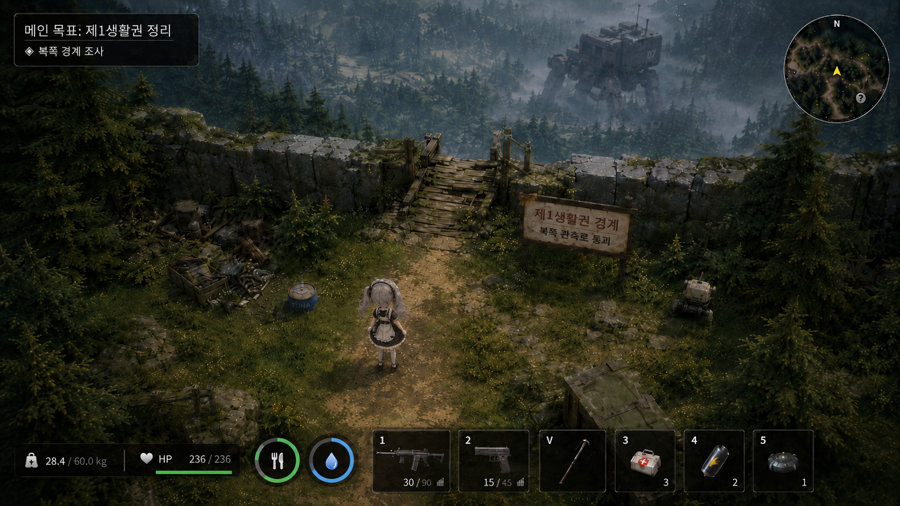
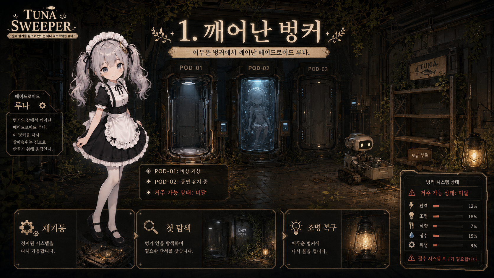
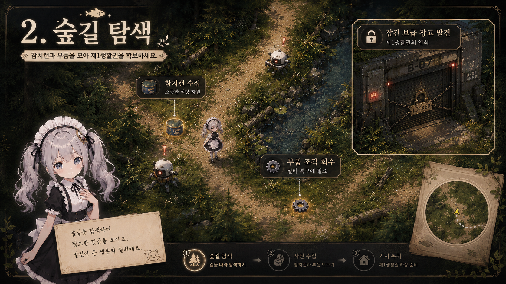
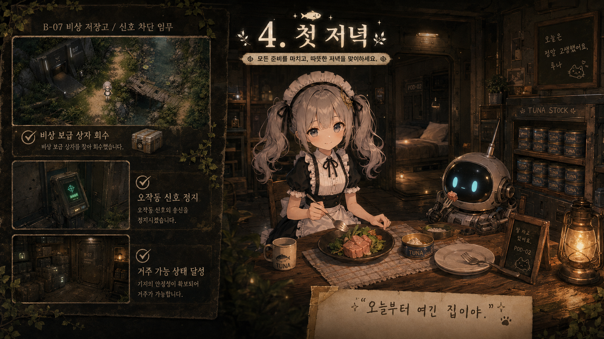

# Tuna Sweeper 본편 스토리/퀘스트 구성 정리


## 최신 기준

이 문서는 스토리 감정선과 과거 상세 기획을 보존하는 보조 문서다.

현재 퀘스트 구조, 아이템 요구량, 지역 개방, 퀘스트 대화의 우선 기준은 아래 SSOT 문서다.

- `Docs/SSOT/TunaSweeper_SSOT_Quest_Item_v0.6.md`
- `Docs/SSOT/TunaSweeper_Quest_Dialogue_v0.6.1.md`
- `Docs/SSOT/area_unlocking.md`

아래의 과거 상세 퀘스트안 중 `시설 복구 1/2`, 고급보안구역 이전 명칭, 포탈/워프포인트 직접 안내, 보스 처치 즉시 엔딩, 후속 지역 떡밥과 충돌하는 내용은 폐기된 초안으로 본다.

## 1. 핵심 방향

**Tuna Sweeper**는 거대한 세계의 진실을 파헤치는 게임이 아니라, 숲속 벙커에서 깨어난 소녀형 안드로이드가 주변 숲의 제1생활권을 확보하고, 벙커를 거주 가능한 집으로 만드는 3~4시간 분량의 소규모 익스트랙션 슈터다.

본편의 감정선은 다음과 같다.

> 어두운 대피소 → 돌아올 수 있는 집
> 빈 참치 선반 → 차려진 식탁
> 고장난 벙커 → 따뜻한 첫 저녁

최종 목표는 단순히 “고급참치 획득”이 아니라, **M20 `오늘의 식탁`을 통해 벙커 생활 안정화 엔딩에 도달하는 것**이다.

---

## 2. 본편 목표

### 공식 목표

> 단일 대형 맵의 제1생활권을 단계적으로 개방하고, 벙커를 첫 야간 운용이 가능한 거주 가능 상태로 복구한다.

### 플레이어가 실제로 하는 일

- 벙커 내부 상태 점검
- 첫 참치캔과 벙커 기초 재료 회수
- 숲길 확인과 막힌 길 단서 조사
- 자판기 시스템 확인과 잠긴 상품 조건 해금
- 자판기 폭발물로 콘크리트 더미 영구 제거
- 고급보안구역 소문 확인과 방어구 보강
- 고급보안구역에서 기록칩과 경비 드론 렌즈 회수
- 보안 로그 해독과 최종보스 위치 확인
- 최종보스전 이후 고급참치 확보
- 오늘의 식탁 준비와 일상 엔딩 도달

### 엔딩 감정

> 세계를 구한 것이 아니라, 오늘 밤 돌아올 집을 만들었다.

---

## 3. 본편에서 해결하는 것과 남기는 것

### 본편에서 해결하는 것

- 벙커 상태 점검과 생활감 회복
- 선택형 하우징 해금
- 참치 선반 완성
- 숲길과 콘크리트 더미 동선 개선
- 자판기 폭발물 해금
- 고급보안구역 진입과 후반 단서 회수
- 최종보스 처치
- 고급참치 확보
- 제1생활권 관리 가능 상태 달성
- 거주 가능 상태 달성
- 첫 저녁 준비

### 본편에서 남기는 것

- POD-02 안에 잠든 존재의 정체
- POD-03 빈 장치의 사용자
- 상위 권한의 의미
- 주인공의 정확한 제작 목적
- 숲 바깥의 세계와 지도 밖 구역의 상세 정보

이 요소들은 본편의 미완성이 아니다. 본편 엔딩은 다음 지역 이동이나 후속 지역 예고가 아니라 벙커 정착으로 닫는다.

---

## 4. 주요 캐릭터/요소

## 4.1 플레이어: 소녀형 안드로이드 지원 유닛

- 숲속 벙커의 열린 동면 장치에서 비상 기상
- 기억 일부 손상
- 식량 확보 프로토콜 유지
- 참치캔을 중요 자원으로 인식
- 감정 표현은 서툴지만, 점점 벙커를 “집”으로 받아들임

대표 대사:

> “기억 데이터 손상. 위치 확인… 벙커.”
> “고단백 원통형 보급품. 중요도 높음.”
> “조명이 켜지니까… 덜 버려진 곳 같아.”

---

## 4.2 캔봇

참치캔 정리 담당 소형 로봇. 본편의 벙커 관리인이자 기본 안내/퀘스트 연결 접점이다.
상점과 제작은 직접 담당하지 않는다.

### 역할

- 참치 선반 정리
- 짧은 안내와 리액션
- 벙커 기본 퀘스트 안내와 보상 연결
- 벙커 생활감 제공
- 엔딩에서 첫 식탁 준비

### 하지 않는 것

- 상점 기능
- 호감도
- 제작/강화 담당
- 전투 동행

대표 대사:

> “참치 선반 비어 있음. 비상 상황입니다.”
> “밖은 위험함. 하지만 참치는 밖에 있음.”
> “고급참치 확인. 중앙 선반 배치 대상입니다.”
> “그래도 준비된 집입니다.”

---

## 4.3 벙커 시스템

감정 없는 시스템 메시지와 퀘스트 목표를 표시하는 장치.

### 역할

- 벙커 상태 진단
- 퀘스트 목표 표시
- 동면 장치 상태 표시
- 본편 목표와 동면실 미스터리 여운 전달

대표 로그:

```text
POD-02: PRIMARY / STASIS ACTIVE
생체 신호: 안정
기상 권한: 없음
```

```text
제1생활권 확보 완료
외부 출입로: 안정
후반 위험 구역: 관리 가능
최종 보급품: 회수 완료
벙커 야간 운용: 가능
거주 가능 상태: 달성
```

---

## 4.4 동면 장치 3개

벙커 안에 처음부터 보이는 핵심 떡밥.

| 장치 | 상태 | 역할 |
|---|---|---|
| POD-01 | 열림 | 주인공이 나온 장치 |
| POD-02 | 가동 중 | 누군가 잠들어 있음, 미스터리 여운 |
| POD-03 | 닫힌 빈 장치 | 사라진 누군가의 흔적 |

### POD-01

```text
POD-01: SUPPORT UNIT / AWAKENED
비상 기상 기록: 손상됨
```

### POD-02

```text
POD-02: PRIMARY / STASIS ACTIVE
생체 신호: 안정
기상 권한: 없음
```

### POD-03

```text
POD-03: EMPTY / LOCKED
사용자 기록: 삭제됨
```

본편에서는 POD-02를 절대 깨우지 않는다.

---

## 5. 시스템/범위 결정 사항

## 5.1 지역

지역은 1개다.

> 숲속 벙커 주변 제1생활권



구역 개방의 기준 원본은 [지역 개방 기준](../SSOT/area_unlocking.md)이다.

그 안에서 아래 순서로 이동 가능 범위가 넓어진다.

- 벙커 내부/앞마당
- 초반 숲길
- 중앙 저위험 파밍 구역
- 숲길 단서 3종과 콘크리트 더미
- 자판기 시스템과 자판기 폭발물
- 콘크리트 더미 제거 후 열리는 반복 이동 편의 동선
- 고급보안구역
- 보안 로그와 최종보스 구역
- 고급참치 확보와 오늘의 식탁
- 엔딩 후 일상 퀘스트

거대 공장, 대형 연구소, 멀쩡히 작동하는 거대 시설은 본편에서 제외한다.

---

## 5.2 재화

### 코인

- 상점 구매/판매와 보상 지급에 사용하는 기본 재화
- UI에서는 흰색 단색 코인 아이콘과 숫자로 표기
- `$` 표기는 사용하지 않음

### 참치캔

- 핵심 수집품/식량 비축 상징
- 선반에 쌓이며 진행감을 줌
- 최종 엔딩의 식탁과 연결

### 부품 조각

- 작업대 복구, 장비 제작, 수리, 업그레이드에 사용하는 제작 재료

### 배터리

- 본편에서는 능력 트리 재화로 크게 쓰지 않음
- 필요하다면 퀘스트 아이템 또는 미스터리 여운 수준으로 제한

---

## 5.3 상점/작업대

본편에는 무기상/방어구상/잡화상 같은 NPC 상점은 두지 않는다.
대신 벙커 자판기 거래는 존재한다.

- 무기상 없음
- 방어구상 없음
- 잡화상 없음
- NPC별 상점 없음
- 벙커 자판기 구매/판매 있음

자판기는 코인을 사용한 제한 재고 구매와 플레이어 아이템 판매를 담당한다.
재고와 구매/판매 상태는 저장 대상이며, 본편의 거래 기능은 이 자판기 범위로 제한한다.

작업대는 거래와 분리된 제작/정비 시설이다.

### 작업대 기능

- 장비 제작
- 장비 수리
- 간단 업그레이드
- 수리 키트 보충

### 작업대/하우징 진행

| 시점 | 상태 |
|---|---|
| 시작 | 기본 벙커 기능과 캔봇 안내 중심 |
| M03 이후 | 하우징: 정리 선반 해금 후보 |
| M11 이후 | 하우징: 간이 작업대 해금 후보 |
| M17 이후 | 하우징: 휴식 코너 해금 후보 |
| 엔딩 후 | 생활 잔업과 반복 정리 가능 |

---

## 5.4 NPC

NPC는 생활 시뮬레이션 캐릭터가 아니라, 벙커 시설의 얼굴과 상호작용 접점으로 제한한다.

시설은 두 종류로 구분한다.

- NPC가 붙는 시설: 하우징 모드에서는 시설 메시만 보이며, 플레이 모드로 돌아오면 NPC가 나타난다. 상호작용은 시설 메시가 아니라 NPC에서 일어난다.
- NPC가 붙지 않는 시설: 시설 액터 자체에서 상호작용한다. 작업대가 이 유형이다.

NPC는 다음을 하지 않는다.

- NPC별 상점
- 호감도
- 전투 동행
- 스케줄 생활

허용되는 NPC 역할은 다음과 같다.

- 캔봇: 참치 선반 정리
- 신호봇: 통신 관제 시설에서 맵, 경로 정보, 워프포인트/순간이동 관리
- 정비봇: 작업대가 아닌 정비 시설에서 벙커 설비 복구, 시설 확장, 전력/설비 점검 안내
- 밥통봇: 보급 시설에서 식량/귀환 보상/소모품 보급 연출

NPC가 붙는 시설은 퀘스트와 기능 해금의 접점이 될 수 있지만, 별도 상점/호감도/생활 스케줄 시스템으로 확장하지 않는다.

---

## 5.5 경로 개방

### 진행 구조

| 시점 | 경로 상태 |
|---|---|
| 시작 | 벙커, 초반 숲길, 중앙 저위험 파밍 일부 개방 |
| M05 | 숲길 상태 확인 |
| M06~M08 | 막힌 길, 안전거리, 콘크리트 더미 단서 조사 |
| M09~M11 | 자판기 시스템과 자판기 폭발물 해금 |
| M12 | 콘크리트 더미 영구 제거, 반복 이동 편의 증가 |
| M13~M15 | 고급보안구역 위치 확인과 내부 단서 회수 |
| M16~M18 | 보안 로그 해독, 최종보스전 진행 |
| M19~M20 | 고급참치 확보와 생활 엔딩 조건 달성 |

보급창고는 S04/S05 선택형 파밍 효율 구역이며, 전체 진행의 필수 관문으로 사용하지 않는다.

---

## 5.6 시간 시스템

“첫 밤” 또는 “첫 저녁”은 실제 시간 시스템이 아니다.

넣지 않는 것:

- 실시간 낮밤 사이클
- 타이머
- 시간 제한
- 굶주림
- 수면 시스템
- 하루 카운트

대신 메인 진행에 따라 조명/분위기만 바뀌고, 엔딩에서 밤 연출이 나온다.

---

## 6. 메인 퀘스트 구성

본편 퀘스트 최종 기준은 SSOT의 M01~M20 체인을 따른다.
아래 5막 구분은 감정선 요약용이며, 세부 퀘스트 ID와 요구 아이템은 `Docs/SSOT/TunaSweeper_SSOT_Quest_Item_v0.6.md`를 따른다.

| 메인 | 제목 | 핵심 목표 | 감정 변화 |
|---|---|---|---|
| 1 | 깨어난 벙커 | 재기동, 첫 참치 회수, 조명 복구 | 여긴 어디지? |
| 2 | 숲길과 서쪽 우회로 | 초반 숲길, 중앙 파밍, 서쪽 우회로, 숏컷 해금 | 밖에 나갔다 돌아올 수 있다 |
| 3 | 막힌 숲길과 자판기 | 숲길 단서, 자판기 폭발물, 콘크리트 더미 제거 | 맵이 덜 불편해진다 |
| 4 | 고급보안구역 | 방어구 보강, 고급보안구역 진입, 보안 로그 해독 | 위험 구역도 관리할 수 있다 |
| 5 | 최종보스와 첫 저녁 | 최종보스전, 고급참치 확보, 오늘의 식탁 | 여긴 집이다 |

---

## 상세 퀘스트 초안 주의

아래 `메인 퀘스트 1` 이후의 긴 상세 퀘스트/대사 초안은 과거 5막 구조를 보존한 참고용이다.

최신 구현과 데이터 작성은 `Docs/SSOT/TunaSweeper_SSOT_Quest_Item_v0.6.md`의 M01~M20, S01~S20을 따른다. 아래 초안에서 강제형 시설 복구, 포탈/워프포인트 직접 안내, 고급보안구역 이전 명칭, 보급창고 필수화, 고급참치 이전 명칭이 보이면 새 SSOT 기준으로 대체한다.

# 메인 퀘스트 1. 깨어난 벙커



## 챕터 역할

튜토리얼, 벙커 소개, 목표 설정.

## 시작 상황

플레이어는 어두운 벙커 안에서 깨어난다. 조명은 깜빡이고, 작업대는 꺼져 있으며, 참치 선반은 비어 있다.

옆에는 열린 동면 장치가 있다. 조금 떨어진 곳에는 아직 작동 중인 동면 장치 하나와, 닫혀 있지만 비어 있는 장치 하나가 보인다.

캔봇은 참치 선반 앞에서 반쯤 고장난 상태로 재부팅된다.

---

## 퀘스트 1-1. 재기동 확인

### 목표

- 벙커 내부 둘러보기
- 열린 동면 장치 조사
- 벙커 시스템 단말기 확인
- 기본 권총 회수

### 퀘스트 설명

> **재기동 확인**
> 지원 유닛의 비상 기상이 확인되었습니다.
> 벙커 내부 상태를 점검하고 기본 장비를 회수하십시오.

### 시스템 로그

```text
POD-01: SUPPORT UNIT / AWAKENED
비상 기상 기록: 손상됨
벙커 상태: 저전력
거주 가능 상태: 미달
```

### 대사

안드로이드:

> “기억 데이터 손상. 위치 확인… 벙커.”
> “내가 나온 장치인가.”

캔봇:

> “참치 선반 비어 있음. 비상 상황입니다.”

안드로이드:

> “그게 첫 번째 비상 상황이야?”

---

## 퀘스트 1-2. 잠든 장치

### 목표

- POD-02 조사
- POD-03 조사
- 시스템 로그 확인

### 퀘스트 설명

> **동면 장치 점검**
> 벙커 내 동면 장치의 상태를 확인하십시오.
> 접근 권한이 없는 장치는 강제로 개방하지 마십시오.

### 시스템 로그

```text
POD-02: PRIMARY / STASIS ACTIVE
생체 신호: 안정
기상 권한: 없음
```

```text
POD-03: EMPTY / LOCKED
사용자 기록: 삭제됨
```

### 대사

안드로이드:

> “하나는 아직 잠들어 있고…”
> “하나는 비어 있는데 잠겨 있어.”

캔봇:

> “기록 누락은 관리 대상이 아닙니다. 참치 누락은 관리 대상입니다.”

안드로이드:

> “너 기준 이상해.”

---

## 퀘스트 1-3. 첫 외부 탐색

### 목표

- 벙커 밖으로 나가기
- 벙커 앞마당에서 참치캔 3개 회수
- 부품 조각 10개 수집
- 정찰 드론 2기 처치
- 벙커로 귀환

### 퀘스트 설명

> **식량 확보 프로토콜**
> 벙커의 식량 비축량이 기준치에 미달합니다.
> 주변에서 보존 식량과 수리 부품을 회수하십시오.

### 시스템 로그

```text
식량 비축량: 0%
외부 출입로: 위험도 낮음
회수 우선순위: 참치캔 / 부품 조각
```

### 대사

안드로이드:

> “참치캔 발견.”
> “고단백 원통형 보급품. 중요도 높음.”

캔봇:

> “회수 권장. 강력 권장.”

---

## 퀘스트 1-4. 조명 복구

### 목표

- 벙커로 귀환
- 부품 조각으로 보조 전력 복구
- 참치캔을 선반에 등록
- 캔봇 재기동 완료

### 퀘스트 설명

> **보조 전력 복구**
> 회수한 부품을 사용해 벙커 조명을 복구하십시오.
> 식량 선반에 참치캔을 등록하면 보급 상태가 갱신됩니다.

### 완료 변화

- 벙커 조명 일부 켜짐
- 캔봇 정상 작동
- 참치 선반에 첫 참치캔 표시
- 작업대는 아직 제한 상태

### 대사

캔봇:

> “참치 3개 등록. 선반 상태: 아주 조금 안심.”

안드로이드:

> “조명이 켜지니까… 덜 버려진 곳 같아.”

시스템:

```text
벙커 상태: 임시 대피소
다음 목표: 외부 출입로 확보
```

---

# 메인 퀘스트 2. 숲길과 서쪽 우회로



## 챕터 역할

기본 탐색 루프를 확립하고, 서쪽 우회로와 첫 숏컷을 통해 맵이 되돌아 연결되는 구조를 보여준다.

---

## 퀘스트 2-1. 벙커 앞마당 정리

### 목표

- 벙커 앞마당의 고장 기계 제거
- 부품 조각 20개 수집
- 참치캔 3개 추가 회수

### 퀘스트 설명

> **벙커 앞마당 정리**
> 벙커 출입로 주변에 고장난 자동기계가 남아 있습니다.
> 출입 안전을 위해 주변을 정리하십시오.

### 대사

안드로이드:

> “집 앞에 드론이 돌아다니는 건 불편해.”

캔봇:

> “집이라는 표현을 기록했습니다.”

안드로이드:

> “아직 집이라고 한 건 아니야.”

---

## 퀘스트 2-2. 숲길 중앙과 서쪽 우회로 확인

### 목표

- 숲길 중앙까지 이동
- 서쪽 우회로 입구 확인
- 정찰 드론 4기 처치
- 낡은 표지판과 분기 안내판 조사

### 퀘스트 설명

> **숲길 중앙 확보**
> 벙커에서 이어지는 숲길과 서쪽 우회로 입구를 확인하십시오.
> 우회로는 초기 구역으로 되돌아오는 연결 루트입니다.

### 발견

```text
서쪽 우회로 / 중앙 파밍 구역 →
```

표지판 글씨 일부는 지워져 있다.

### 대사

캔봇:

> “우회로 감지. 돌아오는 길이 짧아질 가능성 있음.”

안드로이드:

> “길이 짧아지는 것도 충분히 가치 있어.”

---

## 퀘스트 2-3. 돌아오는 문

### 목표

- 서쪽 우회로 끝까지 이동
- 반대편 잠긴 문 조사
- 주변 적 제거
- 문을 열어 초기 구역과 연결

### 퀘스트 설명

> **돌아오는 문**
> 서쪽 우회로 끝에서 초기 구역으로 이어지는 잠긴 문이 확인되었습니다.
> 반대편에서 문을 열어 영구 숏컷을 확보하십시오.

### 시스템 로그

```text
문 상태: 반대편 잠금
수동 개방: 가능
개방 결과: 초기 구역 숏컷 활성화
```

### 대사

안드로이드:

> “여기로 돌아오면 길이 훨씬 짧아지겠어.”

캔봇:

> “귀환 효율 향상. 참치 운반에도 유리합니다.”

안드로이드:

> “결국 참치로 이어지는구나.”

---

## 폐기된 과거 상세 초안

기존 `시설 복구 1`, `경로 언락 1`, `고급보안구역 돌파`, `시설 복구 2`, `워프포인트 등록` 중심의 상세 퀘스트 초안은 폐기한다.

현재 기준에서는 이 구간을 다음 흐름으로 대체한다.

- M06~M08: 숲길 단서, 안전거리, 콘크리트 더미 조사
- M09~M11: 자판기 시스템, 관리자 권한, 자판기 폭발물 해금
- M12: 콘크리트 더미 영구 제거
- M13~M15: 고급보안구역 소문, 방어구 보강, 고급보안구역 진입
- M16~M18: 보안 로그 해독, 마지막 외출 준비, 최종보스전

보급창고는 이 구간의 필수 관문이 아니라 S04/S05 선택형 파밍 효율 퀘스트로 처리한다. 포탈/워프포인트는 메인 퀘스트에서 직접 안내하지 않는다.

---
# 메인 퀘스트 5. 최종보스와 첫 저녁



## 챕터 역할

최종 챕터. 고급보안구역에서 얻은 보안 로그로 최종보스 위치를 확인하고, 보스를 처치한 뒤 고급참치와 식탁 재료를 준비해 일상 엔딩에 도달한다.

챕터 이름은 **첫 밤**보다 **첫 저녁**이 더 좋다. 시간 시스템 느낌이 덜하고, 일상 엔딩과 바로 연결된다.

---

## 퀘스트 5-1. 보안 로그 해독

최신 SSOT 기준 M16에 해당한다.

- 손상된 데이터카드, 싸구려 USB, 키보드 키캡을 모은다.
- 고급보안구역에서 얻은 로그를 해독한다.
- 최종보스 위치와 주변 위험 정보를 확인한다.

---

## 퀘스트 5-2. 마지막 외출 준비

최신 SSOT 기준 M17에 해당한다.

- 비상식량 팩, 휴대용 정수필터, 행운의 캔따개를 준비한다.
- 최종보스전으로 진입할 준비 상태를 만든다.

---

## 퀘스트 5-3. 최종보스전

최신 SSOT 기준 M18에 해당한다.

- 본편 기준 최종보스를 처치한다.
- 보스 처치 후 즉시 엔딩으로 가지 않는다.
- 좋은 엔딩에는 고급참치와 식탁 준비가 남는다.

---

## 퀘스트 5-4. 고급참치 확보

최신 SSOT 기준 M19에 해당한다.

- 고급참치, 은박 보냉팩, 작은 접시를 준비한다.
- 고급참치 획득처와 보스 처치와의 관계는 아직 미정이다.
- 고급참치는 보급창고 전용 보상으로 두지 않는다.

---

## 퀘스트 5-5. 오늘의 식탁

최신 SSOT 기준 M20에 해당한다.

- 고급참치, 깨끗한 포크, 멀쩡한 식탁보, 작은 꽃병을 준비한다.
- 루나와 캔봇의 벙커 생활이 안정되었음을 보여주며 일상 엔딩에 진입한다.

### 엔딩 장면

밖은 밤.
숲은 어둡지만 멀리서 들리던 기계음은 줄어 있다.

벙커 안은 따뜻한 조명으로 켜져 있다.
참치 선반은 가득 차 있고, 중앙에는 고급참치 상자가 놓여 있다.

캔봇이 작은 접이식 테이블을 펼친다.
작은 조리 장치 위에 참치 토스트, 참치 샌드위치, 혹은 따뜻한 참치죽 같은 것이 놓인다.

안드로이드는 먹을 수 있는지 애매하다. 그래도 맛 데이터를 기록하려고 한 입, 혹은 아주 소량을 분석한다.

그리고 POD-02 쪽을 바라본다.
깨우지는 않는다.
대신 빈 접시 하나를 조용히 더 놓는다.

### 엔딩 대사

캔봇:

> “식사 준비 완료.”

안드로이드:

> “먹을 사람은 아직 없는데.”

캔봇:

> “그래도 준비된 집입니다.”

안드로이드:

> “……응.”
> “오늘부터 여긴 집이야.”

캔봇:

> “집 이름 등록 필요.”

안드로이드:

> “튜나 벙커.”

캔봇:

> “TUNA BUNKER 등록 완료.”
> “참치 선반 상태: 매우 좋음.”

시스템:

```text
POD-02: STASIS ACTIVE
생체 신호: 안정
기상 권한: 없음
```

안드로이드:

> “언젠가, 같이 먹을 수 있으면 좋겠네.”

### 마지막 컷

- 캔봇이 선반 앞에서 조용히 움직임
- 안드로이드는 식탁에 앉아 있음
- POD-02의 상태등이 천천히 한 번 깜빡임
- 밖은 밤, 안은 따뜻함

엔딩 타이틀:

```text
첫 저녁 완료
거주 가능 상태 달성
```

---

## 7. 홍보/기대치 관리 문구

이 게임은 처음부터 엔딩 범위를 명확히 알려야 한다.

### 핵심 포지셔닝

> 세계를 구하는 게임이 아니라, 벙커를 집으로 만드는 게임.

### 좋은 홍보 문구

> 숲속 벙커에서 깨어난 안드로이드가 참치캔과 부품을 모아 단일 대형 맵의 구역을 차례로 개방하고, 벙커를 거주 가능한 집으로 복구하는 3~4시간 분량의 소규모 익스트랙션 슈터.

짧은 버전:

> 참치캔을 줍고, 숲길과 지름길을 열고, 오늘 밤 돌아올 집을 만드세요.

### 피해야 할 홍보 문구

- 멸망한 세계의 진실을 밝혀라
- 잠든 존재의 정체를 추적하라
- 인류 재건의 비밀이 깨어난다
- 모든 진실이 밝혀진다

이런 표현은 유저가 큰 서사를 기대하게 만들어 본편 엔딩이 약하게 느껴질 수 있다.

---

## 8. 최종 한 줄 요약

**Tuna Sweeper 본편은 참치를 찾는 이야기가 아니라, 어두운 벙커에서 깨어난 안드로이드가 같은 맵의 길을 점점 열고 보급품을 모아, 마침내 첫 저녁을 차릴 수 있는 집을 만드는 이야기다.**
