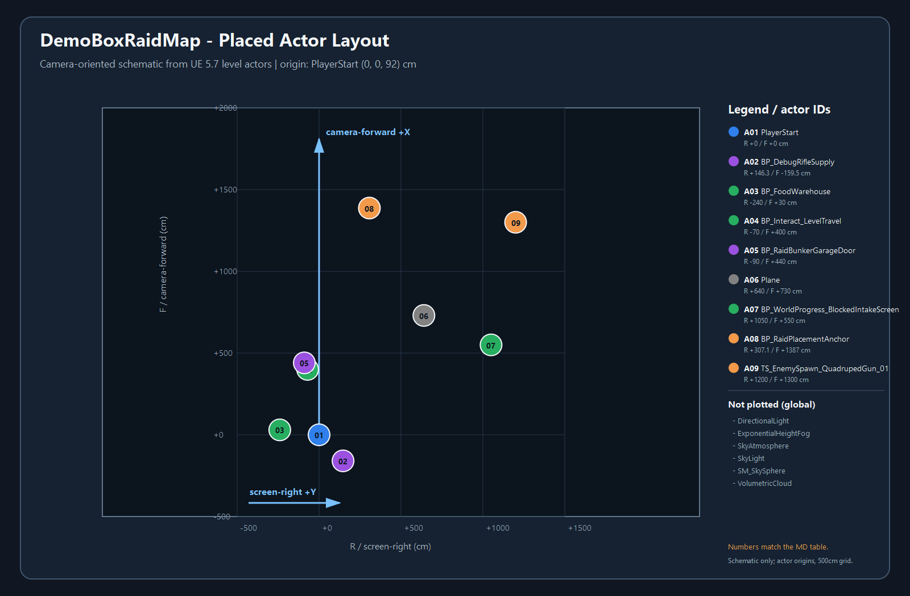
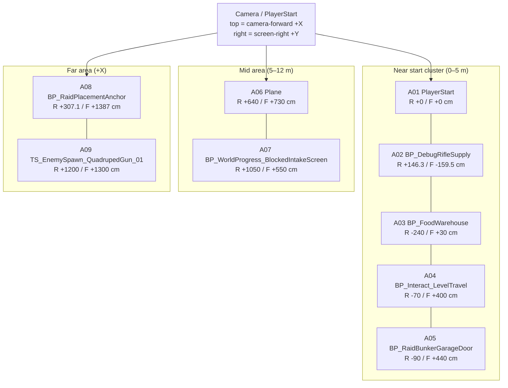

# DemoBoxRaidMap 배치 액터 현황

## 기준과 범위

- 기준일: 2026-09-16
- 실제 레벨: `/Game/Maps/DemoBoxRaidMap` (`TunaSweeper/Content/Maps/DemoBoxRaidMap.umap`)
- 현재 Stove 데모 레이드 선택: `TunaSweeper/Config/DefaultGame.ini`의 `bUseBoxRaidLevel=True`
- 추출 방법: UE 5.7 에디터의 `EditorActorSubsystem.get_all_level_actors()`로 맵을 읽기 전용 로드하고, 저장된 액터의 Label·Class·Transform을 수집했다.
- 이번 문서는 기획상 예정 목록이 아니라 현재 `.umap`에 저장된 액터 기준이다. 적·루팅 상자처럼 런타임 생성되는 대상은 레벨에 실제 대상 액터가 아니라 앵커만 배치되어 있으므로 앵커와 JSON 연결을 별도로 표시한다.

## 한눈에 보는 상태

현재 맵에는 총 **15개**의 레벨 액터가 있다. 이 중 위치 비교에 의미가 있는 로컬 배치 액터는 **9개**이며, `DirectionalLight, ExponentialHeightFog, SkyAtmosphere, SkyLight, SM_SkySphere, VolumetricCloud`는 전역 조명·대기·하늘 구성이라 아래 위치도에서 제외했다.

PlayerStart 기준 5m 안에는 5개 액터가 몰려 있다: PlayerStart, BP_DebugRifleSupply, BP_FoodWarehouse, BP_Interact_LevelTravel, BP_RaidBunkerGarageDoor. 따라서 현재 상태는 사용자가 말한 테스트용 축약 레이드처럼 시작 지점 주변 기능 액터가 다닥다닥 붙은 배치로 볼 수 있다. 로컬 배치 순서는 A01 PlayerStart (0 m), A02 BP_DebugRifleSupply (2.2 m), A03 BP_FoodWarehouse (2.4 m), A04 BP_Interact_LevelTravel (4.1 m), A05 BP_RaidBunkerGarageDoor (4.5 m), A06 Plane (9.7 m), A07 BP_WorldProgress_BlockedIntakeScreen (11.9 m), A08 BP_RaidPlacementAnchor (14.2 m), A09 TS_EnemySpawn_QuadrupedGun_01 (17.7 m)이다.

| 분류 | 수량 |
| --- | ---: |
| Environment / prop | 2 |
| Gameplay interaction | 3 |
| Lighting / atmosphere | 5 |
| Other placed actor | 2 |
| Player start | 1 |
| Runtime placement anchor | 2 |

## 카메라 기준 좌표

플레이어 캐릭터 `/Game/Characters/Player/BP_TunaSweeperPlayerCharacter`의 현재 탑다운 카메라 설정을 기준으로 좌표를 읽었다.

| 항목 | 값 |
| --- | --- |
| 카메라 붐 회전 | `Pitch -88° / Yaw 0° / Roll 0°` |
| 카메라 붐 길이 | `1500 cm` |
| 기준 액터 | `PlayerStart` at `(0, 0, 92) cm` |
| 카메라 전방 투영 | 월드 `+X` = 화면 위쪽 |
| 화면 오른쪽 투영 | 월드 `+Y` = 화면 오른쪽 |
| 표의 R/F | R = screen-right(+Y), F = camera-forward(+X), 단위 cm |

## PNG 지도

아래 PNG는 같은 덤프의 실제 액터 원점을 카메라 기준 R/F 평면으로 투영한 개략 지도다. 500cm 격자와 번호 범례를 넣었으며, 번호는 아래 액터 표의 ID와 동일하다. 전역 조명·하늘 액터는 공간적 위치를 표시하는 것이 의미 없어서 오른쪽 범례에만 별도 기재했다.

파일: `Docs/demo_box_raid_actor_layout.png`

## Mermaid 위치 개략도

아래 그래프도 같은 R/F 좌표를 사용한다. Mermaid는 절대 좌표를 지원하지 않으므로 근접도 레이어와 좌우 방향을 표시하는 용도의 개략도다.

## 액터 상세

위치·회전·스케일은 UE 월드 단위 기준이며 위치는 cm, 회전은 Pitch/Yaw/Roll, 스케일은 배율이다. 회전이 180° 또는 30°처럼 보이는 값도 현재 맵에 저장된 값 그대로 기록했다.

| ID | Label | 분류 | Class | Location cm (X,Y,Z) | Rotation° (P/Y/R) | Scale (X,Y,Z) | Camera-relative (R/F cm) | 현재 역할/비고 |
| --- | --- | --- | --- | --- | --- | --- | --- | --- |
| A01 | PlayerStart | Player start | `PlayerStart` | `(0, 0, 92)` | `P0 / Y0 / R0` | `(1, 1, 1)` | `R +0 / F +0` | 레이드 시작 기준점 |
| A02 | BP_DebugRifleSupply | Other placed actor | `BP_DebugRifleSupply` | `(-159.5, 146.3, -0.5)` | `P0 / Y0 / R0` | `(1, 1, 1)` | `R +146.3 / F -159.5` | 테스트용 소총·탄약 보급 액터 |
| A03 | BP_FoodWarehouse | Gameplay interaction | `BP_FoodWarehouse` | `(30, -240, 0)` | `P0 / Y30 / R0` | `(1, 1, 1)` | `R -240 / F +30` | 참치캔 3004 x 1, 퀘스트 demo_q4_todays_reward |
| A04 | BP_Interact_LevelTravel | Gameplay interaction | `BP_Interact_LevelTravel` | `(400, -70, -30)` | `P0 / Y0 / R0` | `(1, 1, 1)` | `R -70 / F +400` | 직접 배치 레벨 이동, 목적지 Bunker |
| A05 | BP_RaidBunkerGarageDoor | Other placed actor | `BP_RaidBunkerGarageDoor` | `(440, -90, 0)` | `P0 / Y-119.5 / R0` | `(1, 1, 1)` | `R -90 / F +440` | 레이드 입구 차고문 |
| A06 | Plane | Environment / prop | `StaticMeshActor` | `(730, 640, 0)` | `P0 / Y90 / R0` | `(20, 20, 20)` | `R +640 / F +730` | 박스 레이드 바닥 |
| A07 | BP_WorldProgress_BlockedIntakeScreen | Gameplay interaction | `BP_WaterIntake` | `(550, 1050, 0)` | `P0 / Y84 / R0` | `(1, 1, 1)` | `R +1050 / F +550` | 취수시설 월드 진행, 크로우바 6003 / 밸브 손잡이 6004 |
| A08 | BP_RaidPlacementAnchor | Runtime placement anchor | `BP_RaidPlacementAnchor` | `(1387, 307.1, 52.4)` | `P0 / Y0 / R0` | `(1, 1, 1)` | `R +307.1 / F +1387` | PlacementId 2, Loot Container |
| A09 | TS_EnemySpawn_QuadrupedGun_01 | Runtime placement anchor | `BP_RaidPlacementAnchor` | `(1300, 1200, 90)` | `P0 / Y180 / R180` | `(1, 1, 1)` | `R +1200 / F +1300` | PlacementId 1, Enemy / 런타임 적 스폰 위치 |
| A10 | DirectionalLight | Lighting / atmosphere | `DirectionalLight` | `(0, -600, 400)` | `P-49.5 / Y-10.3 / R112.4` | `(1, 1, 1)` | `R -600 / F +0` | 전역 조명·대기 액터; 위치도 생략 |
| A11 | ExponentialHeightFog | Lighting / atmosphere | `ExponentialHeightFog` | `(-5600, -50, -6850)` | `P0 / Y0 / R0` | `(1, 1, 1)` | `R -50 / F -5600` | 전역 조명·대기 액터; 위치도 생략 |
| A12 | SkyAtmosphere | Lighting / atmosphere | `SkyAtmosphere` | `(0, 0, -6000)` | `P0 / Y0 / R0` | `(1, 1, 1)` | `R +0 / F +0` | 전역 조명·대기 액터; 위치도 생략 |
| A13 | SkyLight | Lighting / atmosphere | `SkyLight` | `(0, -740, 600)` | `P0 / Y0 / R0` | `(1, 1, 1)` | `R -740 / F +0` | 전역 조명·대기 액터; 위치도 생략 |
| A14 | SM_SkySphere | Environment / prop | `StaticMeshActor` | `(0, 0, 0)` | `P0 / Y0 / R0` | `(400, 400, 400)` | `R +0 / F +0` | 전역 하늘 구체 프록시; 위치도 생략 |
| A15 | VolumetricCloud | Lighting / atmosphere | `VolumetricCloud` | `(0, 0, 700)` | `P0 / Y0 / R0` | `(1, 1, 1)` | `R +0 / F +0` | 전역 조명·대기 액터; 위치도 생략 |

## 클래스·오브젝트 경로

아래 경로는 위 표의 액터를 다시 찾을 때 사용하는 실제 오브젝트 경로다.

| ID | Label | Class path | Object path |
| --- | --- | --- | --- |
| A01 | PlayerStart | `/Script/Engine.PlayerStart` | `/Game/Maps/DemoBoxRaidMap.DemoBoxRaidMap:PersistentLevel.PlayerStart_0` |
| A02 | BP_DebugRifleSupply | `/Game/Blueprints/Debug/BP_DebugRifleSupply.BP_DebugRifleSupply_C` | `/Game/Maps/DemoBoxRaidMap.DemoBoxRaidMap:PersistentLevel.BP_DebugRifleSupply_C_1` |
| A03 | BP_FoodWarehouse | `/Game/Interaction/DemoEnding/BP_FoodWarehouse.BP_FoodWarehouse_C` | `/Game/Maps/DemoBoxRaidMap.DemoBoxRaidMap:PersistentLevel.BP_FoodWarehouse_C_0` |
| A04 | BP_Interact_LevelTravel | `/Game/Interaction/BP_Interact_LevelTravel.BP_Interact_LevelTravel_C` | `/Game/Maps/DemoBoxRaidMap.DemoBoxRaidMap:PersistentLevel.BP_Interact_LevelTravel_C_1` |
| A05 | BP_RaidBunkerGarageDoor | `/Game/Environment/Bunker/GarageDoor/BP_RaidBunkerGarageDoor.BP_RaidBunkerGarageDoor_C` | `/Game/Maps/DemoBoxRaidMap.DemoBoxRaidMap:PersistentLevel.BP_RaidBunkerGarageDoor_C_1` |
| A06 | Plane | `/Script/Engine.StaticMeshActor` | `/Game/Maps/DemoBoxRaidMap.DemoBoxRaidMap:PersistentLevel.StaticMeshActor_1` |
| A07 | BP_WorldProgress_BlockedIntakeScreen | `/Game/Interaction/BP_WaterIntake.BP_WaterIntake_C` | `/Game/Maps/DemoBoxRaidMap.DemoBoxRaidMap:PersistentLevel.BP_WorldProgress_BlockedIntakeScreen_C_3` |
| A08 | BP_RaidPlacementAnchor | `/Game/Raid/Placement/BP_RaidPlacementAnchor.BP_RaidPlacementAnchor_C` | `/Game/Maps/DemoBoxRaidMap.DemoBoxRaidMap:PersistentLevel.BP_RaidPlacementAnchor_C_2` |
| A09 | TS_EnemySpawn_QuadrupedGun_01 | `/Game/Raid/Placement/BP_RaidPlacementAnchor.BP_RaidPlacementAnchor_C` | `/Game/Maps/DemoBoxRaidMap.DemoBoxRaidMap:PersistentLevel.BP_RaidPlacementAnchor_C_0` |
| A10 | DirectionalLight | `/Script/Engine.DirectionalLight` | `/Game/Maps/DemoBoxRaidMap.DemoBoxRaidMap:PersistentLevel.DirectionalLight_0` |
| A11 | ExponentialHeightFog | `/Script/Engine.ExponentialHeightFog` | `/Game/Maps/DemoBoxRaidMap.DemoBoxRaidMap:PersistentLevel.ExponentialHeightFog_0` |
| A12 | SkyAtmosphere | `/Script/Engine.SkyAtmosphere` | `/Game/Maps/DemoBoxRaidMap.DemoBoxRaidMap:PersistentLevel.SkyAtmosphere_0` |
| A13 | SkyLight | `/Script/Engine.SkyLight` | `/Game/Maps/DemoBoxRaidMap.DemoBoxRaidMap:PersistentLevel.SkyLight_0` |
| A14 | SM_SkySphere | `/Script/Engine.StaticMeshActor` | `/Game/Maps/DemoBoxRaidMap.DemoBoxRaidMap:PersistentLevel.StaticMeshActor_0` |
| A15 | VolumetricCloud | `/Script/Engine.VolumetricCloud` | `/Game/Maps/DemoBoxRaidMap.DemoBoxRaidMap:PersistentLevel.VolumetricCloud_0` |

## 런타임 데이터 연결

### Loot Container 앵커

- A08: `PlacementId=2`, `AnchorKind=Loot Container`, 실제 위치 `(X 1387, Y 307.1, Z 52.4) cm`.
- SSOT 데이터: `TunaSweeper/Content/Data/LootContainerSpawns.json`의 논리 레벨 `DemoRaidMap`, 클래스 `/Game/Interaction/BP_LootContainer.BP_LootContainer_C`, 컨테이너 정의 `7009` (`container.north_crate`), 내용물 `8013`.
- 현재 내용물 행은 `6005 × 1`이며, 이 배치는 방수 테이프(아이템 6005) 1개를 확정 지급하는 북쪽 상자 데이터다.
- 위치는 앵커 Transform이 소유하고, JSON에는 location·rotation·scale을 두지 않는 현재 배치 계약을 따른다.

### Enemy 앵커

- A09: `PlacementId=1`, `AnchorKind=Enemy`, 실제 위치 `(X 1300, Y 1200, Z 90) cm`, Yaw `180°`.
- SSOT 데이터: `TunaSweeper/Content/Data/EnemySpawns.json`의 논리 레벨 `DemoRaidMap`, 프로필 `enemy.quadruped_gun_test`, 적 클래스 `/Game/Blueprints/BP_QuadrupedGunEnemy.BP_QuadrupedGunEnemy_C`, 전투 프로필 `enemy.rifle_anchor`.
- 따라서 맵에 직접 배치된 적 BP는 0개이고, 런타임에서 이 앵커 위치에 `BP_QuadrupedGunEnemy`가 생성된다.

## 해석 시 주의

- 이 문서의 대상은 정식 대형 레이드가 아니라 현재 Stove 데모에서 선택된 `DemoBoxRaidMap`이다. `DemoRaidMap`은 데모 레이드 논리 ID와 JSON의 `level_name` 호환 이름으로 계속 사용된다.
- PNG와 Mermaid는 카메라 기준 평면의 액터 원점만 보여준다. 메시의 실제 외곽, 충돌 범위, NavMesh, 런타임 스폰 후 생성되는 컴포넌트 크기는 표현하지 않는다.
- 다음 배치 검토에서는 먼저 PlayerStart 주변의 5m 클러스터를 분리하고, 취수시설·북쪽 상자·적 앵커를 플레이 동선에 맞춰 간격 조정하는 것이 우선이다.
