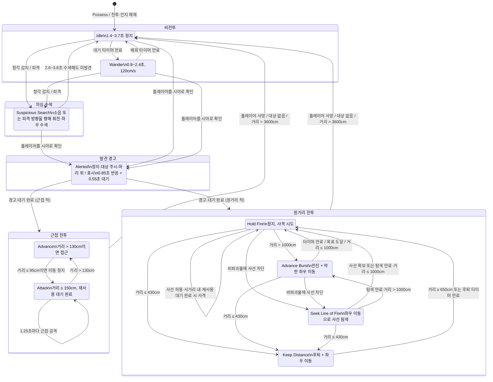

# 적 AI 인지·전투 상태 전이

기준 구현: `ATunaSweeperEnemyAIController`와 `ATunaSweeperEnemyCharacter`.
거리는 Unreal 단위인 cm이다.

## 인지 규칙

- 소음은 `UTunaSweeperNoiseSubsystem` 이벤트를 구독해, 기본 청각 범위 `1800cm`와 최소 강도 `0.08`을 만족하면 `Suspicious Search`를 시작한다. 자신의 소음은 무시한다.
- 시야 확인은 플레이어 생존, 평면 거리 `≤2300cm`, 전방 시야각 `100°` 이내, 비파괴 차단물이 없는 사선을 모두 만족해야 한다.
- 적이 죽지 않고 피해를 받으면 공격자 방향을 의심 위치로 사용한다. 이 경우에도 즉시 전투로 넘어가지 않고 수색으로 시작한다.
- 직접 시야로 플레이어를 찾은 경우에도 즉시 공격하지 않는다. `Alerted` 상태에서 이동을 멈추고 플레이어를 바라보며 느낌표를 표시한 뒤, 총 `1.4초`가 지나야 실제 전투로 진입한다.
- `SM_Enemy_AlertExclamation` 메시를 적의 머리 위에 붙이고, 표시 중에는 로컬 플레이어를 향하는 빌보드로 회전한다.

## 원거리 거리별 동작

| 거리 | 상태 선택 | 기본 지속 시간 / 이동 |
| --- | --- | --- |
| `≤430cm` | `Keep Distance` | 0.5~0.9초 동안 후퇴·좌우 이동 |
| `650~1000cm` | `Hold Fire` | 2.8~4.4초 정지·사격 시도 |
| `>1000cm` | `Advance Burst` | 250~400cm(중거리) 또는 400~600cm(장거리) 전진 |
| 비파괴물에 사선 차단 | `Seek Line of Fire` | 0.8~1.4초 좌우 이동 |

## 구현 위치

- 인지·전투 상태: `TunaSweeper/Source/TunaSweeper/Private/AI/TunaSweeperEnemyAIController.cpp`
- 인지 기본값: `TunaSweeper/Source/TunaSweeper/Public/AI/TunaSweeperEnemyAIController.h`
- 피격 의심과 느낌표 표시: `TunaSweeper/Source/TunaSweeper/Private/AI/TunaSweeperEnemyCharacter.cpp`
- 느낌표 메시: `TunaSweeper/Content/Characters/Enemy/SM_Enemy_AlertExclamation.uasset`
