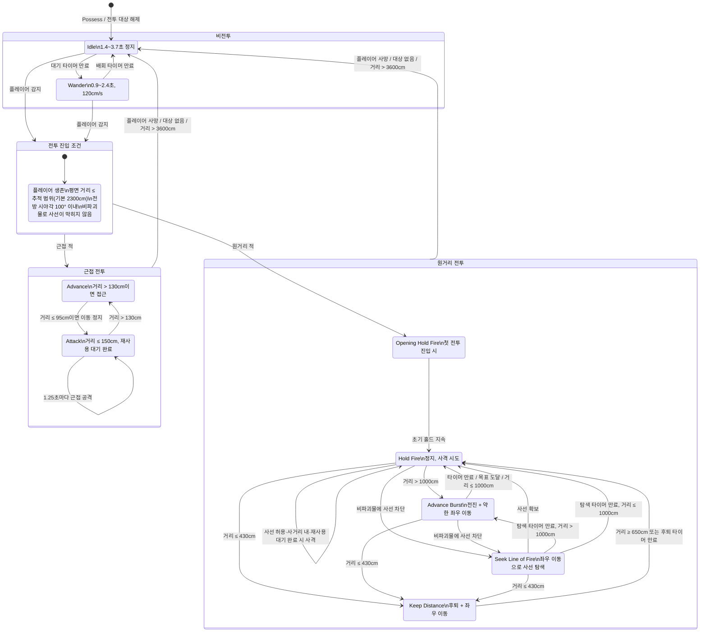

# 적 AI 상태 전이

기준 구현: `ATunaSweeperEnemyAIController`와 `ATunaSweeperEnemyCharacter`.
거리는 Unreal 단위인 cm이며, 아래 기본값은 인스턴스별 랜덤 오프셋이 적용되기 전의 값이다.

## 전투 갱신과 이탈

- 대상 감지와 전투 판단은 기본 `0.25초`마다 실행된다. 개체마다 `-0.04~+0.06초`의 오프셋이 적용된다.
- 전투에 진입한 뒤에는 시야각과 사선으로 전투를 해제하지 않는다. 플레이어가 죽거나 대상이 없어지거나, 평면 거리가 이탈 범위(기본 `3600cm`, 추적 범위보다 작게 설정할 수 없음)를 넘을 때만 비전투 `Idle`로 복귀한다.
- 모래주머니는 파괴 가능한 사선 차단물이다. 원거리 적은 이를 통과해 사격할 수 있지만, 비파괴 차단물은 `Seek Line of Fire` 상태를 유발한다.

## 원거리 거리별 동작

| 거리 | 상태 선택 | 기본 지속 시간 / 이동 |
| --- | --- | --- |
| `≤430cm` | `Keep Distance` | 0.5~0.9초 동안 후퇴·좌우 이동 |
| `650~1000cm` | `Hold Fire` | 2.8~4.4초 정지·사격 시도 |
| `>1000cm` | `Advance Burst` | 250~400cm(중거리) 또는 400~600cm(장거리) 전진 |
| 비파괴물에 사선 차단 | `Seek Line of Fire` | 0.8~1.4초 좌우 이동 |

원거리 적은 전투 최초 진입 시 `Opening Hold Fire`에 들어가며, 이때에는 추적 범위 안이면 즉시 사격을 시도할 수 있다. 이후 `Hold Fire` 사격은 원거리 공격 범위(기본적으로 선호 최대 거리 `1000cm` 이상) 안에서만 시도한다.

## 구현 위치

- 상태 갱신과 전이: `TunaSweeper/Source/TunaSweeper/Private/AI/TunaSweeperEnemyAIController.cpp`
- 상태 열거형·기본값: `TunaSweeper/Source/TunaSweeper/Public/AI/TunaSweeperEnemyAIController.h`
- 근접 적 판별 및 근접 수치: `TunaSweeper/Source/TunaSweeper/Private/AI/TunaSweeperEnemyCharacter.cpp`
