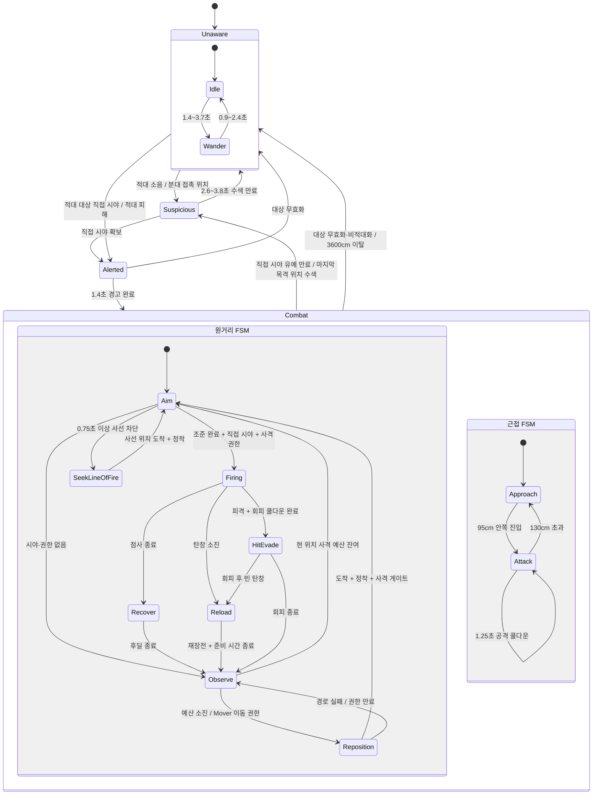

# 적 AI 행동·인지·전투 상태

최종 코드 대조일은 2026-07-13이다. 기준 구현은 `ATunaSweeperEnemyAIController`, `ATunaSweeperEnemyCharacter`, `UTunaSweeperEnemySquadSubsystem`이며 거리 단위는 cm이다. 원거리 전투 수치는 `Content/Data/EnemyCombatProfiles.json`을 단일 원본으로 사용한다.

## 전체 상태 흐름



## 비전투·인지 행동

### Unaware

- `Idle`은 1.4~3.7초 동안 정지하고, `Wander`는 무작위 평면 방향으로 0.9~2.4초 동안 이동한다.
- 배회 속도는 120cm/s이며 `Idle ↔ Wander`를 반복한다.
- 가장 가까운 적대 액터를 찾되 프로필의 `tracking_range`, 전방 100도 시야각, 직접 사선 검사를 모두 통과해야 `Alerted`가 된다.
- 파괴 가능한 물체는 시야 확보 대상으로 간주하지만 아군과 파괴 불가능한 물체는 시야·사선을 차단한다.

### Suspicious

- 적대 소음, 외부 경고, 신선한 분대 마지막 목격 위치, 전투 중 시야 상실로 진입한다.
- 이동을 멈추고 의심 위치를 중심으로 좌우 48도 범위를 훑는다.
- 2.6~3.8초 안에 직접 시야를 되찾으면 `Alerted`, 찾지 못하면 `Unaware`로 돌아간다.
- `Unaware`에서 처음 진입할 때 `!` 말풍선을 0.9초 표시한다. 같은 인지 사이클에서는 반복하지 않으며 `Unaware` 복귀 때 표시 가능 상태가 초기화된다.

### Alerted와 Combat

- `Alerted`에서는 1.4초 동안 적을 바라보지만 공격하지 않는다. 종료 후 공격 유형에 맞는 전투 FSM으로 들어간다.
- 전투 중 시야를 잃으면 기본 0.75초 동안 현재 대상을 유지한다. 이 시간 동안 직접 시야 없이는 발사하지 않는다.
- 신선한 분대 접촉이 있으면 Mover는 공유된 마지막 목격 위치로 이동을 계속할 수 있다. 아군·불가파괴물로 막힌 위치를 복구 중이면 5초 lease 범위까지 전술 이동을 유지할 수 있다.
- 신선한 접촉이나 복구 사유 없이 시야 유예가 끝나면 분대에서 빠지고 마지막 목격 위치를 `Suspicious` 상태로 수색한다.
- 대상이 죽거나 전투 표적 불가 상태가 되거나 적대 관계가 아니게 되거나 3600cm 밖으로 이탈하면 전투를 완전히 해제하고 `Unaware`로 돌아간다.

### 소음

- 기본 청각 범위는 1800cm, 민감도는 1.0, 최소 청취 강도는 0.08이다.
- 실제 청취 범위는 청자 범위와 소음 이벤트의 최대 범위 중 작은 값이며 거리 감쇠를 적용한다.
- 같은 팩션이 낸 발소리·총성·폭발 소음은 무시한다. 이미 `Alerted` 또는 `Combat`이면 새 소음으로 인지 상태를 덮어쓰지 않는다.

## 현재 전투 프로필과 RaidMap 배치

| 프로필 | 배치 | 역할 | 속도 | 추적 / 공격 거리 | 선호 거리 | 위험 거리 |
| --- | --- | --- | ---: | ---: | ---: | ---: |
| `enemy.pistol_flanker` | 권총 적, `raid_alpha` slot 1 | Flanker / 최초 Mover | 370 | 2300 / 1150 | 560~880 | 360 |
| `enemy.rifle_anchor` | 일반 소총 적, `raid_alpha` slot 0 | Anchor / 최초 Suppressor | 340 | 2300 / 1450 | 650~1000 | 430 |
| `enemy.elite_rifle_anchor` | 고급 소총 적, Solo | Anchor | 340 | 2300 / 1450 | 650~1000 | 430 |
| `enemy.melee_lumberjack` | 근접 적 2명, Solo | Melee | 260 | 1800 / 150 | 해당 없음 | 해당 없음 |

전투 역할은 전리품이나 `enemy_id`로 추론하지 않고 스폰 데이터의 `combat_profile_id`로 결정한다.

## 원거리 개인 사격 리듬

| 프로필 | 한 `Firing`의 탄수 | 탄 간격 | Recover | Observe | 최소 비사격 창 |
| --- | ---: | ---: | ---: | ---: | ---: |
| 권총 Flanker | 1발 | 없음 | 1.0~1.2초 | 1.0~1.4초 | 2.0초 |
| 일반 소총 Anchor | 3발, 첫 교전 2발 | 0.18~0.23초 | 1.2~1.5초 | 1.4~2.0초 | 2.6초 |
| 고급 소총 Anchor | 4발, 첫 교전 3발 | 0.15~0.19초 | 1.3~1.6초 | 1.7~2.4초 | 3.0초 |

- 반자동 무기는 프로필 값과 관계없이 한 `Firing`에서 정확히 1발만 쏜다. 자동화기는 첫 교전 탄수와 이후 탄수를 구분한다.
- 남은 장탄이 목표 탄수보다 적으면 현재 장탄 수만큼만 계획한다.
- 한 위치에서는 무작위로 1~2개의 `Firing`만 허용하고 이후 재배치를 시도한다.
- 마지막 탄 시각에 `Recover 최소 + Observe 최소`를 더한 값을 다음 발사 가능 시각으로 별도 보존한다. 피격 회피나 짧은 상태 전환이 끼어도 최소 비사격 창을 건너뛸 수 없다.
- 발사 API는 `Firing`에서만 호출한다. `Aim`, `Recover`, `Observe`, `Reload`, `Reposition`, `SeekLineOfFire`, `HitEvade`에서는 발사하지 않는다.

### 원거리 상태별 의미

| 상태 | 행동 | 종료 조건 |
| --- | --- | --- |
| `Idle` | 전투 FSM 진입 대기 | Suppressor/Solo는 사격 게이트 후 `Aim`, Mover는 이동 게이트 후 `Reposition` |
| `Aim` | 0.3~0.5초 동안 표적 조준, 사선 확인 | 직접 시야와 사격 권한이 있으면 `Firing` |
| `Firing` | 계획된 탄수만 발사 | 점사 종료 후 `Recover`, 빈 탄창이면 `Reload` |
| `Recover` | 정지하고 총구 방향 갱신도 멈추는 사격 후딜 | 프로필 시간이 끝나면 `Observe` |
| `Observe` | 정지 상태로 표적 또는 마지막 목격 위치를 천천히 바라봄 | 사격 예산·분대 역할에 따라 `Aim` 또는 `Reposition` |
| `Reposition` | `Orbit`, `Approach`, `Retreat`, `CrossReposition` 중 하나를 NavMesh `MoveTo`로 수행 | 도착 후 0.35~0.55초 정착 |
| `SeekLineOfFire` | 막힌 사선을 벗어나는 좌우 이동 | 도착 후 정착, 실패하면 짧은 `Observe` |
| `Reload` | 실제 무기 재장전과 필요 시 제한 이동 | 재장전 완료 후 0.35~0.55초 준비 |
| `HitEvade` | 피격 방향의 측후방으로 150~250cm 회피 | 빈 탄창이면 `Reload`, 아니면 짧은 `Observe` |

### 사격 결과 처리

`TryFireProjectileAt()`은 성공 여부가 아니라 아래 결과를 반환하며 컨트롤러가 상태를 결정한다.

| 결과 | 컨트롤러 처리 |
| --- | --- |
| `Fired` | 탄수·첫 탄·마지막 탄을 기록하고 다음 탄 간격 예약 |
| `MagazineEmpty`, `Reloading` | 명시적으로 `Reload` 진입 |
| `Cooldown` | 0.02초 뒤 같은 탄 재시도 |
| `OutOfAmmo` | 분대에서 이탈하고 점사 종료 |
| `FriendlyTarget`, `Blocked` | 발사하지 않고 현재 점사 종료 |

## 재장전과 상태 말풍선

- 마지막 탄 발사 또는 빈 탄창 결과를 확인한 컨트롤러가 명시적으로 `Reload`에 들어간다. 캐릭터 내부의 숨은 자동 재장전은 없다.
- 탄창 크기, 장탄, 예비 탄, 재장전 시간은 `ItemTable.json`의 실제 무기 값을 사용한다.
- 재장전 시작부터 완료까지 기존 진행 링과 `WBP_SpeechBubble`의 `재장전` 문구를 함께 표시한다.
- 상태 말풍선 우선순위는 `재장전 > !`이다. revision을 확인하는 타이머를 사용하므로 이전 `!` 타이머가 새 `재장전` 메시지를 지우지 못한다. 기존 3D 느낌표 메시는 비활성화되어 있다.
- 재장전 완료 뒤 0.35~0.55초의 준비 시간을 거치고 짧은 `Observe` 뒤에야 다시 조준한다.
- Solo는 기본적으로 제자리에서 재장전한다. 위험 거리 안쪽이면 안전한 후퇴점을 찾아 이동 속도 50%로 한 번 후퇴한다.
- 분대원은 Suppressor 역할을 먼저 반납한다. 역할 교대 후 Mover가 된 재장전자는 이동 게이트가 열릴 때 한 번의 안전한 측면 이동을 할 수 있다.
- 탄약이 완전히 소진되면 분대 전술에서 이탈한다. 두 분대원이 동시에 빈 탄창이어도 각자 즉시 재장전하며 토큰을 기다리지 않는다.

## 2인 제압 사격·재배치

분대 키는 `(FactionId, SquadId)`다. 현재 2인 원거리 분대는 `(10, squad.raid_alpha)`이며 slot 0이 최초 `Suppress`, slot 1이 최초 `Reposition`이다. 같은 팩션이어도 `SquadId`가 다르면 접촉과 전술 권한을 공유하지 않는다.

```text
Suppress가 Aim 후 첫 탄 발사
→ 0.15~0.35초 뒤 Reposition이 이동 시작
→ Reposition 도착 후 0.35~0.55초 정착
→ Suppress 마지막 탄 뒤 분대 전체 0.9~1.2초 침묵
→ 이동 완료와 침묵 중 더 늦은 시각에 역할 교대
→ 새 Suppress가 다음 Firing, 이전 Suppress는 다음 Mover
```

- 한 사이클에는 Suppression lease와 Reposition lease가 각각 한 명에게 배정되므로 두 명의 동시 사격과 동시 일반 재배치를 허용하지 않는다.
- 역할은 `CycleId`와 5초 lease로 보호한다. pair 생성, 역할 교대, 멤버 이탈 때 cycle이 바뀌며 이전 cycle의 이동·정착·사격 완료 콜백은 무시한다.
- Suppressor의 첫 탄이 Mover 출발 시각을 만들고 lease를 갱신한다. 마지막 탄이 다음 사수의 침묵 게이트를 만든다.
- Mover가 먼저 도착해도 Suppressor의 마지막 탄 보고 전에는 역할을 바꾸지 않는다.
- Suppressor가 0.75초 이상 아군 또는 불가파괴물에 막히면 즉시 역할을 뒤집지 않고 현재 Mover에게 `SeekLineOfFire` 복구 이동 권한을 준다.
- 분대가 사선 복구를 요청한 상태에서 점사가 시작됐다면 마지막 탄 보고 전에는 cycle을 넘기지 않는다.
- lease가 만료되면 이미 시작된 미완료 점사를 닫고 침묵 시간을 설정한 뒤 역할을 교대한다. 아직 첫 탄도 쏘지 않은 cycle은 바로 교대해 교착과 lease 누수를 막는다.
- pair가 전투 도중 형성되면 기존 Solo 점사나 중복 이동을 정리하고 새 역할에 맞춰 상태를 정상화한다.
- 파트너에게 공유하는 정보는 대상과 마지막 목격 위치뿐이다. 파트너의 신선한 접촉으로 이동은 계속할 수 있지만 자신의 직접 시야 없이 발사할 수 없다.
- 사망, pawn 해제, 대상 상실, 교전 해제, 탄약 완전 소진으로 한 명이 등록 해제되면 생존자는 `Solo` FSM으로 돌아간다.

## 재배치 종류와 안전 규칙

### 일반 이동

- `Orbit`: 선호 거리 안에서는 접선 방향으로 이동한다.
- `Approach`: 공격 거리 밖에서 접선 30%와 표적 방향을 섞어 프로필별 180~300cm 또는 200~300cm 범위로 접근한다. 분대에서는 Mover만 접근한다.
- `Retreat`: 위험 거리 안이거나 안전 재장전 이동일 때 접선과 바깥 방향을 섞어 후퇴한다.
- `SeekLineOfFire`: 막힌 사선을 벗어난다. 2인 분대는 slot 0과 slot 1이 서로 반대쪽 후보를 사용한다.
- 목표점은 상태 진입 때 고정하고 NavMesh에 투영한 뒤 캡슐 겹침을 검사한다. `MoveTo` 실패 시 반대편 후보를 한 번만 시도하고 다시 실패하면 0.35초 `Observe`로 돌아간다. 직접 돌진, 순간이동은 사용하지 않는다.

### CrossReposition

- Flanker가 Solo 또는 Mover일 때만 사용할 수 있다. 확률은 15%, 쿨다운은 6초이며 Anchor는 진입하지 않는다.
- 플레이어 위치를 스냅샷한 뒤 먼저 200~300cm 접선 이동을 수행한다. 이후 150cm 궤도 쪽으로 단계적으로 접근해 반대편을 통과하고 350cm, 최종 560cm 이상까지 사격 없이 이탈한다.
- 긴 구간은 최대 약 280cm의 경유점으로 나누고 각 경유점을 NavMesh와 캡슐 겹침으로 검증한다.
- 스냅샷 경로와 현재 이동 구간은 플레이어 중심에서 최소 120cm를 유지해야 한다. 플레이어가 이동 경로로 들어오면 Tick과 다음 경유점 시작 때 다시 검사하고 일반 `Orbit`으로 대체한다.
- 예상 경로 길이를 현재 이동 속도로 나눈 시간이 남은 5초 lease에서 정착 시간과 0.25초 여유를 뺀 값보다 길면 Cross를 취소하고 일반 재배치를 사용한다.

### HitEvade

- 원거리 적이 피격되면 진행 중인 점사를 닫고 공격자 반대 방향과 측면을 섞어 150~250cm 회피한다.
- 재사용 대기시간은 4초다. Suppressor라면 먼저 제압 권한을 반납하며, 회피 후에도 마지막 탄 기준 최소 비사격 창을 유지한다.
- 회피 목표 검증 또는 `MoveTo`가 실패하면 0.25초 `Observe`로 전환한다.

## 근접 적 행동

- 근접 프로필은 이번 원거리 사격 리듬과 분대 교대에서 제외되며 RaidMap의 두 근접 적은 Solo다.
- 대상이 130cm보다 멀어지면 직접 이동 입력으로 추적하고 95cm 안쪽에 들어오면 이동을 멈춘다.
- 공격 가능 거리는 150cm, 공격 쿨다운은 1.25초다.
- 근접 피해, 출혈, 넉백도 중앙 팩션 판정을 통과한 적대 대상에게만 적용된다.

## 팩션 규칙

| 대상 | 현재 `FactionId` |
| --- | ---: |
| 플레이어, 펫 | 1 |
| 일반 적, 롤링 봄버, 롤링 봄버 스포너 | 10 |
| 미지정 | 255 (`NoFaction`) |

- 모든 관계는 `UTunaSweeperFactionSubsystem`을 통한다. 같은 유효 ID는 `Friendly`, 다른 유효 ID는 `Hostile`, 255 또는 미지정은 `Neutral`이다.
- AI 표적과 현재 표적 유지, 시야와 사선, 소음, 투사체·근접·폭발 피해, 출혈·넉백, 피격 회피, 롤링 봄버와 스포너에 같은 판정기를 적용한다.
- 같은 팩션은 서로 공격하거나 경계하지 않는다. 아군이 사선을 가리면 발사를 중단하며 같은 팩션 투사체는 아군을 이동 충돌 무시 대상으로 등록해 피해 없이 통과한다.
- 팩션이 없는 폭발통 같은 환경 피해원은 기존 환경 피해를 유지한다.
- AI 컨트롤러의 `IGenericTeamAgentInterface`도 같은 팩션 ID를 사용한다.
- 후속 동맹·중립 관계표는 `GetFactionAttitudeById()` 내부에 추가하며 다른 전투 코드는 직접 ID를 비교하지 않는다.

## 데이터와 구현 위치

- 전투 프로필: `TunaSweeper/Content/Data/EnemyCombatProfiles.json`
- 스폰별 프로필·팩션·분대: `TunaSweeper/Content/Data/EnemySpawns.json`
- 무기 `fire_mode`, 탄창, 재장전 시간: `TunaSweeper/Content/Data/ItemTable.json`
- 전투 FSM: `TunaSweeper/Source/TunaSweeper/Private/AI/TunaSweeperEnemyAIController.cpp`
- 무기 런타임·말풍선: `TunaSweeper/Source/TunaSweeper/Private/AI/TunaSweeperEnemyCharacter.cpp`
- 분대 lease: `TunaSweeper/Source/TunaSweeper/Private/Subsystem/TunaSweeperEnemySquadSubsystem.cpp`
- 팩션 판정: `TunaSweeper/Source/TunaSweeper/Private/Subsystem/TunaSweeperFactionSubsystem.cpp`
- 자동화 테스트: `TunaSweeper/Source/TunaSweeper/Private/Tests/TunaSweeperEnemyCombatTests.cpp`
