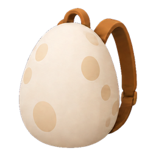
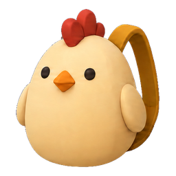
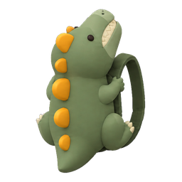
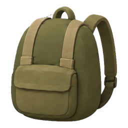
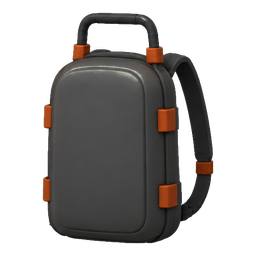

# 장비 설명

## 몸 슬롯

캐릭터의 장비를 장착하는 몸 슬롯은 총 **8칸**이다. 무기 슬롯 3칸과 신체·가방 슬롯 5칸으로 구성되며, 각 슬롯에는 장비 하나를 장착한다.

| 순서 | 슬롯 | 장착 대상 |
|---|---|---|
| 1 | 총기 1 | 총기 |
| 2 | 총기 2 | 총기 |
| 3 | 근접 | 근접무기 |
| 4 | 머리 | 헬멧 등 머리 장비 |
| 5 | 신체 | 방탄조끼·전술 재킷 등 몸통 장비 |
| 6 | 얼굴 | 선글라스 등 얼굴 장비 |
| 7 | 이어폰 | 귀에 착용하는 장비 |
| 8 | 가방 | 배낭 |

슬롯 이름과 순서는 현재 게임 UI를 기준으로 한다. 방탄조끼와 전술 재킷은 같은 신체 슬롯을 사용하므로 동시에 장착할 수 없다.

### UI 배치

장착 영역은 **가로 4칸 × 세로 2줄**이다. 화면에서 왼쪽부터 오른쪽으로, 윗줄 다음 아랫줄 순서로 배치된다.

```text
┌────────────┬────────────┬────────────┬────────────┐
│   총기 1   │   총기 2   │    근접    │    머리    │
├────────────┼────────────┼────────────┼────────────┤
│    신체    │    얼굴    │   이어폰   │    가방    │
└────────────┴────────────┴────────────┴────────────┘
```

위 도식은 슬롯 위치를 나타내며 실제 아이콘이나 픽셀 크기는 생략했다.

구현 근거: [장착 영역의 열 수·크기 및 슬롯 표시 순서](../TunaSweeper/Source/TunaSweeper/Private/UI/TunaSweeperHudInventoryAreaWidget.cpp)의 `EquipmentReserveColumnCount`, `EquipmentReserveHeight`, `GetEquipmentSlotDisplayName`, `RefreshInventoryItems`.

## 가방

가방 슬롯 장비는 총 **5종**이다. 아래 아이콘은 게임에서 사용하는 256×256 PNG이며, 왼쪽부터 1~5단계 순서다.

| 1단계 · 계란 가방 | 2단계 · 닭 가방 | 3단계 · 공룡 가방 | 4단계 · 군용배낭 | 5단계 · 카본프레임 가방 |
|---|---|---|---|---|
|  |  |  |  |  |
| 총 50칸 | 총 60칸 | 총 80칸 | 총 100칸 | 총 120칸 |

### 단계별 상세 설명

#### 1단계 · 계란 가방

- 아이템 ID: `5002`. 기본 40칸에서 **50칸(+10칸)**으로 확장한다. 운반 힘 보너스는 `10`이다.
- 위쪽이 살짝 좁은 아이보리색 달걀 몸체에 큰 연갈색 반점을 배치한다. 황갈색 어깨끈과 작은 손잡이를 사용한다.
- 외부 보조 주머니 없이 계란 자체의 형태가 드러난다.
- 모델: `SM_Backpack_Egg`, **240삼각형**, UV 아일랜드 11개.

#### 2단계 · 닭 가방

- 아이템 ID: `5003`. **60칸(+20칸)**으로 확장한다. 운반 힘 보너스는 `20`이다.
- 둥근 크림색·노란색 몸체, 작은 눈과 부리, 붉은 볏, 양옆의 짧은 날개로 닭을 표현한다. 얼굴이 바깥을 향한다.
- 외부 보조 주머니를 없애고 둥근 배와 캐릭터 표정이 잘 보이도록 한다.
- 모델: `SM_Backpack_Chicken`, **390삼각형**, UV 아일랜드 27개.

#### 3단계 · 공룡 가방

- 아이템 ID: `5004`. **80칸(+40칸)**으로 확장한다. 운반 힘 보너스는 `40`이다.
- 공룡의 **배가 착용자의 등에 붙어 업힌 모습**이다. 바깥으로 등판과 둥근 돌기·꼬리가 보이며, 짧은 팔과 다리는 착용자 쪽을 향한다.
- 고개는 하늘을 향해 젖힌다. 입을 다문 채 뾰족한 이가 맞물려 보이는 우스꽝스러운 표정이며, 입을 크게 벌리지 않는다.
- 차분한 녹색 몸체와 황토색 등판 돌기를 사용한다. 외부 보조 주머니는 없다.
- 모델: `SM_Backpack_Dinosaur`, **364삼각형**, UV 아일랜드 44개. 작은 이빨은 독립된 표면이며, 몸통·머리·끈은 연결된 면을 아일랜드로 묶는다.

#### 4단계 · 군용배낭

- 아이템 ID: `5005`. **100칸(+60칸)**으로 확장한다. 운반 힘 보너스는 `60`이다.
- 올리브색 몸체와 모래색의 넓은 끈으로 구성한 단순한 군용배낭이다. 둥근 모서리와 큼직한 전면 주머니를 사용한다.
- 작은 지퍼·촘촘한 웨빙·복잡한 위장무늬를 줄여 작은 아이콘에서도 형태가 읽히게 한다.
- 모델: `SM_Backpack_Military`, **328삼각형**, UV 아일랜드 19개.

#### 5단계 · 카본프레임 가방

- 아이템 ID: `5011`. **120칸(+80칸)**으로 확장한다. 운반 힘 보너스는 `80`이다.
- 짙은 회색의 **단단한 하드케이스**에 외부 카본프레임과 주황색 잠금장치를 배치한다. 케이스 면은 넓고 단순하며 모서리를 둥글게 처리한다.
- 초기 카본프레임 가방보다 세로 높이를 **1.3배**로 늘렸다. 현재 모델 전체 높이는 약 **59.02cm**다.
- 부풀어 오른 천 주머니나 접힌 천 표현을 사용하지 않는다. 카본 재질은 작은 직조무늬 대신 넓은 색 면으로 표현한다.
- 모델: `SM_Backpack_CarbonFrame`, **336삼각형**, UV 아일랜드 28개.
- 현재 데이터의 판매가는 600코인, 경험치 값은 150이다. 단계와 아이템 희귀도는 별도 값이며, 희귀도는 기존 최고 등급인 `legendary`를 사용한다.

### 공통 모델·UV·텍스처 사양

- 귀여운 게임 화풍에 맞는 단순하고 둥근 실루엣을 사용한다. 핑크·구름·하트·반짝이 장식은 사용하지 않는다.
- 끈과 장식을 포함한 **완성 모델 하나당 500삼각형 미만**이다. 삼각화된 FBX를 다시 불러와 동일한 수를 확인한다.
- UV0은 몸통의 앞·뒤, 끈, 날개 등 연결된 표면을 아일랜드로 묶는다. 각 아일랜드는 고유 영역을 가지며, 대칭면을 포개거나 같은 영역을 반복 사용하지 않는다.
- UV1은 같은 아일랜드 배치를 사용하는 라이트맵 채널이다. 두 채널 모두 범위와 퇴화·겹침을 검사한다.
- **가방별 512×512 고유 베이스컬러 텍스처 1장과 고유 재질 1개**를 사용한다. 가방 사이에 텍스처를 공유하지 않는다.
- 수정 전 실측 밀도 약 **616.53px/m → 308.26px/m**로 절반을 적용했다. 아일랜드의 실제 면적에 맞춰 밀도를 정규화한다. 해상도만 비교하지 않고 UV 면적과 모델의 실제 면적을 함께 측정한다.
- 각 UV 배치를 참조해 내장 이미지 생성 도구로 텍스처를 별도 생성하고, 최종 512×512로 저장했다. 원본 `.blend`에는 다섯 텍스처가 모두 내장되어 있다.
- 원본 모델은 Blender +Z가 위, +Y가 착용자 쪽이다. UE 좌표·단위 변환 결과는 검증 보고서에 기록한다.

### 파일과 검증

- 아이템 데이터: [ItemTable.json](../TunaSweeper/Content/Data/ItemTable.json). 이름·설명은 [ItemNameStrings.csv](../TunaSweeper/Content/Data/ItemNameStrings.csv)의 `item.backpack_tier1`~`item.backpack_tier5` 키로 해석한다.
- [Blender 원본](../TunaSweeper/SourceArt/Props/Backpacks/Backpacks.blend), [FBX 폴더](../TunaSweeper/SourceArt/Props/Backpacks/Models), [개별 텍스처](../TunaSweeper/SourceArt/Props/Backpacks/Textures), [UV 배치](../TunaSweeper/SourceArt/Props/Backpacks/UV).
- UE 메시·재질·텍스처: `/Game/Props/Backpacks/`. UI 아이콘: `/Game/UI/Icons/T_UIIcon_Backpack_Tier1`~`T_UIIcon_Backpack_Tier5`.
- [실제 모델 정면 렌더](../TunaSweeper/SourceArt/Props/Backpacks/Previews/Models_Front.png), [반대쪽 렌더](../TunaSweeper/SourceArt/Props/Backpacks/Previews/Models_Back.png). 위 아이콘은 이미지 생성 시안이며 이 렌더는 실제 저폴리곤 모델이다.
- [Blender·FBX 검증 결과](../TunaSweeper/SourceArt/Props/Backpacks/source_validation.json), [UE 애셋 검증 결과](../TunaSweeper/SourceArt/Props/Backpacks/unreal_validation.json).
- 기존 1~4단계 아이템 ID를 유지하고 5단계만 새 ID를 사용한다. 세이브는 기존 아이템 ID·인스턴스 저장 구조를 사용한다.
- 런타임 인벤토리 상한과 불러오기 시 점유 슬롯 보존 상한은 120칸이다. 이전 Blueprint 설정의 최대값이 100이어도 5단계의 마지막 슬롯을 사용할 수 있도록 필수 상한을 120으로 보장한다.
