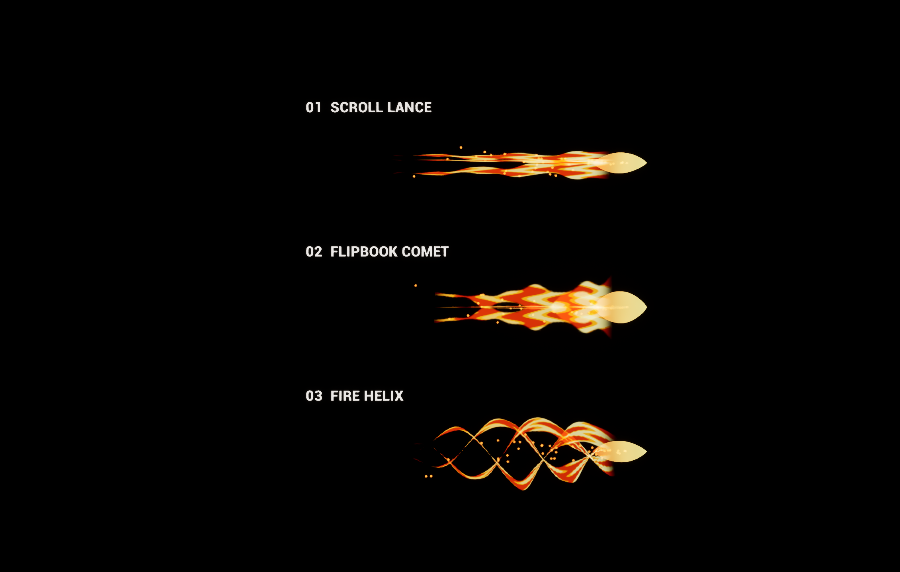

# 화염 투사체 비교 후보

콘텐츠 폴더: `/Game/Effects/FlameProjectiles`

비교 맵: `/Game/Effects/FlameProjectiles/L_FlameProjectile_Comparison`

| Niagara System | 방식 | 외형 |
| --- | --- | --- |
| `NS_FlameProjectile_ScrollLance` | UV와 시간을 이용한 연속 화염 흐름 | 길고 좁은 3갈래 화염창 |
| `NS_FlameProjectile_FlipbookComet` | 4×4, 16프레임 마스크 플립북 + 흐름 색상 | 넓고 펄럭이는 4갈래 혜성 꼬리 |
| `NS_FlameProjectile_Helix` | 나선 메시 + 회전 모듈 + UV 흐름 | 투사체 뒤를 감싸는 3중 화염 나선 |

각 시스템은 `ProjectileCore` 메시, `FlameTail` 메시, `TrailingEmbers` 스프라이트 이미터를 가진다. UE 5.7 경량 Niagara 이미터를 사용하며, 본체와 꼬리는 1초 루프로 유지하고 불티는 초당 65개를 발생시킨다. 플립북 텍스처는 512×512이며 프레임당 128×128, 초당 24프레임이다.

전방은 로컬 `+X`, 꼬리는 `-X`이다. 길이는 약 2.1~2.6m이며 Niagara 컴포넌트의 스케일로 조절할 수 있다. 독립적인 시각효과 후보로, 이동·충돌·피해 처리는 포함하지 않는다. 게임 투사체에 연결할 때 해당 투사체의 방향과 생명주기에 맞춰 컴포넌트를 배치·정리한다.

비교 맵은 에디터 뷰포트용이다. Realtime을 켜고 `G`로 편집 아이콘을 숨기면 세 이펙트를 비교할 수 있다. `F11`로 뷰포트를 확대한다. 게임 플레이 모드나 전투 데이터는 변경하지 않는다.

초기 검증: 생성 자동화 테스트 통과, 16개 자산 로드 및 메시·머티리얼 연결 확인, 에디터에서 3종의 본체·화염 꼬리·불티 재생 확인. 패키징 및 실제 전투 투사체 연결은 이 작업 범위에 포함하지 않는다.

일회성 생성 소스는 생성 자산과 함께 커밋한 뒤 바로 다음 정리 커밋에서 제거한다. 저장된 자산은 생성 코드 없이 사용한다.
