# 게임 내 아이콘 이미지 목록

프로젝트 UI 아이콘 텍스처를 Unreal Engine 5.7의 PNG 익스포터로 내보낸 목록입니다. 총 **75개**입니다.

- 이미지 위치: `Images/icons/`
- 원본 해상도와 알파 채널을 유지한 PNG입니다. 흰색 아이콘은 어두운 배경에서 확인하면 더 잘 보입니다.
- 아이템, HUD, 메뉴, 보관함 필터, 난이도 및 표시·조작 아이콘을 포함합니다.
- 배경, 지도 전체 이미지, 패널·프레임 및 튜토리얼 삽화는 제외했습니다.
- 아이콘 폴더에는 현재 아이템 테이블에서 참조하지 않는 에셋도 포함됩니다.
- 키 입력 이미지는 개별 키가 아닌 원본 4×4 시트입니다.

## 아이템 · HUD · 메뉴

| 이미지 | 에셋 / 연결된 아이템 | 해상도 |
| --- | --- | --- |
|  | `/Game/UI/Icons/T_UI_Hud_Status_Heart` | 256 × 256 |
| 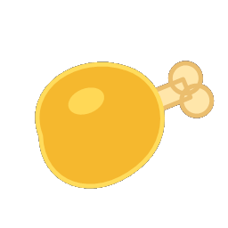 | `/Game/UI/Icons/T_UI_Hud_Status_Meat` | 256 × 256 |
| 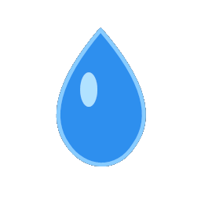 | `/Game/UI/Icons/T_UI_Hud_Status_WaterDrop` | 256 × 256 |
| 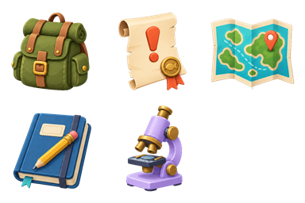 | `/Game/UI/Icons/T_UI_Mode_ColorAtlas` | 384 × 256 |
|  | `/Game/UI/Icons/T_UI_Mode_Inventory` | 128 × 128 |
|  | `/Game/UI/Icons/T_UI_Mode_Map` | 128 × 128 |
|  | `/Game/UI/Icons/T_UI_Mode_Memo` | 128 × 128 |
|  | `/Game/UI/Icons/T_UI_Mode_Quest` | 128 × 128 |
| 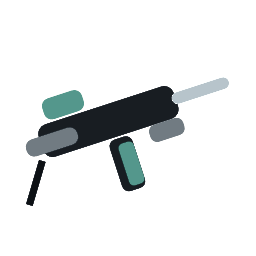 | `/Game/UI/Icons/T_UIIcon_AdvancedRifle` 아이템: 1007 (`item.advanced_rifle`) | 256 × 256 |
| 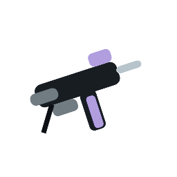 | `/Game/UI/Icons/T_UIIcon_AdvancedSMG` 아이템: 1008 (`item.advanced_smg`) | 256 × 256 |
| 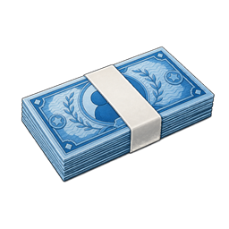 | `/Game/UI/Icons/T_UIIcon_AncientBanknoteBundle` 아이템: 7003 (`item.ancient_banknote`) | 256 × 256 |
| 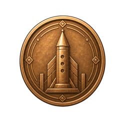 | `/Game/UI/Icons/T_UIIcon_AncientCoin` 아이템: 7002 (`item.ancient_coin`) | 256 × 256 |
| 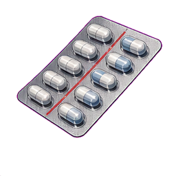 | `/Game/UI/Icons/T_UIIcon_Antibiotics` 아이템: 4004 (`item.antibiotics`) | 256 × 256 |
| 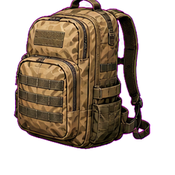 | `/Game/UI/Icons/T_UIIcon_Backpack` | 256 × 256 |
| 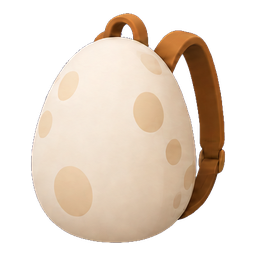 | `/Game/UI/Icons/T_UIIcon_Backpack_Tier1` 아이템: 5002 (`item.backpack_tier1`) | 256 × 256 |
| 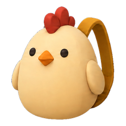 | `/Game/UI/Icons/T_UIIcon_Backpack_Tier2` 아이템: 5003 (`item.backpack_tier2`) | 256 × 256 |
| 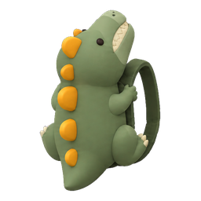 | `/Game/UI/Icons/T_UIIcon_Backpack_Tier3` 아이템: 5004 (`item.backpack_tier3`) | 256 × 256 |
| 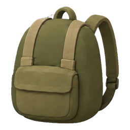 | `/Game/UI/Icons/T_UIIcon_Backpack_Tier4` 아이템: 5005 (`item.backpack_tier4`) | 256 × 256 |
| 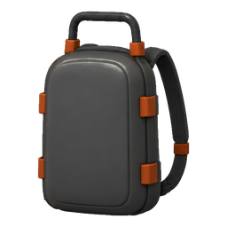 | `/Game/UI/Icons/T_UIIcon_Backpack_Tier5` 아이템: 5011 (`item.backpack_tier5`) | 256 × 256 |
| 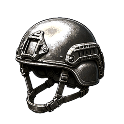 | `/Game/UI/Icons/T_UIIcon_BallisticHelmet` 아이템: 5006 (`item.ballistic_helmet`) | 256 × 256 |
| 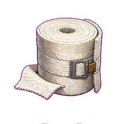 | `/Game/UI/Icons/T_UIIcon_Bandage` 아이템: 4001 (`item.bandage`) | 256 × 256 |
| 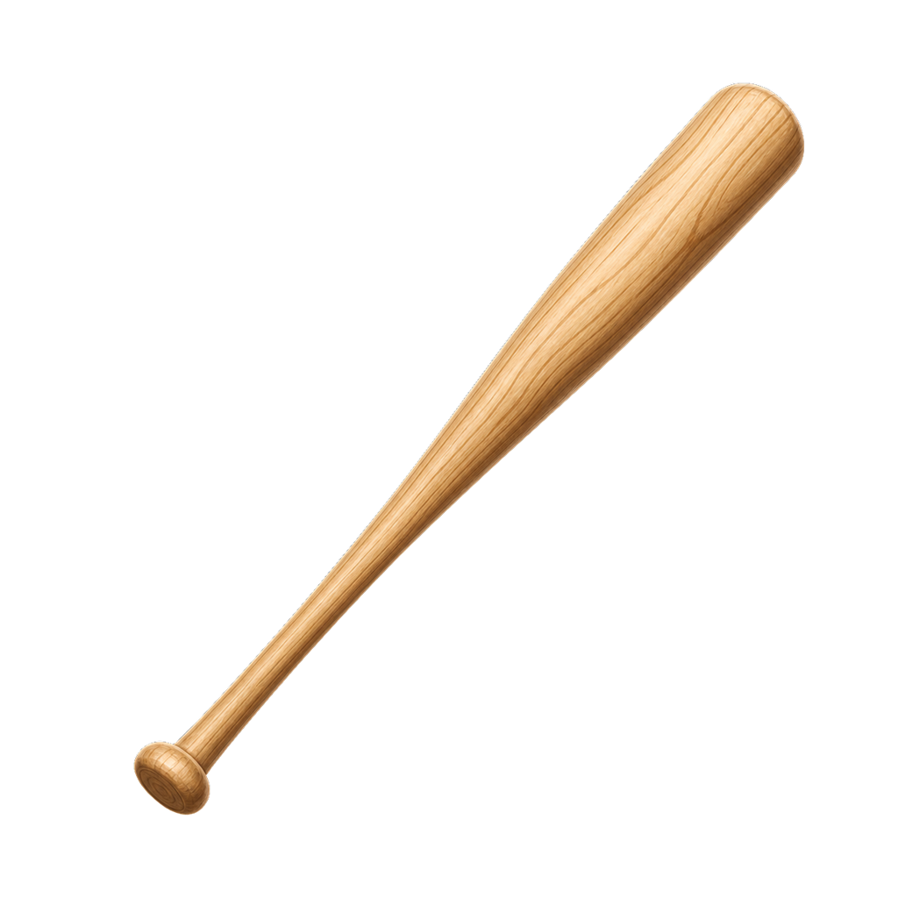 | `/Game/UI/Icons/T_UIIcon_BaseballBat` | 1024 × 1024 |
| 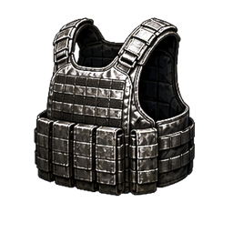 | `/Game/UI/Icons/T_UIIcon_BodyArmor` 아이템: 5001 (`item.body_armor`) | 256 × 256 |
| 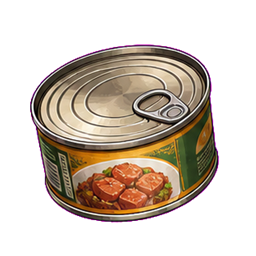 | `/Game/UI/Icons/T_UIIcon_CannedFood` 아이템: 3001 (`item.canned_food`) | 256 × 256 |
| 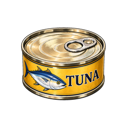 | `/Game/UI/Icons/T_UIIcon_CannedTuna` 아이템: 3004 (`item.canned_tuna`) | 256 × 256 |
| 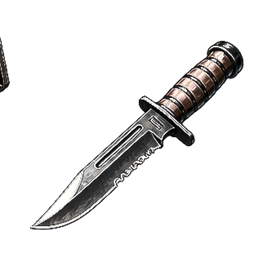 | `/Game/UI/Icons/T_UIIcon_CombatKnife` | 256 × 256 |
| 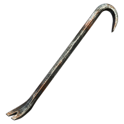 | `/Game/UI/Icons/T_UIIcon_Crowbar` | 256 × 256 |
| 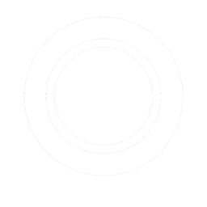 | `/Game/UI/Icons/T_UIIcon_CurrencyCoin_White` | 256 × 256 |
| 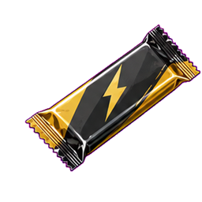 | `/Game/UI/Icons/T_UIIcon_EnergyBar` 아이템: 3003 (`item.energy_bar`) | 256 × 256 |
| 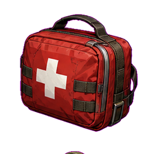 | `/Game/UI/Icons/T_UIIcon_FirstAidKit` 아이템: 4002 (`item.first_aid_kit`) | 256 × 256 |
| 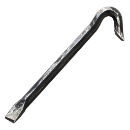 | `/Game/UI/Icons/T_UIIcon_MeleeCrowbar` 아이템: 6003 (`item.crowbar`) | 256 × 256 |
|  | `/Game/UI/Icons/T_UIIcon_Painkillers` 아이템: 4003 (`item.painkillers`) | 256 × 256 |
| 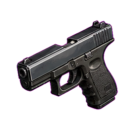 | `/Game/UI/Icons/T_UIIcon_Pistol` 아이템: 1001 (`item.pistol`) | 256 × 256 |
| 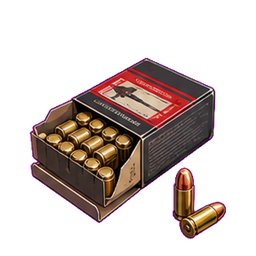 | `/Game/UI/Icons/T_UIIcon_PistolAmmo` 아이템: 2001 (`item.pistol_ammo`) | 256 × 256 |
| 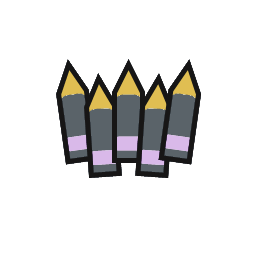 | `/Game/UI/Icons/T_UIIcon_PistolAPAmmo` 아이템: 2012 (`item.pistol_ap_ammo`) | 256 × 256 |
| 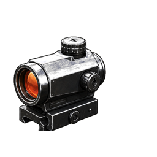 | `/Game/UI/Icons/T_UIIcon_RedDotOptic` 아이템: 2005 (`item.red_dot_optic`), 2006 (`item.laser_sight`) | 256 × 256 |
| 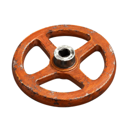 | `/Game/UI/Icons/T_UIIcon_ReplacementValveHandle` 아이템: 6004 (`item.replacement_valve_handle`) | 256 × 256 |
| 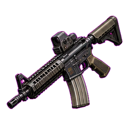 | `/Game/UI/Icons/T_UIIcon_Rifle` 아이템: 1002 (`item.rifle`) | 256 × 256 |
| 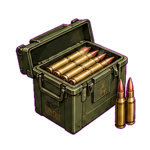 | `/Game/UI/Icons/T_UIIcon_RifleAmmo` 아이템: 2002 (`item.rifle_ammo`), 2023 (`item.rifle_incendiary_ammo`) | 256 × 256 |
| 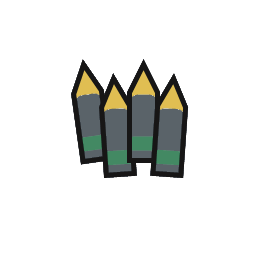 | `/Game/UI/Icons/T_UIIcon_RifleAPAmmo` 아이템: 2022 (`item.rifle_ap_ammo`) | 256 × 256 |
| 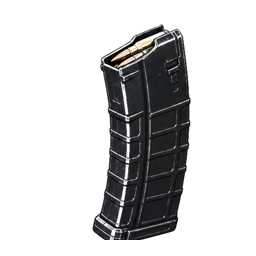 | `/Game/UI/Icons/T_UIIcon_RifleExtendedMagazine` 아이템: 2004 (`item.rifle_extended_magazine`) | 256 × 256 |
| 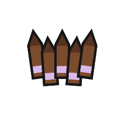 | `/Game/UI/Icons/T_UIIcon_RustyPistolAmmo` 아이템: 2011 (`item.rusty_pistol_ammo`) | 256 × 256 |
| 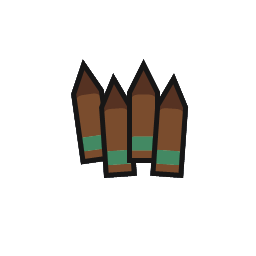 | `/Game/UI/Icons/T_UIIcon_RustyRifleAmmo` 아이템: 2021 (`item.rusty_rifle_ammo`) | 256 × 256 |
| 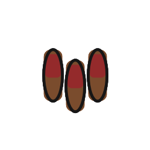 | `/Game/UI/Icons/T_UIIcon_RustyShotgunAmmo` 아이템: 2031 (`item.rusty_shotgun_ammo`) | 256 × 256 |
| 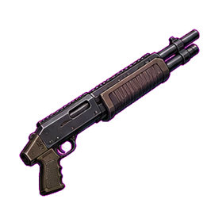 | `/Game/UI/Icons/T_UIIcon_Shotgun` 아이템: 1003 (`item.shotgun`) | 256 × 256 |
| 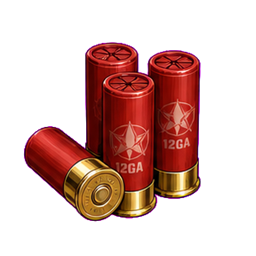 | `/Game/UI/Icons/T_UIIcon_ShotgunAmmo` 아이템: 2003 (`item.shotgun_ammo`) | 256 × 256 |
| 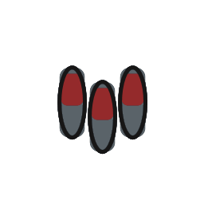 | `/Game/UI/Icons/T_UIIcon_ShotgunAPAmmo` 아이템: 2032 (`item.shotgun_ap_ammo`) | 256 × 256 |
| 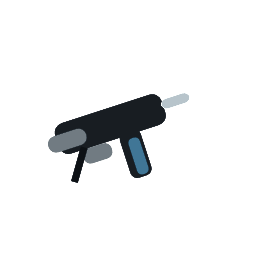 | `/Game/UI/Icons/T_UIIcon_SMG` 아이템: 1006 (`item.smg`) | 256 × 256 |
| 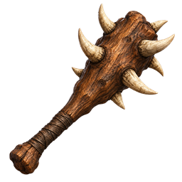 | `/Game/UI/Icons/T_UIIcon_SpikedClub` 아이템: 1005 (`item.spiked_club`) | 256 × 256 |
| 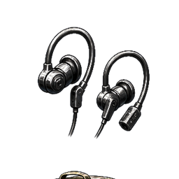 | `/Game/UI/Icons/T_UIIcon_TacticalEarphones_Tier1` 아이템: 5008 (`item.tactical_earphones_tier1`) | 256 × 256 |
| 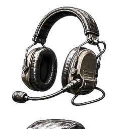 | `/Game/UI/Icons/T_UIIcon_TacticalEarphones_Tier2` 아이템: 5009 (`item.tactical_earphones_tier2`) | 256 × 256 |
| 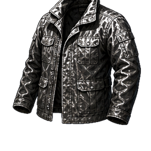 | `/Game/UI/Icons/T_UIIcon_TacticalJacket` 아이템: 5010 (`item.tactical_jacket`) | 256 × 256 |
| 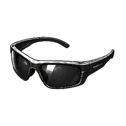 | `/Game/UI/Icons/T_UIIcon_TacticalSunglasses` 아이템: 5007 (`item.tactical_sunglasses`) | 256 × 256 |
| 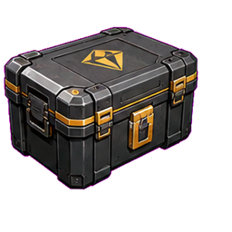 | `/Game/UI/Icons/T_UIIcon_ValuablesCrate` 아이템: 6001 (`item.valuables_crate`), 6002 (`item.wood`) | 256 × 256 |
| 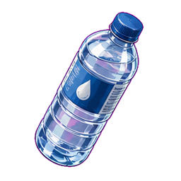 | `/Game/UI/Icons/T_UIIcon_WaterBottle` 아이템: 3002 (`item.water_bottle`), 3005 (`item.large_water_bottle`), 3006 (`item.king_water_bottle`), 7001 (`item.blueprint_king_water_bottle`) | 256 × 256 |
| 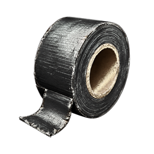 | `/Game/UI/Icons/T_UIIcon_WaterproofTape` 아이템: 6005 (`item.waterproof_tape`) | 256 × 256 |
|  | `/Game/UI/Icons/T_UIIcon_WoodenClub` 아이템: 1004 (`item.wooden_club`) | 256 × 256 |

## 보관함 필터

| 이미지 | 에셋 / 연결된 아이템 | 해상도 |
| --- | --- | --- |
|  | `/Game/UI/StorageFilters/T_UIStorageFilter_All` | 128 × 128 |
|  | `/Game/UI/StorageFilters/T_UIStorageFilter_Ammo` | 128 × 128 |
|  | `/Game/UI/StorageFilters/T_UIStorageFilter_Attachment` | 128 × 128 |
|  | `/Game/UI/StorageFilters/T_UIStorageFilter_Blueprint` | 128 × 128 |
|  | `/Game/UI/StorageFilters/T_UIStorageFilter_Consumable` | 128 × 128 |
|  | `/Game/UI/StorageFilters/T_UIStorageFilter_Gear` | 128 × 128 |
|  | `/Game/UI/StorageFilters/T_UIStorageFilter_Material` | 128 × 128 |
|  | `/Game/UI/StorageFilters/T_UIStorageFilter_Other` | 128 × 128 |
|  | `/Game/UI/StorageFilters/T_UIStorageFilter_Weapon` | 128 × 128 |

## 난이도

| 이미지 | 에셋 / 연결된 아이템 | 해상도 |
| --- | --- | --- |
|  | `/Game/UI/Difficulty/T_DifficultyIcon_Farming` | 1254 × 1254 |
|  | `/Game/UI/Difficulty/T_DifficultyIcon_Hard` | 1254 × 1254 |
|  | `/Game/UI/Difficulty/T_DifficultyIcon_Normal` | 1254 × 1254 |

## 표시 · 조작

| 이미지 | 에셋 / 연결된 아이템 | 해상도 |
| --- | --- | --- |
|  | `/Game/UI/Indicators/T_TunaThoughtIndicator` | 1024 × 1024 |
|  | `/Game/UI/Interaction/T_InteractionMarkerOpenedCheck` | 64 × 64 |
|  | `/Game/UI/Map/T_UIMap_PlayerLocation_Transparent` | 256 × 256 |
|  | `/Game/UI/Title/T_SettingsBackArrow` | 128 × 128 |
|  | `/Game/UI/Dialogue/T_KeycapPress_4x4` | 1024 × 1024 |
|  | `/Game/UI/SpeechBubble/T_EnemyAlertCloud` | 1024 × 1024 |
