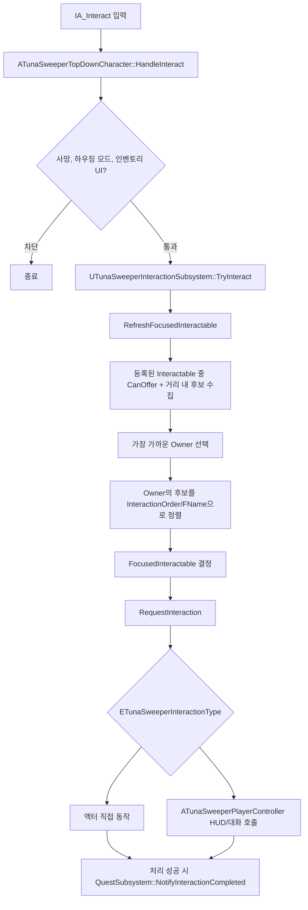
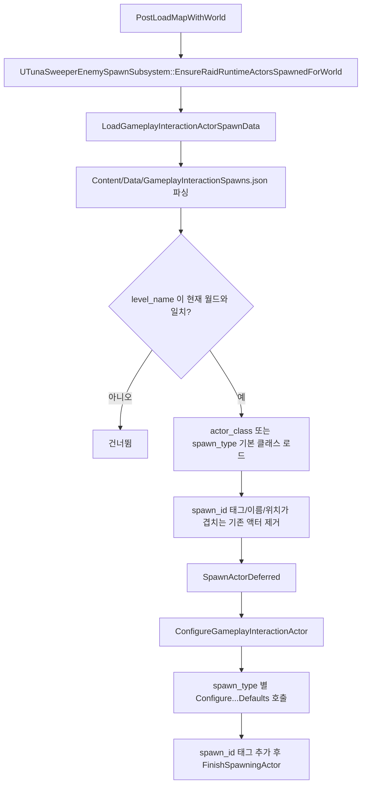

# 상호작용 시스템 흐름

이 문서는 월드 상호작용 입력에서 포커스, 마커, 상호작용 분기, HUD 패널 호출, 런타임 상호작용 액터 스폰까지의 현재 C++ 구현 흐름을 정리한다.

## 전체 흐름

1. `ATunaSweeperTopDownCharacter::SetupPlayerInputComponent()`가 `/Game/Input/IA_Interact`를 `HandleInteract()`에, `/Game/Input/IA_InteractionFocus`를 `HandleInteractionFocus()`에 바인딩한다.
2. `HandleInteract()`는 사망 상태, 하우징 모드, 인벤토리 UI를 먼저 막는다. 단, 인벤토리 UI 체크 전에 `ATunaSweeperPlayerController::TryHandleHoveredItemInteract()`를 시도하므로 UI에 올려둔 아이템 사용/장착 계열 입력이 월드 상호작용보다 우선한다.
3. 통과하면 월드 서브시스템 `UTunaSweeperInteractionSubsystem::TryInteract()`로 위임한다.
4. `UTunaSweeperInteractableComponent`는 `BeginPlay()`에서 월드 상호작용 서브시스템에 등록하고, `EndPlay()`/`OnUnregister()`에서 해제한다.
5. `UTunaSweeperInteractionSubsystem::Tick()`은 하우징 모드가 열려 있으면 포커스를 비우고 종료한다. 아니면 `RefreshFocusedInteractable()`로 현재 포커스를 갱신한다.
6. 포커스는 등록된 컴포넌트 중 `CanOfferInteraction()`이 true이고 플레이어와 2D 상호작용 거리 안에 있는 후보만 대상으로 한다. 가장 가까운 컴포넌트가 아니라 가장 가까운 `Owner`를 먼저 고르고, 같은 `Owner`의 후보를 `InteractionOrder`, `FName` 순으로 정렬해 포커스 인덱스를 유지한다.
7. `HandleInteractionFocus()`는 같은 `Owner`에 상호작용 컴포넌트가 여러 개 있을 때 `MoveFocusedInteractionSelection()`을 호출해 포커스 인덱스를 순환한다. 이 구조는 작업대와 돼지저금통처럼 한 액터에 여러 옵션이 붙은 경우에 쓰인다.
8. `RequestInteraction()`은 유효성, `CanOfferInteraction()`, 거리 조건을 다시 검사한 뒤 `ETunaSweeperInteractionType` switch로 타입별 핸들러를 호출한다.
9. 핸들러가 true를 반환하면 `UTunaSweeperQuestSubsystem::NotifyInteractionCompleted(ObjectiveEventId, InteractionTypeName)`가 호출된다.

## 핵심 파일과 클래스

| 클래스/파일 | 경로 | 역할 |
| --- | --- | --- |
| `ATunaSweeperTopDownCharacter` | `TunaSweeper/Source/TunaSweeper/Private/Character/TunaSweeperTopDownCharacter.cpp` | `IA_Interact`, `IA_InteractionFocus` 입력을 받아 상호작용 서브시스템으로 위임한다. |
| `ATunaSweeperPlayerController` | `TunaSweeper/Source/TunaSweeper/Private/Player/TunaSweeperPlayerController.cpp` | HUD 패널, 퀘스트/메모 패널, 하우징 모드, 두더지 대화 시퀀스를 연다. |
| `UTunaSweeperInteractionSubsystem` | `TunaSweeper/Source/TunaSweeper/Private/Subsystem/TunaSweeperInteractionSubsystem.cpp` | 상호작용 컴포넌트 등록, 포커스 선정, BunkerMap 제한, 타입별 분기를 담당한다. |
| `UTunaSweeperInteractableComponent` | `TunaSweeper/Source/TunaSweeper/Private/Interaction/TunaSweeperInteractableComponent.cpp` | 상호작용 타입/이름/거리/목표 이벤트를 보관하고 마커 위젯을 생성/갱신한다. |
| `ATunaSweeperInteractableActor` | `TunaSweeper/Source/TunaSweeper/Private/Interaction/TunaSweeperInteractableActor.cpp` | 기본 `SceneRoot`, `VisualMesh`, `InteractableComponent`를 가진 상호작용 액터 베이스다. |
| 아이템/컨테이너 액터 | `TunaSweeper/Source/TunaSweeper/Private/Interaction/TunaSweeperPickupItemActor.cpp`, `TunaSweeperItemSpawnInteractableActor.cpp`, `TunaSweeperLootContainerActor.cpp`, `TunaSweeperLootContainerSpawnInteractableActor.cpp` | 픽업, 아이템 스폰, 루팅 컨테이너 열기/스폰을 처리한다. |
| 이동/월드 액터 | `TunaSweeper/Source/TunaSweeper/Private/Interaction/TunaSweeperLevelTravelInteractableActor.cpp`, `TunaSweeperWorldProgressActor.cpp`, `TunaSweeperPersistentDoorActor.cpp`, `TunaSweeperDoorActor.cpp`, `TunaSweeperWarpPointActor.cpp`, `TunaSweeperMemoActor.cpp` | 레벨 이동, 월드 진행 수리, 영속 문, 일반 문, 워프, 메모 획득을 처리한다. |
| 벙커 시설 액터 | `TunaSweeper/Source/TunaSweeper/Private/Interaction/TunaSweeperHousingManagementActor.cpp`, `TunaSweeperStorageActor.cpp`, `TunaSweeperShopActor.cpp`, `TunaSweeperWorkbenchActor.cpp`, `TunaSweeperPiggyBankActor.cpp` | 하우징, 창고, 상점, 작업대, 돼지저금통 상호작용을 처리한다. |
| 퀘스트/두더지 액터 | `TunaSweeper/Source/TunaSweeper/Private/Character/TunaSweeperMoleCompanionActor.cpp`, `TunaSweeperFacilityNpcActor.cpp` | 퀘스트 제공자/폴백 ID를 해석하고 퀘스트 알림 및 두더지 대화 옵션을 제공한다. |
| HUD 패널 | `TunaSweeper/Source/TunaSweeper/Private/UI/TunaSweeperGameHudWidget.cpp` | 루팅/창고/상점/작업대 외부 패널, 퀘스트 패널, 메모 패널, 하우징 패널 표시를 담당한다. |
| 런타임 스폰 | `TunaSweeper/Source/TunaSweeper/Private/Subsystem/TunaSweeperEnemySpawnSubsystem.cpp`, `TunaSweeper/Content/Data/GameplayInteractionSpawns.json` | 맵 로드 후 JSON 기반 상호작용/런타임 액터를 생성하고 타입별 초기값을 주입한다. |

## 마커와 포커스

- `UTunaSweeperInteractableComponent`는 기본 마커 위젯 클래스로 `/Game/UI/WBP_InteractionMarker`를 사용한다.
- 상호작용 거리는 기본 `InteractionDistance = 200.0f`, 마커 표시 거리는 기본 `MarkerVisibleDistance = 400.0f`이며 모두 XY 2D 거리로 판정한다.
- 같은 `Owner`에 컴포넌트가 여러 개 있어도 화면 마커는 `ResolveMarkerInteractableForOwner()`가 고른 첫 컴포넌트 하나만 표시한다. 표시 마커에는 `GetMarkerInteractionOptions()`가 옵션 목록과 현재 포커스 인덱스를 넘긴다.
- 마커 라벨은 포커스된 `Owner`의 대표 마커일 때만 보인다.
- 하우징 모드가 열려 있으면 `UTunaSweeperInteractionSubsystem`과 `UTunaSweeperInteractableComponent` 양쪽에서 포커스와 마커 표시를 억제한다.
- `WorldProgress`는 필요 아이템 아이콘/수량을 `SetInteractionRequirementPreview()`로 마커에 표시한다.
- 열린 루팅 컨테이너는 `SetMarkerCompleted(true)`로 열린 상태 마커를 표시한다.

## 타입별 분기

| 타입 | 코드상 제한 | 핸들러와 실제 동작 |
| --- | --- | --- |
| `ItemPickup` | 맵 제한 없음 | `ATunaSweeperPickupItemActor`에서 `ItemId`/`Quantity`를 읽고 `UTunaSweeperGameInstance::AddItemToPreferredAvailableSlot()`에 넣는다. 인벤토리가 가득 차면 실패하고, 성공 시 `bDestroyOnPickup`이면 액터를 제거한다. |
| `ItemSpawn` | 맵 제한 없음 | `ATunaSweeperItemSpawnInteractableActor::SpawnRandomPickupItem()`이 `UTunaSweeperItemDataSubsystem`의 전체 아이템 정의 중 하나를 골라 `PickupItemActorClass`를 스폰하고 `SetItemId()`를 호출한다. 위치는 반경 범위에서 고른 뒤 지면 트레이스로 보정한다. |
| `LootContainerOpen` | 맵 제한 없음 | `ATunaSweeperLootContainerActor::OpenRuntimeContainer()`가 새 컨테이너 인스턴스를 만들거나 기존 런타임 슬롯을 재사용한다. 그 뒤 뚜껑 열기 애니메이션을 재생하고 `ATunaSweeperPlayerController::OpenLootContainerPanel()`로 HUD를 연다. UI 닫힘/인벤토리 변경 시 런타임 슬롯을 다시 캡처한다. |
| `LootContainerSpawn` | 맵 제한 없음 | `ATunaSweeperLootContainerSpawnInteractableActor`가 컨테이너 정의와 수용량에 맞는 contents 행을 무작위 선택해 `ATunaSweeperLootContainerActor`를 스폰하고 `SetContainerDataIds()`를 호출한다. |
| `LevelTravel` | 맵 제한 없음 | `ATunaSweeperLevelTravelInteractableActor::TravelToTargetLevel()`이 `HandleLevelTravelPersistence()`, `NotifyLevelTravelRequested()`를 호출한다. 레이드 경험치 귀환 연출이 있으면 우선 실행하고, 아니면 레벨 전환 서브시스템 또는 `UGameplayStatics::OpenLevel()`로 이동한다. |
| `Quest` | 맵 제한 없음, 단 해석 가능한 퀘스트 ID 필요 | `ATunaSweeperMoleCompanionActor` 또는 `ATunaSweeperFacilityNpcActor`에서 provider/fallback으로 퀘스트 ID를 해석한 뒤 `OpenQuestPanel(QuestId)`를 호출한다. 퀘스트 ID가 없으면 `CanOfferInteraction()`에서 후보 제외된다. |
| `MoleDialogue` | BunkerMap 전용 | 소유자가 `ATunaSweeperMoleCompanionActor`이고 현재 맵이 `BunkerMap`일 때만 제공된다. `StartScenarioForTrigger(interaction.mole, true)`를 호출해 활성 플레이버 JSON의 조건에 맞는 두더지 대화를 재생한다. |
| `SelfDestruct` | 맵 제한 없음 | `ATunaSweeperSelfDestructInteractableActor::StartSelfDestruct()`가 말풍선 카운트다운을 시작한다. 종료 시 폭발 이펙트, 소음 리포트, 반경 내 `UTunaSweeperVitalsComponent` 피해를 적용하고 자기 자신을 제거한다. |
| `WorldProgress` | 맵 제한 없음 | `ATunaSweeperWorldProgressActor::RepairUsingAvailableRequiredItems(true)`가 필요한 수량을 전부 보유한 경우 아이템을 소비하고 `WorldProgressStates`를 Completed로 저장한다. 완료 후 충돌/마커를 끄고 완료 대체 액터를 스폰한 뒤 자신을 제거한다. |
| `PersistentDoor` | 맵 제한 없음 | `ATunaSweeperPersistentDoorActor::OpenDoor(true)`가 문 상태를 Completed로 저장하고, 충돌을 끄며 마커 타입을 `None`으로 바꾼다. 일반 토글이 아니라 영속적인 열기 전용이다. |
| `DoorOpen` | 맵 제한 없음 | `ATunaSweeperDoorActor::ToggleDoor()`가 `bOpen`을 뒤집고 힌지 회전을 보간한다. 저장은 하지 않는다. |
| `WarpPoint` | 맵 제한 없음 | `ATunaSweeperWarpPointActor`가 같은 월드의 `TargetWarpPointId`를 찾아 이동을 정지시키고, 대상 위치 + `ExitOffset`으로 텔레포트한다. 성공하면 `QuestSubsystem::NotifyWarpPointUsed()`를 보낸다. |
| `Memo` | 맵 제한 없음, 미획득 메모만 | `CanOfferInteraction()`이 `MemoId > 0`이고 아직 획득하지 않은 경우만 허용한다. `UTunaSweeperMemoSubsystem::TryGetMemoDefinition()` 성공 후 `MarkMemoAcquired(MemoId, false)`, `OpenMemoPanel(MemoId)`, 액터 제거 순서로 처리한다. |
| `HousingManagement` | 상호작용 분기 자체에는 BunkerMap 제한 없음 | `ATunaSweeperPlayerController::OpenHousingMode()`가 로컬 컨트롤러, Intro/OpeningScenario 제외, 대화 중 아님을 검사한다. 성공 시 HUD 모드를 `None`으로 만들고 `UTunaSweeperHousingSubsystem::OpenHousingMode()`, 하우징 카메라 전환, 입력 모드 복원을 실행한다. |
| `StorageOpen` | BunkerMap 전용 | `ATunaSweeperStorageActor`만 처리한다. 서브시스템과 `OpenStoragePanel()` 양쪽에서 BunkerMap을 확인하고, HUD의 외부 패널을 Storage로 연다. |
| `ShopOpen` | BunkerMap 전용 | `ATunaSweeperShopActor::GetShopId()`를 넘겨 `OpenShopPanel(ShopId)`를 호출한다. HUD는 기존 루팅 패널을 닫고 `SetActiveShop(ShopId)` 후 외부 패널을 Shop으로 연다. |
| `WorkbenchOpen`/`WorkbenchCraft` | BunkerMap 전용 | `WorkbenchOpen`은 craft로 위임된다. `OpenWorkbenchCraftPanel(WorkbenchId)`가 HUD 작업대 패널을 Craft 모드로 열고, `UTunaSweeperGameInstance::SetActiveWorkbench()` 후 craft일 때 선택 아이템을 비운다. |
| `WorkbenchDismantle` | BunkerMap 전용 | 같은 `ATunaSweeperWorkbenchActor`의 두 번째 컴포넌트가 처리한다. `OpenWorkbenchDismantlePanel(WorkbenchId)`로 작업대 패널을 Dismantle 모드로 연다. |
| `WorkbenchBlueprintRegister` | BunkerMap 전용 | 같은 액터의 세 번째 컴포넌트가 처리한다. `OpenWorkbenchBlueprintRegisterPanel(WorkbenchId)`로 작업대 패널을 BlueprintRegister 모드로 연다. |
| `PiggyBank` | BunkerMap 전용 | `ATunaSweeperPiggyBankActor::GrantCurrency()`가 `UTunaSweeperQuestSubsystem::AddCoins(GrantAmount, true)`를 호출하고 돈 소리를 재생한다. |
| `PiggyBankDeposit` | BunkerMap 전용 | 인벤토리의 고대 동전 `7002`와 고대 지폐 `7003`을 모두 소비한다. 지폐는 `AncientBanknoteCoinValue = 10`으로 환산해 `AddPiggyBankStoredAncientCoinValue(PiggyBankId, value, true)`에 저장하고 말풍선을 띄운다. |
| `PiggyBankWithdraw` | BunkerMap 전용 | 현재 출금 기능은 미구현이다. 말풍선에 `미구현`을 띄우고 플레이어 한 줄 대사 시퀀스를 시작한다. |

## BunkerMap 제한 정리

`UTunaSweeperInteractionSubsystem::CanOfferInteraction()` 기준 BunkerMap에서만 후보가 되는 타입은 다음과 같다.

- `StorageOpen`
- `ShopOpen`
- `WorkbenchOpen`
- `WorkbenchCraft`
- `WorkbenchDismantle`
- `WorkbenchBlueprintRegister`
- `PiggyBank`
- `PiggyBankDeposit`
- `PiggyBankWithdraw`
- `MoleDialogue`

추가로 `ATunaSweeperPlayerController::OpenStoragePanel()`, `OpenShopPanel()`, `OpenWorkbenchCraftPanel()`, `OpenWorkbenchDismantlePanel()`, `OpenWorkbenchBlueprintRegisterPanel()`도 `IsBunkerMap()`을 다시 검사한다. 반대로 pickup, item spawn, loot container open/spawn, level travel, quest, self destruct, world progress, persistent door, door open, warp point, memo, housing management에는 현재 상호작용 코드상 BunkerMap 제한이 없다.

주의할 점은 제한 판정 방식이 서로 다르다는 것이다. 상호작용 서브시스템의 BunkerMap 확인은 `World->GetMapName().EndsWith("BunkerMap")`이고, JSON 스폰 서브시스템의 `level_name` 매칭은 PIE 접두사를 제거한 짧은 맵 이름 또는 패키지 이름 비교다.

## HUD 호출 흐름

| 호출자 | PlayerController 메서드 | HUD 메서드 | 결과 |
| --- | --- | --- | --- |
| 루팅 컨테이너 | `OpenLootContainerPanel(ContainerInstance)` | `ShowLootContainerPanel(ContainerInstance)` | HUD 모드를 Inventory로 바꾸고 외부 패널에 루팅 컨테이너 인스턴스를 바인딩한다. |
| 창고 | `OpenStoragePanel()` | `ShowStoragePanel()` | BunkerMap 확인 후 외부 패널을 Storage로 열고 인벤토리와 창고를 함께 보여준다. |
| 상점 | `OpenShopPanel(ShopId)` | `ShowShopPanel(ShopId)` | 기존 루팅 패널을 닫고 `SetActiveShop(ShopId)` 후 외부 패널을 Shop으로 연다. |
| 작업대 | `OpenWorkbenchCraft/Dismantle/BlueprintRegisterPanel(WorkbenchId)` | `ShowWorkbenchPanel(WorkbenchId, Mode)` | `SetActiveWorkbench()`를 설정하고 외부 패널을 Workbench 모드별로 연다. |
| 퀘스트 | `OpenQuestPanel(QuestId)` | `ShowQuestPanel(QuestId)` | HUD 모드를 Quest로 바꾸고 상호작용 퀘스트 패널을 해당 퀘스트로 초기화한다. |
| 메모 | `OpenMemoPanel(MemoId)` | `ShowMemoPanel(MemoId)` | HUD 모드를 Memo로 바꾸고 메모 패널에서 해당 메모를 연다. |
| 하우징 | `OpenHousingMode()` | `SetHudMode(None)` 및 하우징 패널 갱신 | 하우징 서브시스템을 열고 별도 하우징 카메라로 전환한다. 하우징 중에는 월드 상호작용 포커스/마커가 억제된다. |
| 두더지 대화 | `StartScenarioForTrigger(interaction.mole, true)` | `UTunaSweeperScenarioSubsystem`으로 데이터 해석 후 `UTunaSweeperDialogueWidget` 생성 | HUD 패널 모드가 아니라 대화 위젯을 viewport 90에 올리고 UI Only 입력 모드로 바꾼다. |

## JSON 런타임 스폰 흐름

`UTunaSweeperEnemySpawnSubsystem`은 GameInstance 서브시스템이며 `FCoreUObjectDelegates::PostLoadMapWithWorld`에 등록된다. 레벨 전환 중에는 `UTunaSweeperLevelTransitionSubsystem::HandlePostLoadMapWithWorld()`도 같은 스폰 보장을 한 번 더 호출한다. 같은 월드에 대해 `LastSpawnedWorld`가 같으면 중복 스폰하지 않는다.

`GameplayInteractionSpawns.json`의 기본 필수 필드는 `level_name`, `spawn_id`, `spawn_type`, `location`이다. `actor_class`가 없으면 `spawn_type`별 기본 클래스를 쓴다. 공통 필드로 `rotation`, `scale`, `interaction_display_name`, `interaction_display_name_key`, `marker_widget_class`, `mapOverlay`를 읽는다.

상호작용 액터와 직접 연결되는 주요 `spawn_type`은 다음과 같다.

| `spawn_type` | 생성/설정 대상 |
| --- | --- |
| `level_travel` | 직접 배치 액터의 `Destination` enum과 GameInstance의 `DA_LevelTravelPresentation`을 사용한다. JSON 스폰 설정은 지원하지 않는다. |
| `pickup_item` | `ATunaSweeperPickupItemActor::ConfigurePickupItemDefaults()` |
| `item_spawn` | `ATunaSweeperItemSpawnInteractableActor::ConfigureItemSpawnDefaults()` 및 컴포넌트 `ItemSpawn` 설정 |
| `loot_container` | `ATunaSweeperLootContainerActor::ConfigureLootContainerDefaults()` |
| `loot_container_spawn` | `ATunaSweeperLootContainerSpawnInteractableActor::ConfigureLootContainerSpawnDefaults()` 및 컴포넌트 `LootContainerSpawn` 설정 |
| `self_destruct` | `ATunaSweeperSelfDestructInteractableActor::ConfigureSelfDestructDefaults()` 및 컴포넌트 `SelfDestruct` 설정 |
| `vending_machine`/`shop_open`/`shop` | `ATunaSweeperShopActor::ConfigureShopDefaults()` 및 컴포넌트 `ShopOpen` 설정 |
| `workbench`/`workbench_open` | `ATunaSweeperWorkbenchActor::ConfigureWorkbenchDefaults()` 및 제조/분해/설계도 등록 컴포넌트 설정 |
| `piggy_bank` 계열 | `ATunaSweeperPiggyBankActor::ConfigurePiggyBankDefaults()` |

같은 JSON에는 `extraction_point`, `shooting_practice_dummy`, `rolling_bomber_spawner`, `sandbag_cover`, `explosive_barrel`, `static_mesh_prop`, `periodic_noise_emitter`도 함께 들어간다. 이들은 동일 스폰 파이프라인을 쓰지만 `UTunaSweeperInteractionSubsystem::RequestInteraction()`의 월드 상호작용 switch와 직접 연결되지 않는 타입도 있다.

## 디버깅 체크리스트

1. 입력이 안 들어오면 `ATunaSweeperTopDownCharacter::SetupPlayerInputComponent()`에서 `/Game/Input/IA_Interact`와 `/Game/Input/IA_InteractionFocus`가 로드되는지 확인한다.
2. 포커스가 안 잡히면 `UTunaSweeperInteractableComponent::BeginPlay()`가 게임 월드에서 호출되어 `RegisterInteractable()`까지 도달했는지 확인한다.
3. 후보가 사라지면 `CanOfferInteraction()` 조건을 확인한다. `InteractionType == None`, 숨겨진 Owner, 하우징 모드, BunkerMap 제한, 이미 획득한 메모가 주요 차단 조건이다.
4. 가까운데 상호작용이 안 되면 `InteractionDistance`가 기본 200이고 XY 2D 거리만 본다는 점을 확인한다. 마커 표시 거리 400과 실행 거리 200은 다르다.
5. 여러 옵션이 있는 액터는 같은 `Owner`의 컴포넌트를 `InteractionOrder`로 정렬한다. 작업대와 돼지저금통에서 옵션 순서가 이상하면 각 컴포넌트의 `InteractionOrder`를 확인한다.
6. 마커가 하나만 보이는 것은 정상이다. 같은 `Owner`의 대표 컴포넌트만 마커를 표시하고, 옵션 목록은 대표 마커에 합쳐진다.
7. 창고/상점/작업대/돼지저금통/두더지가 안 뜨면 현재 맵 이름이 실제로 `BunkerMap`으로 끝나는지 확인한다.
8. HUD가 안 열리면 `ATunaSweeperPlayerController::EnsureGameHudWidget()`가 성공했는지, `GameHudWidgetClass`가 `/Game/UI/WBP_GameHud`로 로드되는지 확인한다.
9. 루팅 컨테이너가 비거나 열리지 않으면 `ContainerDefinitionId`, `ContentsId`, `UTunaSweeperItemDataSubsystem::TryBuildLootContainerInstance()`를 확인한다.
10. 메모가 안 보이면 `MemoId > 0`, `TryGetMemoDefinition()`, `UTunaSweeperGameInstance::IsMemoAcquired()` 상태를 확인한다. 획득한 메모 액터는 `BeginPlay()` 또는 상호작용 후 제거된다.
11. 월드 진행 수리가 실패하면 필요 아이템 ID/수량과 `CountInventoryItemById()` 결과를 확인한다. 현재 `RepairUsingAvailableRequiredItems()`는 부족분 일부 투입이 아니라 완료 필요 수량을 모두 보유해야 성공한다.
12. JSON 스폰 액터가 안 생기면 `GameplayInteractionSpawns.json`의 `level_name`, `spawn_id`, `spawn_type`, `actor_class`, `location`을 확인한다. `spawn_type`이 Unknown이면 행 전체를 건너뛴다.
13. PIE에서 맵 이름 문제가 의심되면 JSON 스폰은 `NormalizeLevelName()`으로 `UEDPIE_` 접두사를 제거하지만, 상호작용의 BunkerMap 제한은 `GetMapName().EndsWith("BunkerMap")`를 쓴다는 차이를 확인한다.
14. 레벨 이동이 안 되면 직접 배치 액터의 `Destination`, GameInstance의 `DA_LevelTravelPresentation`, `UTunaSweeperLevelTransitionSubsystem::StartTransition()` 반환값, 최종 `UGameplayStatics::OpenLevel()` 호출 경로를 확인한다.
15. 하우징 모드 중 월드 상호작용이 안 되는 것은 의도된 동작이다. `UTunaSweeperHousingSubsystem::IsHousingModeOpen()`이 true이면 서브시스템 포커스와 마커가 모두 억제된다.
