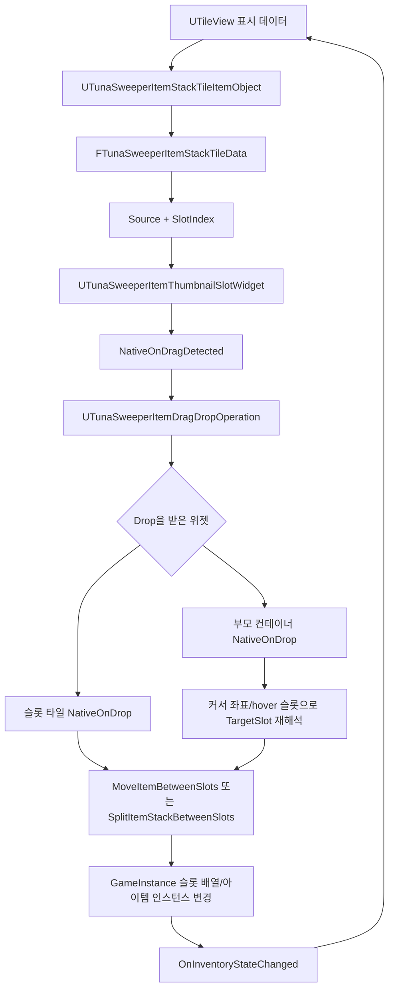
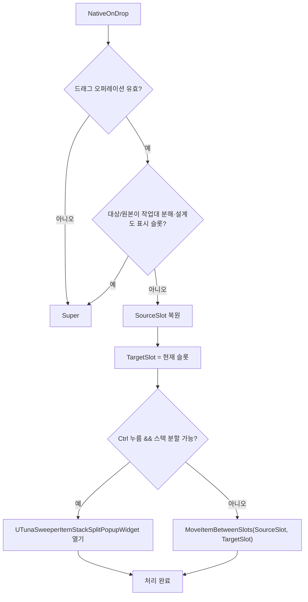
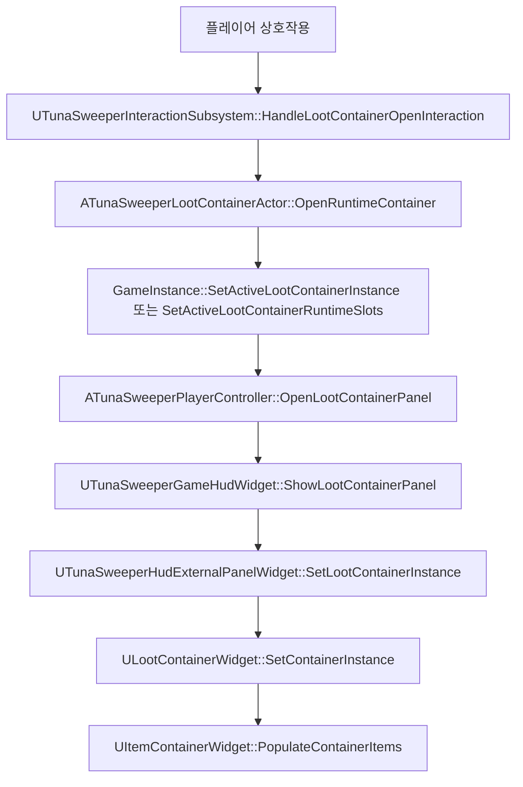
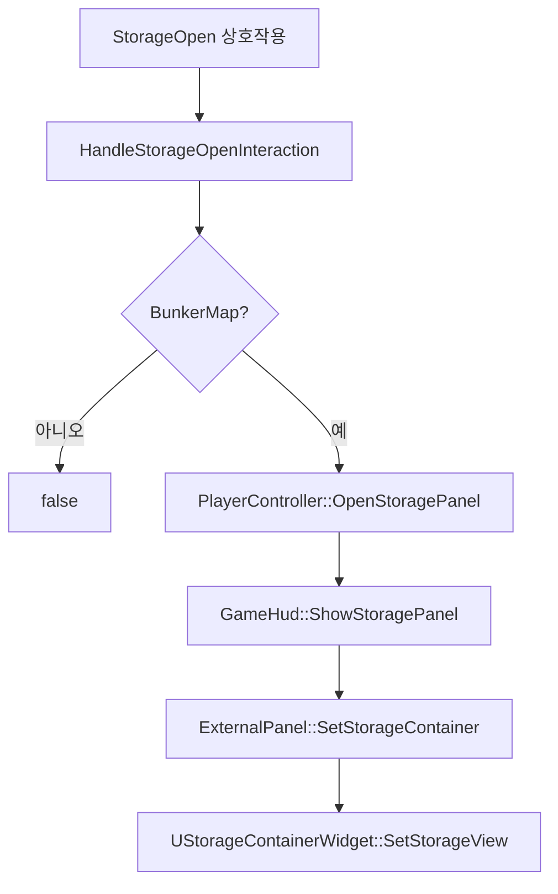
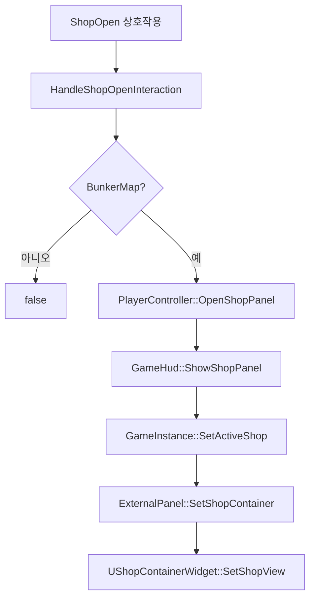
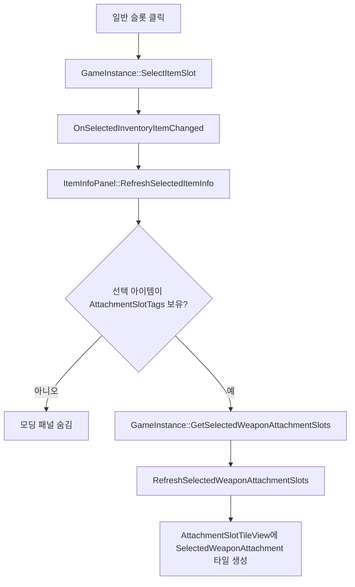
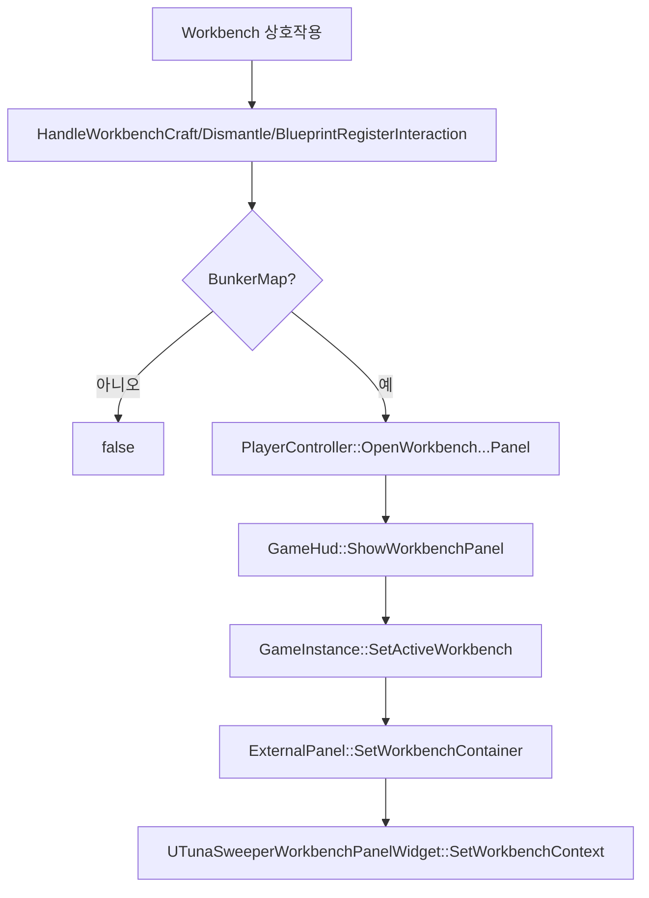

# 아이템 컨테이너 위젯과 드래그/드롭 흐름

이 문서는 아이템을 담거나 표시하는 위젯과 그 사이의 드래그/드롭 구현을 코드 기준으로 정리한다. 사용자가 언급한 전리품, 상점, 인벤토리, 장비칸, 보조가방 외에도 코드상 누락되기 쉬운 창고, 퀵슬롯, 선택 무기 부착물, 작업대 표시 슬롯까지 함께 다룬다.

## 핵심 결론

아이템 드래그의 기준 데이터는 `FTunaSweeperItemSlotReference`다. UI 위젯은 아이템을 직접 옮기지 않고, 드래그된 타일의 `Source`와 `SlotIndex`를 `UTunaSweeperGameInstance::MoveItemBetweenSlots()` 또는 `SplitItemStackBetweenSlots()`에 넘긴다.

일반적인 슬롯 간 이동 대상은 다음 7개다.

- `Equipment`
- `AuxiliaryBag`
- `Inventory`
- `LootContainer`
- `Storage`
- `SelectedWeaponAttachment`
- `UsableQuickSlot`

상점과 작업대 레시피/분해/설계도 목록은 같은 타일 위젯을 사용하지만, 일반 슬롯 배열에 직접 들어가는 컨테이너가 아니다. 상점은 구매/판매 경로를 쓰고, 작업대는 레시피 선택 또는 분해/설계도 등록 타겟 지정 경로를 쓴다.

## 관련 코드 지도

| 영역 | 파일 | 역할 |
| --- | --- | --- |
| 슬롯 소스 enum | `TunaSweeper/Source/TunaSweeper/Public/Inventory/TunaSweeperInventoryTypes.h` | `ETunaSweeperItemSlotSource`, `FTunaSweeperItemSlotReference`, `FTunaSweeperItemInstance`, `FTunaSweeperInventorySlot` 정의 |
| 드래그 오퍼레이션 | `TunaSweeper/Source/TunaSweeper/Public/UI/TunaSweeperItemDragDropOperation.h` | 드래그 중인 타일 데이터와 마지막 hover 슬롯 저장 |
| 공통 슬롯 타일 | `TunaSweeper/Source/TunaSweeper/Private/UI/TunaSweeperItemThumbnailSlotWidget.cpp` | 마우스 입력, 드래그 시작, hover 하이라이트, 슬롯 직접 drop 처리 |
| 인벤토리/장비/보조가방 | `TunaSweeper/Source/TunaSweeper/Private/UI/TunaSweeperHudInventoryAreaWidget.cpp` | 장비칸, 보조가방, 인벤토리 `TileView` 생성과 부모 drop fallback |
| 전리품/창고/상점 컨테이너 | `TunaSweeper/Source/TunaSweeper/Private/UI/ItemContainerWidget.cpp` | 외부 컨테이너 공통 베이스, 전리품/창고/상점 파생 위젯, 컨테이너 부모 drop fallback |
| 외부 패널 | `TunaSweeper/Source/TunaSweeper/Private/UI/TunaSweeperHudExternalPanelWidget.cpp` | LootingBox/Storage/Shop/Workbench 모드 전환 |
| HUD 패널 진입 | `TunaSweeper/Source/TunaSweeper/Private/UI/TunaSweeperGameHudWidget.cpp` | 인벤토리, 전리품, 창고, 상점, 작업대 패널 표시 |
| 컨테이너 상호작용 | `TunaSweeper/Source/TunaSweeper/Private/Subsystem/TunaSweeperInteractionSubsystem.cpp` | 월드 액터 상호작용을 HUD 패널 열기로 연결 |
| 루팅 컨테이너 액터 | `TunaSweeper/Source/TunaSweeper/Private/Interaction/TunaSweeperLootContainerActor.cpp` | 열린 전리품 컨테이너 런타임 슬롯 생성/유지 |
| 선택 아이템/부착물 패널 | `TunaSweeper/Source/TunaSweeper/Private/UI/TunaSweeperHudItemInfoPanelWidget.cpp` | 선택 무기 부착물 슬롯 표시와 drop 처리 |
| 퀵슬롯 설정 패널 | `TunaSweeper/Source/TunaSweeper/Private/UI/TunaSweeperGameHudWidget.cpp` | 인벤토리 모드 안의 `UsableQuickSlot` 타일 생성 |
| 작업대 패널 | `TunaSweeper/Source/TunaSweeper/Private/UI/TunaSweeperWorkbenchPanelWidget.cpp` | 제작 레시피, 분해 후보, 설계도 등록 후보와 타겟 drop |
| 최종 이동 규칙 | `TunaSweeper/Source/TunaSweeper/Private/Game/TunaSweeperGameInstance.cpp` | `CanMoveItemBetweenSlots()`, `MoveItemBetweenSlots()`, `CanSplitItemStackBetweenSlots()`, `SplitItemStackBetweenSlots()` |

## 전체 구조

## 슬롯 소스 전체 목록

| Source | 실제 슬롯 배열 | 대표 UI | 드래그 시작 | Drop 대상 | 비고 |
| --- | --- | --- | --- | --- | --- |
| `Equipment` | `EquipmentSlots` | 장비칸 | 가능 | 가능 | 총기/근접/머리/몸/얼굴/이어폰/가방 등 장비 호환성 검사 |
| `AuxiliaryBag` | `AuxiliaryBagSlots` | 보조가방 | 가능 | 가능 | 별도 호환성 제한은 없고 일반 슬롯처럼 이동 |
| `Inventory` | `PlayerInventorySlots` | 기본 인벤토리 | 가능 | 가능 | 배낭 장비에 따라 용량이 바뀜 |
| `LootContainer` | `ActiveLootContainerSlots` | 전리품 컨테이너 | 가능 | 가능 | 활성 루팅 컨테이너가 있을 때만 슬롯 배열 유효 |
| `Storage` | `StorageSlots` | 창고 | 가능 | 가능 | 필터 탭에서는 표시 인덱스를 실제 창고 슬롯으로 매핑 |
| `Shop` | 없음 | 상점 판매 목록 | 불가 | 불가 | 구매는 `TryBuyActiveShopSlot()` 경로 |
| `WorkbenchRecipe` | 없음 | 작업대 제작 레시피 | 불가 | 불가 | 레시피 선택/제작 버튼 경로 |
| `WorkbenchDismantleItem` | 실제 원본 슬롯 참조를 들고 있는 후보 목록 | 작업대 분해 후보 | 슬롯 타일 기준으로는 마우스 down에서 선택 처리만 함 | 일반 이동 불가, 작업대 타겟 drop 가능 | `SelectedDismantleSlot` 지정 |
| `WorkbenchBlueprintItem` | 실제 원본 슬롯 참조를 들고 있는 후보 목록 | 작업대 설계도 후보 | 슬롯 타일 기준으로는 마우스 down에서 선택 처리만 함 | 일반 이동 불가, 작업대 타겟 drop 가능 | `SelectedBlueprintSlot` 지정 |
| `SelectedWeaponAttachment` | `SelectedWeaponAttachmentSlots` | 아이템 정보 패널의 부착물 슬롯 | 가능 | 가능 | 선택된 무기 인스턴스의 `AttachmentSlots`와 동기화 |
| `UsableQuickSlot` | `UsableQuickSlots` | 인벤토리 모드 퀵슬롯 설정 패널 | 가능 | 가능 | 소비/투척 아이템만 허용 |

## 공통 타일 데이터

`FTunaSweeperItemStackTileData`는 모든 아이템 타일의 표시/동작 데이터를 한 곳에 모은다.

- `ItemStack`, `ItemInstance`: 수량, 아이템 ID, 인스턴스 상태.
- `DisplayName`, `DescriptionText`, `ItemDefinition`, `IconTexture`: UI 표시 정보.
- `Source`, `SourceIndex`, `SlotReference`: 드래그/드롭의 실제 원본 슬롯.
- `ShopId`, `ShopStockQuantity`, `ShopPrice`: 상점 표시 전용 정보.
- `WorkbenchRecipeId`, `WorkbenchIngredientText`, `WorkbenchDismantleResultText`, `WorkbenchBlueprintRecipeId`: 작업대 표시/액션 전용 정보.
- `bIsEmpty`, `bShowEmptySlotLabel`, `bSortLocked`: 빈칸 표시와 정렬 잠금 상태.

`UTunaSweeperItemStackTileItemObject`는 이 데이터를 `UTileView`에 넣기 위한 `UObject` 래퍼다. 각 `TileView` entry가 `UTunaSweeperItemThumbnailSlotWidget`로 표시되면, `NativeOnListItemObjectSet()`에서 타일 데이터를 받아 `CachedTileData`에 저장한다.

## 공통 슬롯 위젯 동작

`UTunaSweeperItemThumbnailSlotWidget`는 대부분의 아이템 칸이 공유하는 entry 위젯이다.

### 마우스 down

| 조건 | 동작 |
| --- | --- |
| 빈칸 | 상위 위젯 처리로 넘김 |
| `Shop` 또는 `WorkbenchRecipe` | `Handled`만 반환하고 드래그 감지 시작 안 함 |
| 그 외 아이템 칸 | `DetectDragIfPressed()`로 좌클릭 드래그 감지 시작 |

### 마우스 up

| 조건 | 동작 |
| --- | --- |
| `Shop`, `WorkbenchRecipe`, `WorkbenchDismantleItem`, `WorkbenchBlueprintItem` | 클릭 처리만 하고 일반 선택 갱신은 하지 않음 |
| 드래그 직후 suppress 플래그 있음 | 선택 갱신 없이 종료 |
| 일반 슬롯 | `UTunaSweeperGameInstance::SelectItemSlot(GetCachedSlotReference())` 호출 |
| `SelectedWeaponAttachment` | 선택 슬롯으로 갱신하지 않음 |

### 드래그 시작

`NativeOnDragDetected()`는 다음 조건을 통과해야 `UTunaSweeperItemDragDropOperation`을 만든다.

| 조건 | 결과 |
| --- | --- |
| 빈칸 | 드래그 없음 |
| `Shop` 또는 `WorkbenchRecipe` | 드래그 없음 |
| 그 외 아이템 칸 | `TileData`를 담은 `UTunaSweeperItemDragDropOperation` 생성 |

드래그 오퍼레이션에는 `HoveredSlotReference`와 `bHasHoveredSlotReference`가 있다. 이는 drop 이벤트가 실제 슬롯 위젯이 아니라 부모 패널로 들어오는 경우를 보완하기 위한 값이다.

### drag enter/over/leave

`CanAcceptDragOperation()`가 `GameInstance->CanMoveItemBetweenSlots(SourceSlot, TargetSlot)`를 호출한다. 가능하면 슬롯 하이라이트를 켜고, 현재 슬롯을 `DragDropOperation->HoveredSlotReference`에 기록한다. 불가능하면 하이라이트를 끄고, 이 슬롯이 마지막 hover 슬롯이었다면 hover 기록도 지운다.

### 슬롯 위젯이 직접 drop을 받은 경우

## 부모 패널 drop fallback

UMG/Slate에서는 마우스를 슬롯 위에서 놓아도 `NativeOnDrop()`이 항상 그 슬롯 entry로 들어오지 않는다. 그래서 인벤토리 영역과 외부 컨테이너 영역, 아이템 정보 패널은 부모 위젯에서도 drop을 처리한다.

부모 fallback의 공통 순서는 다음과 같다.

1. `UTunaSweeperItemDragDropOperation`인지 확인한다.
2. 커서의 screen position을 해당 `TileView`의 local position으로 변환한다.
3. entry width/height, column count, scroll offset을 사용해 화면상 슬롯 인덱스를 계산한다.
4. 화면 슬롯 인덱스를 실제 `FTunaSweeperItemSlotReference`로 변환한다.
5. Ctrl이면 스택 분할 팝업을 먼저 시도한다.
6. 아니면 `MoveItemBetweenSlots()`를 호출한다.
7. 커서 좌표 계산이 실패하면 `HoveredSlotReference` fallback으로 한 번 더 이동을 시도한다.

이 구조 때문에 “hover 하이라이트는 보이는데 drop이 안 됨” 문제를 추적할 때는 슬롯 위젯의 `NativeOnDrop()`만 보면 부족하다. 부모 위젯의 `NativeOnDrop()`이 실제 drop을 받은 경우를 같이 확인해야 한다.

## 인벤토리/장비칸/보조가방

담당 위젯은 `UTunaSweeperHudInventoryAreaWidget`다.

| UI | TileView | Source | 데이터 |
| --- | --- | --- | --- |
| 장비칸 | `EquipmentReserveTileView` | `Equipment` | `GetEquipmentSlots()` |
| 보조가방 | `AuxiliaryBagTileView` | `AuxiliaryBag` | `GetAuxiliaryBagSlots()` |
| 인벤토리 | `InventoryTileView` | `Inventory` | `GetInventorySlots()` |

`RefreshInventoryItems()`가 각 슬롯 배열을 `PopulateTileView()`로 보내고, 각 슬롯을 `FTunaSweeperItemStackTileData`로 만든다. 장비칸은 `bShowEmptySlotLabel = true`이고, 슬롯 이름은 총기 1/총기 2/근접/머리/신체/얼굴/이어폰/가방으로 표시된다.

인벤토리 영역 부모 drop은 `TryResolveDropSlotFromCursor()`에서 다음 순서로 검사한다.

1. 장비칸 `EquipmentReserveTileView`
2. 보조가방 `AuxiliaryBagTileView`
3. 인벤토리 `InventoryTileView`

장비칸으로 drop하면 `CanSlotAcceptItem()`이 `IsItemCompatibleWithEquipmentSlot()`을 호출한다. 장비 슬롯은 슬롯별 장비 태그/카테고리와 맞아야 하며, 가방 슬롯은 배낭 아이템이면 허용된다. 배낭을 바꾸거나 빼는 이동은 `CanMoveItemBetweenSlots()`가 이동 후 인벤토리 용량을 시뮬레이션해, 점유된 인벤토리 슬롯이 새 용량을 넘으면 거부한다.

보조가방은 별도 장비 호환성 검사가 없고 일반 슬롯처럼 이동한다.

## 전리품 컨테이너

월드 루팅 상자는 `ATunaSweeperLootContainerActor`와 `ULootContainerWidget`가 담당한다.

`LootContainer` 슬롯 배열은 `ActiveLootContainerSlots`다. 활성 컨테이너가 없으면 `GetMutableSlotsForSource(LootContainer)`가 `nullptr`을 반환하므로 이동 대상이 될 수 없다.

전리품에서 다른 슬롯으로 아이템이 이동하면 `MoveItemBetweenSlots()`가 `bAcquiredFromLootContainer`를 true로 잡는다. 이동/병합/분할이 성공하면 다음 후처리를 한다.

- `MarkItemEverAcquired()`
- `QuestSubsystem->NotifyItemAcquired()`
- `AddRaidExperienceForItem()`
- `MarkItemStateMutationForSave()`

전리품 컨테이너는 닫힐 때도 상태를 잃지 않도록 `ATunaSweeperLootContainerActor`가 `OnInventoryStateChanged`와 `OnActiveLootContainerUiClosed`를 통해 런타임 슬롯을 다시 캡처한다.

## 창고

창고는 사용자가 처음 언급한 목록에는 없지만 실제 컨테이너로 존재한다. `UStorageContainerWidget`가 담당하고, 외부 패널 모드는 `Storage`다.

진입 경로는 다음과 같다.

창고는 `StorageSlots`를 보여준다. `All` 필터에서는 실제 창고 슬롯 배열 전체가 그대로 표시된다. 카테고리 필터가 켜지면 `VisibleStorageSlotIndices`를 만들어 일치하는 아이템만 압축 표시한다.

필터 탭에서 주의할 점은 다음과 같다.

| 상태 | 화면 인덱스 | 실제 슬롯 |
| --- | --- | --- |
| `All` | 화면 0번 = `StorageSlots[0]` | 동일 |
| 카테고리 필터 | 화면 0번 = `VisibleStorageSlotIndices[0]` | 다를 수 있음 |

그래서 `TryResolveCompactedDropSlotFromCursor()`는 화면상 슬롯을 먼저 구한 뒤 `VisibleStorageSlotIndices`로 실제 `StorageSlots` 인덱스를 다시 변환한다. 이 매핑이 깨지면 필터 탭에서 다른 슬롯으로 drop되는 문제가 생긴다.

## 상점

상점은 `UShopContainerWidget`가 표시하지만 일반 드래그 컨테이너는 아니다.

진입 경로는 다음과 같다.

상점 타일은 `BuildShopTileData()`에서 `Source = Shop`으로 만들어진다. 하지만 `UTunaSweeperItemThumbnailSlotWidget::NativeOnMouseButtonDown()`과 `NativeOnDragDetected()`가 `Shop`을 드래그 시작 대상에서 제외한다. `UItemContainerWidget::NativeOnDrop()`도 패널의 `SlotSource == Shop`이면 drop을 처리하지 않는다.

구매는 `UTunaSweeperGameInstance::TryBuyActiveShopSlot()` 경로다.

| 분기 | 동작 |
| --- | --- |
| 활성 상점 아이템 없음 | 실패 |
| 재고 0 이하 | 실패 |
| 코인 부족 | 실패 |
| 상점 아이템 정의 없음 | 실패 |
| 인벤토리에 추가 실패 | 실패 |
| 성공 | `AddItemToFirstAvailableInventorySlot()`, 재고 감소, 코인 차감, 인벤토리 변경 브로드캐스트, 저장 dirty 처리 |

판매는 `UTunaSweeperShopSellPanelWidget`가 선택된 보유 아이템의 판매 UI를 보여주고, 상점 패널이 열려 있을 때 선택 아이템 기준으로 처리된다. 판매는 상점 슬롯으로 드래그해 넣는 구조가 아니다.

## 퀵슬롯

퀵슬롯도 누락되기 쉬운 컨테이너다. 코드상 소스는 `UsableQuickSlot`이고 실제 배열은 `UsableQuickSlots`다.

표시가 두 군데로 나뉜다.

| UI | 역할 |
| --- | --- |
| `UTunaSweeperHudQuickSlotBarWidget` | 플레이 중 하단 HUD 표시 |
| `InventoryQuickSlotPanel` 안의 `UTunaSweeperItemThumbnailSlotWidget` | 인벤토리 모드에서 아이템을 드래그해 퀵슬롯을 설정하는 드롭 대상 |

`UTunaSweeperGameHudWidget::BuildQuickSlotTileData()`가 `Source = UsableQuickSlot` 타일을 만들고, `RefreshInventoryQuickSlotPanel()`이 각 퀵슬롯 위젯에 세팅한다.

`CanSlotAcceptItem()`은 `UsableQuickSlot` 대상일 때 `IsItemCompatibleWithUsableQuickSlot()`을 호출한다. 허용되는 카테고리는 다음 둘이다.

- 소비 아이템: `item.category.consumable`
- 투척 아이템: `item.category.throwable`

무기, 장비, 탄약, 재료 등은 퀵슬롯으로 drop할 수 없다.

## 선택 무기 부착물 슬롯

선택 아이템 정보 패널 안의 모딩 영역은 `SelectedWeaponAttachment` 소스를 사용한다. 담당 위젯은 `UTunaSweeperHudItemInfoPanelWidget`다.

흐름은 다음과 같다.

부착물 슬롯으로 drop하면 `CanSlotAcceptItem()`이 `IsItemCompatibleWithSelectedWeaponAttachmentSlot()`을 호출한다. 다음 조건을 모두 만족해야 한다.

- 선택 무기에 해당 부착 슬롯 태그가 있어야 한다.
- 드롭한 아이템 정의의 `AttachmentSlotTag`가 슬롯 태그와 같아야 한다.
- 부착물의 `CompatibleWeaponTypeTags`가 비어 있거나, 선택 무기의 `WeaponTypeTag`를 포함해야 한다.

부착물 슬롯 간 이동이나 부착물 제거/교체가 성공하면 `CommitSelectedWeaponAttachmentSlotsToSelectedItem()`이 선택 무기 인스턴스의 `AttachmentSlots` 맵에 결과를 다시 쓴다.

추가로 일반 아이템 슬롯 위에 부착물을 바로 drop하는 경로도 있다. `TryResolveItemAttachmentDrop()`은 원본 아이템이 부착물이고 대상 슬롯의 아이템이 그 부착물을 받을 수 있는 무기라면, 일반 swap보다 먼저 `ApplyItemAttachmentDrop()`을 수행한다. 대상 무기에 같은 부착 슬롯이 이미 있으면 기존 부착물을 원본 슬롯으로 되돌리고, 없으면 원본 슬롯을 비운다.

## 작업대 컨테이너

작업대는 외부 패널 모드 `Workbench`를 사용한다. 코드상 아이템 소스는 세 가지가 있다.

| Source | 모드 | 의미 | 일반 슬롯 이동 |
| --- | --- | --- | --- |
| `WorkbenchRecipe` | Craft | 제작 레시피 출력 아이템 표시 | 불가 |
| `WorkbenchDismantleItem` | Dismantle | 인벤토리/창고에서 분해 가능한 후보 표시 | 불가 |
| `WorkbenchBlueprintItem` | BlueprintRegister | 등록 가능한 설계도 후보 표시 | 불가 |

진입 경로는 벙커 전용이다.

작업대 분해/설계도 모드는 drop을 지원하지만 일반 이동이 아니다.

| 모드 | Drop 위치 | 검증 | 성공 시 |
| --- | --- | --- | --- |
| Dismantle | `DismantleSelectedItemDropZone` 또는 선택 타일 영역 | `TryGetWorkbenchDismantleCandidateFromSlot()`로 후보인지 확인 | `SelectedDismantleSlot`과 `FocusedDismantleCandidateSlot` 갱신 |
| BlueprintRegister | `BlueprintSelectedItemDropZone` 또는 선택 타일 영역 | `TryGetSlotItemInstance()`와 설계도 등록 가능 여부 확인 | `SelectedBlueprintSlot`과 `FocusedBlueprintSlot` 갱신 |

실제 분해/등록은 drop 시점에 바로 실행되지 않고, `ExecuteSelectedWorkbenchAction()`에서 버튼 클릭으로 실행된다.

## 드래그 이동 최종 규칙

`UTunaSweeperGameInstance::CanMoveItemBetweenSlots()`가 이동 가능 여부를 최종 판단한다.

| 분기 | 결과 |
| --- | --- |
| 원본/대상 슬롯이 invalid | 실패 |
| 같은 슬롯 | 실패 |
| 슬롯 배열이 없거나 인덱스 범위 밖 | 실패 |
| 원본 슬롯이 비어 있음 | 실패 |
| 부착물 직접 drop으로 해석 가능 | 기존 부착물 swap 가능 여부만 확인 후 성공 |
| 같은 아이템 스택이고 대상 스택에 여유 있음 | 성공 |
| 같은 아이템 스택이지만 대상 스택이 가득 참 | 실패 |
| 대상 슬롯이 원본 아이템을 받지 못함 | 실패 |
| 대상에 아이템이 있고 원본 슬롯이 대상 아이템을 받지 못함 | 실패 |
| 이동 후 배낭 용량 축소로 인벤토리 overflow 발생 | 실패 |
| 그 외 | 성공 |

`MoveItemBetweenSlots()`는 `CanMoveItemBetweenSlots()`가 true를 반환한 뒤 실제 변경을 한다. 실행 순서는 크게 다음과 같다.

1. 원본/대상 슬롯 배열을 찾는다.
2. 루팅 컨테이너에서 가져오는 이동인지 기록한다.
3. 부착물 직접 drop이면 `ApplyItemAttachmentDrop()`을 먼저 시도한다.
4. 스택 병합 가능하면 `TryMergeItemStacksBetweenSlots()`를 수행한다.
5. 대상이 빈칸이고 원본 수량이 max stack보다 많으면 max stack만 새 인스턴스로 떼어 이동한다.
6. 일반 swap 또는 move를 수행한다.
7. 선택 무기 부착물 슬롯이 관련되면 `CommitSelectedWeaponAttachmentSlotsToSelectedItem()`을 호출한다.
8. 장비 변경 후 인벤토리 용량을 다시 계산하고 슬롯 배열 크기를 맞춘다.
9. 전리품 획득이면 획득 기록/퀘스트/레이드 경험치를 반영한다.
10. `BroadcastInventoryStateChanged()`와 저장 dirty 처리를 한다.

## Ctrl 드래그 분할

슬롯 위젯이나 부모 컨테이너의 drop 처리에서 Ctrl 키가 눌려 있으면 `UTunaSweeperItemStackSplitPopupWidget::TryOpenStackSplitPopup()`을 먼저 시도한다.

`CanSplitItemStackBetweenSlots()`의 조건은 다음과 같다.

| 조건 | 설명 |
| --- | --- |
| 원본/대상 슬롯 유효 | 둘 다 실제 슬롯 배열에 있어야 함 |
| 같은 슬롯 아님 | 자기 자신으로 분할 불가 |
| 원본 아이템 존재 | 원본 슬롯이 비어 있으면 실패 |
| 대상 슬롯 비어 있음 | 대상에 아이템이 있으면 분할 대신 일반 이동/병합 대상 |
| 원본 수량 2 이상 | 1개짜리는 분할 불가 |
| 인스턴스 상태 없음 | 부착물, 장전 탄약, 선택 탄종 등이 있으면 분할 불가 |
| 대상 슬롯 호환 | 장비/퀵슬롯/부착물 슬롯이면 해당 호환성 통과 필요 |

확인 팝업에서 수량을 정하면 `SplitItemStackBetweenSlots()`가 원본 수량을 줄이고 새 아이템 인스턴스를 만들어 대상 슬롯에 넣는다. 전리품 컨테이너에서 플레이어 쪽으로 분할 획득한 경우에도 퀘스트/레이드 경험치 획득 처리가 실행된다.

## 표시 인덱스와 실제 슬롯 인덱스

대부분의 슬롯은 화면 인덱스와 실제 슬롯 인덱스가 같다. 예외는 창고 필터와 작업대 후보 목록이다.

| UI | 화면 인덱스 | 실제 이동 기준 |
| --- | --- | --- |
| 장비/보조가방/인벤토리 | 동일 | `SourceIndex` |
| 전리품 | 동일 | `ActiveLootContainerSlots[SourceIndex]` |
| 창고 All | 동일 | `StorageSlots[SourceIndex]` |
| 창고 카테고리 필터 | 다를 수 있음 | `VisibleStorageSlotIndices[DisplayIndex]` |
| 상점 | 상점 슬롯 인덱스 | 구매용 `ShopSlotIndex`, 이동 슬롯 아님 |
| 작업대 분해/설계도 | 후보 목록 인덱스와 원본 슬롯 참조가 분리됨 | `TileData.SlotReference`에 든 실제 원본 슬롯 |
| 선택 무기 부착물 | 부착 슬롯 표시 인덱스 | `SelectedWeaponAttachmentSlotTags[SlotIndex]` |

드래그 버그를 추적할 때는 `SourceIndex`보다 `SlotReference`가 우선이다. 코드도 `SlotReference.IsValid()`이면 그것을 쓰고, 없을 때만 `Source + SourceIndex`로 복원한다.

## 패널 표시 분기

| 요청 | 코드 경로 | 맵 제한 | 표시되는 외부 패널 |
| --- | --- | --- | --- |
| 인벤토리 키 | `GameHud::ShowInventoryOnlyPanel()` | 벙커면 창고로 우회 | 일반 HUD 인벤토리 영역 |
| 전리품 열기 | `OpenLootContainerPanel()` | 코드상 별도 벙커 제한 없음 | `LootingBox` |
| 창고 열기 | `OpenStoragePanel()` | `BunkerMap` 필요 | `Storage` |
| 상점 열기 | `OpenShopPanel()` | `BunkerMap` 필요 | `Shop` |
| 작업대 열기 | `OpenWorkbench...Panel()` | `BunkerMap` 필요 | `Workbench` |

`UTunaSweeperHudExternalPanelWidget`는 `LootContainerWidget`, `StorageContainerWidget`, `ShopContainerWidget`, `WorkbenchPanelWidget`을 갖는다. 별도 창고/상점/작업대 위젯이 없는 오래된 HUD 블루프린트 호환을 위해 `LootContainerWidget`이 `SetStorageView()`, `SetShopView()`, `SetWorkbenchView()`를 대신 처리하는 fallback도 남아 있다.

## 드롭 실패를 볼 때의 체크리스트

1. 드래그가 시작되는 소스인가: `Shop`, `WorkbenchRecipe`는 시작하지 않는다.
2. 타일의 `bIsEmpty`가 false인가.
3. `TileData.SlotReference`가 유효한가. 유효하지 않으면 `SourceIndex`가 맞는가.
4. drop을 슬롯 위젯이 받았는가, 부모 패널이 받았는가.
5. 부모 패널에서 `ScreenSpacePosition -> TileView local position` 변환이 맞는가.
6. 스크롤이 있는 `TileView`라면 `GetScrollOffset()`이 슬롯 계산에 반영되는가.
7. 창고 필터 탭이라면 화면 인덱스가 `VisibleStorageSlotIndices`로 실제 슬롯에 매핑되는가.
8. `CanMoveItemBetweenSlots()`가 실패한다면 장비/퀵슬롯/부착물 호환성 문제인지 확인한다.
9. 배낭 장비 변경이면 이동 후 인벤토리 용량 overflow가 생기는지 확인한다.
10. Ctrl 분할이면 대상 슬롯이 비어 있고 원본 아이템에 부착물/장전 탄약 같은 per-instance 상태가 없는지 확인한다.
11. 전리품 획득인데 퀘스트/경험치가 안 오르면 `SourceSlot.Source == LootContainer && TargetSlot.Source != LootContainer` 조건을 확인한다.
12. 작업대 분해/설계도 drop이면 일반 `MoveItemBetweenSlots()`가 아니라 `AssignDismantleCandidateToTarget()` 또는 `AssignBlueprintItemToTarget()`가 호출되는지 확인한다.

## 구현상 주의점

- 새 컨테이너를 추가할 때는 `ETunaSweeperItemSlotSource`만 늘리면 끝나지 않는다. `GetMutableSlotsForSource()`, `GetSlotsForSource()`, 타일 생성 코드, 부모 drop 좌표 해석, `CanSlotAcceptItem()` 호환성 검사를 함께 추가해야 한다.
- 이동 가능한 컨테이너라면 `UTunaSweeperItemThumbnailSlotWidget`의 `CanAcceptDragOperation()`에서 `CanMoveItemBetweenSlots()`가 true를 반환할 수 있어야 hover 하이라이트가 켜진다.
- 표시 전용 컨테이너라면 상점/작업대처럼 드래그 시작과 drop 처리를 명시적으로 차단하거나 별도 액션 경로를 둬야 한다.
- `OnInventoryStateChanged`는 대부분의 슬롯 UI를 다시 그리는 핵심 이벤트다. 이동은 됐는데 UI가 갱신되지 않으면 성공 경로에서 브로드캐스트가 빠졌는지 확인한다.
- 선택 무기 부착물 슬롯은 선택 아이템에 종속된 임시 view다. 실제 저장 대상은 선택 무기 인스턴스의 `AttachmentSlots` 맵이므로, 관련 이동 후 `CommitSelectedWeaponAttachmentSlotsToSelectedItem()`가 필요하다.
