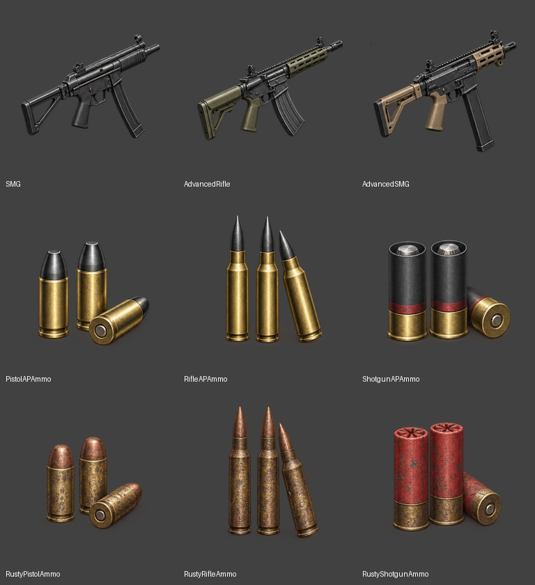

# 아이템 아이콘 교체 — 2026-09-26

`ItemTable.json`과 `ItemNameStrings.csv`의 설명을 확인하여 기본 도형으로 그려진 아이템 아이콘 9개를 교체했다.

| 에셋 접미사 | 아이템 ID | 설명에 따른 표현 |
| --- | --- | --- |
| SMG | 1006 | 빠른 재장전과 짧은 점사에 적합한 기본 기관단총. 짧은 총열과 접이식 개머리판. |
| AdvancedRifle | 1007 | 탄창·재장전 성능이 개선된 돌격소총. 개량된 리시버, 핸드가드와 탄창. |
| AdvancedSMG | 1008 | 고급 부품으로 지속 화력이 강화된 기관단총. 현대적인 핸드가드와 확장 탄창. |
| PistolAPAmmo | 2012 | 관통력을 높인 권총탄. 짧은 황동 탄피와 검은 금속 탄두. |
| RifleAPAmmo | 2022 | 관통력을 높인 소총탄. 긴 병목 탄피와 뾰족한 검은 탄두. |
| ShotgunAPAmmo | 2032 | 단단한 표적에 강한 산탄총 철갑탄. 굵은 검은 탄피와 금속 슬러그. |
| RustyPistolAmmo | 2011 | 상태가 나빠 위력이 낮은 권총탄. 짧은 탄피와 부식된 표면. |
| RustyRifleAmmo | 2021 | 상태가 나빠 위력이 낮은 소총탄. 긴 병목 탄피와 부식된 표면. |
| RustyShotgunAmmo | 2031 | 상태가 나빠 위력이 낮은 산탄. 빛바랜 붉은 탄피와 부식된 황동 밑부분. |

## 생성과 처리

- 내장 `image_gen`으로 3×3 시트 한 장을 생성했다. 순서는 위 표와 같다.
- 생성 도구가 반환한 RGBA의 네이티브 알파를 보존했다. 초기에는 당시 지침에 따라 배경 쌍으로 검산했으나, 작업 중 갱신된 지침에 맞춰 해당 중간 파일을 제거했다. 분리 전 시트의 알파와 불투명도가 0보다 큰 픽셀의 RGB가 생성 원본과 동일함을 확인했다.
- 실제 출력 크기는 1254×1254다. 피사체 경계에 맞춰 분리한 뒤 256×256 투명 캔버스에 최대 216×216 크기로 중앙 배치했다.
- 게임 임포트 원본과 문서 이미지는 같은 `Images/icons/T_UIIcon_*.png`를 사용한다. 기존 `/Game/UI/Icons/T_UIIcon_*` 경로를 유지했다.
- 네이티브 투명 생성 원본 `Source.png`와 미리보기는 `GeneratedImages/ItemIconRefresh/`에 보관한다.
- 프로젝트 UI 텍스처 임포트 경로를 사용했다. 초기화 도중 즉시 종료하는 옵션에서 충돌이 발생하여, 에디터 초기화 후 종료하도록 실행했다.

## 생성 프롬프트

아래 공통 프롬프트에 위 표의 대상별 특징을 추가했다.

> Create a polished video game inventory icon sprite sheet, exactly 3 columns by 3 rows. No grid lines, labels or lettering. Detailed hand-painted semi-realistic 3D survival RPG item illustrations with grounded steel, brass and polymer, controlled broad highlights, clear form and depth. Not flat vector art or basic polygon placeholders. Avoid glitter and tiny speckles. Keep each object completely inside its cell with padding. Perfectly flat muted mauve background #7A6B78; no gradient, floor, cast shadow, reflection, texture, border or watermark. Do not use the background color inside items. Opaque objects with crisp silhouettes. Guns in three-quarter side view, buttstock lower-left to muzzle upper-right. Ammo in groups of three with distinct pistol, rifle and shotgun proportions. Soft upper-left key light; readable at 64 pixels. Pristine dark projectile tips and brass on armor-piercing ammo; brown tarnish/corrosion and faded hulls on low-grade ammo.

## 미리보기

## 검증

- 문서의 PNG 75개 디코딩과 링크를 확인했다. 교체 이미지 9개는 256×256 RGBA이며 가장자리에 투명 여백을 유지한다.
- 별도 Unreal Python commandlet이 종료 코드 0으로 9개 에셋을 다시 로드했다. UI LOD 그룹, sRGB, EditorIcon 압축, NoMipmaps 설정을 확인했다.
- 에셋에서 다시 익스포트한 PNG 9개가 문서 이미지와 픽셀 단위로 일치했다.
- 일부 임포트 프로세스는 저장 및 종료 로그 이후 비정상 종료 코드를 반환했다. 저장 결과는 위 독립 검증으로 확인했다. 게임 화면에서의 실제 표시 검증은 수행하지 않았다.
