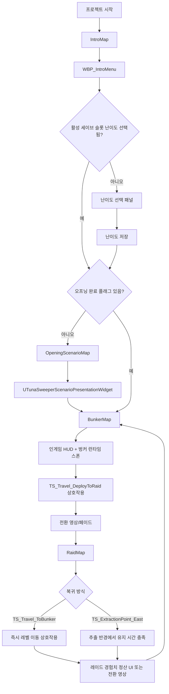

# 인트로/벙커/레이드 전환 코드 흐름

이 문서는 `IntroMap`, `OpeningScenarioMap`, `BunkerMap`, `RaidMap` 사이의 런타임 전환 흐름과 분기별 동작을 코드 기준으로 정리한다. 전환 문제를 추적할 때는 `PlayerController`의 맵 분기, `GameInstance`의 세이브/시나리오 플래그, 월드 상호작용 액터, 레벨 전환 서브시스템 순서로 확인하면 된다.

## 빌드별 시작 및 레이드 역할

Demo 새 게임은 타이틀의 Demo 안내 확인 전까지 세이브를 만들지 않는다. 확인과 슬롯 1 저장이 성공하면 프롤로그/인트로 영상 없이 공유 `BunkerMap`으로 직접 이동하고 벙커 진입 페이드와 Demo 스토리 연출을 시작한다. 기존 Demo 슬롯을 계속할 때는 벙커로 직접 복귀하되 첫 진입 연출을 강제로 다시 예약하지 않는다.

Main의 난이도 선택과 manifest 기반 초기 맵 흐름은 유지된다. 레이드 이동 데이터는 호환성을 위해 논리 이름 `RaidMap`을 계속 사용할 수 있으며 런타임이 Demo에서는 `DemoRaidMap`, Main에서는 Main 레이드 역할 맵으로 변환한다. 레이드 경험치, 저장 전환, 퀘스트 맵 비교와 지도 정의도 같은 역할 판정을 사용한다.

## 전체 흐름

## 주요 코드 위치

| 역할 | 코드/데이터 |
| --- | --- |
| 기본 시작 맵, 기본 GameMode | `TunaSweeper/Config/DefaultEngine.ini` |
| 기본 Pawn/PlayerController 지정 | `Source/TunaSweeper/Private/Game/TunaSweeperGameMode.cpp` |
| 맵별 최초 UI 분기 | `Source/TunaSweeper/Private/Player/TunaSweeperPlayerController.cpp` |
| 타이틀 메뉴 UI, 세이브/난이도/시작 처리 | `Source/TunaSweeper/Private/UI/TunaSweeperIntroMenuWidget.cpp` |
| 세이브 슬롯, 난이도, 오프닝 완료 플래그 | `Source/TunaSweeper/Private/Game/TunaSweeperGameInstance.cpp` |
| 오프닝 독백/영상 후 벙커 이동 | `Source/TunaSweeper/Private/UI/TunaSweeperScenarioPresentationWidget.cpp` |
| 공통 전환 영상/페이드/원형 리빌 | `Source/TunaSweeper/Private/Subsystem/TunaSweeperLevelTransitionSubsystem.cpp` |
| 벙커 런타임 캐릭터 스폰 | `Source/TunaSweeper/Private/Subsystem/TunaSweeperBunkerRuntimeSpawnSubsystem.cpp`, `Content/Data/BunkerCharacterSpawns.json` |
| 레이드/벙커 상호작용 액터 스폰 | `Source/TunaSweeper/Private/Subsystem/TunaSweeperEnemySpawnSubsystem.cpp`, `Content/Data/GameplayInteractionSpawns.json` |
| 벙커/레이드 즉시 레벨 이동 액터 | `Source/TunaSweeper/Private/Interaction/TunaSweeperLevelTravelInteractableActor.cpp` |
| 레이드 추출 지점 | `Source/TunaSweeper/Private/Interaction/TunaSweeperExtractionPointActor.cpp` |
| 레이드 복귀 경험치 정산 UI | `Source/TunaSweeper/Private/Subsystem/TunaSweeperRaidExperienceReturnSubsystem.cpp` |

## 맵 진입 시 PlayerController 분기

`ATunaSweeperPlayerController::BeginPlay()`가 현재 맵 이름으로 첫 UI를 결정한다. 판정은 `GetWorld()->GetMapName().EndsWith(...)` 방식이므로 PIE 접두사가 있어도 끝부분 맵 이름이 맞으면 통과한다.

| 현재 맵 | 동작 |
| --- | --- |
| `IntroMap` | `ApplyInitialTitleDisplaySettings()` 후 다음 틱에 `EnsureIntroMenuWidget()`을 호출한다. `/Game/UI/WBP_IntroMenu`를 `AddToViewport(50)`로 붙이고 `FInputModeUIOnly`로 타이틀 입력 모드를 만든다. 타이틀 BGM도 시작한다. |
| `OpeningScenarioMap` | `EnsureScenarioPresentationWidget()`을 호출한다. `UTunaSweeperScenarioPresentationWidget`을 `AddToViewport(60)`로 붙이고 UI 전용 입력, 이동/시점 입력 무시 상태로 둔다. |
| 그 외 맵 | `ApplyLevelBgmState()`, `EnsureGameHudWidget()`을 실행한다. `BunkerMap`이면 벙커 BGM, `RaidMap`이면 BGM 정지다. 이후 `ShowBunkerEntryFadeIfNeeded()`와 Mole 인트로 대화를 처리한다. |

인게임 HUD는 `/Game/UI/WBP_GameHud`이며 `UTunaSweeperGameHudWidget`이 인벤토리, 지도, 메모, 퀘스트, 외부 패널을 `ETunaSweeperHudMode`로 관리한다.

## 인트로 메뉴 시작 분기

### 시작 버튼

타이틀 메뉴에서 시작 버튼은 `UTunaSweeperIntroMenuWidget::HandleStartClicked()`를 거쳐 `BeginStartTravel(false)`로 들어간다. 디버그/항상 새 시작 버튼은 `BeginStartTravel(true)`를 호출한다.

`BeginStartTravel(bool bAlwaysNewStart)`의 분기는 다음과 같다.

| 조건 | 동작 |
| --- | --- |
| `bStartTravelPending == true` | 이미 전환 중이므로 아무 것도 하지 않는다. 중복 클릭 방지다. |
| `GameInstance` 없음 | `StartTargetLevelName` 기본값인 `BunkerMap`으로 전환을 시도한다. 일반 실행에서는 거의 fallback 경로다. |
| `bAlwaysNewStart == true` | 현재 활성 슬롯을 `DeleteSaveSlotAndStartNewGame()`으로 삭제 후 새 게임 상태로 활성화한다. 삭제/초기화 실패 시 전환하지 않는다. |
| `bAlwaysNewStart == false` | 활성 슬롯 요약을 읽고, 데이터가 없으면 새 게임으로 `ActivateSaveSlot(..., true)`, 데이터가 있으면 기존 슬롯 로드로 `ActivateSaveSlot(..., false)`를 호출한다. |
| 활성 슬롯 난이도 미선택 | `ShowDifficultySelection()`으로 난이도 패널만 열고 전환하지 않는다. |
| 활성 슬롯 난이도 선택됨 | `ResolveInitialGameplayLevelName()`으로 다음 맵을 결정하고 `BeginTravelToLevel()`을 호출한다. |

### 난이도 선택

난이도 패널의 Farming/Normal/Hard 버튼은 각각 `SelectDifficultyStage(1/2/3)`만 수행한다. 실제 시작은 `HandleDifficultyStartClicked()`이다.

`HandleDifficultyStartClicked()`는 `SelectedDifficultyStage`가 유효할 때 `UTunaSweeperGameInstance::SetActiveSaveSlotDifficultyStage()`로 난이도를 저장하고, 다시 `ResolveInitialGameplayLevelName()`으로 목적지를 결정한다.

### 다음 맵 결정

`UTunaSweeperGameInstance::ResolveInitialGameplayLevelName()`의 결과는 다음과 같다.

| 조건 | 반환 맵 |
| --- | --- |
| `bActiveSaveSlotDifficultySelected == false` | `IntroMap` |
| `CompletedScenarioFlags`에 `scenario.opening.awakening` 있음 | `BunkerMap` |
| 난이도는 선택됐지만 오프닝 완료 플래그 없음 | `OpeningScenarioMap` |

즉 첫 플레이는 난이도 선택 후 `OpeningScenarioMap`으로 가고, 오프닝을 본 세이브는 다음부터 `BunkerMap`으로 바로 들어간다.

### 타이틀에서 실제 OpenLevel

`BeginTravelToLevel(FName TargetLevelName)`은 다음 순서로 작동한다.

1. 목적지가 없거나 이미 전환 중이면 중단한다.
2. `bStartTravelPending = true`, `PendingStartTargetLevelName = TargetLevelName`으로 중복 전환을 막는다.
3. 시작/난이도/세이브/설정 버튼을 모두 비활성화한다.
4. 타이틀 BGM을 `StartTransitionFadeSeconds` 동안 fade out한다.
5. `UTunaSweeperScreenFadeWidget`을 만들 수 있으면 검은 화면 fade out 완료 콜백으로 `OpenPendingStartTargetLevel()`을 호출한다.
6. fade 위젯 생성 실패 시 월드 타이머로 같은 함수를 예약한다.
7. 월드도 없으면 즉시 `OpenPendingStartTargetLevel()`을 호출한다.

`OpenPendingStartTargetLevel()`은 pending 상태와 목적지를 다시 검사한 뒤 `UGameplayStatics::OpenLevel(this, TargetLevelName)`을 호출한다.

## OpeningScenarioMap 동작

`OpeningScenarioMap`에서는 일반 HUD가 아니라 `UTunaSweeperScenarioPresentationWidget`만 올라온다. 이 위젯은 코드로 UI를 구성하고, 독백과 오프닝 영상을 순서대로 재생한다.

### 오프닝 위젯 phase

`ETunaSweeperScenarioPresentationPhase`는 다음 순서로 흐른다.

| Phase | 동작 |
| --- | --- |
| `FadeIn` | 검은 화면에서 배경으로 페이드 인한다. 완료되면 `DisplayLine`으로 가고 오프닝 BGM을 시작한다. |
| `DisplayLine` | 시스템 텍스트/독백을 타자기 효과로 표시한다. 현재 줄이 끝나고 최소 표시 시간이 지나면 다음 줄로 간다. |
| `FadeOutBeforeVideo` | 독백 종료 후 검은 화면으로 페이드 아웃한다. |
| `OpeningVideo` | `./Movies/intro.mp4`를 `UFileMediaSource`로 연다. |
| `VideoFadeIn` | 영상이 열리면 영상 표시 상태로 페이드 인한다. |
| `PlayingVideo` | 영상을 재생한다. 종료 1초 전부터 fade out 준비를 한다. |
| `VideoFadeToBlack` | 영상 종료 직전에 검은 화면으로 페이드한다. |
| `WaitingForVideoEnd` | 영상 종료 이벤트 또는 끝 근처 시간이 감지되면 벙커 이동을 마무리한다. |

키 입력/마우스 클릭은 `AdvanceOrFillLine()`으로 독백 줄을 채우거나 다음 줄로 넘기는 용도다. 비디오가 정상적으로 열리지 않거나 필요한 위젯/미디어 객체 생성이 실패하면 `FinishIntroVideoAndTravel()`로 fallback되어 벙커 이동은 계속 진행된다.

### 오프닝 완료 플래그 처리

`TravelToBunker()`는 바로 완료 플래그를 저장하지 않고 `UTunaSweeperGameInstance::BeginScenarioBunkerEntry("scenario.opening.awakening")`를 먼저 호출한다. 이 함수는 `PendingScenarioCompletionFlag`만 설정한다.

그 다음 `UGameplayStatics::OpenLevel(this, "BunkerMap")`으로 벙커를 연다. 벙커가 실제로 로드된 뒤 `ATunaSweeperPlayerController::ShowBunkerEntryFadeIfNeeded()`가 `CompletePendingScenarioBunkerEntryIfNeeded()`를 호출한다. 여기서 pending 플래그가 `CompletedScenarioFlags`에 저장된다.

이 구조 때문에 오프닝 도중 강제 종료되거나 벙커 로드가 완료되지 않으면 오프닝 완료 플래그가 저장되지 않는다.

## BunkerMap 진입 동작

`BunkerMap`에 들어오면 PlayerController는 인게임 맵 분기로 처리된다.

1. `ApplyLevelBgmState()`가 벙커 BGM을 재생한다.
2. `EnsureGameHudWidget()`이 `/Game/UI/WBP_GameHud`를 붙인다.
3. `ShowBunkerEntryFadeIfNeeded()`가 오프닝 완료 pending 플래그가 있는지 확인한다.
4. pending 플래그가 있으면 저장 후 검은 화면 fade in을 보여준다.
5. 오프닝 직후 진입이면 Mole 인트로 대화를 약간 지연해서 시작한다.
6. 일반 벙커 진입이면 Mole 인트로 대화 조건만 바로 확인한다.

벙커 런타임 캐릭터는 `UTunaSweeperBunkerRuntimeSpawnSubsystem`이 `FCoreUObjectDelegates::PostLoadMapWithWorld`를 통해 맵 로드 후 스폰한다. `Content/Data/BunkerCharacterSpawns.json`의 `TS_Bunker_LED_Robot`이 대표 예시다.

## BunkerMap에서 RaidMap으로 전환

벙커에서 레이드로 가는 진입점은 UI 버튼이나 JSON 런타임 스폰이 아니라 `BunkerMap`에 직접 배치한 `BP_Interact_LevelTravel` 상호작용 액터다.

직접 배치 액터는 `Level Travel > Destination` 드롭다운에서 `Raid` 또는 `Bunker`만 선택한다. 액터는 실제 맵 이름이나 영상·위젯·문구·페이드 값을 보유하지 않는다. `UTunaSweeperGameInstance::TryResolveLevelTravel()`이 목적지를 현재 빌드의 실제 맵 이름으로 해석하고, `/Game/Movies/DA_LevelTravelPresentation`에서 전환 연출을 읽는다. Demo의 `Raid`는 `DemoRaidMap`으로 해석되며, `MS_BunkerToRaid` 영상은 DA의 `Raid` 항목에 연결된다.

레벨 이동 전용 JSON 스폰 행은 더 이상 지원하지 않으며, 발견되면 런타임 스포너가 경고 후 건너뛴다. `extraction_point` 등 다른 JSON 기반 상호작용 액터에는 영향을 주지 않는다.

### 플레이어 입력에서 레이드 이동까지

1. 플레이어가 상호작용 입력 `IA_Interact`를 누른다.
2. `ATunaSweeperTopDownCharacter::HandleInteract()`가 호출된다.
3. 캐릭터가 죽었거나, 하우징 모드거나, 인벤토리 UI가 열려 있으면 중단한다.
4. `UTunaSweeperInteractionSubsystem::TryInteract()`로 위임한다.
5. `TryInteract()`가 현재 포커스된 `UTunaSweeperInteractableComponent`를 갱신하고 `RequestInteraction()`을 호출한다.
6. `RequestInteraction()`은 유효성, 거리, 상호작용 가능 여부를 검사한다.
7. 타입이 `ETunaSweeperInteractionType::LevelTravel`이면 `HandleLevelTravelInteraction()`으로 간다.
8. `HandleLevelTravelInteraction()`은 소유 액터를 `ATunaSweeperLevelTravelInteractableActor`로 캐스팅하고 `TravelToTargetLevel()`을 호출한다.

### `TravelToTargetLevel()` 분기

| 조건 | 동작 |
| --- | --- |
| GameInstance 또는 목적지 해석 실패 | 실패 반환. |
| `GameInstance` 있음 | `HandleLevelTravelPersistence(SourceLevelName, TargetLevelName)` 호출. 벙커->레이드면 세이브 저장과 레이드 경험치 세션 시작. |
| `QuestSubsystem` 있음 | `NotifyLevelTravelRequested(SourceLevelName, TargetLevelName)` 호출. 레벨 이동 퀘스트 목표 진행에 사용된다. |
| 레이드 경험치 정산 pending 있음 | `UTunaSweeperRaidExperienceReturnSubsystem::StartReturnPresentation()` 시도. 주로 레이드->벙커 복귀용이다. 성공하면 여기서 종료. |
| 전환 미디어와 전환 위젯이 모두 있음 | `UTunaSweeperLevelTransitionSubsystem::StartTransition()` 시도. 성공하면 여기서 종료. |
| 위 조건 실패 | `UGameplayStatics::OpenLevel(WorldContextObject, TargetLevelName)` 직접 호출. |

벙커->레이드에서는 보통 경험치 정산 pending이 없으므로 `UTunaSweeperLevelTransitionSubsystem` 경로로 전환 영상이 재생되고 `RaidMap`이 열린다.

## 공통 전환 영상 서브시스템

`UTunaSweeperLevelTransitionSubsystem::StartTransition()`은 벙커->레이드, 레이드->벙커, 추출 복귀의 공통 전환 연출을 담당한다.

### 시작 조건

다음 중 하나라도 만족하지 못하면 `false`를 반환하고 호출자는 직접 `OpenLevel()` fallback을 사용한다.

- 현재 phase가 `Idle`
- 목적지 맵 이름이 있음
- `UMediaSource`가 있음
- `UTunaSweeperLevelTransitionWidget` 클래스가 있음
- 전환 위젯 생성 성공
- 미디어 소스 로드 성공
- `UMediaPlayer`, `UMediaTexture` 생성 성공
- `MediaPlayer->OpenSource()` 성공

### Phase 흐름

| Phase | 동작 |
| --- | --- |
| `FadingToBlackBeforeVideo` | 검은 화면으로 fade out한다. 완료되면 영상 표시 단계로 간다. |
| `FadingFromBlackToVideo` | 영상 텍스처를 위젯에 붙이고 검은 화면을 걷는다. fade 완료 시 `OpenTargetLevel()`을 호출한다. |
| `LoadingLevel` | `OpenLevel()`이 요청된 상태다. 새 맵 로드 완료 이벤트를 기다린다. |
| `CircularRevealPostLoadHold` | 새 맵에서 잠깐 검은 화면을 유지한다. |
| `CircularRevealInitialElastic` | 중앙 구멍이 탄성으로 열린다. |
| `CircularRevealHold` | 잠깐 열린 상태를 유지한다. |
| `CircularRevealFinalExpand` | 화면 전체로 원형 리빌을 확장하고 완료되면 `FinishTransition()`으로 정리한다. |

미디어 열기 실패 이벤트(`HandleMediaOpenFailed`)가 오면 곧바로 `OpenTargetLevel()`을 호출한다. 미디어 종료 이벤트는 루프 재생으로 처리한다. 전환 중에는 입력 모드를 `UIOnly`로 바꾸고 이동/시점 입력을 막으며, 플레이어의 진행 중 행동을 취소한다. 완료 시 `ApplyDefaultGameInputMode()`로 입력을 복구한다.

## RaidMap 로드 후 런타임 스폰

`RaidMap` 로드 후에도 `UTunaSweeperEnemySpawnSubsystem::EnsureRaidRuntimeActorsSpawnedForWorld()`가 실행된다. 이 함수는 현재 월드와 `level_name`이 맞는 데이터만 스폰한다.

주요 데이터:

- `Content/Data/EnemySpawns.json`: 적
- `Content/Data/LootContainerSpawns.json`: 루팅 컨테이너
- `Content/Data/TransparentObstacleSpawns.json`: 투명화 장애물
- `Content/Data/WorldProgressObjectSpawns.json`: 월드 진행 오브젝트
- `Content/Data/WarpPointSpawns.json`: 워프 지점
- `Content/Data/GameplayInteractionSpawns.json`: 레벨 이동, 추출 지점, 아이템/루팅 상호작용, 테스트 프랍 등

`LastSpawnedWorld`가 같은 월드를 가리키면 중복 스폰을 막고 바로 성공 처리한다.

## RaidMap에서 BunkerMap으로 복귀

현재 데이터 기준 복귀 경로는 두 가지다.

### 1. 즉시 레벨 이동 상호작용

`GameplayInteractionSpawns.json`의 `TS_Travel_ToBunker`:

| 필드 | 값 |
| --- | --- |
| `level_name` | `RaidMap` |
| `spawn_type` | `level_travel` |
| `target_level_name` | `BunkerMap` |
| `interaction_display_name` | `To Bunker` |
| `transition_message_key` | `ui.transition.returning_to_bunker` |

플레이어 입력 흐름은 벙커의 `Deploy`와 같다. `ATunaSweeperLevelTravelInteractableActor::TravelToTargetLevel()`이 호출되고, 이번에는 `HandleLevelTravelPersistence(RaidMap, BunkerMap)`이 레이드 복귀 저장/정산을 수행한다.

### 2. 추출 지점

`GameplayInteractionSpawns.json`의 `TS_ExtractionPoint_East`는 `spawn_type = extraction_point`이며 `target_level_name = BunkerMap`이다. 이 액터는 상호작용 키가 아니라 틱에서 플레이어 위치를 검사한다.

`ATunaSweeperExtractionPointActor::UpdateExtractionProgress()` 분기:

| 조건 | 동작 |
| --- | --- |
| 이미 추출 발동됨 | 아무 것도 하지 않는다. |
| 플레이어가 없거나 죽었음 | 유지 시간 초기화, HUD 진행률 숨김. |
| 플레이어가 추출 반경 밖 | 유지 시간 초기화, HUD 진행률 숨김. |
| 플레이어가 추출 반경 안 | `CurrentHoldSeconds`를 증가시키고 HUD 진행률을 갱신한다. |
| `CurrentHoldSeconds >= ExtractionHoldSeconds` | `ExtractPawn()`을 호출한다. |

`ExtractPawn()`은 플레이어를 멈추고 현재 행동을 취소한 뒤 `HandleLevelTravelPersistence()`, `NotifyLevelTravelRequested()`를 호출한다. 이후 경험치 정산 UI, 공통 전환 영상, 직접 `OpenLevel()` fallback 순서로 벙커 복귀를 시도한다.

## 레이드 복귀 저장/경험치 분기

`UTunaSweeperGameInstance::HandleLevelTravelPersistence(SourceLevelName, TargetLevelName)`은 방향에 따라 다르게 동작한다.

| 방향 | 동작 |
| --- | --- |
| `RaidMap -> BunkerMap` | 인벤토리 상태 초기화 보장, 현재 Pawn의 체력/음식/수분 비율 캡처, 레이드 경험치 획득량 커밋, 런타임 퀵슬롯 상태 포함 저장, pending 벙커 아이템 저장 플래그 해제. |
| `BunkerMap -> RaidMap` | 현재 게임 상태 저장, 레이드 경험치 세션 시작. |
| 그 외 | 별도 처리 없음. |

레이드에서 획득 경험치가 있으면 `HasPendingRaidExperienceAnimationState()`가 true가 될 수 있다. 이 경우 `ATunaSweeperLevelTravelInteractableActor` 또는 `ATunaSweeperExtractionPointActor`는 일반 전환보다 먼저 `UTunaSweeperRaidExperienceReturnSubsystem::StartReturnPresentation()`을 시도한다.

`UTunaSweeperRaidExperienceReturnSubsystem` 흐름:

1. pending 경험치 애니메이션 상태를 `ConsumePendingRaidExperienceAnimationState()`로 소비한다.
2. `UTunaSweeperRaidExperienceWidget`을 `AddToViewport(900)`으로 띄운다.
3. 입력을 UI 전용으로 바꾸고 이동/시점 입력을 잠근다.
4. 목표 레벨을 비동기 프리로드한다.
5. 경험치 애니메이션 종료와 목표 레벨 프리로드 완료가 모두 true가 되면 계속 버튼을 활성화한다.
6. 계속 요청 시 정산 UI를 제거하고 공통 전환 영상 서브시스템을 시도한다.
7. 전환 서브시스템 실패 시 직접 `OpenLevel(BunkerMap)`으로 fallback한다.

경험치 정산 pending이 없으면 이 UI는 생략되고 바로 공통 전환 영상으로 간다.

## 분기별 요약

| 상황 | 결과 |
| --- | --- |
| 새 세이브, 난이도 미선택 | 인트로 메뉴에서 난이도 선택 패널 표시. |
| 새 세이브, 난이도 선택 완료, 오프닝 미완료 | `OpeningScenarioMap`으로 이동. |
| 기존 세이브, 오프닝 완료 | 타이틀에서 바로 `BunkerMap`으로 이동. |
| 오프닝 영상 실패 | 벙커 이동은 계속 진행. |
| 오프닝 후 벙커 첫 진입 | pending 시나리오 플래그 저장, 벙커 진입 페이드, Mole 대화 지연 시작. |
| 일반 벙커 진입 | HUD/BGM 적용, Mole 대화 조건만 확인. |
| 벙커 Deploy | 벙커 상태 저장, 레이드 경험치 세션 시작, 전환 영상 후 `RaidMap`. |
| 레이드 즉시 복귀 상호작용 | 레이드 상태 저장/경험치 커밋, 필요 시 경험치 정산 UI, 이후 `BunkerMap`. |
| 레이드 추출 지점 | 반경 안에서 유지 시간이 차면 복귀 경로 실행. 반경 밖/사망 시 진행률 초기화. |
| 전환 영상 위젯/미디어 생성 실패 | 호출자가 직접 `OpenLevel()`로 fallback. |
| 전환 영상 재생 중 미디어 open 실패 | `UTunaSweeperLevelTransitionSubsystem`이 바로 목적지 맵을 연다. |

## 디버깅 체크 포인트

전환이 예상과 다를 때는 아래 순서로 확인한다.

1. `DefaultEngine.ini`의 `GameDefaultMap`이 `IntroMap`인지 확인한다.
2. `ATunaSweeperPlayerController::BeginPlay()`에서 현재 맵 분기가 어디로 들어가는지 확인한다.
3. 타이틀에서 `bStartTravelPending`, `PendingStartTargetLevelName`, 활성 세이브 슬롯, 난이도 선택 여부를 확인한다.
4. `CompletedScenarioFlags`에 `scenario.opening.awakening`이 있는지 확인한다.
5. 오프닝 후 벙커 이동이라면 `PendingScenarioCompletionFlag`가 벙커 로드 뒤 저장되는지 확인한다.
6. 벙커/레이드 이동 지점이 보이지 않으면 해당 맵의 직접 배치 `BP_Interact_LevelTravel` 액터와 `Interactable` 컴포넌트를 확인한다.
7. 상호작용이 안 되면 `UTunaSweeperInteractionSubsystem::CanOfferInteraction()`, `IsWithinInteractionDistance()`, 현재 focused interactable을 확인한다.
8. 전환 영상이 안 나오면 GameInstance의 `DA_LevelTravelPresentation` 참조, 목적지 항목의 `TransitionMediaSource`·위젯 클래스, `UTunaSweeperLevelTransitionSubsystem::StartTransition()` 반환값과 media open 실패 이벤트를 확인한다.
9. 레이드 복귀에서 경험치 UI가 안 나오면 `HandleLevelTravelPersistence(RaidMap, BunkerMap)`이 호출됐는지, pending 경험치 애니메이션 상태가 생성됐는지 확인한다.
10. 추출 지점이 작동하지 않으면 플레이어가 살아 있는지, 2D 거리 기준으로 `ExtractionRadius` 안에 있는지, `CurrentHoldSeconds`가 증가하는지 확인한다.
