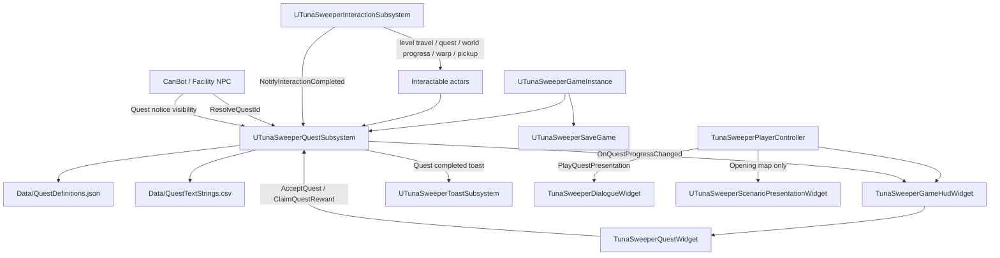
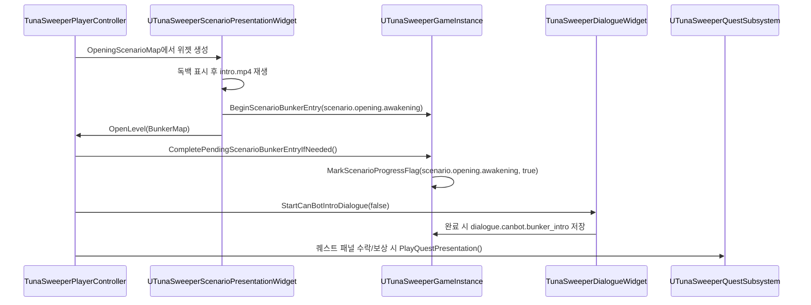

# 퀘스트/대화/시나리오 플래그 연결 흐름

이 문서는 현재 코드에서 확인되는 퀘스트, 대화, 시나리오 플래그, 월드 진행 상태의 연결 흐름을 정리한다. 파일 경로는 저장소 기준 상대 경로로 표기한다.

## 관련 코드와 데이터

주요 런타임 클래스는 다음 파일에 있다.

- `TunaSweeper/Source/TunaSweeper/Public/Subsystem/TunaSweeperQuestSubsystem.h`
- `TunaSweeper/Source/TunaSweeper/Private/Subsystem/TunaSweeperQuestSubsystem.cpp`
- `TunaSweeper/Source/TunaSweeper/Public/Quest/TunaSweeperQuestTypes.h`
- `TunaSweeper/Source/TunaSweeper/Public/Game/TunaSweeperGameInstance.h`
- `TunaSweeper/Source/TunaSweeper/Private/Game/TunaSweeperGameInstance.cpp`
- `TunaSweeper/Source/TunaSweeper/Public/Inventory/TunaSweeperSaveGame.h`
- `TunaSweeper/Source/TunaSweeper/Public/UI/TunaSweeperScenarioPresentationWidget.h`
- `TunaSweeper/Source/TunaSweeper/Private/UI/TunaSweeperScenarioPresentationWidget.cpp`
- `TunaSweeper/Source/TunaSweeper/Public/UI/TunaSweeperDialogueWidget.h`
- `TunaSweeper/Source/TunaSweeper/Private/UI/TunaSweeperDialogueWidget.cpp`
- `TunaSweeper/Source/TunaSweeper/Private/Player/TunaSweeperPlayerController.cpp`
- `TunaSweeper/Source/TunaSweeper/Public/Subsystem/TunaSweeperInteractionSubsystem.h`
- `TunaSweeper/Source/TunaSweeper/Private/Subsystem/TunaSweeperInteractionSubsystem.cpp`
- `TunaSweeper/Source/TunaSweeper/Public/Interaction/TunaSweeperInteractableComponent.h`

주요 데이터 파일은 다음 경로에 있다.

- `TunaSweeper/Content/Data/QuestDefinitions.json`
- `TunaSweeper/Content/Data/QuestTextStrings.csv`
- `TunaSweeper/Content/Data/BunkerCharacterSpawns.json`
- `TunaSweeper/Content/Data/GameplayInteractionSpawns.json`
- `TunaSweeper/Content/Data/EnemySpawns.json`
- `TunaSweeper/Content/Data/WarpPointSpawns.json`
- `TunaSweeper/Content/Data/WorldProgressObjectSpawns.json`
- `TunaSweeper/Content/Data/ItemTable.json`
- `TunaSweeper/Content/Data/ItemStackDefinitions.json`

## 전체 연결 흐름

## 퀘스트 데이터 로딩

`UTunaSweeperQuestSubsystem::Initialize()`는 시작 시 `LoadQuestData(false)`를 호출한다. 로딩은 `FPaths::ProjectContentDir()` 기준으로 `Data/QuestTextStrings.csv`와 `Data/QuestDefinitions.json`을 읽는다.

`QuestTextStrings.csv`는 `string_key,ko,en,ja` 헤더를 기대한다. 퀘스트 정의의 제목, 설명, 목표 문구, 발표 대사는 문자열 키를 통해 이 CSV에서 해석된다. 현재 퀘스트 서브시스템은 한국어 우선 텍스트를 런타임 표시 문자열로 구성한다.

`QuestDefinitions.json`에서 읽는 주요 필드는 다음과 같다.

- 퀘스트: `quest_id`, `provider_id`, `sort_order`, `title_string_key`, `description_string_key`, `required_completed_quest_ids`, `auto_track_on_accept`
- 목표: `objective_id`, `type`, `text_string_key`, `text`, `required_count`, `source_level`, `target_level`, `item_id`, `enemy_id`, `interaction_event_id`, `interaction_type`, `warp_point_id`, `target_warp_point_id`
- 보상: `coins`, `items`, `housing_facilities`, `housing_facility_unlocks`, `workbench_recipes`, `workbench_recipe_unlocks`
- 발표: `accept_presentation`, `reward_presentation`, `speaker_name_string_key`, `dialogue_text_string_key`, `use_camera_focus`, `camera_focus_location`, `camera_blend_seconds`

CSV 또는 JSON 로딩이 실패하면 `RegisterFallbackQuest()`가 최소 대체 퀘스트 `quest_first_outing`을 등록한다. 이 대체 퀘스트는 `provider.canbot` 제공자, `BunkerMap`에서 `RaidMap`으로 이동하는 목표, 100 코인 보상을 가진다.

## 퀘스트 상태와 저장

퀘스트 상태는 `ETunaSweeperQuestState`로 관리된다.

| 상태 | 의미 | 주요 진입 조건 |
| --- | --- | --- |
| `Available` | 수락 가능 후보 | 정의가 로드되어 있고 선행 퀘스트 조건을 만족할 수 있음 |
| `Accepted` | 진행 중 | `AcceptQuest()` 성공 |
| `RewardAvailable` | 목표 완료, 보상 수령 대기 | 모든 목표 진행도가 요구치에 도달 |
| `RewardCompleted` | 보상 수령 완료 | `ClaimQuestReward()` 성공 |

진행 상태는 `UTunaSweeperQuestSubsystem` 내부의 `QuestProgressById`, `TrackedQuestId`, `CoinBalance`로 유지된다. 저장 시에는 `ExportQuestProgressForSave()`가 `UTunaSweeperSaveGame`의 `QuestProgressStates`, `TrackedQuestId`, `QuestCoinBalance`로 내보낸다. 로드 시에는 `LoadQuestProgressFromSave()`가 현재 로드된 퀘스트 정의를 기준으로 존재하는 퀘스트만 복원하고, 목표 진행도는 현재 요구치 범위로 보정한다.

`AcceptQuest()`는 다음 순서로 동작한다.

1. `EnsureSaveStateLoaded()`로 게임 인스턴스 저장 상태를 준비한다.
2. `CanAcceptQuest()`로 퀘스트 정의 존재, 현재 상태 `Available`, 선행 퀘스트 완료 여부를 확인한다.
3. 상태를 `Accepted`로 바꾼다.
4. `auto_track_on_accept`가 true이면 `TrackedQuestId`를 해당 퀘스트로 설정한다.
5. `BroadcastQuestProgressChanged(true)`로 UI 갱신 이벤트를 보내고 게임 상태 저장을 요청한다.

`ClaimQuestReward()`는 상태가 `RewardAvailable`일 때만 성공한다. 아이템 보상이 있으면 `UTunaSweeperGameInstance::GrantQuestItemRewards()`가 먼저 인벤토리 수용 가능 여부를 검사한다. 공간 부족 등으로 아이템 지급이 실패하면 퀘스트 상태는 바뀌지 않는다. 아이템 지급이 가능하면 시설 해금, 작업대 레시피 해금, 코인 지급을 처리한 뒤 상태를 `RewardCompleted`로 변경하고 추적 중인 퀘스트라면 추적을 해제한다.

## 목표 진행 트리거

현재 코드에서 확인되는 목표 타입은 `ETunaSweeperObjectiveType` 기준으로 `LevelTravel`, `ItemAcquired`, `EnemyKilled`, `InteractionCompleted`, `BunkerRescueReturn`, `WarpPointUsed`이다. 시나리오 플래그를 직접 목표로 삼는 전용 목표 타입은 현재 없다.

| 목표 타입 | JSON 값 | 진행 알림 | 실제 트리거 | 매칭 조건 |
| --- | --- | --- | --- | --- |
| 레벨 이동 | `level_travel` | `NotifyLevelTravelRequested(Source, Target)` | `ATunaSweeperLevelTravelInteractableActor::TravelToTargetLevel()` | `source_level`, `target_level`이 비어 있으면 와일드카드, 있으면 현재 맵/대상 맵과 일치해야 함 |
| 아이템 획득 | `item_acquired` | `NotifyItemAcquired(ItemId, Quantity, bSaveImmediately)` | 인벤토리에 아이템이 새로 들어오는 여러 경로 | `item_id`가 없으면 와일드카드, 있으면 획득 아이템 ID와 일치해야 함 |
| 적 처치 | `enemy_killed` | `NotifyEnemyKilled(EnemyId)` | `ATunaSweeperEnemyCharacter`가 플레이어에게 처치될 때 | `enemy_id`가 없으면 와일드카드, 있으면 처치된 적 ID와 일치해야 함 |
| 상호작용 완료 | `interaction_completed` | `NotifyInteractionCompleted(EventId, TypeName)` | `UTunaSweeperInteractionSubsystem::RequestInteraction()`에서 핸들러 성공 후 | `interaction_event_id`, `interaction_type`이 비어 있으면 와일드카드, 있으면 컴포넌트 이벤트 ID와 상호작용 타입명이 일치해야 함 |
| 벙커 구조 귀환 | `bunker_rescue_return` | `NotifyBunkerRescueReturn(Source, Target)` | 플레이어 구조/사망 후 벙커 귀환 처리 | `source_level`, `target_level` 매칭 |
| 워프 포인트 사용 | `warp_point_used` | `NotifyWarpPointUsed(Level, WarpPointId, TargetWarpPointId)` | `ATunaSweeperWarpPointActor::WarpInstigator()` | `source_level`, `warp_point_id`, `target_warp_point_id` 매칭 |

목표 진행은 `AdvanceMatchingObjectives()`에서 처리된다. 이 함수는 상태가 `Accepted`인 퀘스트만 검사하고, 매칭된 목표 진행도를 `RequiredCount`까지 증가시킨다. 모든 목표가 완료되면 상태를 `RewardAvailable`로 바꾸고 `ShowQuestCompletedToast()`를 통해 완료 토스트를 표시한다. 변경이 있으면 `OnQuestProgressChanged`를 브로드캐스트하고 저장을 요청한다.

### 아이템 획득

아이템 획득 알림은 게임 인스턴스의 인벤토리 변경 경로에서 발생한다. 대표적으로 일반 아이템 추가, 선호 슬롯 추가, 전리품 컨테이너에서 일반 인벤토리로 이동, 전리품 스택 분할, 작업대 제작 결과 수령이 `NotifyItemAcquired()`를 호출한다. 벙커 맵에서는 즉시 저장 대신 벙커 아이템 상태 저장 대기 플래그를 세우는 경로가 있으며, 벙커 밖에서는 즉시 저장 요청으로 이어질 수 있다.

퀘스트 보상 아이템 지급인 `GrantQuestItemRewards()`는 아이템을 인벤토리에 넣고 저장 상태를 갱신하지만 `NotifyItemAcquired()`를 다시 호출하지 않는다. 따라서 보상 아이템이 다른 `item_acquired` 목표를 연쇄 진행시키지는 않는다.

현재 `QuestDefinitions.json`에는 `item_acquired` 목표를 사용하는 퀘스트가 보이지 않지만, 코드 경로는 구현되어 있다.

### 상호작용 완료

`UTunaSweeperInteractionSubsystem::RequestInteraction()`은 상호작용 타입별 핸들러가 성공하면 공통으로 `NotifyInteractionCompleted()`를 호출한다. 전달되는 이벤트 ID는 `UTunaSweeperInteractableComponent::ObjectiveEventId`이고, 타입명은 `GetInteractionTypeName()`의 소문자 이름이다.

예를 들어 시설 NPC는 생성/설정 시 퀘스트 상호작용 컴포넌트에 이벤트 ID를 넣는다. `SignalBot`은 `interaction.signalbot.quest`, `RicePotBot`은 `interaction.ricepotbot.quest`를 사용하며, 두 퀘스트 모두 JSON에서 `interaction_type`을 `quest`로 요구한다.

CanBot의 퀘스트 상호작용은 현재 생성자에서 별도 `ObjectiveEventId`를 설정하지 않는다. CanBot 퀘스트 체인은 주로 제공자 ID `provider.canbot`와 퀘스트 패널 수락/보상 흐름으로 연결된다.

### 레벨 이동과 워프

레벨 이동 상호작용은 `TravelToTargetLevel()`에서 게임 인스턴스의 레벨 이동 저장 처리를 먼저 호출하고, 이어서 `NotifyLevelTravelRequested()`를 호출한다. 이후 실제 레벨 열기 또는 귀환 연출 흐름으로 넘어간다. 상호작용 핸들러도 성공으로 끝나므로, 같은 상호작용에서 `interaction_completed` 목표도 별도로 매칭될 수 있다.

워프 포인트는 `WarpInstigator()`에서 현재 맵 이름, 현재 워프 포인트 ID, 대상 워프 포인트 ID로 `NotifyWarpPointUsed()`를 호출한다. 워프 상호작용도 성공 후 공통 상호작용 완료 알림을 추가로 발생시킬 수 있다.

### 월드 진행

월드 진행 오브젝트는 `WorldProgressObjectSpawns.json`으로 배치되고, 성공 상태는 `UTunaSweeperGameInstance`의 `WorldProgressStatesById` 및 저장 게임의 `WorldProgressStates`로 관리된다. 예를 들어 부서진 다리 수리 데이터는 필요한 아이템과 수량을 요구하고, 완료 여부는 월드 상태로 남는다.

현재 코드 기준으로 월드 진행 전용 퀘스트 목표 타입은 없다. 월드 진행을 퀘스트와 연결하려면 `WorldProgress` 상호작용 성공 후 발생하는 `interaction_completed` 목표를 사용해야 한다. 이때 목표 JSON에는 `interaction_type`을 `world_progress`로 지정할 수 있고, 컴포넌트에 의미 있는 `ObjectiveEventId`가 설정되어 있어야 특정 오브젝트만 좁혀 매칭할 수 있다.

### 현재 정의된 주요 퀘스트

`QuestDefinitions.json`에서 확인되는 주요 연결은 다음과 같다.

- `quest_first_outing`: `provider.canbot`, `level_travel`, `BunkerMap`에서 `RaidMap` 이동, 100 코인 보상
- `quest_lumberjack_first_kill`: `provider.canbot`, 선행 `quest_first_outing`, `enemy_killed`로 `enemy.lumberjack` 처치, 150 코인 및 `housing_workbench` 해금
- `quest_signalbot_map_check`: `provider.signalbot`, `interaction_completed`, 이벤트 `interaction.signalbot.quest`, 타입 `quest`, 25 코인 보상
- `quest_ricepotbot_supply_check`: `provider.ricepotbot`, `interaction_completed`, 이벤트 `interaction.ricepotbot.quest`, 타입 `quest`, 25 코인 보상
- `quest_rescue_cart_return`: 제공자 없음, `bunker_rescue_return`, `RaidMap`에서 `BunkerMap` 귀환, 50 코인 보상
- `quest_warp_point_used_test`: 제공자 없음, `warp_point_used`, `RaidMap`의 `raid_warp_point_a`에서 `raid_warp_point_b` 사용

## 퀘스트 제공자, NPC, notice

CanBot은 `ATunaSweeperLedRobotCharacterActor`에서 기본 제공자 `provider.canbot`와 fallback 퀘스트 `quest_first_outing`을 가진다. `BunkerCharacterSpawns.json`의 CanBot 스폰 데이터는 `BunkerMap`에 CanBot 블루프린트를 배치한다.

퀘스트 대상 NPC는 `ResolveQuestId()`에서 `UTunaSweeperQuestSubsystem::TryResolveQuestForProvider()`를 호출한다. 이 함수는 같은 제공자 안에서 다음 우선순위로 노출할 퀘스트를 고른다.

1. `RewardAvailable`
2. `Accepted`
3. `Available`
4. `sort_order`
5. `quest_id`

이미 `RewardCompleted`인 퀘스트는 제외되고, 선행 조건을 만족하지 못한 `Available` 퀘스트도 제외된다. 제공자에 속한 퀘스트가 하나도 없을 때만 fallback 퀘스트를 검토한다. 제공자 퀘스트가 존재하지만 모두 완료되었거나 잠겨 있으면 fallback으로 내려가지 않는다.

NPC의 quest notice는 `ShouldShowQuestNotice()` 조건으로 표시된다. 표시 조건은 해결된 퀘스트 ID가 있고, 상태가 `Available`이면서 `CanAcceptQuest()`가 true이거나, 상태가 `RewardAvailable`인 경우다. 각 NPC는 `OnQuestProgressChanged`를 구독해 notice 표시를 갱신한다.

## HUD, 퀘스트 패널, 보상 발표

퀘스트 UI는 `TunaSweeperGameHudWidget`과 `TunaSweeperQuestWidget`이 담당한다.

- NPC 퀘스트 상호작용 성공 시 `UTunaSweeperInteractionSubsystem::HandleQuestInteraction()`이 `TunaSweeperPlayerController::OpenQuestPanel(QuestId)`을 호출한다.
- 플레이어 컨트롤러는 HUD를 보장한 뒤 `GameHudWidget->ShowQuestPanel(QuestId)`을 호출한다.
- 퀘스트 패널의 기본 버튼은 상태에 따라 `AcceptQuest()` 또는 `ClaimQuestReward()`를 호출한다.
- 수락 성공 후에는 `PlayQuestPresentation(QuestId, OnAccept)`로 수락 발표 대화를 재생한다.
- 보상 수령 성공 후에는 `PlayQuestPresentation(QuestId, OnRewardClaim)`로 보상 발표 대화를 재생한다.
- 퀘스트 진행 변경은 `OnQuestProgressChanged`로 HUD와 퀘스트 패널을 새로고침한다.
- 목표 완료 순간에는 `UTunaSweeperToastSubsystem::ShowQuestCompletedToast()`로 완료 토스트가 표시된다.

## 대화와 시나리오 프레젠테이션

`UTunaSweeperScenarioPresentationWidget`은 `OpeningScenarioMap`에서 생성된다. 독백 라인을 표시한 뒤 `./Movies/intro.mp4`를 재생하고, 종료 또는 실패 시 `TravelToBunker()`를 호출한다. 이때 바로 완료 플래그를 저장하지 않고 `UTunaSweeperGameInstance::BeginScenarioBunkerEntry(scenario.opening.awakening)`로 pending flag만 설정한 뒤 `BunkerMap`을 연다.

`BunkerMap` 로드 후 `TunaSweeperPlayerController::ShowBunkerEntryFadeIfNeeded()`가 `CompletePendingScenarioBunkerEntryIfNeeded()`를 호출한다. pending flag가 있으면 이를 `CompletedScenarioFlags`에 저장하고 검은 화면 페이드 인을 재생한다. 페이드가 끝나면 약간의 지연 후 CanBot 인트로 대화가 시작된다.

`TunaSweeperDialogueWidget`은 공통 대화 표시 위젯이다. 라인 단위로 타자 효과를 진행하고, 키 입력 또는 좌클릭으로 현재 문장을 즉시 채우거나 다음 문장으로 넘어간다. 라인에 카메라 포커스가 있으면 플레이어 컨트롤러가 해당 위치로 카메라를 블렌드한다. 대화 종료 시 completion flag가 지정되어 있으면 `UTunaSweeperGameInstance::MarkScenarioProgressFlag()`로 저장한다.

퀘스트 수락/보상 발표도 같은 대화 위젯을 사용하지만 completion flag를 지정하지 않는다. 따라서 퀘스트 발표 대화 완료는 시나리오 플래그를 추가하지 않는다.

## 오프닝에서 CanBot과 첫 퀘스트까지

오프닝 이후 첫 진입 흐름은 다음 순서로 이어진다.

1. 초기 레벨 결정은 `UTunaSweeperGameInstance::ResolveInitialGameplayLevelName()`이 담당한다. 난이도 선택 전이면 `IntroMap`, 오프닝 완료 플래그가 있으면 `BunkerMap`, 없으면 `OpeningScenarioMap`을 반환한다.
2. `OpeningScenarioMap`에서 `UTunaSweeperScenarioPresentationWidget`이 독백과 영상 재생을 처리한다.
3. 영상 완료 후 `BeginScenarioBunkerEntry(scenario.opening.awakening)`가 pending flag를 설정하고 `BunkerMap`으로 이동한다.
4. `BunkerMap`의 플레이어 컨트롤러가 pending flag를 완료 처리하고 `scenario.opening.awakening`을 저장한다.
5. 같은 진입 흐름에서 `StartCanBotIntroDialogue(false)`가 호출된다.
6. CanBot 인트로가 처음 완료되면 `dialogue.canbot.bunker_intro` 플래그가 저장된다. 이후 자동 재생은 이 플래그 때문에 생략된다.
7. CanBot의 일반 대화 상호작용은 `StartCanBotIntroDialogue(true)`로 강제 재생할 수 있다. 이미 완료된 경우에는 completion flag를 다시 저장하지 않는다.
8. CanBot의 퀘스트 상호작용은 `OpenQuestPanel()`로 이어지고, `quest_first_outing` 또는 같은 provider 체인의 다음 퀘스트를 표시한다.
9. 플레이어가 첫 퀘스트를 수락하면 상태가 `Accepted`가 되고, 자동 추적이 설정되며, 수락 발표 대화가 재생된다.
10. `BunkerMap`에서 `RaidMap`으로 이동하는 레벨 이동 상호작용이 성공하면 `quest_first_outing`의 `level_travel` 목표가 완료되고, 퀘스트 완료 토스트와 HUD 갱신이 발생한다.
11. 이후 CanBot notice는 첫 퀘스트가 `RewardAvailable` 상태이므로 다시 표시될 수 있고, 보상 수령 후 다음 provider 퀘스트 조건이 열리면 새 notice 조건을 평가한다.

## 시나리오 플래그, 퀘스트 상태, 월드 상태의 차이

| 구분 | 저장 위치 | 예시 | 용도 | 퀘스트 목표와의 관계 |
| --- | --- | --- | --- | --- |
| 시나리오/대화 플래그 | `UTunaSweeperSaveGame::CompletedScenarioFlags` | `scenario.opening.awakening`, `dialogue.canbot.bunker_intro` | 오프닝 완료, 자동 대화 재생 여부, 초기 레벨 결정 | 현재 전용 목표 타입 없음. 퀘스트 진행을 직접 증가시키지 않음 |
| 퀘스트 상태/진행 | `QuestProgressStates`, `TrackedQuestId`, `QuestCoinBalance` | `quest_first_outing` 상태와 목표 카운트 | 수락, 목표 진행, 보상 가능/완료, 추적, 코인 | 퀘스트 서브시스템의 목표 매칭 알림으로만 변경 |
| 월드 진행 상태 | `WorldProgressStates` | 수리된 다리, 진행 수량 | 월드 오브젝트의 완료/진행 유지 | 전용 목표 타입 없음. 필요하면 `interaction_completed`로 연결 |
| 인벤토리/아이템 상태 | 인벤토리 슬롯 및 아이템 상태 저장 | 획득 아이템, 제작 결과, 보상 아이템 | 플레이어 소지품과 제작/보상 처리 | 일반 획득은 `item_acquired` 목표를 진행할 수 있으나, 퀘스트 보상 지급은 연쇄 진행시키지 않음 |

중요한 차이는 시나리오 플래그가 진행 연출과 재생 여부를 제어하는 저장 플래그라는 점이다. 퀘스트 플래그라는 별도 플래그 세트는 없고, 퀘스트는 상태와 목표 진행도로 저장된다. 월드 진행은 퀘스트와 독립된 영속 상태이며, 현재 코드에서는 완료 자체가 자동으로 퀘스트 상태를 바꾸지 않는다.

## 디버깅 체크리스트

- 퀘스트가 보이지 않으면 `QuestDefinitions.json`의 `quest_id`, `provider_id`, `required_completed_quest_ids`, `sort_order`를 확인한다.
- 문구가 비어 있거나 fallback처럼 보이면 `QuestTextStrings.csv` 헤더가 `string_key,ko,en,ja`인지, JSON의 문자열 키가 CSV에 있는지 확인한다.
- NPC notice가 안 뜨면 해당 액터의 provider ID, fallback quest ID, `ResolveQuestId()`, `CanAcceptQuest()`, 현재 퀘스트 상태를 확인한다.
- 시설 NPC 퀘스트 목표가 안 오르면 `QuestInteractableComponent`의 `ObjectiveEventId`와 JSON의 `interaction_event_id`, `interaction_type`이 일치하는지 확인한다.
- CanBot 퀘스트가 interaction objective로 진행되지 않는다면 현재 CanBot 퀘스트 컴포넌트에는 별도 objective event ID가 설정되어 있지 않다는 점을 먼저 확인한다.
- 레벨 이동 목표가 안 오르면 실제 현재 맵 이름과 `source_level`, 대상 맵과 `target_level`이 일치하는지 확인한다. 코드 매칭은 정확한 이름 또는 접미 형태를 허용한다.
- 아이템 획득 목표가 안 오르면 해당 획득 경로가 일반 획득인지 확인한다. 퀘스트 보상 지급은 `NotifyItemAcquired()`를 호출하지 않는다.
- 적 처치 목표가 안 오르면 적 스폰 데이터의 `enemy_id`와 JSON의 `enemy_id`가 일치하는지, 처치자가 플레이어 컨트롤러로 판정되는지 확인한다.
- 워프 목표가 안 오르면 `WarpPointSpawns.json`의 현재/대상 워프 포인트 ID와 JSON의 `warp_point_id`, `target_warp_point_id`를 확인한다.
- 월드 진행을 퀘스트로 연결하려면 월드 진행 완료 상태 저장과 별개로 `interaction_completed` 목표가 매칭될 수 있는 이벤트 ID와 타입명이 준비되어 있는지 확인한다.
- 오프닝 이후 벙커로 바로 가지 않거나 반복 재생되면 `CompletedScenarioFlags`에 `scenario.opening.awakening`이 저장되었는지, pending flag가 `BunkerMap` 진입 후 완료 처리되었는지 확인한다.
- CanBot 인트로가 반복 자동 재생되면 `dialogue.canbot.bunker_intro` 플래그가 대화 종료 시 저장되는지 확인한다.
- HUD가 갱신되지 않으면 `OnQuestProgressChanged` 바인딩, `TunaSweeperGameHudWidget::HandleQuestProgressChanged()`, `TunaSweeperQuestWidget::HandleQuestProgressChanged()` 호출 여부를 확인한다.
