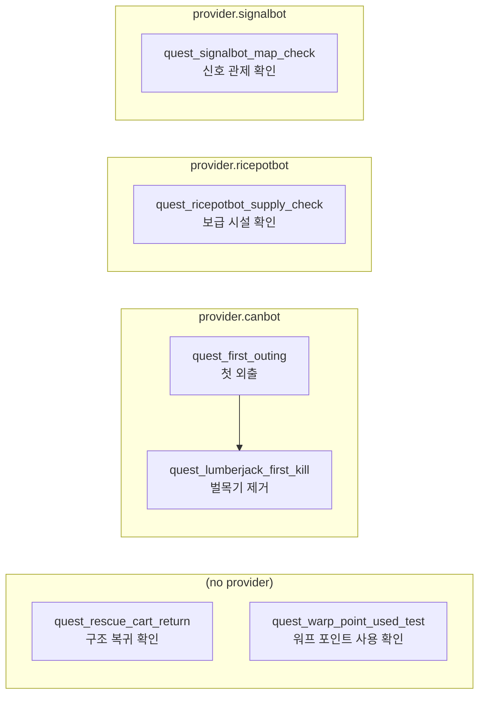

# Quest Graph

Generated by `Tools/QuestGraphGenerator`.

- Source: `TunaSweeper/Content/Data/QuestDefinitions.json`
- Text: `TunaSweeper/Content/Data/QuestTextStrings.csv`
- Language: `ko`
- Generated: 2026-07-03 14:07:48

## Summary

- Quests: 6
- Providers: 3
- Providerless quests: 2
- Prerequisite edges: 1
- Validation errors: 0
- Validation warnings: 0

## Prerequisite Graph

## Provider Chains

### (no provider)

| Sort | Quest | Title | Prerequisites | Rewards | Auto Track |
| ---: | --- | --- | --- | --- | --- |
| 9000 | `quest_rescue_cart_return` | 구조 복귀 확인 | - | 50 coins | No |
| 9100 | `quest_warp_point_used_test` | 워프 포인트 사용 확인 | - | - | No |

### provider.canbot

| Sort | Quest | Title | Prerequisites | Rewards | Auto Track |
| ---: | --- | --- | --- | --- | --- |
| 10 | `quest_first_outing` | 첫 외출 | - | 100 coins | Yes |
| 20 | `quest_lumberjack_first_kill` | 벌목기 제거 | `quest_first_outing` | 150 coins facility housing_workbench | Yes |

### provider.ricepotbot

| Sort | Quest | Title | Prerequisites | Rewards | Auto Track |
| ---: | --- | --- | --- | --- | --- |
| 110 | `quest_ricepotbot_supply_check` | 보급 시설 확인 | - | 25 coins | Yes |

### provider.signalbot

| Sort | Quest | Title | Prerequisites | Rewards | Auto Track |
| ---: | --- | --- | --- | --- | --- |
| 100 | `quest_signalbot_map_check` | 신호 관제 확인 | - | 25 coins | Yes |

## Objectives

| Quest | Objective | Type | Text | Required | Filters |
| --- | --- | --- | --- | ---: | --- |
| `quest_rescue_cart_return` | `return_by_rescue_cart` | `bunker_rescue_return` | 구급 카트에 실려 벙커로 돌아오기 | 1 | source=RaidMap, target=BunkerMap |
| `quest_warp_point_used_test` | `use_raid_warp_point_a` | `warp_point_used` | 워프 포인트 사용 | 1 | source=RaidMap, warp=raid_warp_point_a, target_warp=raid_warp_point_b |
| `quest_first_outing` | `leave_bunker` | `level_travel` | 벙커 밖으로 이동 | 1 | source=BunkerMap, target=RaidMap |
| `quest_lumberjack_first_kill` | `kill_lumberjack` | `enemy_killed` | 벌목기 처치 | 1 | enemy=enemy.lumberjack |
| `quest_ricepotbot_supply_check` | `talk_to_ricepotbot` | `interaction_completed` | 밥통봇과 대화 | 1 | interaction_event=interaction.ricepotbot.quest, interaction_type=quest |
| `quest_signalbot_map_check` | `talk_to_signalbot` | `interaction_completed` | 신호봇과 대화 | 1 | interaction_event=interaction.signalbot.quest, interaction_type=quest |

## Validation

No validation issues.

