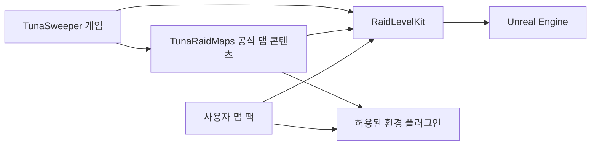

# 레이드 레벨 플러그인 분리와 사용자 맵 배포 검토

작성: 2026-09-30. 상태: 프로젝트 조사 완료, 구현 전 설계 검토안.

## 1. 결론과 목표

가능하다. 게임이 공용 레벨 계약과 맵 콘텐츠 플러그인을 사용하고, 맵은 게임 모듈을 참조하지 않는 구조를 권장한다. 현재 앵커의 위치/생성 데이터 분리가 출발점이며, 기존 맵의 게임 액터와 `/Game` 에셋 참조를 함께 정리해야 한다.

사용자가 요청한 목표:

- 레이드 레벨의 프로젝트 의존성을 제거한다.
- 프로젝트가 새 플러그인에 의존한다.
- 레벨에는 정적 환경과 플레이스먼트 앵커를 중심으로 배치한다.
- 사용자 제작 레벨을 Steam 창작마당 또는 ZIP으로 배포할 수 있는지 검토한다.

확정된 제작 방식: 사용자는 UE 5.7 에디터에서 레벨을 제작한다. 별도 제작 프로젝트에 공용 플러그인과 필요한 환경 에셋을 제공하고, 검사·쿠킹·맵 팩 내보내기 흐름을 연결하는 방향으로 설계한다. 아래 이름은 제안명이며 아직 생성된 플러그인이 아니다.

## 2. 프로젝트에서 확인한 사실

### 실제 맵과 에셋 검사

설치된 UE `5.7.4-51494982`의 Python commandlet으로 AssetRegistry의 hard/soft package 참조와 세 맵의 로드 후 액터 클래스를 읽었다. 저장 API를 호출하지 않았고, 세 `.umap`의 전후 SHA-256이 일치했다.

| 맵 | 로드된 배치 앵커 | 확인된 게임 전용 액터 예시 |
| --- | ---: | --- |
| `/Game/Maps/DemoBoxRaidMap` | 2 | 레벨 이동, 급수 시설, 식량 창고, 디버그 보급, ATV, 차고 문 |
| `/Game/Maps/DemoRaidMap` | 14 | 직접 배치된 적 7개, 폭발 배럴 9개, 상자 3개, 닭 2개, 탈출 지점, 레벨 이동, 급수 시설, 식량 창고 |
| `/Game/MainRaid/RaidMap` | 0 | 폭발 배럴 9개, 토마토 9개, 상자 3개, 닭 2개, 차고 문 |

- 세 맵 모두 `/Script/TunaSweeper` 직접 참조가 있다.
- `DemoRaidMap`, `RaidMap`은 `StylizedWater` 코드와 콘텐츠도 참조한다. `DemoRaidMap`에는 `MiyakovCharacterSystem` 직접 참조도 있다.
- 세 맵의 `WorldSettings.default_game_mode`는 `None`이다. 프로젝트 기본 GameMode는 `Config/DefaultEngine.ini`에서 정한다. 맵을 옮길 때 게임 BP GameMode를 맵에 새로 지정하면 다시 의존성이 생긴다.
- 앵커 BP는 `/Game/Raid/Placement/DA_LootAnchorPreviews`와 `/Script/TunaSweeper`를 직접 참조한다. 미리보기 DA도 게임 모듈에 정의되어 있고 세 미리보기 메시를 참조한다.
- 정적 메시도 재질, 텍스처, 물리 재질, Landscape LayerInfo, foliage 등의 참조를 함께 옮겨야 한다. 맵 파일 위치만 바꾸면 독립되지 않는다.

검사 결과는 `TunaSweeper/Saved/RaidDependencyAudit/report.json`, 최종 실행 로그는 같은 폴더의 `stdout_localcache.log`에 있다. 최종 commandlet 종료 코드 0, 오류 0개이며 SSL 인증서 저장소와 NavMesh 관련 경고 2종이 남았다. 최초 실행의 DDC 쓰기 오류는 작업 폴더의 캐시 경로를 환경 변수로 지정해 해결했다.

이 검사는 에디터 참조를 포함한다. 재귀 탐색은 `/Game` 패키지 내부를 따라가고 다른 플러그인에서는 멈췄으므로 전체 cook 의존성 목록으로 사용할 수 없다. 액터 수는 로드 중 생성되는 보조 객체를 포함할 수 있다. Level Blueprint 그래프 전체, World Partition 외부 액터 전체 로드, 쿠킹 결과, 독립 프로젝트 로드와 패키지 실행은 아직 검증하지 않았다.

### 코드 경계

| 위치 | 현재 역할과 영향 |
| --- | --- |
| `Source/TunaSweeper/Public/Raid/TunaSweeperRaidPlacementAnchor.h` | 앵커 종류, ID, 중복 적 ID 허용, 에디터 미리보기 계약. 게임 모듈의 공개 타입이다. |
| `Source/TunaSweeper/Public/Raid/TunaSweeperLootAnchorPreviewDataAsset.h` | 미리보기 DA와 구조체. 앵커와 함께 독립화해야 한다. |
| `Source/TunaSweeper/Private/Subsystem/TunaSweeperRaidPlacementSubsystem.cpp` | 앵커 검증뿐 아니라 게임 전용 JSON, 적 프로필, 전투/루팅 클래스를 읽고 생성한다. 통째로 공용 플러그인에 옮기면 게임 의존성도 이동한다. |
| `Source/TunaSweeper/Private/Subsystem/TunaSweeperMemoSubsystem.cpp` | 메모 배치와 게임의 수집 상태를 별도로 처리한다. |
| `Source/TunaSweeper/Private/Settings/TunaSweeperBuildFlavor.cpp` | 현재 레이드 하나를 고르고 짧은 맵 이름으로 레이드 여부와 별칭을 판정한다. 임의의 사용자 맵을 지원하는 카탈로그는 없다. |
| `Source/TunaSweeper/Private/Game/TunaSweeperGameInstance.cpp` | 레이드 이동 목적지를 위 선택 함수에서 얻는다. |
| `Source/TunaSweeper/Private/Game/TunaSweeperGameInstanceSave.cpp` 및 `TunaSweeperGameInstanceExperience.cpp` | 레이드 이름 판정이 귀환 저장과 경험치 적용에도 연결된다. 외부 맵을 여는 기능만 추가하면 이 동작은 완성되지 않는다. |
| `Config/DefaultGame.ini`, `Config/Custom/*/DefaultGame.ini` | 기존 맵 경로를 cook 대상으로 지정한다. 경로 변경 때 빌드별 설정도 함께 바꿔야 한다. |

현재 공개 Source/Plugins 검색에서 `ISteamUGC`, `SteamUGC`, `GetItemInstallInfo`, 사용자 콘텐츠 마운트 구현을 찾지 못했다. `OnlineSubsystemSteam` 활성화는 창작마당 지원 구현과 별개다.

## 3. 권장 의존성 구조

화살표는 왼쪽이 오른쪽을 사용한다는 뜻이다.



### A. RaidLevelKit: 공용 레벨 계약과 제작 도구

- `RaidLevelRuntime`: 앵커 Actor, AnchorKind enum, 안정적인 식별자와 맵 설명 데이터, 게임 타입을 사용하지 않는 구조 검증.
- `RaidLevelEditor`: 에디터 표시, 배치 검증, 의존성 검사, 제작/내보내기 도구.
- 플러그인 Content: 앵커 BP와 자체 완결된 미리보기 DA·메시·재질. 게임의 `/Game/Raid/Placement` 참조를 제거한다.
- 직렬화된 BP가 참조하는 타입은 Runtime에 둘 수 있다. 미리보기 구현·데이터의 cook 제외와 Editor 모듈 의존성은 따로 검증한다. `WITH_EDITORONLY_DATA`만으로 다른 프로젝트에서 편집할 때의 의존성이 없어지지는 않는다.
- 이 플러그인은 `TunaSweeper`, 게임 전용 GameInstance, 적/아이템/퀘스트 클래스나 게임 `/Game` 경로를 참조하지 않는다. UI 표시는 프로젝트의 문자열 키 방식을 유지하며, 독립 도구에 필요한 문자열 데이터/키도 함께 제공한다.

### B. TunaRaidMaps: 공식 레이드 맵과 환경 에셋

- 맵, Landscape, foliage, 정적 메시와 그 하위 에셋을 보관하는 콘텐츠 플러그인이다.
- 게임 코드 참조 없이 `RaidLevelKit`, 엔진, 명시적으로 허용한 환경 플러그인에만 의존한다.
- 사용자 맵 제작자는 공식 맵 전체를 설치하지 않아도 작업할 수 있어야 한다. 공용 환경 에셋을 제공할 경우 재배포 가능한 것만 별도 선택 팩으로 제공한다.
- 공용 계약과 공식 맵을 하나의 플러그인에 넣는 것도 가능하지만, 제작 SDK와 맵 업데이트를 나누기 위해 두 플러그인을 권장한다.

### C. TunaSweeper: 게임 해석과 실행

적·루팅·메모·퀘스트·저장·보상·탈출 로직과 실제 게임 Actor 클래스는 게임이 소유한다. 게임이 플러그인 앵커를 읽고 ID에 대응하는 프로필을 찾아 런타임 Actor를 생성한다. 게임에서 플러그인으로 의존성이 향하므로, 초기에는 추상 인터페이스를 과하게 추가할 필요 없이 게임 쪽 어댑터로 연결할 수 있다.

게임이 시작 위치, 탈출 위치, 상호작용/차량 생성 위치를 필요로 하면 해당 위치도 중립 앵커 또는 레벨 메타데이터로 표현한다. 확장 종류는 구현 단계에서 필요한 항목만 추가한다. 기존 `Enemy/LootContainer/Memo` 값과 `PlacementId`를 보존하고, 새 종류/번호 대역은 `Docs/raid_placement_id_numbering.md`와 함께 정의한다. `3000+`는 현재 예약 영역이다.

레벨별 생성 데이터는 맵 팩의 별도 데이터에서 앵커 ID와 허용된 프로필 ID를 연결할 수 있다. 이는 맵 Actor에 적 클래스나 루팅 정의를 직접 저장하지 않으면서 사용자 맵에 생성 대상을 지정하는 방법이다. 사용자에게 게임 클래스 경로를 자유 입력시키는 방식은 초기 범위로 권하지 않는다.

### 레벨에 남길 요소

- 지형, foliage, 정적 메시, 조명, 환경 음향·효과, 충돌, 내비게이션 영역과 베이크 결과.
- 배치 앵커, 중립 시작/탈출 위치, 게임 코드에 의존하지 않는 레벨 메타데이터.
- 필요한 물/안개 등의 환경 플러그인 Actor. 여기서 정적 환경은 게임 진행 로직이 없다는 의미이며, 물 애니메이션까지 금지한다는 뜻은 아니다.

직접 배치된 적·보급·차량·폭발물·수집물·퀘스트 상호작용·탈출 처리 액터는 게임이 앵커에서 생성하도록 바꾼다. 카메라, 얕은 물, 차고 문처럼 환경과 게임 동작이 섞인 기능은 독립 환경 부분과 게임 제어 부분을 구분한다. 특히 `BP_LocationBlendCamera`, `BP_Editor_MapCaptureActor`, `BP_SplineConcreteBarrier`, `BP_ShallowPuddle`도 남은 게임 참조를 검사해 제거하거나 독립화한다. Level Blueprint에서도 게임 클래스 참조와 게임 진행 실행을 제거한다.

## 4. 대안 비교

| 방식 | 장점 | 제약 | 판단 |
| --- | --- | --- | --- |
| 앵커만 플러그인으로 이동 | 변경량이 작음 | 기존 맵의 게임 Actor·환경 `/Game` 참조가 남음 | 첫 이행 단계로만 유효 |
| 공용 Kit + 맵 콘텐츠 + 게임 어댑터 | 레벨 독립성과 제작 SDK를 함께 확보 | 에셋 이동과 게임 Actor의 앵커 전환 필요 | 권장 |
| 레이드 게임 로직 전체를 플러그인으로 이동 | 레이드 기능 전체 재사용 가능 | 전투·인벤토리·퀘스트·세이브까지 범위가 커짐 | 현재 목표에는 과도함 |

## 5. 마이그레이션 순서와 완료 기준

1. 이동 전에 맵·앵커 패키지의 역참조(`GetReferencers`)와 텍스트 경로를 수집한다. 앵커/enum/미리보기 타입과 에셋을 `RaidLevelKit`으로 이동한다. 모듈 API 매크로와 Build.cs 의존성을 바꾸고 클래스·enum·구조체·패키지 이동에 맞는 Core Redirects를 작성한다. BP를 로드하고 재저장한 뒤 이전 참조가 사라졌는지 확인한다. [Epic Core Redirects](https://dev.epicgames.com/documentation/en-us/unreal-engine/core-redirects-in-unreal-engine?application_version=5.7)
2. 작은 `DemoBoxRaidMap`부터 직접 배치 게임 Actor를 앵커와 게임 쪽 생성 데이터로 전환한다. 위치·회전·크기·게임 설정·기존 식별자를 보존한다. 이는 1차 검증 대상이며 다른 레이드 맵의 독립화가 끝났다는 의미는 아니다.
3. 공식 맵과 필요한 환경 에셋을 `TunaRaidMaps`로 이동한다. Landscape/foliage/재질·텍스처·물리 재질, 해당 시 external actors/build data까지 참조 그래프 단위로 옮긴다. 게임용 콘텐츠와 에디터 전용 도구를 함께 무차별 이동하지 않는다. 플러그인 전체를 무조건 cook하지 않고 현재 빌드별 맵 포함/제외 정책을 새 경로에도 적용한다.
4. 같은 절차를 `DemoRaidMap`, `RaidMap`에 적용한다. 기존 별칭과 배치 ID의 의미를 유지한다. 현재 서사 작업에 새로운 데모/릴리스 분리 정책을 도입하지 않는다.
5. 게임의 맵 선택·이동·미니맵·스폰·귀환/사망·저장·경험치와 cook 설정을 새 패키지 경로에 연결한다. 내부 맵의 기존 저장 키는 호환 어댑터로 유지한다.
6. 새 UE 제작 프로젝트에 Kit와 필요한 맵/환경 플러그인만 넣어 맵 열기와 검사·cook을 검증한다. 게임 소스와 게임 `/Game` 폴더가 없는 상태에서 통과해야 한다.
7. 본 게임에서 기존 배치 결과, 적/루팅/메모, 진입·탈출, 사망·저장 회귀를 검증한다. 전체 참조 검사와 실제 패키지 실행을 통과해야 독립화 완료로 판정한다.

핵심 완료 기준은 “Plugins 폴더에 있음”이 아니라 **게임 프로젝트가 없는 제작 환경에서 열리고, 게임 전용 모듈/콘텐츠 참조가 없으며, 본 게임에서는 같은 동작을 제공함**이다. [Epic UE 5.7 플러그인 구조](https://dev.epicgames.com/documentation/en-us/unreal-engine/plugins-in-unreal-engine?application_version=5.7)

## 6. 사용자 레벨의 ZIP / Steam 창작마당 배포

### 제작과 배포 흐름

```text
UE 5.7 제작 프로젝트 + RaidLevelKit
  → 정적 환경/앵커 배치 + 허용 프로필 연결 데이터
  → 의존성·앵커·지원 기능 검사
  → 대상 게임 빌드/플랫폼에 맞춘 cook
  → manifest + cooked map pack
  → ZIP 또는 Steam 창작마당
  → 게임의 공통 검사·마운트·맵 등록 → 레이드 입장
```

원본 `.umap/.uasset` 공유용 ZIP과 게임 실행용 ZIP은 목적이 다르다. 실행용은 대상 플랫폼의 cooked 콘텐츠와 의존성을 포함해야 한다. 외부 액터를 사용하는 원본 맵도 `.umap` 하나만 복사하면 부족할 수 있다. [Epic cooking](https://dev.epicgames.com/documentation/unreal-engine/cooking-content-in-unreal-engine), [One File Per Actor](https://dev.epicgames.com/documentation/en-us/unreal-engine/one-file-per-actor-in-unreal-engine)

### 공통으로 필요한 기능

- 맵 팩 manifest: `PackId`, `MapId`, 전체 맵 패키지 경로, 포맷/SDK 버전, 지원 게임 빌드, 플랫폼, 필요한 환경 팩, 파일 목록·해시. 표시 이름·설명은 문자열 키와 팩별 번역 테이블로 제공한다.
- 충돌 방지: `/User_<PackId>/Maps/...` 같은 팩별 패키지 공간을 제작 프로젝트의 콘텐츠 플러그인에서 **cook 전에** 만들고, cook 산출물·manifest·게임 마운트에서 같은 경로를 유지한다. cook 후 `/Game` 파일을 이동/이름 변경해 바꾸는 방식은 사용하지 않는다. 본편 `/Game` 에셋 덮어쓰기를 허용하지 않는다. 앵커의 전역 식별은 `(PackId, MapId, PlacementId)`처럼 맵 이름 중복과 독립적으로 만든다. [Epic cooked 콘텐츠의 경로 보존](https://dev.epicgames.com/documentation/unreal-engine/working-with-cooked-content-in-the-unreal-engine)
- 로딩: 검사 → 컨테이너/패키지 마운트 → 해당 방식에 맞는 AssetRegistry 데이터 등록 → 맵 카탈로그 등록 → 게임 모드와 레이드 세션 설정 → 전체 패키지 경로로 이동.
- 오류 처리: 미완성 설치, 누락 의존성, 비호환 버전, 잘못된 앵커는 입장 전에 설명하고 제외한다. ZIP은 지정 설치 폴더 밖 경로와 중복 팩을 검사한다. 로드된 맵을 사용 중인 동안 교체·삭제하지 않는다.
- 저장: 현 메모 수집은 숫자 `memo_id`, 월드 진행은 `ObjectId` 기반이다. 사용자 맵이 같은 값을 사용해 본편 상태와 충돌하지 않도록 별도 진행 공간을 설계한다. 초기 사용자 맵은 본편 퀘스트/업적 진행과 보상을 분리하는 안을 권장한다. 실제 정책과 저장 변경 시 `Docs/save_persistence.md`를 갱신한다.
- 제작 범위: 초기에는 승인된 앵커/환경 클래스와 콘텐츠를 지원한다. 사용자 C++ DLL과 임의 게임 Blueprint 실행까지 지원하면 호환성·검증 범위가 크게 늘어난다. `.umap` 확장자만 검사해서는 Level Blueprint 실행을 제한할 수 없다.

### Pak / IoStore 확인 사항

이 설치의 `Engine/Config/BaseGame.ini`는 `UsePakFile=True`, `bUseIoStore=True`이며, 공개 프로젝트 config에서는 별도 덮어쓰기를 찾지 못했다. 에디터의 `TunaSweeperBuildTargetTool.cpp`도 설정에 따라 `-pak/-iostore`를 붙인다. 따라서 단일 `.pak` 복사로 충분하다고 가정하지 않는다.

Pak은 `.pak`, IoStore는 `.utoc/.ucas`와 함께 생성되는 산출물·메타데이터를 정확히 취급해야 한다. 엔진 5.7 로컬 헤더에서 `FPakPlatformFile::Mount`와 명시적 플러그인 마운트 API의 존재를 확인했지만, API 존재가 외부 cooked 맵의 정상 실행을 입증하지는 않는다. 먼저 실제 게임 패키지와 별도 제작 프로젝트의 샘플 맵으로 cook, mount, shader/material, AssetRegistry, map travel까지 검증한다. 단순 파일 스캔만으로 IoStore 등록을 대체한다고 가정하지 않는다. [Epic 패키징 설정](https://dev.epicgames.com/documentation/en-us/unreal-engine/project-section-of-the-unreal-engine-project-settings)

제작 SDK는 초기에는 실제 게임과 맞는 UE 패치 버전·게임 콘텐츠/직렬화 계약·플랫폼을 고정한다. 이후 검증된 범위만 호환 버전으로 넓힌다. 게임 업데이트 후 모든 과거 맵의 호환성을 자동 보장할 수는 없다. [Epic 에셋 버전 관리](https://dev.epicgames.com/documentation/unreal-engine/versioning-of-assets-and-packages-in-unreal-engine)

### ZIP

스토어와 독립적인 설치 경로다. 제작 도구가 내보낸 완전한 팩을 ZIP으로 전달하고 게임의 로컬 맵 관리자에서 설치/검사한다. Steam판과 다른 배포판이 같은 팩 로더를 공유할 수 있다. 외부 맵을 로드하는 런타임과 설치 UI는 새로 구현해야 한다.

### Steam 창작마당

같은 맵 팩을 Workshop 항목으로 업로드한다. 제작 도구에는 `CreateItem`, `StartItemUpdate`, `SetItemContent`, `SubmitItemUpdate`에 대응하는 게시 흐름이 필요하다. 게임에는 구독 목록, 설치 상태, 다운로드 완료 콜백, `GetItemInstallInfo`의 설치 폴더 조회를 연결하고 그 결과를 공통 팩 로더에 전달한다. Steam이 다운로드/업데이트를 관리하고 게임이 콘텐츠 검사와 로드를 담당한다. 게임 실행 중 설치될 수도 있으므로 파일 준비 전에 마운트하지 않는다. [Steamworks 구현 안내](https://partner.steamgames.com/doc/features/workshop/implementation?l=english)

협동 플레이까지 지원한다면 입장 전에 모든 참가자의 PackId·버전·내용 해시 일치를 확인해야 한다. 이 검토는 코옵 사용자 맵의 실행/동기화를 확인한 결과가 아니다.

### 제작 도구 제공 범위

제작자는 자신의 UE 5.7 설치를 사용하고, 우리는 공용 플러그인·예제 프로젝트·재배포 가능한 에셋·검사/내보내기 도구를 제공하는 구성이 적절하다. 게임 전체 소스는 중립 계약만으로 제작과 cook이 가능하면 필수 배포물이 아니다. 게임 플레이 시험은 실제 게임에서 한다.

Unreal Editor나 Engine Tools 바이너리를 SDK에 묶어 공개 배포하는 경우에는 별도의 배포 조건이 적용된다. 현 Epic EULA는 공개 Engine Tools 배포 경로를 제한하므로, 도구·타사 에셋을 포함한 SDK의 실제 배포물 기준으로 조건을 확인해야 한다. [Epic EULA §5 및 §6(d)](https://www.unrealengine.com/eula/unreal)

## 7. 권장 진행 범위

1. **레이드 독립화:** Kit 분리 → 작은 맵 전환 → 모든 대상 맵/의존성 이전 → 독립 제작 프로젝트와 게임 회귀 검증.
2. **로컬 사용자 맵:** 별도 제작 프로젝트의 샘플 팩을 실제 Win64 게임 패키지에서 불러오는 시험 → 버전/저장 정책 확정 → ZIP 제작·설치 지원.
3. **Steam 창작마당:** 동일 팩에 게시·구독·다운로드·업데이트 처리를 연결.

이번 작업에서는 소스·에셋·설정·저장 형식을 변경하지 않았다. 플러그인 생성과 맵 이동, 사용자 팩 실행 시험은 이 설계를 검토한 다음 수행할 구현 작업이다.
