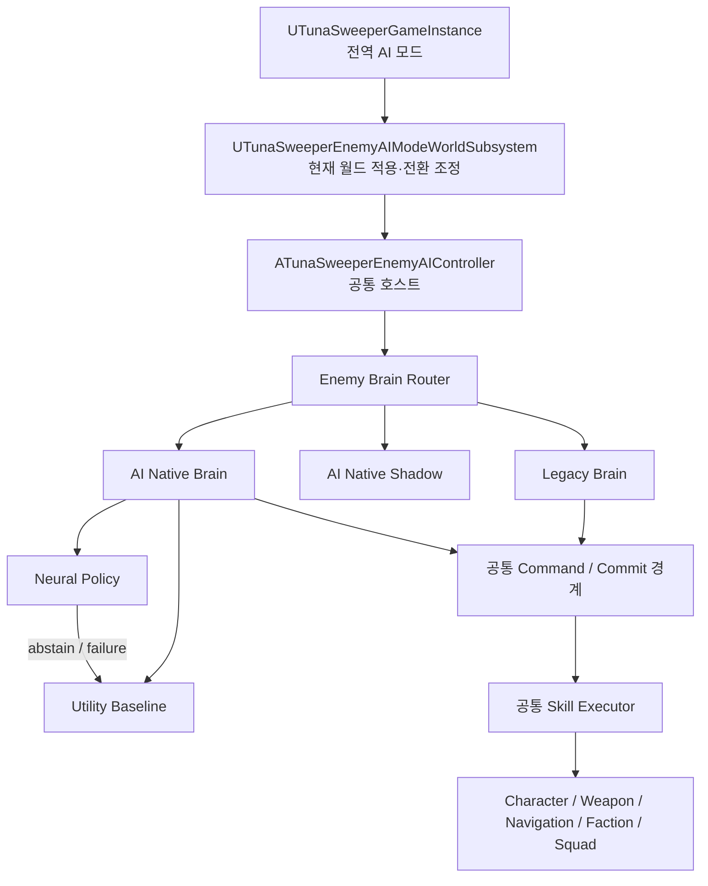

# AI Native NPC v0.4.6 TunaSweeper 적용성 검토

- 검토일: 2026-08-03
- 문서 상태: 검토 완료
- 대상 프로젝트: `TunaSweeper/TunaSweeper.uproject`
- 대상 엔진: Unreal Engine 5.7
- 대상 외부 계약: AI Native NPC 요구사항·UE 구현 계획 v0.4.6 / Schema 2.0 RC5
- 검토 범위: 현재 표준 적 AI와 AI Native NPC 구현의 공존, GameInstance 전역 선택, 실행 중 안전한 전환

## 1. 검토 결론

AI Native NPC 구조는 TunaSweeper에 적용할 수 있다. 다만 외부 저장소를 플러그인처럼 바로 넣어 기존 적 AI를 대체할 수 있는 상태는 아니다.

| 항목 | 판정 | 근거 |
|---|---|---|
| 기존 AI와 신규 AI의 선택 구조 | GO | 현재 Controller를 호스트로 유지하고 내부 Brain을 교체하면 가능 |
| GameInstance 전역 모드 선택 | GO | GameInstance는 모드 설정과 변경 알림만 소유하고 WorldSubsystem이 월드 적용을 담당 |
| 새로 스폰되는 적의 즉시 모드 적용 | GO | 기존 스폰 경로와 Controller 초기화 시 전역 모드를 조회 가능 |
| 이미 실행 중인 적의 모드 전환 | 조건부 GO | 전환 요청은 즉시 받고 실제 교체는 다음 안전한 Skill 경계에서 수행 |
| AI Native Utility Baseline 수직 슬라이스 | 조건부 GO | 외부 문서가 RC5 Utility Baseline 구현을 허용 |
| AI Native Neural을 기본 게임 AI로 사용 | NO-GO | V1 Neural·OOD·Calibration·최종 Freeze가 아직 보류 상태 |
| 기존 적 AI 제거 | NO-GO | 전투 기능 동등성, 회귀 검증, fallback 경로가 확보되지 않음 |

권장 기본값은 `Legacy`다. 첫 신규 모드는 `AINativeShadow`, 첫 실제 행동 모드는 `AINativeUtility`로 한다. `AINativeNeural`은 상위 계약과 Runtime Gate가 닫힌 뒤에만 활성화한다.

## 2. 검토한 외부 자료

- 요구사항·구현 계획:
  - <https://github.com/naming-sense/AI-Native-NPC/blob/main/docs/current/requirements/ai_native_npc_requirements_implementation_plan_v0.4.6.md>
- Unreal Engine 5.7 구현 계획:
  - <https://github.com/naming-sense/AI-Native-NPC/blob/main/docs/current/unreal/ai_native_npc_ue57_manny_spatial_vision_audio_implementation_plan_v0.4.6.md>
- Skill Registry:
  - <https://github.com/naming-sense/AI-Native-NPC/blob/main/contracts/current/skill_registry_v1.yaml>
- Goal Registry:
  - <https://github.com/naming-sense/AI-Native-NPC/blob/main/contracts/current/goal_registry_v1.yaml>
- 저장소 루트:
  - <https://github.com/naming-sense/AI-Native-NPC>

외부 저장소의 현재 `main`은 문서, YAML 계약, 생성 Python/C++ 계약을 중심으로 한 최소 저장소다. 실제 Unreal Runtime 구현과 Runtime Gate 증거는 별도 구현이 필요하다.

또한 검토 시점의 저장소 루트에서 명시적인 `LICENSE` 파일을 확인하지 못했다. 외부 계약 YAML이나 생성 C++ Header를 프로젝트에 직접 복사하기 전 사용 권한을 확인해야 한다.

## 3. 외부 문서에서 지금 구현 가능한 범위

외부 문서의 현재 판정은 다음과 같다.

- Schema·Registry·Generated contract와 Utility Baseline 수직 슬라이스: 진행 가능
- 데이터 Capture, Candidate/Commit 경로: 진행 가능
- 현재 RC5 2-output Neural 연결: smoke test만 가능
- V1 Neural, OOD, Calibration: 보류
- 대량 학습 데이터와 최종 Freeze: 보류

Phase 0 공식 범위는 다음과 같다.

- Goal: `IdleObserve`, `InvestigateDisturbance`
- Skill: `Idle`, `TurnTo`, `Approach`, `Investigate`, `SearchArea`
- Control Candidate: `ContinueCurrentAction`
- Target: `Entity`, `SoundEvent`, `LastKnownPosition`, `Waypoint`, `NoTarget`
- Policy: Utility Baseline과 단순 Neural smoke
- 권위: Single-player에서도 GameThread의 서버 권위 형태

TunaSweeper의 실제 적은 이미 근접·원거리 공격, 재장전, 사선 회복, 분대 제압/재배치 행동을 사용한다. 따라서 공식 Phase 0만으로는 현재 게임의 전투 기능을 대체할 수 없다.

Registry에는 V1용 `CombatEngage` Goal과 `Attack` Skill이 존재한다. 초기 통합에서는 현재 전투 FSM 전체를 복합 `Attack` Skill Executor로 감싸 동등성을 유지하고, 이후 필요할 때 전술 행동을 더 세분화하는 방향이 안전하다.

## 4. 현재 TunaSweeper 적 AI 구조

### 4.1 주요 코드

| 위치 | 현재 책임 |
|---|---|
| `Source/TunaSweeper/Public/AI/TunaSweeperEnemyAIController.h` | 인지·경계·비전투·근접·원거리·분대 상태와 설정 소유 |
| `Source/TunaSweeper/Private/AI/TunaSweeperEnemyAIController.cpp` | Target 탐색, FSM 전이, 이동 요청, 사격, 재장전, 소음·분대 처리 |
| `Source/TunaSweeper/Public/AI/TunaSweeperEnemyCharacter.h` | 체력, 공격 API, 무기·탄약 Runtime 상태 |
| `Source/TunaSweeper/Private/AI/TunaSweeperEnemyCharacter.cpp` | 실제 피해·투사체·재장전·드롭 실행 |
| `Source/TunaSweeper/Public/Subsystem/TunaSweeperNoiseSubsystem.h` | 월드 소음 Event와 청취 강도 계산 |
| `Source/TunaSweeper/Public/Subsystem/TunaSweeperEnemySquadSubsystem.h` | 2인 분대 역할·사격·이동 lease와 공유 접촉 정보 |
| `Source/TunaSweeper/Public/Subsystem/TunaSweeperFactionSubsystem.h` | 적대 관계와 Target/피해 허용 판정 |
| `Source/TunaSweeper/Private/Subsystem/TunaSweeperEnemySpawnSubsystem.cpp` | 적 스폰, 전투 Profile과 진영·분대 정보 적용 |
| `Source/TunaSweeper/Public/Game/TunaSweeperGameInstance.h` | 맵을 넘어 유지되는 게임 설정과 런타임 상태 |

### 4.2 현재 실행 흐름

```text
EnemyCharacter 생성
→ AIControllerClass로 ATunaSweeperEnemyAIController 빙의
→ 약 0.25초 간격 UpdateAttackTarget
→ 매 Tick Awareness / NonCombat / Melee / Ranged FSM 갱신
→ Controller가 MoveTo·회전·사격·재장전을 직접 요청
→ EnemyCharacter와 Weapon이 실제 공격·탄약·피해 실행
```

현재 `ATunaSweeperEnemyAIController`는 판단과 실행 조정이 한 클래스에 결합되어 있다. 별도의 Behavior Tree는 사용하지 않으며, AI Native가 요구하는 Belief, Goal Manager, Typed Target, Candidate Builder, Commit Coordinator 경계도 아직 없다.

### 4.3 재사용 가치가 높은 부분

다음 구현은 AI Native 경로에서도 유지하는 것이 좋다.

- `ATunaSweeperEnemyCharacter`의 체력·사망·무기·탄약·재장전 Runtime
- `TryFireProjectileAt`, `AttackTarget` 등 실제 전투 실행 API
- `UTunaSweeperFactionSubsystem`의 적대·피해 권한
- `UTunaSweeperEnemySquadSubsystem`의 역할·사격·이동 lease
- `UTunaSweeperNoiseSubsystem`의 소음 전파와 감쇠 계산
- NavigationSystem 기반 이동과 기존 이동 목표 검증
- 현재 원거리 전투 FSM의 Aim/Firing/Recover/Reload/Reposition 세부 동작
- 기존 적 Combat Profile JSON과 스폰 데이터
- 기존 전투 Automation Test와 디버그 Snapshot

## 5. 현재 구조와 AI Native 계약의 대응

| AI Native 계층 | 현재 대응 구현 | 상태 | 필요한 작업 |
|---|---|---|---|
| Authoritative World | Character, Weapon, Faction, Squad | 양호 | 모델이 직접 변경하지 못하도록 공통 실행 경계 유지 |
| Perception | 직접 LOS, Faction actor 열거, NoiseSubsystem | 부분 충족 | 원시 감지와 허용된 Belief 분리 |
| Belief Runtime | CurrentTargetActor, LastKnownTargetLocation | 부족 | source, observed time, confidence, TTL, revision 추가 |
| Goal Manager | Awareness/FSM 상태에 암묵적으로 포함 | 부족 | 명시적 Goal instance, phase, revision 도입 |
| Typed Target | Actor pointer와 FVector | 부족 | StableId, Generation, Revision, Kind별 snapshot 추가 |
| Target Slotter | 없음 | 미구현 | 16 regular + NoTarget 고정 slot 구현 |
| Candidate Builder | 상태별 if/switch | 미구현 | 16×17 후보와 hard mask 구현 |
| Utility Baseline | 현재 규칙 기반 FSM | 직접 호환 안 됨 | 동일 Candidate 계약 위에서 score를 내는 별도 정책 구현 |
| Neural Policy | 없음 | 미구현 | NNE backend와 World queue 필요 |
| Post-process | 부분적인 상태 전환 비용 | 부족 | switch cost, fallback reason, stale 처리 구현 |
| Commit Coordinator | 각 FSM 함수가 직접 실행 | 부족 | 최신 Target·Goal·자원 검증 후 Skill 시작 경계 구현 |
| Skill Executor | Controller와 Character에 분산 | 재사용 가능 | 공통 명령/결과 인터페이스로 감싸기 |

## 6. 권장 아키텍처

Controller 클래스를 `LegacyController`와 `AINativeController` 두 개로 나누고 실행 중 재빙의하는 방식은 권장하지 않는다.

- 기존 이동 request와 완료 callback이 끊긴다.
- Controller가 소유한 Target·FSM·분대 등록 상태가 소실된다.
- HUD와 디버그 코드가 현재 Controller 구체 타입을 캐스팅한다.
- 전환 순간 Pawn focus, movement, squad lease가 불일치할 수 있다.
- 별도 Controller 간 상태 handoff가 Brain 교체보다 복잡하다.

대신 현재 Controller를 공통 호스트로 유지하고 내부 Brain을 교체한다.



### 6.1 GameInstance 책임

`UTunaSweeperGameInstance`는 다음만 소유한다.

- 전역 기본 AI 모드
- 모드 조회/변경 API
- 모드 변경 delegate
- 새 월드와 새 적이 조회할 초기값

GameInstance가 NPC Actor, WorldSubsystem, NNE request, 모델 instance를 직접 소유해서는 안 된다. GameInstance는 맵 전환 중에도 남지만 World 객체는 파괴되기 때문이다.

권장 공개 계약 예시:

```cpp
UENUM(BlueprintType)
enum class ETunaSweeperEnemyAIMode : uint8
{
    Legacy,
    AINativeShadow,
    AINativeUtility,
    AINativeNeural
};

UFUNCTION(BlueprintCallable)
void SetEnemyAIMode(
    ETunaSweeperEnemyAIMode NewMode,
    bool bApplyToExistingEnemies = true);

UFUNCTION(BlueprintPure)
ETunaSweeperEnemyAIMode GetEnemyAIMode() const;
```

### 6.2 WorldSubsystem 책임

`UTunaSweeperEnemyAIModeWorldSubsystem`은 다음을 담당한다.

- 현재 World의 Controller 등록/해제
- GameInstance 모드 변경 delegate 구독
- 기존 적에게 Brain 전환 요청 전달
- 모드별 Controller 수와 전환 실패 이유 집계
- 레벨 전환 시 delegate와 약한 참조 정리

NNE를 도입하면 모델 공유, instance pool, queue, batch는 별도 `UTunaSweeperAINativeInferenceWorldSubsystem`이 맡는다. NPC마다 ModelData나 NNE instance를 만들지 않는다.

### 6.3 Controller 호스트 책임

공통 Controller는 다음 엔진 책임만 유지한다.

- Possess/UnPossess와 Navigation callback
- Faction의 Generic Team 연동
- 공통 perception input 수집
- 활성 Brain lifecycle
- 공통 Skill Executor와 Commit 호출
- 공통 디버그 Snapshot

판단 규칙 자체는 `Legacy Brain` 또는 `AI Native Brain`이 소유한다.

### 6.4 Brain 계약

Brain은 최소한 다음 lifecycle을 제공해야 한다.

```text
Initialize(Context)
Activate(HandoffSnapshot)
TickDecision(DeltaSeconds)
HandleEvent(Event)
RequestDeactivate(Reason)
CanDeactivateNow()
BuildHandoffSnapshot()
Deactivate()
```

Brain은 직접 피해를 주거나 Actor를 스폰하지 않는다. 실행 가능한 Skill command만 Commit Coordinator에 제안한다.

## 7. 모드 정의

### 7.1 Legacy

- 현재 구현과 같은 결과를 내는 기본 모드
- 초기 리팩터링에서는 기존 코드 경로를 그대로 호출
- AI Native 데이터 구조나 NNE에 의존하지 않음
- 신규 구조 장애 시 최종 수동 rollback 경로

### 7.2 AINativeShadow

- AI Native Belief, Target, Candidate, Utility/Neural 판단까지 수행
- 실제 World 변경과 Skill Commit은 하지 않음
- Legacy Brain이 실제 행동을 계속 수행
- 두 정책의 선택, Candidate miss, Target miss, latency를 기록

Shadow는 신규 정책을 게임플레이에 노출하지 않고 실제 플레이 분포에서 검증할 수 있으므로 가장 먼저 구현해야 한다.

### 7.3 AINativeUtility

- AI Native의 Belief→Goal→Target→Candidate→Utility→Commit 전체 경로 사용
- 신경망 없이 결정론적 Utility score 사용
- Schema, Candidate, Commit, Skill Executor 검증의 기준선
- Neural 장애 시 자동 fallback 대상

### 7.4 AINativeNeural

- AI Native 공통 Candidate에 대해 Neural score 사용
- 계약 mismatch, timeout, NaN/Inf, stale, OOD, 낮은 calibration에서는 Utility로 fallback
- Utility 경로와 Skill Executor를 공유
- 외부 V1 계약과 Runtime Gate가 통과하기 전 Shipping 기본값으로 금지

Neural 실패에서 곧바로 Legacy FSM 내부 상태로 뛰어드는 자동 fallback은 피한다. Neural과 Utility는 동일 AI Native 계약을 공유하므로 안전하게 대체할 수 있지만, Legacy는 상태 의미가 달라 표준 Brain handoff 절차가 필요하다.

## 8. 실행 중 모드 전환 규약

사용자는 언제든 모드 변경을 요청할 수 있다. 그러나 실제 Brain 교체는 안전 경계에서 수행한다.

### 8.1 즉시 반영 가능한 경우

- 새로 스폰되는 적
- Idle 또는 실행 Skill이 없는 적
- Commit 이전의 대기 상태

### 8.2 안전 경계를 기다리는 경우

- 점사 중인 적
- 재장전 중인 적
- NavMesh 이동 request가 실행 중인 적
- 분대 이동/사격 lease를 가진 적
- interruptibility가 `PhaseBoundary`, `EmergencyOnly`, `Never`인 Skill

### 8.3 전환 순서

```text
GameInstance 모드 변경
→ WorldSubsystem이 전환 generation 증가
→ Controller가 현재 Brain에 deactivate 요청
→ pending NNE request supersede/cancel
→ 새 사격·새 이동 Commit 차단
→ 현재 Skill의 안전 경계 도달
→ Brain이 표준 HandoffSnapshot 작성
→ 기존 Brain deactivate
→ 새 Brain activate
→ 최신 World/Belief로 즉시 재판단
```

### 8.4 전환 중 유지할 상태

- Pawn transform과 velocity
- 현재 체력과 사망 상태
- 무기, 장탄, 예비 탄약, 재장전 결과
- Faction과 Squad identity
- 이미 발사된 투사체와 이미 적용된 피해
- Target identity와 허용된 마지막 관측 snapshot
- 현재 Goal의 공통 표현이 있으면 Goal 요약

### 8.5 전환 중 폐기할 상태

- pending NNE request와 cancellation token
- 이전 Brain 전용 FSM timer
- 이전 Decision ID와 Candidate hash
- Commit되지 않은 이동·공격 proposal
- 만료된 Belief/Event

강제 즉시 전환은 개발·디버그 전용으로 둔다. 강제 전환은 이동을 중지하고 lease를 해제한 뒤 안전한 Idle 상태에서 새 Brain을 시작한다.

## 9. TunaSweeper 전투를 Skill에 매핑하는 방법

| 현재 상태/행동 | 초기 AI Native 매핑 |
|---|---|
| Unaware Idle/Wander | `IdleObserve` + `Idle`/`ContinueCurrentAction` |
| Suspicious 회전 | `InvestigateDisturbance.Orient` + `TurnTo` |
| 의심 위치 접근 | `InvestigateDisturbance.Navigate` + `Approach`/`Investigate` |
| 주변 탐색 | `InvestigateDisturbance.Search` + `SearchArea` |
| 적대 Target 발견 | `CombatEngage` Goal 활성화 |
| Aim/Firing/Recover/Reload | 복합 `Attack(Entity)` Executor 내부 상태 |
| 거리 좁히기 | `Approach(Entity)` 또는 Attack 내부 preferred distance |
| 거리 벌리기 | `KeepDistance`/`RetreatFrom` |
| 엄폐·사선 회복·재배치 | 초기에는 Attack 내부 기존 FSM 재사용, 후속에 `TakeCover` 등으로 분리 |
| Hit Evade | 긴급 `RetreatFrom` 또는 기존 Attack Executor의 interrupt substate |
| 분대 Suppress/Reposition | SquadSubsystem이 권한을 소유하고 Candidate hard mask에 반영 |

현재 Registry에는 독립적인 `Reload`, `SeekLineOfFire`, `CrossReposition` Skill이 없다. 계약을 임의로 변경하면 Schema/Registry/Generated C++/Python/Golden/Model Bundle hash가 모두 달라진다. 초기에는 기존 전투 FSM의 내부 substate로 유지하는 편이 안전하다.

## 10. Belief와 Hidden Information 경계

AI Native 계약은 NPC가 실제로 아는 정보만 정책에 전달해야 한다.

현재 Controller는 `CurrentTargetActor`를 유지하고 사선·거리 판정에서 Actor의 현재 Transform을 읽을 수 있다. AI Native 경로에서는 다음을 강제해야 한다.

- 시야가 있을 때만 `Entity`의 perceived position을 갱신
- 시야 상실 시 `Entity` Target을 추적 대상에서 제거
- 시야 상실 순간 immutable `LastKnownPosition` 생성
- 소리 위치는 발생 시점의 immutable `SoundEvent`로 유지
- 숨은 Actor의 현재 위치·속도·체력을 Feature나 이동 목표 계산에 사용하지 않음
- Squad 공유 정보도 공유가 허용된 snapshot과 시간·TTL만 사용

필요한 Target identity:

```text
IdentityKey = Kind + StableId + Generation
SnapshotKey = IdentityKey + Revision
```

현재 Actor pointer와 `FVector LastKnownTargetLocation`만으로는 비동기 응답의 stale 여부를 검증할 수 없다. World epoch 안에서 안정적인 Entity ID, spawn generation, Belief revision을 제공하는 Registry가 필요하다.

## 11. 분대 시스템 통합 원칙

기존 `UTunaSweeperEnemySquadSubsystem`은 모델보다 상위의 authoritative gameplay 규칙으로 유지한다.

- 현재 Suppress/Reposition 역할은 모델이 임의로 바꾸지 못함
- 사격 lease가 없는 NPC의 `Attack` Candidate는 hard mask
- 이동 lease가 없는 NPC의 전술 이동 Candidate는 hard mask
- 공유 Target은 Belief source와 freshness를 기록
- 오래된 `CycleId` 결과는 현재와 같이 거부
- Brain 전환 시 현재 lease를 명시적으로 유지하거나 안전하게 반납

모델 입력에는 분대 역할과 허용 상태를 Feature로 제공할 수 있지만, 최종 사격·이동 권한은 Candidate Builder와 Commit Coordinator가 검증한다.

## 12. 저장과 레벨 전환

현재 `UTunaSweeperSaveGame`은 적 개별 Goal, Belief, Event Buffer, Active Skill을 저장하지 않는다. 적은 레벨 데이터에서 다시 스폰된다.

초기 도입에서는 다음 정책이 현실적이다.

- 전역 AI 모드는 개발 설정으로만 유지하고 개별 플레이 세이브에는 저장하지 않음
- 레벨 전환 시 적 Brain 상태와 pending inference를 폐기
- 새 레벨에서 GameInstance 기본 모드를 적용해 새 적 생성
- 외부 문서 수준의 NPC Save/Load는 적 Runtime 영속화가 실제 게임 요구가 될 때 별도 구현

AI 모드를 플레이어 옵션으로 노출하기로 결정하면 per-save가 아니라 전역 SaveSettings에 저장하는 편이 적합하다. 이 경우 `Docs/save_persistence.md`도 함께 갱신해야 한다.

## 13. NNE와 모듈 의존성

현재 프로젝트는 다음 AI Native 관련 의존성을 활성화하지 않았다.

- NNE
- NNERuntimeORT 또는 사용할 Runtime backend
- StateTree/GameplayStateTree
- Smart Objects

Utility와 Shadow 첫 단계에는 NNE가 필요하지 않다. Neural 단계에서만 NNE와 backend를 추가한다.

권장 원칙:

- Controller와 Feature Builder가 ORT 구현 타입에 직접 의존하지 않음
- `ITunaSweeperNPCInferenceBackend` 어댑터 뒤에서 NNE runtime을 선택
- 모델과 instance pool은 WorldSubsystem에서 공유
- backend 미등록, 모델 로드 실패, descriptor mismatch는 crash가 아니라 Utility fallback
- Contract hash mismatch는 inference 전에 hard reject

StateTree는 복합 Skill 구현에 선택적으로 사용할 수 있지만 Brain 선택 구조의 필수 의존성은 아니다.

## 14. 단계별 구현 계획

### 단계 0 — 계약 고정과 권한 확인

- 사용할 외부 commit/tag와 Schema/Registry hash 고정
- 외부 계약·생성 코드 사용 권한 확인
- 프로젝트 안의 contract lock 위치 결정
- `Legacy`, `Shadow`, `Utility`, `Neural` 모드 의미 고정

완료 조건:

- 계약 버전과 hash가 문서화됨
- 라이선스 또는 사용 권한이 확인됨
- 계약 변경 절차가 정해짐

### 단계 1 — Brain Router와 Legacy 무회귀

- GameInstance AI mode API 추가
- WorldSubsystem mode coordinator 추가
- Controller 내부 Brain lifecycle 추가
- 기존 코드를 Legacy Brain 경로로 격리
- 새로 스폰된 적과 기존 적의 안전 전환 구현

완료 조건:

- 기본값 `Legacy`에서 기존 전투 Automation Test 통과
- AI mode 전환을 사용하지 않을 때 플레이 동작이 기존과 동일
- 레벨 전환과 적 사망 후 delegate/lease 누수 없음

### 단계 2 — 공통 실행/Commit 경계

- 이동, 회전, 공격, 재장전 명령 인터페이스 작성
- Character/Weapon 실행 API 재사용
- Skill terminal result 표준화
- 분대·Faction·Target 최신 상태 재검증

완료 조건:

- Legacy Brain도 공통 Executor를 통해 World를 변경
- 허용되지 않은 Target, 사격 lease, stale command가 실행되지 않음
- 이미 발사된 투사체와 전환 중 상태가 일관됨

### 단계 3 — Belief/Target/Shadow

- NoiseSubsystem→SoundEvent adapter
- LOS/Faction→Entity Belief adapter
- LastKnownPosition snapshot
- Target StableId/Generation/Revision
- Event Buffer와 Target Slotter
- Candidate Builder와 Utility score
- Shadow 비교 및 capture

완료 조건:

- Shadow가 실제 행동을 변경하지 않음
- 숨은 Actor Transform leakage 0
- Critical Target/Candidate recall 100%
- Legacy 선택과 Utility 선택 차이를 재현 가능한 로그로 비교 가능

### 단계 4 — AI Native Utility 수직 슬라이스

- `IdleObserve`와 `InvestigateDisturbance`
- Phase 0 Skill 실행
- Utility→Commit→Executor 전체 연결
- 실패 시 Continue/Utility Goal fallback

완료 조건:

- 정면 시야 획득
- 뒤쪽 발소리 조사
- 시야 상실 후 마지막 위치 탐색
- Goal Orient→Navigate→Search→Return
- 피격 urgent decision supersede

### 단계 5 — 기존 전투 동등성

- `CombatEngage` Goal 연결
- 기존 전투 FSM을 복합 `Attack` Skill Executor로 감쌈
- 근접/원거리 Profile과 분대 lease 연결
- 실전 교전 A/B와 회귀 테스트

완료 조건:

- 근접·원거리 공격, 재장전, 탄약, 드롭 결과가 Legacy와 동등
- 분대 Suppress/Reposition 규칙 유지
- 전환 중 중복 사격·중복 피해·영구 이동 정지 없음
- Utility 경로가 Legacy fallback 없이 한 전투를 완료 가능

### 단계 6 — Neural smoke와 승격

- NNE backend adapter
- descriptor/shape/dtype/hash 검증
- World queue/batch와 response generation
- Utility fallback health state
- Python↔ONNX Runtime↔UE NNE parity

완료 조건:

- fixture model smoke 통과
- stale Neural response Commit 0
- NNE 누락/실패 packaged build에서 Utility fallback
- 상위 OOD/Calibration/Runtime Gate가 닫히기 전 Shipping 기본값 변경 금지

## 15. 필수 테스트

### 15.1 Legacy 회귀

- 기존 Combat Profile JSON 파싱
- 근접 접근/공격 거리와 쿨다운
- 원거리 점사/회복/재장전
- 사선 막힘과 재배치 fallback
- 2인 분대 role lease와 오래된 CycleId 거부
- Target 상실과 의심 상태 전환

### 15.2 모드 전환

- Idle 중 Legacy→Utility→Legacy
- 이동 중 전환
- 점사 중 전환
- 재장전 중 전환
- 적 사망 직전/직후 전환
- 레벨 전환 직전 모드 변경
- 여러 적에 대한 일괄 전환
- 분대 구성 중 한 적과 두 적 동시 전환

### 15.3 AI Native 계약

- Target slot 결정론
- Candidate mask와 hash parity
- Actor pointer/absolute world coordinate가 Tensor에 포함되지 않음
- Sound/LastKnownPosition TTL
- stale Decision/Target/Goal revision 거부
- Commit 실패 시 자원과 이동 request rollback
- all-masked와 timeout의 Utility/Idle fallback

### 15.4 성능

- Idle/Alert/Combat별 decision frequency
- 30~50 NPC의 GameThread feature build 비용
- NNE queue/batch p50/p95/p99
- deadline miss, stale discard, fallback 비율
- Shadow 모드가 실제 플레이 프레임에 주는 추가 비용

## 16. 주요 위험과 대응

| 위험 | 영향 | 대응 |
|---|---|---|
| 외부 계약이 최종 Freeze 전 | 생성 코드·모델 재작업 | commit/hash lock, 계약 update를 별도 작업으로 관리 |
| 명시적 라이선스 미확인 | 계약·코드 반입 불가 가능성 | 복사 전 권한 확인 |
| Controller 거대 클래스 | 리팩터링 회귀 | Legacy 무변경 경로를 먼저 만들고 작은 단계로 추출 |
| 숨은 Actor 정보 사용 | 정책 품질·공정성 위반 | Belief snapshot 외 World 조회를 Native path에서 금지 |
| 별도 Controller 재빙의 | 이동·분대·디버그 상태 손실 | 단일 Controller 호스트와 Brain Router 사용 |
| Neural 실패에서 Legacy로 즉시 점프 | 상태 의미 불일치 | Neural→Utility 자동 fallback, Legacy 전환은 표준 handoff |
| 분대 권한을 모델이 우회 | 동시 사격·이동 충돌 | hard mask와 Commit에서 lease 재검증 |
| AI mode를 적 세이브에 잘못 저장 | 계약 변경 후 로드 불일치 | 초기에는 전역 개발 설정만 사용 |
| NNE 의존성으로 Legacy 빌드 영향 | 패키징 실패 | NNE는 후속 단계에 추가하고 backend adapter/fallback 유지 |

## 17. 최종 권고

현재 브랜치에서 바로 착수할 수 있는 최적 범위는 다음이다.

1. GameInstance 전역 모드와 World mode coordinator
2. 단일 Controller 호스트의 Brain Router
3. `Legacy` 무회귀 경로
4. `AINativeShadow` 비교 경로
5. Utility 기반 비전투 수직 슬라이스
6. 기존 전투 FSM을 복합 `Attack` Skill로 연결

기존 AI는 Neural이 아니라 Utility 전투 동등성과 장시간 회귀 검증이 끝날 때까지 유지한다. Neural은 같은 AI Native Candidate/Commit/Executor 위에 마지막으로 얹어야 한다.

최종 모드 운영 원칙:

```text
기본 게임: Legacy
개발 비교: AINativeShadow
기능 검증: AINativeUtility
제한적 smoke: AINativeNeural
Neural 실패: AINativeUtility
전체 시스템 수동 rollback: Legacy
```
