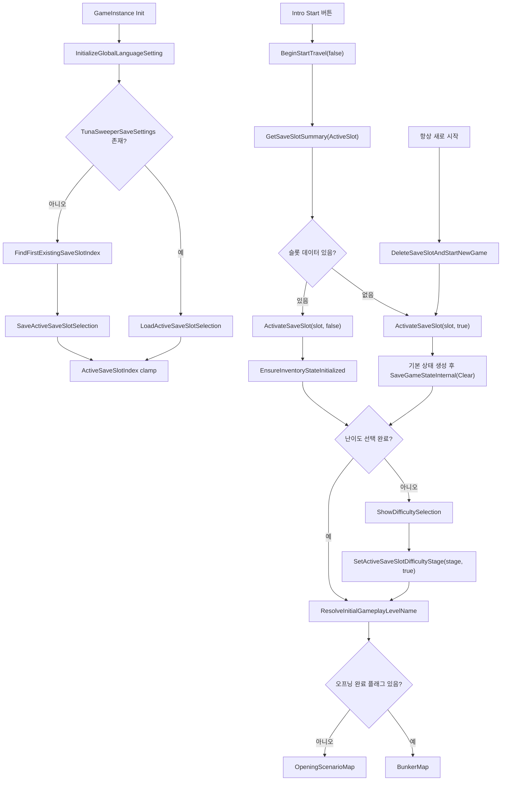
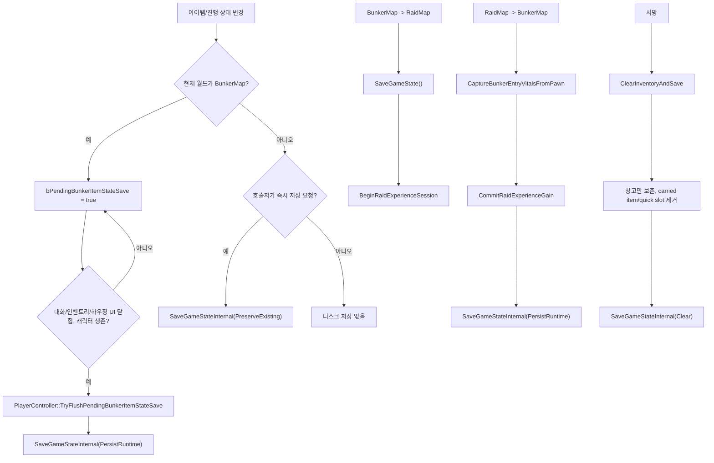
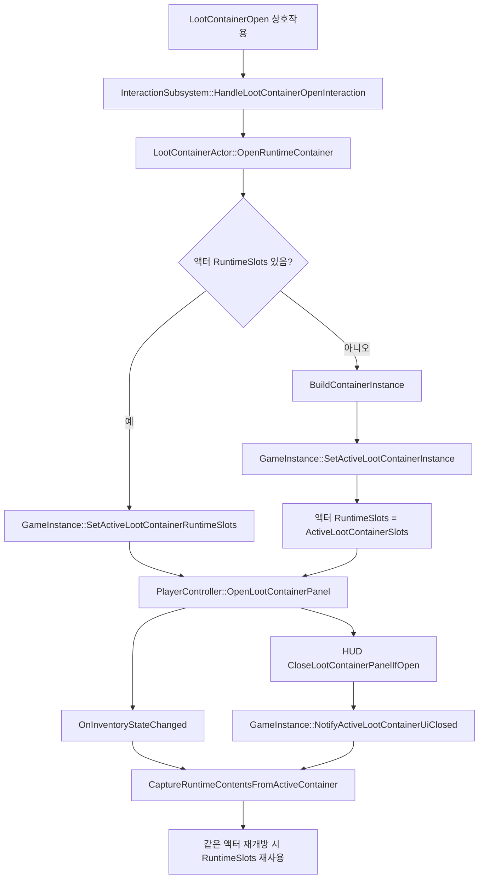

# 저장/로드와 런타임 상태 영속화 흐름

이 문서는 `TunaSweeper`의 저장/로드, 슬롯 활성화, 레벨 이동 저장, 런타임 상태와 저장 상태의 경계를 코드 기준으로 정리한다. 경로 표기는 repo 기준 상대 경로를 사용한다.

## 기준 코드

| 영역 | 코드 |
| --- | --- |
| 저장/로드 중심 | `TunaSweeper/Source/TunaSweeper/Private/Game/TunaSweeperGameInstance.cpp`, `TunaSweeper/Source/TunaSweeper/Public/Game/TunaSweeperGameInstance.h` |
| SaveGame 타입 | `TunaSweeper/Source/TunaSweeper/Public/Inventory/TunaSweeperSaveGame.h` |
| 아이템/슬롯 타입 | `TunaSweeper/Source/TunaSweeper/Public/Inventory/TunaSweeperInventoryTypes.h` |
| 타이틀 슬롯/난이도/설정 UI | `TunaSweeper/Source/TunaSweeper/Private/UI/TunaSweeperIntroMenuWidget.cpp` |
| 오프닝 시나리오 완료 pending | `TunaSweeper/Source/TunaSweeper/Private/UI/TunaSweeperScenarioPresentationWidget.cpp`, `TunaSweeper/Source/TunaSweeper/Private/Player/TunaSweeperPlayerController.cpp` |
| 레벨 이동/추출 | `TunaSweeper/Source/TunaSweeper/Private/Interaction/TunaSweeperLevelTravelInteractableActor.cpp`, `TunaSweeper/Source/TunaSweeper/Private/Interaction/TunaSweeperExtractionPointActor.cpp` |
| 사망 저장 | `TunaSweeper/Source/TunaSweeper/Private/Character/TunaSweeperTopDownCharacter.cpp` |
| 퀘스트 저장 연동 | `TunaSweeper/Source/TunaSweeper/Private/Subsystem/TunaSweeperQuestSubsystem.cpp` |
| 메모/문/월드 진행 | `TunaSweeper/Source/TunaSweeper/Private/Interaction/TunaSweeperMemoActor.cpp`, `TunaSweeper/Source/TunaSweeper/Private/Interaction/TunaSweeperPersistentDoorActor.cpp`, `TunaSweeper/Source/TunaSweeper/Private/Interaction/TunaSweeperWorldProgressActor.cpp` |
| 하우징 | `TunaSweeper/Source/TunaSweeper/Private/Subsystem/TunaSweeperHousingSubsystem.cpp` |
| 런타임 스폰 | `TunaSweeper/Source/TunaSweeper/Private/Subsystem/TunaSweeperEnemySpawnSubsystem.cpp`, `TunaSweeper/Source/TunaSweeper/Private/Subsystem/TunaSweeperBunkerRuntimeSpawnSubsystem.cpp`, `TunaSweeper/Source/TunaSweeper/Private/Subsystem/TunaSweeperMemoSubsystem.cpp` |

## 슬롯과 저장 파일 구조

`UTunaSweeperGameInstance`의 `TunaSweeperSave` 네임스페이스가 저장 슬롯 규칙을 가진다.

| 항목 | 값/동작 |
| --- | --- |
| 플레이 저장 슬롯 prefix | `TunaSweeperSave_Slot` |
| 슬롯 인덱스 | `1..3`, `SanitizeSaveSlotIndex()`에서 clamp |
| 실제 슬롯명 | `TunaSweeperSave_Slot01`, `TunaSweeperSave_Slot02`, `TunaSweeperSave_Slot03` |
| SaveUserIndex | `0` |
| SaveGame 파일 위치 | `Saved/SaveGames/<SlotName>.sav` |
| 백업 위치 | `Saved/SaveGames/Backups/SaveSlot%02d_%Y%m%d_%H%M%S_<ticks>.sav` |
| 백업 보관 수 | 최신 기준 최대 `30`개 |
| 현재 세이브 버전 | `18` |
| SaveSettings 슬롯명 | `TunaSweeperSaveSettings` |

`UTunaSweeperSaveGame`은 실제 플레이 상태를 저장한다. `UTunaSweeperSaveSettings`는 플레이 데이터가 아니라 `LastSelectedSaveSlotIndex`만 저장하는 별도 SaveGame이다.

타이틀 설정은 SaveGame 슬롯과 분리된다.

- 언어: `UTunaSweeperGameInstance::LoadGlobalLanguageSetting()`/`SaveGlobalLanguageSetting()`이 `GGameUserSettingsIni`의 `TunaSweeper.InterfaceSettings/Language` 값을 읽고 쓴다.
- 화면 모드/해상도: `UTunaSweeperIntroMenuWidget::ApplyDisplaySettings()`와 `ApplyResolutionSetting()`이 `UGameUserSettings`에 적용하고 `SaveSettings()`를 호출한다.
- DLSS 선호 값: `UTunaSweeperIntroMenuWidget::LoadTitleGraphicsSettings()`/`SaveTitleGraphicsSettings()`가 `GGameUserSettingsIni`의 `TunaSweeper.GraphicsSettings/DLSSMode`를 읽고 쓴다.

## 슬롯 활성화와 시작 흐름

세부 분기는 다음과 같다.

1. `UTunaSweeperGameInstance::Init()`은 언어 설정을 먼저 적용한다. 이후 `LoadActiveSaveSlotSelection()`이 `TunaSweeperSaveSettings`를 읽어 마지막 선택 슬롯을 가져온다. 설정 파일이 없으면 `FindFirstExistingSaveSlotIndex()`로 `1..3` 중 첫 기존 저장 슬롯을 찾고, 없으면 `1`번 슬롯을 선택한 뒤 `SaveActiveSaveSlotSelection()`으로 설정 슬롯을 만든다.
2. 타이틀의 `Start`는 `UTunaSweeperIntroMenuWidget::BeginStartTravel(false)`로 들어간다. 현재 활성 슬롯 요약을 `GetSaveSlotSummary()`로 읽는다.
3. 기존 데이터가 없으면 `ActivateSaveSlot(slot, true)`가 기본 인벤토리/창고/퀘스트/진행 상태를 생성하고 `SaveGameStateInternal(EUsableQuickSlotSaveMode::Clear)`로 빈 새 슬롯을 즉시 저장한다. 이때 난이도는 기본값 `1`이지만 `bActiveSaveSlotDifficultySelected=false`다.
4. 기존 데이터가 있으면 `ActivateSaveSlot(slot, false)`가 `EnsureInventoryStateInitialized()`만 호출한다. 실제 로드는 lazy 방식으로 `LoadGameState()`가 담당한다.
5. 난이도가 아직 선택되지 않은 슬롯이면 `ShowDifficultySelection()`으로 이동한다. 선택 후 `HandleDifficultyStartClicked()`가 `SetActiveSaveSlotDifficultyStage(stage, true)`를 호출해 난이도와 `bDifficultySelected=true`를 저장하고 다시 시작 목적지를 계산한다.
6. 목적지 계산은 `ResolveInitialGameplayLevelName()`이다. 난이도 미선택이면 `IntroMap`, 오프닝 완료 플래그 `scenario.opening.awakening`이 있으면 `BunkerMap`, 아니면 `OpeningScenarioMap`을 반환한다.
7. `AlwaysNewStart`는 `DeleteSaveSlotAndStartNewGame()`으로 기존 슬롯 파일을 삭제한 뒤 같은 슬롯에 새 기본 상태를 저장한다.
8. 슬롯 선택 메뉴의 `PrimarySaveSlotButton`은 `SetActiveSaveSlotIndex(SelectedSaveSlotIndex)`만 수행한다. 이 함수는 활성 슬롯 인덱스를 저장 설정에 반영하고, 기존 런타임 상태를 `ResetRuntimeStateForSaveSlotSelection()`으로 비운다.

## SaveGame 본문 저장 흐름

공개 저장 진입점은 `UTunaSweeperGameInstance::SaveGameState()`이고, 실제 파일 쓰기는 `SaveGameStateInternal()`이다.

`SaveGameState()`는 `bPendingBunkerItemStateSave`를 보고 퀵슬롯 저장 모드를 고른다.

| 모드 | 쓰는 경우 | `UsableQuickSlots` 처리 |
| --- | --- | --- |
| `PersistRuntime` | 벙커 item dirty flush, `RaidMap -> BunkerMap` 생존 복귀 | 현재 런타임 퀵슬롯을 저장 |
| `PreserveExisting` | 일반 저장, 퀘스트/시나리오/메모/마커 등 비아이템 저장 | 기존 저장 파일의 퀵슬롯을 보존 |
| `Clear` | 새 게임 기본 저장, 사망 저장 | 퀵슬롯을 비움 |

`SaveGameStateInternal()`의 실제 순서는 다음과 같다.

1. `PreserveExisting` 모드이고 기존 슬롯이 있으면 기존 `UTunaSweeperSaveGame`을 먼저 로드한다. 이는 현재 저장에 포함하지 않는 런타임 퀵슬롯과 그 퀵슬롯이 참조하던 아이템 인스턴스를 보존하기 위한 분기다.
2. 새 `UTunaSweeperSaveGame` 객체를 만든다.
3. `CollectPlayerOwnedItemUids()`로 플레이어 소유 UID를 수집한다. 기본 수집 대상은 `InventorySlots`, `EquipmentSlots`, `AuxiliaryBagSlots`, `StorageSlots`이고, `PersistRuntime`일 때만 `UsableQuickSlots`도 포함한다. 각 아이템의 `AttachmentSlots`에 있는 UID도 재귀적으로 포함한다.
4. 수집한 UID를 `ItemInstancesByUid`에서 찾아 `MakeItemInstanceForSave()`로 정규화한 뒤 `SaveGame->ItemInstances`에 넣는다. 이때 `LoadedAmmoItemId`, `LoadedAmmoCount`, `SelectedAmmoItemId`가 `NormalizeLoadedAmmoPersistenceFields()`로 맞춰진다.
5. 세이브 메타데이터를 기록한다. `SaveVersion=18`, `SaveSlotIndex`, 누적 플레이 시간, 난이도, 난이도 선택 여부, `LastSavedAtTicks`, `TotalExperiencePoints`가 여기서 들어간다.
6. 시나리오 플래그, 메모, 획득 이력, 지도 마커, 월드 진행, 돼지저금통, 하우징, 하우징 해금, 제작대 레시피 해금을 배열로 내보내고 정렬한다.
7. 퀘스트 서브시스템이 있으면 `ExportQuestProgressForSave()`로 `QuestProgressStates`, `TrackedQuestId`, `QuestCoinBalance`를 내보낸다.
8. 슬롯 배열과 창고, 상점 재고 상태를 복사한다. `StorageSlotCapacity`는 정규화하고, `StorageSlots`는 그 용량까지 보장한다. `ShopStockStates`는 `ShopId`, `SlotIndex`, `ItemId` 순으로 정렬한다.
9. 퀵슬롯 모드를 적용한다. `PreserveExisting`에서는 기존 저장 파일의 `UsableQuickSlots`를 가져오되, 기존 저장의 아이템 인스턴스에 없는 UID는 제거한다. 보존된 퀵슬롯 아이템과 부착물 UID는 새 `ItemInstances`에도 다시 추가한다.
10. 기존 슬롯 파일이 있으면 `BackupExistingSaveGame()`으로 백업을 만든다. 백업 실패 시 저장 전체를 실패 처리한다.
11. `UGameplayStatics::SaveGameToSlot(SaveGame, GetSaveGameSlotName(ActiveSaveSlotIndex), 0)`로 최종 저장한다.

## LoadGame 본문 로드 흐름

`EnsureInventoryStateInitialized()`가 lazy load의 관문이다. 이미 초기화되어 있으면 반환하고, 아니면 `LoadGameState()`를 시도한다. 로드 실패 시 `GenerateDefaultInventoryState()`로 새 기본 상태를 만든다.

`LoadGameState()`의 주요 복구 순서는 다음과 같다.

1. `GetExistingSaveGameSlotName(ActiveSaveSlotIndex)`가 비어 있으면 실패한다. 실제 로드는 `UGameplayStatics::LoadGameFromSlot()`이다.
2. 플레이 시간, 난이도, `bDifficultySelected`, 경험치를 복구한다. 세이브 버전이 `18`보다 낮으면 난이도 선택을 완료한 것으로 간주한다. 오프닝 완료 플래그가 있으면 역시 난이도 선택 완료로 보정한다.
3. 레이드 경험치 런타임 값은 저장에서 가져오지 않는다. `RaidStartExperiencePoints=TotalExperiencePoints`, pending 경험치와 pending 애니메이션은 초기화된다.
4. `CompletedScenarioFlags`, `AcquiredMemoIds`, `EverAcquiredItemIds`, `MapMarkers`를 검증하며 복구한다. 마커는 중복/잘못된 `MarkerId`를 건너뛰고 `NextMapMarkerId`를 재계산한다.
5. `WorldProgressStatesById`는 `ObjectId`가 없는 항목을 버리고 `ProgressQuantity`를 0 이상으로 보정한다.
6. `PiggyBankStatesById`는 `PiggyBankId`가 없는 항목을 버리고 저장 코인 값을 0 이상으로 보정한다.
7. `HousingFacilities`는 `IsValid()`와 중복 `InstanceId`를 검사하고, 회전값을 `0..3`으로 clamp한다.
8. `UnlockedHousingFacilityIds`, `UnlockedWorkbenchRecipeIds`를 복구한다.
9. 퀘스트 서브시스템이 있으면 `LoadQuestProgressFromSave()`를 호출한다. 이 함수는 현재 `QuestDefinitions`에 존재하는 퀘스트만 로드하고, 각 목표 진행 수를 현재 `RequiredCount` 범위로 clamp한다. 로드 후 완료된 퀘스트 보상의 하우징 해금과 제작대 레시피 해금을 다시 `Unlocked...` 세트에 backfill한다.
10. `PendingScenarioCompletionFlag`는 저장 상태가 아니므로 `NAME_None`으로 초기화한다.
11. `ItemInstances`는 `NormalizeLoadedAmmoPersistenceFields()` 후 `IsValid()`인 것만 `ItemInstancesByUid`에 넣는다.
12. `InventorySlots`, `EquipmentSlots`, `AuxiliaryBagSlots`, `UsableQuickSlots`, `StorageSlots`, `StorageSlotCapacity`, `ShopStockStates`를 복구한다. 상점 재고는 `ShopId`, `SlotIndex`, `ItemId`로 만든 키가 유효한 것만 저장하고 수량을 0 이상으로 보정한다.
13. 모든 슬롯 배열에서 `ItemInstancesByUid`에 없는 UID를 `RemoveInvalidSlotReferences()`로 제거한다.
14. 장비/보조가방/퀵슬롯/창고 배열 크기를 보장한다. 저장된 창고 용량보다 뒤쪽 슬롯에 아이템이 있으면 그 슬롯을 포함하도록 `StorageSlotCapacity`를 확장한 뒤 다시 크기를 보장한다.
15. 퀵슬롯에는 사용 가능 아이템만 남긴다. `IsItemCompatibleWithUsableQuickSlot()`에 실패하는 UID는 지운다.
16. `MigrateLegacyEquipmentSlots()`가 과거 장비 슬롯 0에 들어 있던 백팩을 현재 백팩 슬롯으로 옮긴다.
17. `BackfillEverAcquiredItemIdsFromCurrentItems()`로 현재 소유 중인 아이템 ID를 획득 이력에 보강한다.
18. 장비가 제공하는 인벤토리 용량을 다시 계산한다. 저장 배열의 뒤쪽에 아이템이 있으면 그 아이템을 잃지 않도록 최대 허용 용량 안에서 인벤토리 용량을 확장한다.
19. 활성 루트 컨테이너, 상점, 제작대, 선택/hover 슬롯, 선택 무기 부착물 편집 슬롯은 모두 비운다. 이들은 저장 상태가 아니라 UI/액터 런타임 상태다.

## 저장 대상 정리

| 저장 대상 | 저장 필드 | 주요 갱신 경로 |
| --- | --- | --- |
| 슬롯 메타데이터 | `SaveVersion`, `SaveSlotIndex`, `TotalPlaySeconds`, `DifficultyStage`, `bDifficultySelected`, `LastSavedAtTicks` | `SaveGameStateInternal()` |
| 현재 선택 슬롯 설정 | `UTunaSweeperSaveSettings::LastSelectedSaveSlotIndex` | `SetActiveSaveSlotIndex()`, `Init()` fallback |
| 경험치 | `TotalExperiencePoints` | 레이드 생존 복귀 시 `CommitRaidExperienceGain()` 후 저장 |
| 시나리오 플래그 | `CompletedScenarioFlags` | `MarkScenarioProgressFlag()`, `CompletePendingScenarioBunkerEntryIfNeeded()` |
| 메모 | `AcquiredMemoIds` | `MarkMemoAcquired()`가 메모 획득 즉시 메모 세트를 갱신, 저장은 다음 저장 시점 |
| 아이템 획득 이력 | `EverAcquiredItemIds` | 전리품 획득, 구매, 제작, 퀘스트 보상, 로드 backfill |
| 지도 마커 | `MapMarkers` | `AddMapMarker()`, `RemoveMapMarker()` |
| 아이템 인스턴스 | `ItemInstances` | 저장 시 플레이어 소유 슬롯과 부착물 UID만 수집 |
| 인벤토리 | `InventorySlots` | 아이템 추가/이동/정렬/사용/소모 |
| 장비 | `EquipmentSlots` | 장비 슬롯 이동, 사망 시 초기화 |
| 보조가방 | `AuxiliaryBagSlots` | 아이템 이동, 사망 시 초기화 |
| 퀵슬롯 | `UsableQuickSlots` | `PersistRuntime` 저장에서만 런타임 상태 반영, 사망/새 게임에서는 비움 |
| 창고 | `StorageSlotCapacity`, `StorageSlots` | 벙커 storage UI, 제작대 재료/결과, 사망 시 보존 |
| 상점 재고 | `ShopStockStates` | `TryBuyActiveShopSlot()`, `DebugRestockActiveShop()` |
| 퀘스트 | `QuestProgressStates`, `TrackedQuestId`, `QuestCoinBalance` | `UTunaSweeperQuestSubsystem::ExportQuestProgressForSave()` |
| 월드 진행 | `WorldProgressStates` | `ATunaSweeperWorldProgressActor`, `ATunaSweeperPersistentDoorActor` |
| 돼지저금통 | `PiggyBankStates` | `ATunaSweeperPiggyBankActor` 입금 |
| 하우징 배치 | `HousingFacilities` | `UTunaSweeperHousingSubsystem::PersistSavedFacilitiesToGameInstance()` |
| 하우징 기능 해금 | `UnlockedHousingFacilityIds` | 퀘스트 보상, 하우징 워크벤치 의존 해금 |
| 제작대 레시피 해금 | `UnlockedWorkbenchRecipeIds` | 퀘스트 보상, 설계도 등록 |

## 레벨 이동과 dirty/즉시 저장 분기

### BunkerMap -> RaidMap

`ATunaSweeperLevelTravelInteractableActor::TravelToTargetLevel()`은 이동 전에 `UTunaSweeperGameInstance::HandleLevelTravelPersistence(SourceLevelName, TargetLevelName)`를 호출한다.

`SourceLevelName`이 `BunkerMap`, `TargetLevelName`이 `RaidMap`이면 다음 순서다.

1. `SaveGameState()` 호출.
2. 벙커 아이템 dirty가 있으면 `SaveGameStateInternal(PersistRuntime)`, 없으면 `SaveGameStateInternal(PreserveExisting)`.
3. 저장 성공 시 `bPendingBunkerItemStateSave=false`.
4. `BeginRaidExperienceSession()`으로 레이드 경험치 세션 시작. `RaidStartExperiencePoints`가 현재 총 경험치로 맞춰지고 pending gain이 0으로 초기화된다.
5. 레벨 이동 퀘스트는 같은 액터에서 `QuestSubsystem->NotifyLevelTravelRequested()`로 진행된다.
6. 전환 위젯/영상이 가능하면 전환 서브시스템을 쓰고, 실패하면 `OpenLevel()`로 이동한다.

### RaidMap -> BunkerMap

직접 복귀 상호작용과 추출 지점 모두 같은 저장 함수를 호출한다.

- 직접 복귀: `ATunaSweeperLevelTravelInteractableActor::TravelToTargetLevel()`
- 추출: `ATunaSweeperExtractionPointActor::ExtractPawn()`

`SourceLevelName`이 `RaidMap`, `TargetLevelName`이 `BunkerMap`이면 다음 순서다.

1. `EnsureInventoryStateInitialized()`.
2. 현재 Pawn의 `UTunaSweeperVitalsComponent`에서 체력/음식/수분 비율을 `CaptureBunkerEntryVitalsFromPawn()`에 저장한다. 이 값은 저장 파일에 들어가지 않는 pending 런타임 값이다.
3. `CommitRaidExperienceGain()`으로 레이드 중 pending 경험치를 `TotalExperiencePoints`에 더하고, 필요하면 경험치 애니메이션 상태를 만든다.
4. `SaveGameStateInternal(PersistRuntime)`으로 저장한다. 이 경로는 현재 런타임 퀵슬롯까지 저장한다.
5. 저장 성공 시 벙커 item dirty 플래그를 지운다.
6. 레벨 이동 퀘스트 진행을 알린다.
7. pending 경험치 애니메이션 상태가 있으면 `UTunaSweeperRaidExperienceReturnSubsystem::StartReturnPresentation()`을 먼저 시도한다. 실패하거나 pending이 없으면 일반 전환으로 `BunkerMap`을 연다.

벙커 캐릭터가 로드된 뒤 `ConsumePendingBunkerEntryVitals()`가 호출되면 체력은 레이드 복귀 비율 그대로, 음식/수분은 해당 비율과 50% 중 큰 값으로 적용된다. 이 보정 값은 세이브 필드가 아니다.

### 사망

`ATunaSweeperTopDownCharacter::HandleDeath()`는 다음을 수행한다.

1. `QuestSubsystem->NotifyBunkerRescueReturn(SourceLevelName, RespawnTargetLevelName)`으로 사망 복귀형 퀘스트 목표를 진행한다.
2. `UTunaSweeperGameInstance::ClearInventoryAndSave()` 호출.
3. `ClearInventoryAndSave()`는 창고 슬롯에 들어 있는 UID와 해당 `ItemInstance`만 보존한다.
4. 인벤토리, 장비, 보조가방, 퀵슬롯을 초기화한다.
5. active loot container, 선택/hover 슬롯, 레이드 pending 경험치, pending 벙커 입장 vitals를 지운다.
6. `SaveGameStateInternal(EUsableQuickSlotSaveMode::Clear)`로 저장한다.

결과적으로 사망은 창고와 장기 진행 상태는 보존하고, carried item과 퀵슬롯은 잃는 저장이다.

### 상점 구매/판매

상점은 벙커 상호작용이다.

구매 `TryBuyActiveShopSlot()`:

1. 활성 상점과 슬롯, 재고, 가격, 코인 잔액을 검사한다.
2. `AddItemToFirstAvailableInventorySlot()`으로 아이템을 인벤토리에 넣는다.
3. `SetShopStockQuantity()`로 `ShopStockStatesByKey`의 남은 재고를 줄인다.
4. `QuestSubsystem->TrySpendCoins(price, false)`로 코인을 차감한다. 이 호출 자체는 저장을 요청하지 않는다.
5. `BroadcastInventoryStateChanged()`.
6. `MarkItemStateMutationForSave(true)` 호출.

판매 `TrySellItemInSlot()`:

1. 활성 상점과 판매 가능한 슬롯을 검사하고 판매가를 계산한다.
2. `RemoveItemFromSlot()`이 아이템과 부착물을 제거한다. 이 함수도 내부에서 `MarkItemStateMutationForSave()`를 호출한다.
3. `QuestSubsystem->AddCoins(salePrice, false)`로 코인을 더한다.
4. `MarkItemStateMutationForSave(true)`를 다시 호출한다.
5. 선택/hover 슬롯을 정리한다.

`MarkItemStateMutationForSave(true)`는 `BunkerMap`에서는 즉시 저장하지 않고 `bPendingBunkerItemStateSave=true`만 남긴다. 따라서 상점 UI가 열려 있는 동안 여러 구매/판매는 하나의 pending 저장으로 합쳐진다. UI가 닫히고 플레이어가 조작 가능한 상태가 되면 `ATunaSweeperPlayerController::TryFlushPendingBunkerItemStateSave()`가 `SaveGameStateInternal(PersistRuntime)`으로 flush한다.

### 아이템 이동/분할/정렬

`MoveItemBetweenSlots()`, `SplitItemStackBetweenSlots()`, `CompactInventorySlots()`, `CompactStorageSlots()`, `RemoveItemFromSlot()` 등은 성공 후 `BroadcastInventoryStateChanged()`와 `MarkItemStateMutationForSave()`를 호출한다.

분기는 다음과 같다.

- `BunkerMap`: dirty 플래그만 세우고, 플레이 가능한 상태에서 flush한다.
- `RaidMap`: 기본 아이템 이동은 즉시 저장하지 않는다. 다만 루트 컨테이너에서 플레이어 슬롯으로 아이템을 가져오고 퀘스트 목표가 진행되면 `QuestSubsystem->NotifyItemAcquired(..., true)`가 `SaveGameState()`를 부를 수 있다. 이 경우 저장은 `PreserveExisting` 모드라 퀵슬롯은 기존 저장값을 보존한다.
- 호출자가 `MarkItemStateMutationForSave(true)`를 넘긴 경우, `BunkerMap`이 아니면 즉시 `SaveGameStateInternal()`을 호출한다. 현재 코드에서 구매/판매, 창고 용량 변경, 제작대 일부 작업이 이 옵션을 사용한다.

### 제작대와 설계도

제작대는 active workbench 런타임 상태를 열어 둔 뒤 아이템 상태만 저장한다.

- `TryCraftActiveWorkbenchRecipe()`: 재료를 소모하고 결과 아이템을 인벤토리에 추가한 뒤 획득 이력/퀘스트/레이드 경험치를 갱신하고 `MarkItemStateMutationForSave(bSaveImmediately)`를 호출한다.
- `TryDismantleWorkbenchItemInSlot()`: 대상 아이템 하나를 제거하고 결과를 인벤토리 또는 overflow로 넣은 뒤 dirty 처리한다.
- `TryRegisterWorkbenchBlueprintFromSlot()`: 설계도 아이템을 소모하고 `UnlockWorkbenchRecipe(..., false)`로 레시피 해금 후 dirty 처리한다.
- `UnlockWorkbenchRecipe()` 자체는 `bSaveImmediately=true`일 때만 직접 저장한다.

### 메모

`UTunaSweeperInteractionSubsystem::HandleMemoInteraction()`은 메모 정의를 확인한 뒤 `TunaGameInstance->MarkMemoAcquired(MemoId, false)`를 호출하고 메모 액터를 제거한다. 기본적으로 즉시 저장하지 않는다. 메모 ID는 메모 세트에 즉시 들어가므로 같은 런타임에서는 다시 스폰되지 않고, 이후 일반 저장/레벨 이동/사망 저장 때 디스크에 기록된다.

### 문과 월드 진행 오브젝트

`ATunaSweeperWorldProgressActor`는 수리 재료 투입과 완료 상태를 `UpdateWorldProgressState()`로 기록한다.

- 진행 중: `State=InProgress`, `ProgressQuantity`를 clamp해서 저장.
- 완료: `State=Completed`, `ProgressQuantity`를 요구량 이상으로 보정.
- `bSaveImmediately`는 호출자에 따라 다르다. 즉시 저장을 요청하면 `SaveGameStateInternal()`이 호출된다.

`ATunaSweeperPersistentDoorActor::OpenDoor()`도 같은 `WorldProgressStates`를 사용한다. 문을 열면 해당 `DoorObjectId`가 `Completed`로 저장되고, 로드 후 `ApplySavedState()`가 열린 회전과 collision off를 적용한다.

### 하우징

`UTunaSweeperHousingSubsystem`은 저장 배열을 `GameInstance`에서 읽어 런타임 배치 액터를 재구성한다.

- 열기: `OpenHousingMode()`가 현재 월드의 housing area를 보장하고 그리드를 표시한다.
- 배치 시작: `StartPlacement()`가 정의/해금/재료 또는 보관 중인 기존 instance를 검사한다.
- 배치 확정: `TryCommitPlacement()`가 새 `InstanceId`를 만들거나 보관 중 시설을 다시 배치하고, `PersistSavedFacilitiesToGameInstance(true)`로 즉시 저장을 요청한다.
- 보관: `StoreFacility(InstanceId, true)`가 `bStored=true`로 바꾸고 즉시 저장한다.
- 닫기: `CloseHousingMode()`는 active placement를 취소하고, 워크벤치가 배치되어 있으면 `UnlockWorkbenchDependentFacilitiesIfReady()`가 signal/supply 시설 해금을 추가한 뒤 `SaveGameState()`를 호출할 수 있다.

## 런타임 상태와 저장 상태의 차이

저장 파일에 들어가는 것은 장기 상태와 플레이어 소유 상태다. 다음은 런타임 전용이므로 SaveGame 필드가 아니다.

| 런타임 상태 | 위치 | 설명 |
| --- | --- | --- |
| active loot container | `ActiveLootContainerSlots`, `ActiveLootContainerOwner`, `ActiveLootContainerDisplayName`, `ActiveLootContainerCapacity`, `bHasActiveLootContainer` | 현재 열어 둔 컨테이너 UI 상태. 컨테이너 액터의 `RuntimeSlots`와 동기화되지만 SaveGame에 직접 쓰지 않는다. 플레이어 슬롯으로 옮겨진 아이템만 플레이어 소유 UID로 저장된다. |
| 런타임 액터 상태 | 적, 루트 컨테이너, pickup, rolling bomber spawner, sandbag cover, explosive barrel 등 | 레벨 로드 후 JSON 스폰으로 다시 만들어진다. 일반 적 사망, 임시 드롭 컨테이너, 파괴 가능한 엄폐물/폭발통 상태는 현재 SaveGame에 장기 저장되지 않는다. |
| active shop/workbench | `ActiveShopId`, `bHasActiveShop`, `ActiveWorkbenchId`, `ActiveWorkbenchMode`, `bHasActiveWorkbench` | 현재 열어 둔 UI 컨텍스트다. 상점 재고와 아이템/코인은 저장하지만 active 패널 상태는 저장하지 않는다. |
| 선택/hover 슬롯 | `SelectedItemSlotReference`, `HoveredItemSlotReference`, `SelectedWeaponAttachmentSlots` | UI 편집 상태다. 부착 결과는 선택 아이템의 `AttachmentSlots`에 commit되어야 저장된다. |
| pending scenario bunker entry | `PendingScenarioCompletionFlag` | 오프닝에서 벙커로 이동하는 동안만 유지된다. `BunkerMap` 로드 후 완료 플래그로 변환되어 저장된다. |
| pending bunker entry vitals | `bHasPendingBunkerEntryVitals`, 비율 3종 | 레이드 복귀 직후 벙커 캐릭터 vitals 보정용이다. 저장 파일에 넣지 않는다. |
| 레이드 pending 경험치/애니메이션 | `RaidStartExperiencePoints`, `PendingRaidExperiencePoints`, `PendingRaidExperienceAnimationState`, `bHasPendingRaidExperienceAnimationState` | 생존 복귀 때만 `TotalExperiencePoints`로 commit된다. 사망 시 clear된다. |
| 런타임 설정 맵 | `GameplayInfo`, `NumberSettings`, `BoolSettings` | `ResetRuntimeStateForSaveSlotSelection()`에서 비워진다. 언어/그래픽 설정은 별도 config 경로다. |

## ActiveLootContainer 런타임 캡처/재개방 흐름

전리품 상자는 저장 파일에 컨테이너 자체의 남은 내용물을 쓰지 않고, 같은 월드 세션 안에서 액터가 자기 런타임 슬롯을 들고 있다가 다시 열 때 복원한다. SaveGame에 들어가는 것은 플레이어 슬롯으로 이동한 아이템 UID뿐이다.

핵심 규칙은 다음과 같다.

1. 처음 열 때 `ATunaSweeperLootContainerActor::OpenRuntimeContainer()`가 정적 컨테이너 정의/내용(`ContainerDefinitionId`, `ContentsId`)으로 `FTunaSweeperLootContainerInstance`를 만들고, `UTunaSweeperGameInstance::SetActiveLootContainerInstance()`가 아이템 인스턴스를 생성해 `ActiveLootContainerSlots`를 채운다.
2. 액터는 열린 뒤 `RuntimeSlots = TunaGameInstance->GetActiveLootContainerSlots()`로 현재 슬롯을 복사하고 `bHasRuntimeContainerState=true`를 세운다. 마커 완료 표시는 이 플래그를 기준으로 갱신된다.
3. 같은 액터를 다시 열면 `bHasRuntimeContainerState`가 true인 경로로 들어가고, `SetActiveLootContainerRuntimeSlots()`가 액터의 `RuntimeSlots`를 GameInstance의 active 컨테이너 슬롯으로 다시 밀어 넣는다.
4. 컨테이너가 열려 있는 동안 인벤토리 이동이 발생하면 `OnInventoryStateChanged`가 `CaptureRuntimeContentsFromActiveContainer()`를 호출한다. 이 함수는 active 컨테이너 owner가 자기 자신일 때만 `RuntimeSlots`, 표시명, 용량을 캡처한다.
5. HUD가 루팅 패널을 닫을 때 `UTunaSweeperGameHudWidget::CloseLootContainerPanelIfOpen()`이 `NotifyActiveLootContainerUiClosed()`를 호출하고, 액터는 마지막 상태를 다시 캡처한 뒤 닫힘 애니메이션을 재생한다.
6. 적 사망 드롭 컨테이너는 `ATunaSweeperEnemyCharacter::SpawnDeathLootContainer()`가 만든 액터에 `SetRuntimeContainerItemUids()`로 런타임 UID 목록을 심는다. 이 역시 해당 액터가 살아 있는 월드 세션 안의 상태다.
7. `IsRuntimeContainerStateValid()`는 `RuntimeSlots`의 UID가 현재 `GameInstance`의 `ItemInstancesByUid`에 남아 있는지 검사한다. UID가 사라졌으면 액터 런타임 상태를 리셋하고 정적 컨테이너 정의 경로로 돌아간다.
8. 레벨 이동, 사망, 저장/로드를 넘어 남아야 하는 전리품 상자 잔여물은 현재 설계의 persisted state가 아니다. 플레이어가 가져간 아이템만 인벤토리/장비/창고/퀵슬롯 소유 UID 경로로 저장된다.

## 로드 후 재구성

레벨이 열린 뒤에는 저장 데이터와 런타임 JSON 스폰이 결합된다.

1. `UTunaSweeperEnemySpawnSubsystem::EnsureRaidRuntimeActorsSpawnedForWorld()`가 현재 월드 이름과 JSON의 `level_name`을 비교해 적, 루트 컨테이너, 월드 진행 오브젝트, 워프 포인트, 상호작용 액터를 스폰한다.
2. `ATunaSweeperWorldProgressActor::BeginPlay()`는 `ApplySavedState()`로 `WorldProgressStates`를 읽는다. 완료 상태면 blocking collision을 끄고 완료 replacement actor를 스폰한다.
3. `ATunaSweeperPersistentDoorActor::BeginPlay()`는 `ApplySavedState()`로 같은 `WorldProgressStates`를 읽어 문 열림 상태를 적용한다.
4. `UTunaSweeperMemoSubsystem`이 메모 스폰 데이터를 읽고, `AcquiredMemoIds`에 이미 있는 `memo_id`는 스폰하지 않는다. 액터 자체도 `BeginPlay()`에서 `IsMemoAcquired()`를 검사해 이미 획득된 메모를 제거한다.
5. `UTunaSweeperHousingSubsystem::EnsureHousingForWorld()`는 저장된 `HousingFacilities`를 불러오고 `RefreshSpawnedFacilities()`로 배치 액터를 다시 만든다. 저장된 시설이 보관 상태면 스폰하지 않는다.
6. `UTunaSweeperBunkerRuntimeSpawnSubsystem`은 `BunkerCharacterSpawns.json`을 기준으로 CanBot 등 벙커 캐릭터를 스폰한다. 이 캐릭터의 대화 완료 여부는 `CompletedScenarioFlags`로 제어된다.
7. 상점 UI는 열릴 때 `GetShopStockQuantity()`로 `ShopStockStatesByKey`를 조회한다. 저장 상태가 없으면 정적 `ShopDefinitions.json`의 기본 재고를 사용한다.
8. 퀘스트 UI는 `UTunaSweeperQuestSubsystem`의 로드된 `QuestProgressById`, `TrackedQuestId`, `CoinBalance`를 본다.

## 마이그레이션과 검증 포인트

로드와 저장 변경 시 다음 항목을 확인한다.

- 세이브 버전 18 이전 파일은 `bDifficultySelected=true`로 취급된다. 또한 `CompletedScenarioFlags`에 `scenario.opening.awakening`이 있으면 난이도 선택 완료로 보정된다.
- 무기 탄약은 `LoadedAmmoItemId`가 source of truth다. 구버전처럼 `SelectedAmmoItemId`만 있으면 `LoadedAmmoItemId`로 옮기고, 최종적으로 둘을 같은 값으로 맞춘다.
- 슬롯 UID는 반드시 `ItemInstancesByUid`에 있어야 한다. 없는 UID는 `RemoveInvalidSlotReferences()`에서 제거된다.
- `ItemInstances` 저장 시 슬롯에서 도달 가능한 UID만 남는다. 부착물은 `AttachmentSlots` 재귀 수집으로 포함된다.
- `UsableQuickSlots`는 사용 가능한 아이템만 남는다. 소모품/투척물 조건에 맞지 않으면 로드 중 제거된다.
- `PreserveExisting` 저장에서는 기존 저장의 퀵슬롯이 유지된다. 이때 기존 퀵슬롯 아이템 인스턴스와 부착물도 새 저장에 합쳐져야 한다.
- 장비 슬롯 0에 있던 구버전 백팩은 `MigrateLegacyEquipmentSlots()`가 현재 백팩 슬롯으로 이동한다.
- 저장된 창고 용량보다 뒤쪽 슬롯에 아이템이 있으면 로드 중 창고 용량을 확장해 아이템 손실을 막는다.
- 장비/백팩에 따른 인벤토리 용량을 재계산하되, 저장 배열 뒤쪽에 아이템이 있으면 최대 인벤토리 제한 안에서 용량을 확장한다.
- 퀘스트 저장은 현재 JSON 정의에 없는 퀘스트를 버린다. 목표 진행 수는 현재 정의의 `RequiredCount`로 clamp된다.
- 완료된 퀘스트 보상에서 하우징 시설/제작대 레시피 해금을 다시 파생한다. 오래된 저장에 해금 배열이 비어 있어도 완료 보상 기준으로 복구된다.
- 하우징 저장은 `InstanceId` 중복과 잘못된 placement를 제거하고 회전을 `0..3`으로 정규화한다.
- 상점 재고 키는 `ShopId:SlotIndex:ItemId` 구조다. `ItemId`가 바뀐 경우 기존 재고 저장은 새 정의에 매칭되지 않을 수 있다.
- 월드 진행과 문은 안정적인 `ObjectId`/`DoorObjectId`가 필요하다. ID가 바뀌면 완료 상태가 새 액터에 적용되지 않는다.
- 메모는 `MemoId`가 안정적이어야 한다. ID 변경은 획득 상태 복구에 직접 영향을 준다.

## 디버깅 체크리스트

1. 현재 활성 슬롯이 맞는지 확인한다. `TunaSweeperSaveSettings`의 `LastSelectedSaveSlotIndex`와 `ActiveSaveSlotIndex`가 같은지 본다.
2. 슬롯 파일명이 `TunaSweeperSave_Slot%02d` 형식인지 확인한다. 실제 파일은 `Saved/SaveGames/<SlotName>.sav`다.
3. `GetSaveSlotSummary()`가 `bHasData=false`를 반환하면 `DoesSaveGameExist()` 또는 슬롯명 clamp 문제를 먼저 본다.
4. 새 게임이 바로 `BunkerMap`으로 가지 않으면 정상일 수 있다. 새 슬롯은 난이도 미선택 상태로 저장되고, 난이도 선택 후 오프닝 완료 플래그가 없으면 `OpeningScenarioMap`으로 간다.
5. 오프닝 후에도 계속 오프닝으로 돌아가면 `PendingScenarioCompletionFlag`가 `BunkerMap` 진입 후 `CompletePendingScenarioBunkerEntryIfNeeded()`로 저장되는지 확인한다.
6. 벙커 구매/판매/아이템 이동 후 저장 파일이 바로 바뀌지 않는 것은 정상이다. `bPendingBunkerItemStateSave`가 세워지고, `CanFlushPendingBunkerItemStateSave()` 조건이 true가 된 뒤 저장된다.
7. dirty flush가 안 되면 로컬 컨트롤러인지, 현재 맵이 `BunkerMap`인지, 캐릭터가 살아 있는지, 대화/인벤토리/하우징 UI가 닫혔는지 확인한다.
8. 퀵슬롯이 덮이지 않는 경우 저장 모드를 확인한다. 일반 저장은 `PreserveExisting`, 벙커 dirty flush와 레이드 생존 복귀는 `PersistRuntime`, 사망은 `Clear`다.
9. 레이드에서 전리품을 가져왔는데 즉시 저장되지 않는 경우, 그 이동이 퀘스트 목표를 진행했는지 확인한다. 일반 레이드 아이템 이동은 추출/사망/레벨 이동 저장에 의존한다.
10. 레이드 복귀 후 인벤토리/장비/퀵슬롯 상태가 누락되면 `HandleLevelTravelPersistence(RaidMap, BunkerMap)`이 전환 전에 호출됐는지, `SaveGameStateInternal(PersistRuntime)`이 성공했는지, 플레이어 슬롯으로 옮긴 UID가 `CollectPlayerOwnedItemUids()` 수집 대상에 들어갔는지 확인한다.
11. 사망 후 아이템이 남아 있으면 `ClearInventoryAndSave()`가 호출됐는지, 창고 UID만 보존하도록 `CollectItemUidsFromSlots(StorageSlots, ...)`가 동작했는지 확인한다.
12. 사망 후 경험치나 벙커 입장 vitals가 이상하면 `ClearRaidExperienceGain()`과 `bHasPendingBunkerEntryVitals=false` 정리가 실행됐는지 확인한다.
13. 레이드 생존 복귀 경험치가 저장되지 않으면 `BeginRaidExperienceSession()`, `AddRaidExperience()`, `CommitRaidExperienceGain()` 순서를 확인한다.
14. 경험치 정산 UI가 안 뜨면 `HasPendingRaidExperienceAnimationState()`가 true인지, `ConsumePendingRaidExperienceAnimationState()`가 먼저 소비되지 않았는지 확인한다.
15. 상점 재고가 초기화되면 `ShopId`, `SlotIndex`, `ItemId`가 기존 `ShopStockStates` 키와 같은지 확인한다.
16. 상점 구매/판매 후 코인이나 재고가 저장되지 않으면 `TryBuyActiveShopSlot()`/`TrySellItemInSlot()` 후 `MarkItemStateMutationForSave(true)`가 호출됐는지, 벙커 UI 종료 뒤 pending dirty가 flush됐는지 본다.
17. 열린 전리품 상자의 내용이 같은 세션에서 되돌아가면 `OpenRuntimeContainer()`가 `OnInventoryStateChanged`와 `OnActiveLootContainerUiClosed`에 바인딩됐는지, `GetActiveLootContainerOwner()==this` 조건 때문에 캡처가 건너뛰지 않았는지 확인한다.
18. 전리품 상자를 다시 열 때 비거나 초기화되면 `bHasRuntimeContainerState`, `RuntimeSlots`, `IsRuntimeContainerStateValid()`를 본다. 슬롯 UID가 `ItemInstancesByUid`에 없으면 액터 런타임 상태가 리셋된다.
19. 레벨 이동이나 로드 후 전리품 상자 잔여물이 사라지는 것은 현재 설계상 정상일 수 있다. 남은 컨테이너 내용은 SaveGame 대상이 아니고, 플레이어 슬롯으로 옮긴 아이템만 저장된다.
20. 퀘스트 진행이 저장되지 않으면 `BroadcastQuestProgressChanged(true)` 또는 `RequestSaveGameState()` 경로가 호출됐는지 본다.
21. 완료한 문/수리 오브젝트가 되돌아오면 JSON 또는 액터의 `ObjectId`/`DoorObjectId`가 바뀌었는지 확인한다.
22. 획득한 메모가 다시 보이면 `AcquiredMemoIds`에 `MemoId`가 들어갔는지, 메모 스폰 데이터의 `memo_id`가 바뀌지 않았는지 확인한다.
23. 하우징 시설이 사라지거나 중복되면 `HousingFacilities`의 `InstanceId`, `FacilityId`, `AnchorCell`, `RotationQuarterTurns`, `bStored`를 확인한다.
24. 로드 직후 슬롯에 빈 참조가 생기면 `ItemInstances`에 해당 UID가 저장됐는지, 부착물 UID가 `AttachmentSlots` 재귀 수집에 포함됐는지 확인한다.
25. 저장 실패 시 기존 슬롯 백업 단계도 본다. 기존 슬롯이 있는데 `BackupExistingSaveGame()`이 실패하면 최종 `SaveGameToSlot()`까지 가지 않는다.
26. 런타임 액터 상태를 SaveGame 문제로 오해하지 않는다. 적 사망, 드롭 컨테이너 내용, 파괴 가능한 엄폐물/폭발통 상태는 현재 장기 저장 대상이 아니다.
