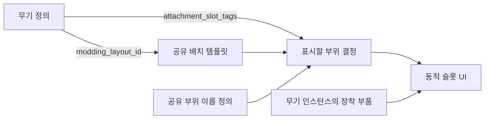

# 공유 위치 데이터 기반 무기 모딩 UI 설계

상태: 사용자 검토용 설계안. 2026-09-26 작성. 이 문서는 구현 완료를 의미하지 않는다.

## 1. 요구사항과 범위

사용자가 요청한 것은 여러 무기가 공유할 수 있는 모딩 위치 데이터셋을 만들고, 무기를 선택하면 그 데이터에 따라 부착 부위의 빈 슬롯 UI를 동적으로 구성하는 방식이다. 같은 부위의 부품은 등급 차이가 있거나 기능 자체가 다를 수 있다.

설계의 성공 조건:

- 여러 무기가 같은 배치 ID를 참조할 수 있다.
- 무기별로 지원하는 부위만 생성하고, 장착 여부에 따라 빈 슬롯 또는 부품을 표시한다.
- 위치 변경과 지원 부위 추가에 무기별 전용 위젯 수정이 필요하지 않다.
- 화면 표시 순서나 좌표를 바꿔도 장착 부품과 저장 데이터의 연결은 유지된다.
- UI와 실제 장착 판정이 같은 부위 태그를 사용한다.

이번 설계는 2D 모딩 슬롯 UI 데이터와 구성 경로에 집중한다. 부품 효과의 수치 밸런스, 새 부품 콘텐츠, 3D 메시 부착 소켓, 작업 비용·시간·장소는 변경하지 않는다. UI 위치 좌표를 월드/무기 메시 좌표로 사용하지 않는다.

## 2. 선택한 구조

기존 JSON 아이템 데이터 흐름을 확장해 `Content/Data/WeaponModdingLayouts.json`을 추가하고, `ItemTable.json`에 `modding_layout_id`를 추가한다. 공유 부위 정의와 배치 템플릿은 한 JSON 파일 안에서 별도 목록으로 관리한다.

| 데이터 | 담당 정보 | 공유 방식 |
| --- | --- | --- |
| 부착 부위 정의 `slot_definitions` | 부위 태그, 표시 이름 문자열 키 | 모든 무기·배치가 같은 부위 정의 사용 |
| 배치 템플릿 `layouts` | 기준 캔버스 크기, 슬롯 크기, 부위별 UI 위치, 무기 이미지 영역 | 여러 무기가 동일 배치 ID 참조 |
| 무기 정의 `ItemTable` | 사용할 배치 ID, 실제 지원 부위 | 기존 `attachment_slot_tags` 유지 |
| 무기 인스턴스 | 현재 부위별 장착 부품 UID | 기존 `AttachmentSlots` 유지 |



검토한 다른 방식은 무기마다 좌표를 직접 기록하는 방식과 UE DataAsset으로 배치를 저작하는 방식이다. 전자는 공유 배치 수정이 여러 무기 정의로 퍼지고, 후자는 현재 JSON 데이터 저작·검증 경로 외에 에셋 저작 경로가 추가된다. 현 프로젝트에서는 공통 JSON 템플릿을 권장한다.

## 3. 데이터 계약

### 3.1 공유 정의와 배치 예시

다음 값은 구조를 설명하는 초기 배치 예시이며 최종 미술 배치가 아니다. 이름에는 기존 `UITextStrings.csv` 키를 사용한다.

```json
{
  "schema_version": 1,
  "slot_definitions": [
    { "slot_tag": "attachment.slot.magazine", "label_key": "ui.item_info.attachment_magazine" },
    { "slot_tag": "attachment.slot.optic", "label_key": "ui.item_info.attachment_optic" },
    { "slot_tag": "attachment.slot.tactical", "label_key": "ui.item_info.attachment_tactical" }
  ],
  "layouts": [
    {
      "id": "modding.layout.long_gun",
      "canvas_size": [384, 280],
      "slot_widget_size": [88, 104],
      "weapon_image": { "center": [0.43, 0.50], "size": [0.58, 0.20] },
      "slots": [
        { "slot_tag": "attachment.slot.optic", "center": [0.50, 0.21], "navigation_order": 0 },
        { "slot_tag": "attachment.slot.magazine", "center": [0.38, 0.80], "navigation_order": 1 },
        { "slot_tag": "attachment.slot.tactical", "center": [0.84, 0.50], "navigation_order": 2 }
      ]
    }
  ]
}
```

- `slot_tag`: 기존 `AttachmentSlotTag` / `AttachmentSlotTags` / 저장 맵과 같은 안정적인 식별자를 사용한다.
- `label_key`: 부위명 현지화 키. 표시용 이름을 JSON이나 코드에 직접 넣지 않는다.
- `canvas_size`: UE UI 논리 단위 기준 크기. 화면 해상도 픽셀이나 cm가 아니다.
- `slot_widget_size`: 슬롯 이미지와 부위명까지 포함한 전체 위젯 영역. 공통 WBP가 내부 타일·이름 배치를 담당한다.
- `center`: 기준 캔버스에서 좌상단 `(0,0)`, 우하단 `(1,1)`인 정규화 중심 좌표. 전체 슬롯 위젯의 중심이다.
- `navigation_order`: 포커스 이동 순서. 저장 키나 실제 장착 슬롯 인덱스로 사용하지 않는다.
- `weapon_image`: 선택 무기 아이콘을 비율 유지해 보여줄 영역. 초기에는 기존 아이콘을 사용한다. 이미지별 화면 구성 차이가 크면 다른 배치 ID를 사용한다.

### 3.2 무기 연결

아래는 기존 무기 행에 반영할 필드만 보여주는 예시다.

```json
[
  {
    "id": 1006,
    "modding_layout_id": "modding.layout.long_gun",
    "attachment_slot_tags": ["attachment.slot.magazine", "attachment.slot.tactical"]
  },
  {
    "id": 1008,
    "modding_layout_id": "modding.layout.long_gun",
    "attachment_slot_tags": ["attachment.slot.magazine", "attachment.slot.optic", "attachment.slot.tactical"]
  }
]
```

두 무기는 같은 배치 템플릿을 공유한다. 기본 SMG는 탄창·전술 슬롯 두 개를 생성하고, 고급 SMG는 광학까지 세 개를 생성한다. 생성하지 않는 부위의 빈 공간은 유지해 다른 슬롯 위치가 이동하지 않게 한다.

실제 지원 부위의 기준은 기존 `attachment_slot_tags`다. 배치는 지원 부위를 추가하거나 호환 규칙을 변경하지 않는다. 지원 부위마다 정확히 하나의 배치 항목이 있어야 한다. 템플릿에 있지만 무기가 지원하지 않는 항목은 생성하지 않는다. 이 필터링은 화면용 뷰에만 적용한다. 실제 `SelectedWeaponAttachmentSlots` 배열을 배치 기준으로 잘라내면 맵 재기록 과정에서 부품 참조가 유실될 수 있으므로 원래 게임플레이 배열을 유지한다.

부착 슬롯이 없는 무기는 배치 ID를 생략하고 모딩 영역을 숨긴다. 부착 슬롯이 있는 무기에는 유효한 배치 ID가 필수다. 총종으로 임의 배치를 추측하지 않는다.

### 3.3 공유 수정과 개별 차이

- 같은 배치 ID를 참조한 모든 무기는 배치 수정의 영향을 받는다.
- 형상이 다른 무기는 별도 배치 ID를 참조한다.
- 1차 버전에는 배치 상속이나 무기별 좌표 덮어쓰기를 넣지 않는다. 최종 좌표를 한 배치 항목에서 바로 확인할 수 있게 한다.
- 하나의 무기에서는 같은 `slot_tag`를 한 번 사용한다. 같은 종류의 레일 두 곳을 독립 슬롯으로 지원하려면 향후 물리 슬롯 ID와 부품 종류를 분리하는 저장 설계가 필요하다. 이번 배치 작업에서 기존 저장 구조를 묵시적으로 바꾸지 않는다.

## 4. 동적 UI 구성

`WBP_HudItemInfoPanel` 안에 공통 모딩 패널 `WBP_WeaponModdingPanel`을 두고, 그 안의 CanvasPanel에 공통 슬롯 위젯 `WBP_WeaponModSlot` 인스턴스를 생성한다. WBP에서 외형과 이름·아이콘 배치를 편집하고 C++은 데이터 조회, 인스턴스 생성, 위치 지정, 이벤트 연결을 담당한다. 무기마다 별도 WBP를 만들지 않는다.

무기 선택 시 흐름:

1. 선택 무기의 UID·아이템 정의를 확인하고 `modding_layout_id`로 템플릿을 조회한다.
2. 템플릿 항목과 무기의 `attachment_slot_tags`를 대조해 슬롯 뷰 데이터를 만든다.
3. 각 슬롯을 `무기 UID + slot_tag`로 식별하고, 캔버스에 지정 위치로 생성한다.
4. `AttachmentSlots[slot_tag]`를 조회한다. 비어 있으면 빈 슬롯 외형과 부위명을, 장착 중이면 부품 아이콘·등급 표시를 채운다.
5. 무기 이미지 영역에 현재 무기 아이콘을 비율 유지해 배치한다.
6. 부품 변경 이벤트에서는 동일 슬롯의 내용만 갱신한다. 선택 무기나 배치가 바뀔 때 슬롯 구조를 재생성한다.

부위명은 장착 중에도 남긴다. 장착 부품 호버에는 기존 공통 아이템 툴팁 데이터를 사용한다. 빈 슬롯 호버에는 해당 부위명과 장착 안내를 문자열 키로 표시한다. 호환 부품 목록·수치 비교 창을 추가하는 것은 후속 UI 범위다.

### 크기와 입력

- 현재 패널의 가용 폭에 맞춰 기준 캔버스를 균일 확대한다. 기준보다 좁아지면 과도하게 축소하지 않고 스크롤 영역으로 접근 가능하게 한다.
- 화면 DPI 배율은 UMG 경로에서 처리하고 다시 좌표에 곱하지 않는다.
- 슬롯 드롭은 실제 슬롯 위젯의 영역으로 판정한다. 기존 `행 × 2 + 열` 방식의 TileView 인덱스 추정은 제거한다.
- 빈 슬롯을 포함해 각 슬롯이 드래그 이벤트를 받는다. 무기 이미지와 장식은 드롭을 가로채지 않는다.
- 레이아웃은 위치 의미가 있는 전용 캔버스다. 일반 인벤토리의 5열 그리드 규칙은 그대로 적용하고, 모딩 캔버스는 해당 규칙의 적용 대상에서 구분한다.

## 5. 장착 규칙·부품 기능·저장

화면 좌표나 템플릿 배열 순서를 장착 식별자로 사용하지 않는다. 슬롯 위젯은 `WeaponUid`, `AttachmentSlotTag`, 현재 부품 UID를 가진다. 드래그를 시작한 원본도 실제 부품 UID와 소속 무기를 기억한다.

UI 어댑터는 장착 직전에 현재 무기와 태그를 다시 확인한 후 기존 인벤토리 이동/교체 처리를 호출한다. 현행 `SelectedWeaponAttachment` 인덱스가 필요하면 그 시점의 태그 배열에서 찾아 변환한다. 드래그 중 선택 무기가 바뀌거나 원본 부품이 이동했으면 작업을 취소하고 화면을 갱신한다. 예전 인덱스로 새 무기를 수정하지 않는다.

장착 판정은 기존 부위 태그 및 `compatible_weapon_type_tags` 규칙을 유지한다. 등급이나 효과 종류로 슬롯 위치를 바꾸지 않는다. 같은 부위에 고등급 부품·기능이 다른 부품을 넣을 수 있고, 각 효과는 부품 정의가 담당한다.

저장되는 것은 기존 `AttachmentSlots: slot_tag → 부품 UID`와 부품 인스턴스다. 배치 ID·UI 좌표·포커스 순서는 아이템 정의/표시 데이터이므로 저장하지 않는다. 이 범위에서는 세이브 버전 변경이 필요하지 않다. 순서와 좌표 변경이 기존 부품을 이동·제거해서는 안 된다.

기존 정의에서 부위 자체를 삭제하거나 이름을 바꾸는 변경은 좌표 편집과 다르다. 장착 중인 부품에 대한 명시적 이전/반환 정책 없이는 시행하지 않는다.

## 6. 로딩과 검증

ItemDataSubsystem에 배치 로더와 조회 API를 추가한다. 예시 역할은 `TryGetModdingLayout`과 `BuildWeaponModSlotViews`다. 초기 로딩과 기존 강제 데이터 재로딩 시 전체 정의를 검증하고 성공한 묶음만 사용한다.

검증 항목:

- 지원 스키마 버전, 배치 ID·부위 태그의 중복 여부 및 무기 `attachment_slot_tags`의 중복 여부
- 부위명 키의 존재와 프로젝트 지원 언어의 문자열 존재
- 알려지지 않은 부위, 무기가 참조한 배치의 누락, 지원 부위의 배치 누락
- 좌표의 유한값·0~1 범위, 크기의 양수 여부, 슬롯 전체 영역의 캔버스 이탈
- 한 배치 안에서 슬롯 전체 위젯 영역의 겹침 및 포커스 순서 중복
- 무기 이미지 영역의 유효 범위와 슬롯 영역 겹침

배치 데이터는 전체 묶음 단위로 검증한다. 최초 로딩에 실패해 유효 묶음이 없으면 모딩 화면의 편집을 차단하고 현지화된 데이터 오류 안내를 표시한다. 아이템 저장 내용과 부품 연결은 유지한다. 재로딩 실패 시 직전 유효 묶음으로 기존 화면을 유지하고 실패를 알린다. 핵심 아이템 데이터 로딩과 배치 데이터 가용성은 구분해 배치 오류로 저장 아이템을 제거하지 않는다. 에디터 검증·자동화 테스트에서는 오류로 실패시켜 배포 전에 수정한다. 전용 C++ 좌표 기본값으로 조용히 대체하지 않는다.

새 JSON은 기존 Content/Data의 패키징 경로에 포함되는지 확인한다. JSON에 새 이미지 경로를 추가하는 기능은 1차 범위에 없고, 기존 무기 아이콘 로딩 경로를 재사용한다. 데이터 편집 반영은 재시작 또는 명시적 재로딩 시 이루어지며 파일 감시 자동 반영은 추가하지 않는다.

## 7. 검증 계획과 적용 순서

1. 공유 배치 데이터 로더·검증·무기 필드 연결을 추가한다.
2. 현행 모딩 지원 무기 네 종류에 배치를 지정한다. 표시 위치와 지원 부위의 기준을 분리한다.
3. 공통 WBP 패널/슬롯을 구성하고 기존 상세 패널에 연결한다.
4. 슬롯 태그 기반 드롭 어댑터와 갱신 경로를 연결하고 기존 2열 드롭 위치 계산을 제거한다.
5. 공유 템플릿의 부분 사용, 좌표/순서 변경, 잘못된 데이터, 언어 변경, DPI·패널 크기, 드래그 중 선택 변경을 검증한다.
6. 장착·교체·분리·툴팁·저장/로드와 드롭/픽업·초과 탄약 반환 회귀 검증을 수행한다.

최소 승인 기준:

- 기본/고급 SMG가 한 템플릿을 사용하며 각각 두 개/세 개 슬롯을 올바른 위치에 표시한다.
- 템플릿 좌표 한 곳을 변경하면 그 배치를 참조하는 모든 무기 UI에서 같은 부위가 이동한다.
- 배열을 재정렬해도 저장된 부품의 부위가 바뀌지 않는다.
- 새로운 배치 ID와 참조 무기를 데이터로 추가했을 때 공통 WBP가 재사용된다.
- 지원하지 않는 부위는 UI에 생성되지 않고, 필수 부위의 위치 누락은 검증 오류로 드러난다.
- 호환 불가·선택 변경·공간 부족 같은 실패에서 다른 무기의 부품을 수정하거나 아이템을 잃지 않는다.

## 8. 기존 작업과 연결

`Docs/weapon_modding_analysis.md`, `Docs/item_container_drag_flow.md`, `Docs/save_persistence.md`, `Docs/weapon_configuration.md`를 기반으로 한다.

조사 시점의 main에는 별도 대화의 수정 커밋 `893e40d1`이 포함되지 않았다. 해당 커밋은 `weapon-modding-fixes` 작업 트리에 있으며 무기 상태 보존·초과 탄약 반환·툴팁 데이터 보완을 담는다. 실제 구현은 이 수정의 통합을 선행 조건으로 삼고, `TryApplyWeaponAttachmentSlotsPreservingAmmo`와 `PopulateItemPresentation` 처리를 재사용한다. 기존 `TunaSweeper.Inventory.WeaponModding` 회귀 테스트도 유지한다. 이번 설계 작업에서는 통합 작업을 실행하지 않는다.

관련 변경 예상 위치는 ItemDataSubsystem, ItemTable, 신규 배치 JSON, HudItemInfoPanel 및 신규 공통 모딩 WBP/위젯, 필요 최소한의 슬롯 드래그 어댑터다. 저장 스키마·부품 효과·별도 대화의 결함 수정은 이 설계에서 다시 정의하지 않는다.
