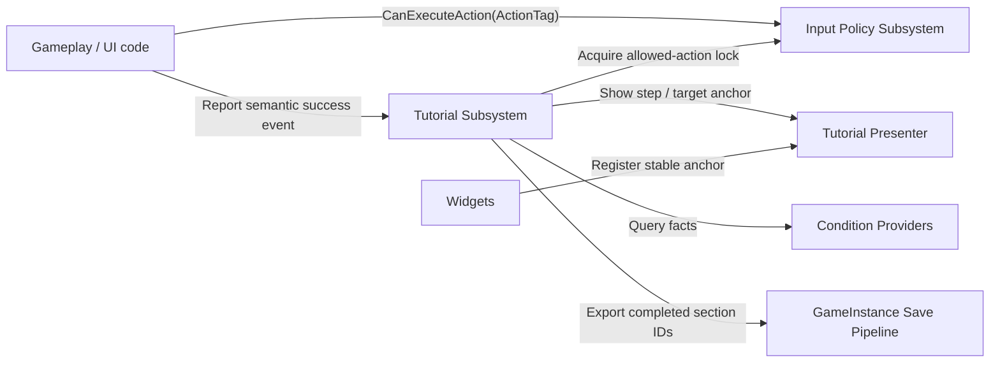

# TunaSweeper Tutorial System Design

## 1. Goals

The tutorial system must support guided, non-repeatable gameplay and UI sequences while minimizing tutorial-specific code in gameplay classes.

Required behavior:

- Enter a tutorial section when its entry conditions become true.
- Block unrelated player input and allow only the action required by the current step.
- Advance only after the required action succeeds, not merely after a raw key press.
- Exit or suspend safely when the world, pawn, or required UI becomes invalid.
- Persist completed tutorial sections per save slot so they do not start again.
- Optionally pause the game for explanation or UI-only steps.
- Draw a dim/highlight overlay above a target widget while allowing interaction only with the highlighted widget.
- Keep tutorial definitions data-driven and keep concrete gameplay code unaware of tutorial sequence IDs.

The initial target is the current single-local-player game. The design keeps player-facing input and presentation separate enough to support split-screen or multiplayer later, but that is not an initial implementation requirement.

## 2. Core Design Decisions

### 2.1 Separate orchestration, input policy, and presentation

Do not make the tutorial subsystem directly own every input, HUD, and gameplay detail.

Use three cooperating responsibilities:

1. `UTunaSweeperTutorialSubsystem`
   - `UGameInstanceSubsystem`
   - Owns tutorial definitions, candidate selection, active section/step, condition evaluation, event observation, and completion persistence.
   - Survives level travel, but tears down the active step presentation and reacquires world/player references after travel.

2. `UTunaSweeperInputPolicySubsystem`
   - `ULocalPlayerSubsystem` is preferred because input permission is player-specific.
   - Arbitrates action permission for tutorial, dialogue, level transition, inventory modal, death, and future blockers.
   - Uses scoped lock handles instead of a single boolean.
   - Gameplay code asks this general-purpose system whether a semantic action is allowed; it does not ask the tutorial subsystem.

3. `UTunaSweeperTutorialPresenterComponent`
   - Owned by the local `PlayerController`, or represented by equivalent controller-owned presentation code.
   - Creates/removes the tutorial overlay, resolves registered widget anchors, updates highlight geometry, and manages tutorial-specific input mode/focus.
   - Contains no entry-condition or save logic.

This split prevents `ATunaSweeperTopDownCharacter`, inventory widgets, and interactable actors from depending on tutorial IDs or tutorial steps.

### 2.2 Communicate through semantic Gameplay Tags

Raw keys are unsuitable as tutorial contracts because bindings can be remapped and different devices can trigger the same action.

Use Gameplay Tags for:

- Action permission: `Input.Action.Move`, `Input.Action.Fire`, `Input.Action.Inventory.Toggle`, `Input.Action.Inventory.MoveItem`
- Successful events: `Tutorial.Event.Player.Moved`, `Tutorial.Event.Weapon.Fired`, `Tutorial.Event.Inventory.Opened`, `Tutorial.Event.Item.Moved`
- Fact/condition types: `Tutorial.Condition.Map`, `Tutorial.Condition.ScenarioFlag`, `Tutorial.Condition.WidgetAnchorAvailable`

The tutorial system may display the currently bound key or gamepad icon, but completion is based on the semantic event emitted after the operation succeeds.

### 2.3 Persist section completion, not the active step

Persist a set of stable completed section IDs:

```cpp
TSet<FName> CompletedTutorialSectionIds;
```

A section is the smallest replay-prevention boundary. A multi-part tutorial that needs checkpoints should be authored as several sections, for example:

- `tutorial.bunker.movement`
- `tutorial.bunker.inventory_open`
- `tutorial.bunker.inventory_move_item`

Do not initially persist an active step index. If the game closes halfway through a section, the section starts again from its first step. This avoids restoring into a missing widget, changed inventory layout, different level, or invalid transient actor.

Mark a section complete and save only after its final completion condition succeeds and cleanup has completed. A skipped, aborted, or invalidated section is not silently marked complete unless the definition explicitly uses a `TreatSkipAsComplete` policy.

## 3. Runtime Architecture



### 3.1 Tutorial subsystem state machine

```text
Idle
  -> EvaluatingCandidates
  -> EnteringSection
  -> PreparingStep
  -> WaitingForCompletion
  -> CompletingStep
      -> PreparingStep (next step)
      -> CompletingSection (last step)
  -> Cleanup
  -> Idle
```

An active section can also enter:

- `Suspended`: a higher-priority owner such as level transition or dialogue temporarily takes control.
- `Aborted`: required context became invalid and the section cannot safely continue.
- `Skipped`: player/debug accessibility flow requested a skip and the definition permits it.

Every path must converge on idempotent cleanup.

### 3.2 Candidate selection

The subsystem keeps an index from observed event/fact tags to tutorial sections. It reevaluates only affected candidates when:

- A semantic tutorial event is reported.
- A registered fact provider broadcasts that relevant state changed.
- A world begins play.
- Save data finishes loading.
- An active section finishes or releases exclusivity.

Avoid checking every tutorial condition on Tick.

Candidate ordering:

1. Exclude completed section IDs.
2. Exclude definitions invalid for the current map/game mode.
3. Require all entry conditions.
4. Reject any blocking condition.
5. Sort by `Priority`, then stable authored order.
6. Start only one section in the same `ExclusiveGroup`.

If several candidates become valid together, lower-priority candidates remain pending and are reevaluated after the active section ends.

## 4. Data Model

Prefer a `UTunaSweeperTutorialDefinition` Primary Data Asset for the first implementation. It supports direct references to text, icons, widget classes, and editable nested structs without building a new JSON polymorphism layer. If designers later need spreadsheet authoring, the same runtime structs can be populated from JSON.

Suggested definition:

```cpp
UCLASS(BlueprintType)
class UTunaSweeperTutorialDefinition : public UPrimaryDataAsset
{
    FName SectionId;
    int32 Priority;
    FName ExclusiveGroup;
    ETutorialResumePolicy ResumePolicy;
    ETutorialSkipPolicy SkipPolicy;
    FTutorialConditionGroup EntryConditions;
    FTutorialConditionGroup AbortConditions;
    TArray<FTutorialStepDefinition> Steps;
};
```

Suggested step fields:

```cpp
USTRUCT(BlueprintType)
struct FTutorialStepDefinition
{
    FName StepId;
    FText InstructionText;
    FText DetailText;

    ETutorialPauseMode PauseMode;
    ETutorialInputMode InputMode;
    FGameplayTagContainer AllowedActionTags;

    FName TargetWidgetAnchor;
    FVector2D HighlightPadding;
    ETutorialMissingTargetPolicy MissingTargetPolicy;
    float TargetWaitTimeoutSeconds;

    FTutorialConditionGroup StartConditions;
    FTutorialConditionGroup CompletionConditions;
    FTutorialConditionGroup AbortConditions;

    float CompletionDelaySeconds;
};
```

Condition groups should support `AllOf`, `AnyOf`, and `NoneOf`. Each leaf condition is evaluated by a provider registered for its condition tag.

```cpp
USTRUCT(BlueprintType)
struct FTutorialCondition
{
    FGameplayTag ConditionTag;
    FName NameValue;
    FGameplayTag TagValue;
    int32 IntValue;
    float FloatValue;
    bool BoolValue;
};
```

This deliberately uses a small generic operand payload. If a condition needs a complex structure, add a typed condition provider and a dedicated instanced struct later; do not grow one giant tutorial enum with knowledge of every game feature.

## 5. Public Integration Interfaces

### 5.1 Gameplay and UI event reporting

The primary integration point is a generic semantic event:

```cpp
UFUNCTION(BlueprintCallable)
void ReportTutorialEvent(
    FGameplayTag EventTag,
    const FTunaSweeperTutorialEventPayload& Payload);
```

Payload fields should cover common context without owning live state:

- instigator/target weak object
- `FName` subject ID
- `FGameplayTag` subject type
- integer/float quantity
- optional source and destination slot descriptors

Report an event only after the real operation succeeds.

Examples:

- Character movement processing reports `Tutorial.Event.Player.Moved` after non-zero movement was accepted.
- Weapon code reports `Tutorial.Event.Weapon.Fired` after a shot actually spawned/consumed ammo.
- HUD reports `Tutorial.Event.Inventory.Opened` after the panel becomes open.
- Inventory transaction code reports `Tutorial.Event.Item.Moved` after the move transaction commits.

Events are observations. They must never be required for the underlying gameplay feature to function.

### 5.2 General input permission

Gameplay input handlers use a tutorial-agnostic permission query:

```cpp
bool CanExecuteAction(FGameplayTag ActionTag, UObject* Context) const;
```

For operations shared by input, UI buttons, and automation, put the check at the command boundary rather than only in the key handler. This prevents a blocked operation from being invoked through another path.

Migration can be incremental:

1. Replace `IsGameplayActionInputLocked()` internals with the input policy query.
2. Give existing high-level handlers stable action tags.
3. Move inventory transactions and important UI commands to the same permission check.
4. Retire individual tutorial checks; keep non-tutorial state providers such as death and modal UI as input-policy lock owners.

The input policy subsystem issues scoped handles:

```cpp
FTunaSweeperInputPolicyHandle AcquirePolicy(
    UObject* Owner,
    int32 Priority,
    ETunaSweeperInputPolicyMode Mode,
    FGameplayTagContainer AllowedActions);

void ReleasePolicy(FTunaSweeperInputPolicyHandle Handle);
```

Recommended modes:

- `AllowAll`
- `DenyListed`
- `AllowListedOnly`
- `DenyAll`

The highest-priority active policy wins. Equal-priority policies combine conservatively. Escape/pause/accessibility actions should have an explicit always-available rule rather than being accidentally swallowed.

Do not rely only on adding a high-priority Enhanced Input Mapping Context. It is useful for tutorial-only actions such as Skip, but it is not a reliable authorization boundary for UI clicks, alternate bindings, or calls that bypass physical input.

### 5.3 Condition providers

Feature systems can expose facts without depending on tutorial definitions:

```cpp
class ITunaSweeperTutorialConditionProvider
{
    virtual bool EvaluateTutorialCondition(
        const FTutorialCondition& Condition,
        const FTutorialEvaluationContext& Context) const = 0;
};
```

Initial providers:

- Map/world provider
- GameInstance scenario/progress flag provider
- Quest provider
- Inventory/item provider
- Player state provider
- UI anchor/visibility provider

Providers register by condition tag. Unknown condition tags fail closed and emit a clear validation/runtime warning.

## 6. Forced Input Guidance

### 6.1 Input is allowed by action, completion is confirmed by result

For a “press fire” step:

1. Tutorial acquires `AllowListedOnly` with `Input.Action.Fire`.
2. Fire input reaches normal weapon code.
3. Normal weapon validation still checks ammo, reload, death, and weapon state.
4. A successful shot emits `Tutorial.Event.Weapon.Fired`.
5. The step completes from that event.

A press that fails because the weapon has no ammo does not complete the step.

### 6.2 Axis actions

For movement or aiming, define thresholds:

- accepted non-zero magnitude
- accumulated active duration
- accumulated distance/rotation, when meaningful

Prefer gameplay results such as “player moved 100 cm” over “W was held for 0.2 seconds” when the tutorial intends to teach movement rather than the key itself.

### 6.3 UI actions

UI operations need the same semantic action tags used at their command boundary. The overlay prevents unrelated pointer clicks, while the input policy blocks keyboard/gamepad routes to unrelated commands.

The target button remains responsible for its normal validation and behavior. Successful state change emits the completion event.

## 7. Widget Highlight Overlay

### 7.1 Stable anchor registry

Never store a raw widget path or designer-tree index in tutorial data.

Widgets register stable anchors while constructed/visible:

```cpp
RegisterTutorialAnchor(FName AnchorId, UWidget* Widget);
UnregisterTutorialAnchor(FName AnchorId, UWidget* Widget);
```

Examples:

- `tutorial.anchor.hud.inventory_button`
- `tutorial.anchor.inventory.first_weapon_slot`
- `tutorial.anchor.inventory.equipment_primary`

The registry stores weak widget references and resolves the best visible candidate for the current local player.

For dynamic list entries, register an anchor only when the item satisfying the authored selector is present. A provider may also resolve a logical selector such as the first movable inventory item.

### 7.2 Overlay layout and hit testing

Create one full-screen `UTunaSweeperTutorialOverlayWidget` at a reserved viewport layer.

Recommended current-project layer:

- HUD/panels: existing low layers
- toast: `950`
- tutorial overlay: `975`
- screen fade/level transition: `1000`

This keeps the overlay above the target HUD and below transition/fade UI. Replace numeric literals with shared UI layer constants when implementing.

Use four hit-test-visible dim panels around the target rectangle:

```text
+------------------------------------+
|             top blocker            |
+----------+---------------+---------+
| left     | target hole   | right   |
| blocker  | no hit test   | blocker |
+----------+---------------+---------+
|            bottom blocker          |
+------------------------------------+
```

The transparent hole is not hit-testable, so pointer input reaches the real underlying widget. A border, pulse, arrow, and instruction callout are `HitTestInvisible`.

This is safer than drawing a visual material hole over one full-screen hit-testable widget, because UMG hit testing does not automatically understand a material's transparent pixels.

### 7.3 Geometry tracking

While a UI-target step is active:

1. Resolve the anchor's cached geometry.
2. Convert its absolute corners into viewport-local coordinates.
3. Apply DPI scale and authored padding.
4. Update blockers, border, and callout after layout.

Recalculate when viewport size, DPI, target geometry, visibility, scroll position, or list virtualization changes. A lightweight active-step Tick is acceptable for geometry tracking; broad tutorial condition evaluation should remain event-driven.

Target invalidation policies:

- `Wait`: hide highlight and wait for the anchor to appear.
- `AbortSection`: cleanup without completion.
- `SkipStep`: only for explicitly optional presentation.
- `FallbackToMessageOnly`: retain instruction without a highlight.

A timeout should report the missing anchor and chosen policy in logs/debug UI.

## 8. Pause and Time Control

Use an explicit per-step pause mode:

- `None`: gameplay continues.
- `GamePaused`: call the centralized pause arbiter and use real game pause.
- `WorldFreezeLease`: future extension for selectively freezing AI/projectiles while keeping the player active.

Initial implementation should support `None` and `GamePaused`.

Use `GamePaused` for explanation or UI-only interaction steps. Before a step that requires movement, firing, physics, or world timers, release pause.

Do not use near-zero global time dilation as the default pause mechanism. It creates fragile behavior for physics, timers, animation, audio, and input completion. If later design requires “the world is frozen but the player can act,” introduce a general world-freeze service with scoped freeze handles for AI, projectiles, and relevant actors.

Pause ownership must also use a scoped handle and restore the previous state:

- If another system had already paused the game, tutorial cleanup must not unpause it.
- Tutorial input actions needed during pause must be configured to trigger while paused.
- Overlay animation and timeout logic must use real time or pause-independent ticking.

## 9. Persistence Integration

Planned save additions:

```cpp
UPROPERTY()
TArray<FName> CompletedTutorialSectionIds;
```

Runtime owner:

```cpp
TSet<FName> CompletedTutorialSectionIds;
```

Integration points:

- Increment `TunaSweeperSave::CurrentSaveVersion`.
- Copy the array from `UTunaSweeperSaveGame` during `UTunaSweeperGameInstance::LoadGameState()`.
- Export the runtime set in `SaveGameStateInternal()`.
- Reset the set when starting/deleting a save slot.
- Treat older saves as an empty set.
- Update `Docs/save_persistence.md` in the implementation change.

The tutorial subsystem should call a narrow GameInstance API:

```cpp
bool IsTutorialSectionCompleted(FName SectionId) const;
bool MarkTutorialSectionCompleted(FName SectionId, bool bSaveImmediately);
```

Section completion should normally save immediately because replay prevention is the feature's primary contract. Coalesce repeated writes and use the existing active-slot save path.

Do not reuse `CompletedScenarioFlags` for tutorials. Scenario routing flags and guided-input tutorial completion have different ownership and lifecycle rules even if both currently store stable names.

## 10. Travel, Interruption, and Cleanup

Cleanup must:

- Release input policy handle.
- Release pause handle.
- Remove overlay and tutorial-only mapping context.
- Restore input mode, cursor, and focus only if the tutorial still owns them.
- Unbind event and anchor listeners.
- Cancel real-time timers.
- Clear weak actor/widget references.
- Stop any tutorial-owned camera or presentation effect.

Run cleanup on:

- successful section completion
- abort/skip
- subsystem deinitialize
- local player/controller replacement
- world cleanup or level transition
- active pawn destruction
- save-slot change

Recommended resume policies:

- `RestartCurrentStep`: default for a transient UI rebuild in the same world.
- `RestartSection`: default after level travel or process restart.
- `AbortUntilEntryConditionsChange`: for context-specific tutorials that should wait for a new valid opportunity.

Higher-priority flows such as level transition, death, mandatory dialogue, and save-slot selection should preempt or suspend tutorials. A tutorial must not sit above the transition fade or restore gameplay input while those flows remain active.

## 11. Authoring Validation and Debugging

Add editor/data validation:

- Section IDs and step IDs are non-empty and unique.
- A section has at least one step.
- Every required condition tag has a registered provider.
- `AllowListedOnly` steps have at least one allowed action.
- A UI highlight step has an anchor ID and a missing-target policy.
- A paused gameplay-action step is rejected unless the action is explicitly pause-compatible.
- Completion conditions are reachable from the allowed actions/events where this can be statically checked.
- No section lists itself as a prerequisite.

Useful console/debug commands:

- `Tutorial.List`
- `Tutorial.Status`
- `Tutorial.Start <SectionId>`
- `Tutorial.Complete <SectionId>`
- `Tutorial.Reset <SectionId|All>`
- `Tutorial.ShowAnchors`
- `Tutorial.DumpInputPolicies`

Log every transition with section ID, step ID, reason, acquired/released handles, and completion event. This is important for diagnosing “input is still blocked” bugs.

## 12. Example Section

```text
Section: tutorial.bunker.inventory_move_item
Priority: 100
ExclusiveGroup: tutorial.primary

Entry:
  - Map == BunkerMap
  - Active flavor's initial bunker-dialogue completion flag is complete
  - Section tutorial.bunker.inventory_open is complete
  - Inventory contains at least one movable item

Step 1:
  Instruction: "인벤토리를 여세요."
  Allowed: Input.Action.Inventory.Toggle
  Completion: Tutorial.Event.Inventory.Opened
  Pause: None

Step 2:
  Instruction: "이 아이템을 장비 슬롯으로 옮기세요."
  Allowed:
    - Input.Action.Inventory.Drag
    - Input.Action.Inventory.Drop
  Target anchor: tutorial.anchor.inventory.first_movable_item
  Completion:
    - Tutorial.Event.Item.Moved
    - payload destination == equipment.primary
  Pause: GamePaused, if UMG drag/drop is verified to work while paused

Final:
  Mark tutorial.bunker.inventory_move_item complete
  Save immediately
  Release overlay, pause, and input policy
```

## 13. Recommended Implementation Order

### Phase 1: Foundation

- Add semantic action/event Gameplay Tags.
- Implement scoped input policy subsystem.
- Route the current `IsGameplayActionInputLocked()` through the policy system.
- Implement tutorial definition, subsystem state machine, event reporting, and debug commands.

### Phase 2: UI guidance

- Implement anchor registry and overlay.
- Add shared viewport layer constants.
- Validate mouse and gamepad focus behavior.
- Integrate one simple “open inventory” tutorial section.

### Phase 3: Persistence and conditions

- Add `CompletedTutorialSectionIds` to save/load/reset/migration.
- Add core condition providers.
- Add data validation.

### Phase 4: Complex forced actions

- Add inventory transaction and combat success events.
- Integrate action permission at UI/gameplay command boundaries.
- Add pause arbitration and interruption handling.
- Build an end-to-end multi-step tutorial and automated tests.

## 14. Acceptance Criteria

- A completed section does not start again in the same save slot, including after restart and level travel.
- The same section can run in a different or reset save slot.
- Only current-step actions can mutate gameplay/UI state.
- A raw input that fails normal gameplay validation does not complete the step.
- Closing/rebuilding the target UI cannot leave the overlay or input lock orphaned.
- Tutorial cleanup never unpauses or restores input owned by another modal system.
- Level transition and death cannot leave a stale tutorial overlay.
- Mouse, keyboard, and gamepad can all complete supported steps.
- Missing anchors and unknown condition providers produce actionable validation/log output.
- Gameplay features continue to work when the tutorial subsystem is disabled.
