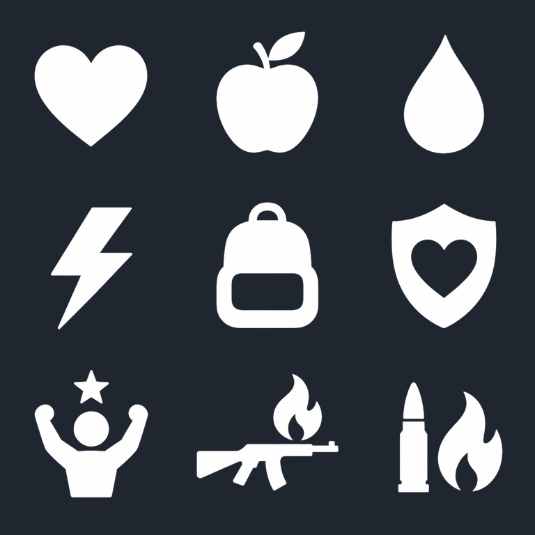

# 연구 아이콘 — 백색 단색 시안

- 9종, 개별 PNG 256×256 RGBA / 투명 시트 768×768 (3×3).
- 같은 능력의 단계별 연구는 아이콘을 공유하며 현재 연구 노드 17개를 모두 대응한다.
- UE 텍스처 경로: `/Game/UI/Research/Icons`. `StatResearchNodes.json`의 `icon`으로 각 연구 노드에 연결한다.
- 실물 `/Game/UI/WBP_ResearchNode`의 `NodeHeader > IconSizeBox > IconImage`에서 배치를 수정할 수 있다. 기본 크기는 48×48, 이름 왼쪽 배치이며 잠금 상태 투명도는 `LockedIconOpacity` 기본값 0.35다.
- 가장자리에는 안티앨리어싱이 있으며 원본 기반 변환의 약한 회색 가장자리가 일부 남는다.

| 위치 | 용도 | PNG | 대응 노드 |
| --- | --- | --- | --- |
| 1행 1열 | 체력 | [Vitality](T_Research_Vitality_White.png) | vitality_1, vitality_2, vitality_3 |
| 1행 2열 | 포만감 | [Nutrition](T_Research_Nutrition_White.png) | nutrition_1, nutrition_2 |
| 1행 3열 | 수분 | [Hydration](T_Research_Hydration_White.png) | hydration_1, hydration_2 |
| 2행 1열 | 스태미나 | [Stamina](T_Research_Stamina_White.png) | stamina_1, stamina_2 |
| 2행 2열 | 운반 능력 | [Carry](T_Research_Carry_White.png) | carry_1, carry_2 |
| 2행 3열 | 생존 숙련 | [SurvivalMastery](T_Research_SurvivalMastery_White.png) | survival_mastery |
| 3행 1열 | 최종 신체 강화 | [UltimateConditioning](T_Research_UltimateConditioning_White.png) | ultimate_conditioning |
| 3행 2열 | 무기 화상 강화 | [WeaponBurn](T_Research_WeaponBurn_White.png) | weapon_burn_1, weapon_burn_2 |
| 3행 3열 | 탄약 화상 강화 | [AmmoBurn](T_Research_AmmoBurn_White.png) | ammo_burn_1, ammo_burn_2 |

## 생성과 투명화

Built-in imagegen으로 단색 배경의 원본 한 장을 생성했다. [최종 프롬프트](prompt.txt).
프로젝트 `icon-alpha-from-solid-bg` 절차에 따라 같은 원본에서 검정/흰색 배경 소스를 만든 뒤 두 소스의 차이로 알파를 추출했다. 추정 배경색은 #646E7C, 출력 크기는 768×768이다. 추가 이미지 재생성 없이 각 셀을 분리했다.

- 원본: ResearchIcons_Source.png
- 투명 시트: ResearchIcons_Transparent.png
- 파생 검정/흰색 소스: ResearchIcons_Transparent_BlackBackground_Source.png / ResearchIcons_Transparent_WhiteBackground_Source.png
- 배경 확인용: ResearchIcons_Transparent_PreviewChecker.png / ResearchIcons_PreviewDark.png
- 노드 대응표: manifest.json (런타임 연구 데이터가 아닌 제작용 메타데이터)
