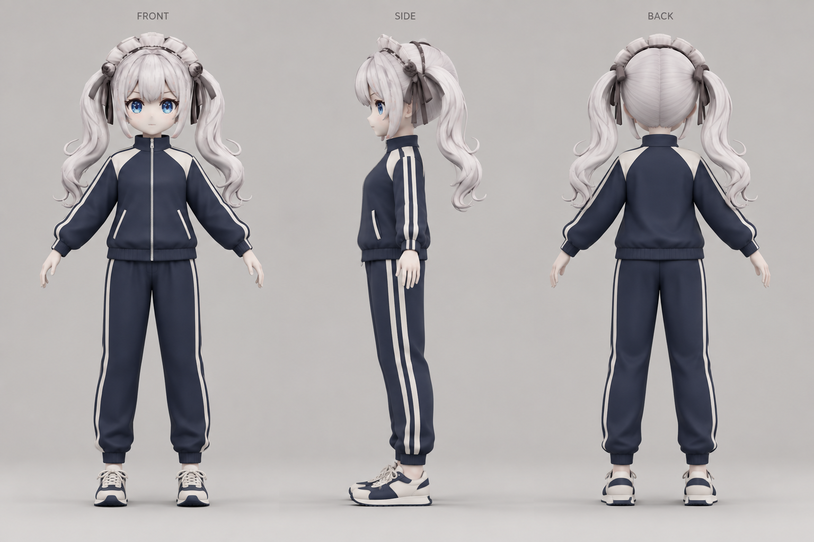

# LunaMk2 의상 레퍼런스

## 운동복 시안



- 남색 지퍼 트랙 재킷, 아이보리 어깨 배색과 두 줄 소매·바지 옆선, 발목을 잡아주는 긴 바지, 아이보리·남색 운동화.
- 기존 교복 정면 렌더를 캐릭터 외형 참고로 사용했다. 생성 이미지이므로 원본 모델과 얼굴·비율·머리 형태가 완전히 일치하는 모델링 도면은 아니다.
- 먼저 레퍼런스를 제시했고, 이후 사용자가 이 시안으로 진행하도록 승인해 [별도 운동복 원본](../Sportswear/README.md)을 제작했다. 게임 적용·의상 교체 시스템은 구현하지 않았다.
- 생성 방식: 내장 image_gen 도구. 참고 이미지: `../SchoolUniform/Previews/LunaMk2_Uniform_Front.png`.

### 생성 프롬프트

```text
Use case: stylized-concept. Create one polished landscape outfit reference sheet for a future 3D game character outfit. Input image is the CHARACTER IDENTITY reference only. Preserve her exact petite stylized game character proportions, large blue eyes, pale skin, silver-white long curled twin tails, bangs and existing hair accessories/headband. Replace the reference school uniform with a coordinated retro athletic tracksuit: deep navy zip-up long-sleeve track jacket with ivory shoulder yoke, two clean ivory stripes following the outside of both sleeves; short upright sports collar, subtle ribbed cuffs and hip-length elastic hem, small silver central zipper and two practical inset hand pockets. Matching loose but tapered navy full-length joggers, two continuous ivory stripes down each outside leg, elastic ankle cuffs. Ivory low-top running shoes with navy panels and simple laces, modest rubber soles. Sporty, practical, cute, fully clothed, relaxed fit, no brands or logos. Show THREE consistent full-body views aligned on one baseline and at identical scale: front, true side, back. Neutral relaxed A-pose with hands away from torso, all feet visible, no cropping. Use a light warm gray studio backdrop, soft even lighting, clear garment silhouette, clean high quality stylized 3D concept render with readable seams and cloth volume, matching the source character rather than realistic human anatomy. Keep outfit construction and stripe positions identical in all views; side and back should show the same twin tail hairstyle. Leave enough spacing between figures. Small unobtrusive headings only: FRONT, SIDE, BACK. This is an outfit design reference, not a screenshot of a modeling program. No weapons, props, tools, skirt, blazer lapels, sailor collar, bow tie, apron, school uniform or scenery.
```
